# Analyses Reference

Each analysis opens its own tab from the **Analysis** menu (or its
respective toolbar icon). Tabs update live when you change the
system; pressing **F5** in the main window forces a refresh of all
open tabs.

The screenshots throughout this chapter come from the Cooke triplet
sample (`samples/CookeTriplet.lhlt` after a Local Optimizer pass) —
EFL 50 mm, F/5, three fields (0°, 14°, 20°), three wavelengths
(0.48 / 0.55 primary / 0.65 µm). Reusing one design across every
section lets you cross-reference what each analysis is showing you
about the *same* lens.

Common controls present on every tab:

- **Wavelength** — drop-down. *Polychromatic* aggregates across all
  system wavelengths weighted by their wavelength weights;
  individual entries show one wavelength.
- **Field** — which field points to show. Default is all fields.
- **Compute** — re-runs the analysis. Most tabs auto-compute on
  open and on system change; this button forces a recompute.
- **Export Text…** — saves the underlying numerical data as a TSV
  text file (the same one consumed by the validation suite).
- **Export Image** — saves the rendered plot as PNG.
- **Show Table** — pops up a tabular view of the data behind the
  curves.
- **Close Tab** — removes the tab. The next time you open the
  analysis from the menu it'll re-create the tab.

---

## Spot Diagram

**Analysis → Spot Diagram**

Ray scatter on the image plane, one sub-plot per field, points
colored per wavelength. In afocal mode the units switch to arcmin
automatically.

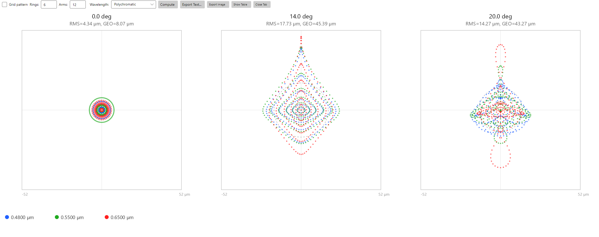

Reading the plot: above each sub-plot, **RMS** is the RMS spot
radius about the centroid and **GEO** is the rim radius (worst-case
ray). In the Cooke triplet above:

| Field | RMS | GEO |
|---|---|---|
| 0.0° | 4.34 µm | 8.07 µm |
| 14.0° | 17.73 µm | 45.39 µm |
| 20.0° | 14.27 µm | 43.27 µm |

The crosshair marks the chief ray; the star marks the centroid.
The on-axis spot is dominated by spherochromatism (the 0.48 µm blue
ring sits outside the others because secondary spherical
aberration is wavelength-dependent). Off-axis the spots become
diamond/heart shaped — characteristic coma + astigmatism mix you'd
expect from a Cooke triplet at moderate field.

| Input | Meaning |
|---|---|
| **Pattern** | `Hexapolar` (Forbes-style ring × arm sampling) or `Rectangular grid`. |
| **Rings / Arms** | Hexapolar density. Default 6 × 12 = 72 rays per field per wavelength — matches the standard `WAVEX` / `SPOT` operand sampling. |
| **Grid Size** | Rectangular grid edge count. |
| **Wavelength** | One wavelength or all (polychromatic). |

With `Polychromatic` selected, RMS is the polychromatic
weighted RMS — the same value the `SPOTM` merit operand reports.

---

## Transverse Ray Fan

**Analysis → Ray Fan**

`Δx` and `Δy` at the image plane for rays traced along the
meridional (`Py`) and sagittal (`Px`) pupil axes, plotted against
normalized pupil coordinate. One sub-plot per field, curves colored
per wavelength.

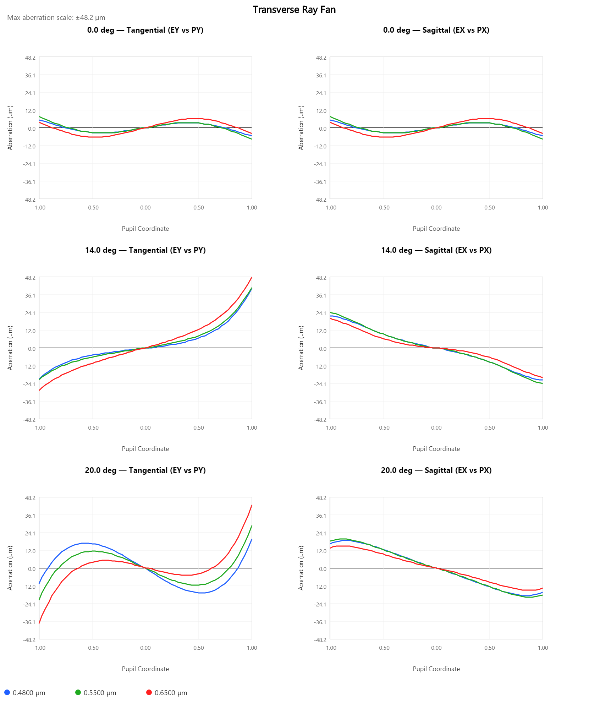

Read it for the same aberration signatures any transverse-ray-fan
plot exposes:

- **Slope at origin** → defocus.
- **Symmetric S-bow** → spherical aberration.
- **Asymmetric about origin in the meridional plot** → coma.
- **Difference between tangential and sagittal curves** →
  astigmatism.
- **Color separation** → axial color (on-axis) or lateral color
  (off-axis).

Top row (0°): tiny, sub-µm aberrations — the Cooke triplet is
essentially diffraction-limited on-axis. Middle row (14°): the
tangential curve develops the asymmetric S-shape of coma; sagittal
shows the symmetric astigmatism cup. Bottom row (20°): the same
features grow, and the inter-wavelength color separation becomes
visible (lateral color).

| Input | Meaning |
|---|---|
| **Number of points** | Samples per axis, default 20. |
| **Wavelength** | One wavelength or all. |
| **Scale** | Auto-scale both axes per field, or fix a common Y-range across all fields. |

---

## OPD Fan

**Analysis → OPD Fan**

Optical path difference in waves, plotted against normalized pupil
coordinate along the meridional (`Py`) and sagittal (`Px`) axes.
Piston **and** tilt are removed — the same convention used by the
`WAVEX` merit operand.

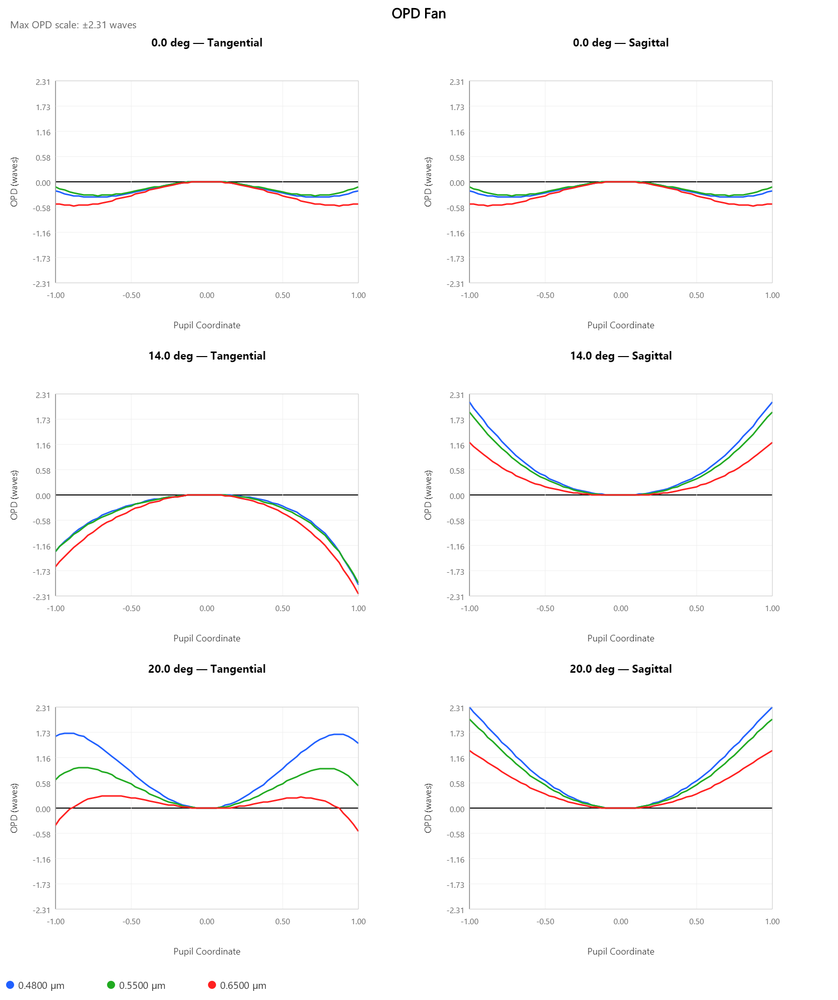

OPD sign convention: positive OPD = the test ray arrives **ahead**
of the reference wavefront. The reference is the chief ray at the
evaluation wavelength, corrected to the exit pupil for focal
systems; for afocal systems the reference is a tilted plane wave.

Reading the plot is similar to the transverse-ray fan, but the
shapes are integrals of the ray-fan curves (an antiderivative
relationship): a parabolic OPD = defocus, a quartic OPD = spherical
aberration, an asymmetric cubic = coma, etc.

In the Cooke triplet above the on-axis OPD stays well within ±0.5
waves across the band — diffraction-limited Marechal regime. The
14° tangential reaches –2 waves at the pupil edge (defocus +
spherical residual), while 14° sagittal shows the ~+2-wave cup of
astigmatism. The 20° tangential displays the M-shape characteristic
of higher-order spherical mixed with field curvature; the
inter-wavelength offset there is also the largest sign of
chromatic content at the pupil edge.

The same OPD data feeds the wavefront map and the FFT PSF / FFT
MTF analyses — anything that's a problem in the OPD fan will be a
problem in those.

---

## Pupil Aberration Fan

**Analysis → Pupil Aberration Fan**

Plots the pupil aberration — the difference between the **real**
and **paraxial** pupil-position predictions for rays launched at
each pupil coordinate. Useful for diagnosing systems where ray
aiming matters (the chief ray doesn't actually pass through the
real stop center even though we launched it through the paraxial
pupil center).

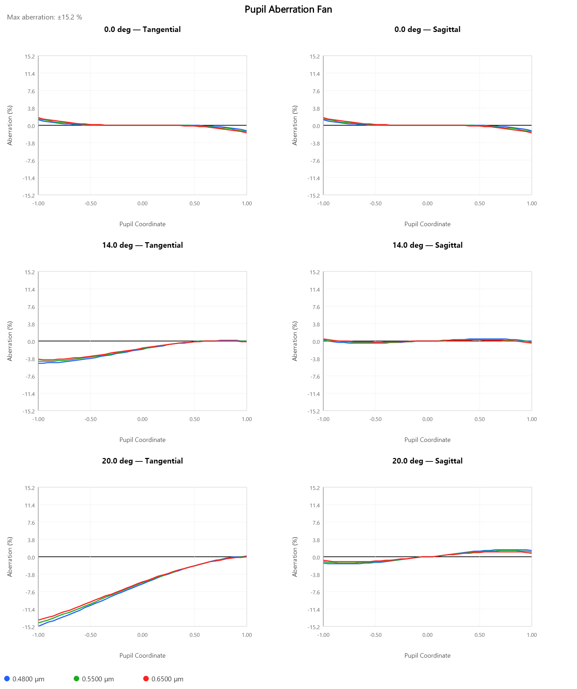

The Y-axis is "% of pupil radius the ray missed by." On-axis (0°)
the pupil aberration is below 1 % — paraxial and real pupil
positions agree closely. At 14°, tangential pupil aberration grows
to ~4 % at the edge of the pupil; at 20° tangential it reaches
~–15 % — meaning rays launched at full pupil edge actually arrive
–15 % short of where paraxial says they should.

When this number is large (> 5 % at the field of interest),
turning **Ray Aiming = Real** in the System Editor materially
changes the merit-function values and the FFT MTF — Multistart and
Basin Hopping will converge to slightly different optima with vs
without ray aiming for such systems.

For typical lenses with modest field and well-placed stop, pupil
aberration is small and ray aiming makes negligible difference.

---

## Wavefront Map

**Analysis → Wavefront Map**

Color map of OPD across the pupil (the 2D version of the OPD fan).
Tilt and piston are removed — same convention as `WAVEX`. Contour
lines optional.

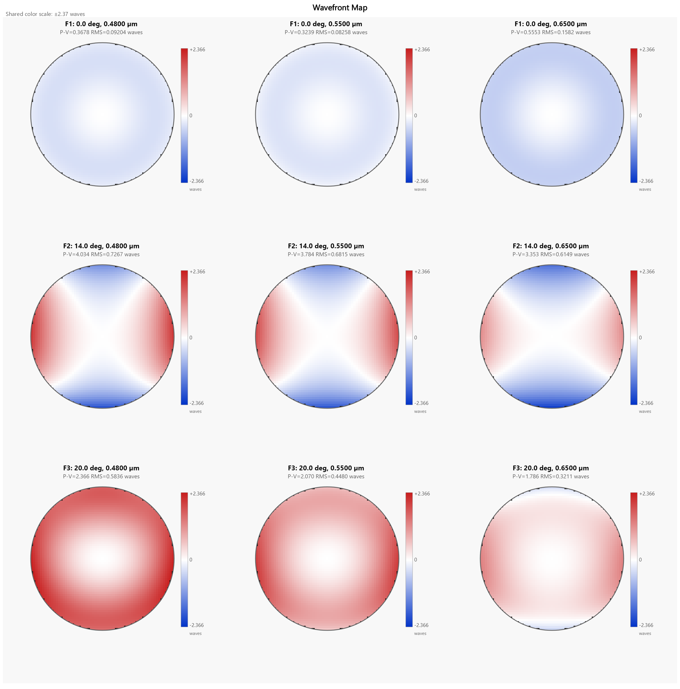

| Input | Meaning |
|---|---|
| **Pupil Samples** | Grid resolution. Larger = slower but smoother. Default 64. |
| **Wavelength** | One or polychromatic. |
| **Field** | One field at a time. |
| **Color scale** | Auto-fit per field, or fix a global waves range. |

Above each sub-plot: peak-to-valley (P-V) OPD and RMS, both in
waves at the evaluation wavelength. The wavefront map is the
clearest single picture of an aberrated bundle's pupil structure —
spherical aberration appears as concentric rings, coma as a tilted
asymmetry, astigmatism as a saddle, and so on.

The same OPD that feeds the FFT PSF and FFT MTF is the wavefront
map you see here.

---

## FFT PSF

**Analysis → FFT PSF**

Diffraction-based point-spread function at one field, computed by
FFT of the pupil amplitude (apodized by transmission) and the
complex wavefront `exp(i 2π OPD)`.

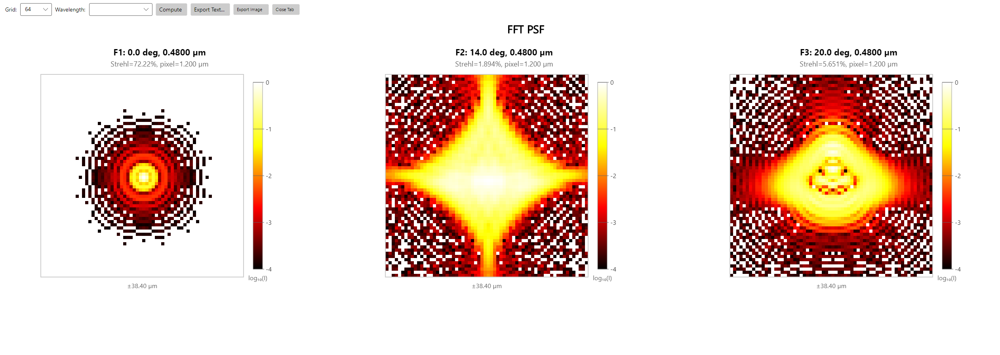

| Input | Meaning |
|---|---|
| **Pupil Samples** | FFT grid edge size. Power of 2; typical 256 or 512. |
| **Display Size** | Image-plane extent shown (µm). |
| **Field** | One at a time. |
| **Wavelength** | Individual wavelength or polychromatic (incoherent sum of per-wavelength PSFs, weight-averaged). |

Reported metrics (above the image): peak intensity normalized to
the diffraction-limited peak (= **Strehl ratio**) and peak
position relative to the chief ray.

Use the FFT PSF to inspect the actual image of a point source —
useful for predicting how a star or pinhole will look on the
sensor. For broadband systems, the polychromatic PSF is the right
choice; the monochromatic PSF tends to show diffraction rings that
average out across a real source.

---

## FFT MTF vs Frequency

**Analysis → FFT MTF**

Diffraction modulation transfer function vs spatial frequency for
each field, tangential (solid) and sagittal (dashed). Computed by
FFT of the geometric-pupil PSF; accuracy is set by the **Pupil
Samples** grid (truncation error falls roughly as `1/N²` for an
`N × N` grid).

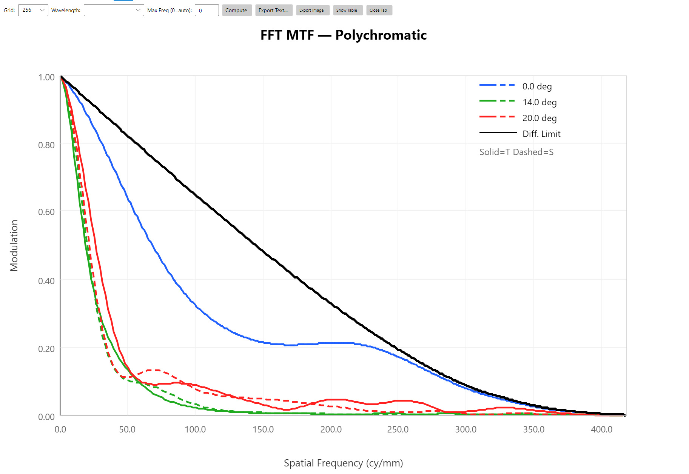

| Input | Meaning |
|---|---|
| **Max Frequency** | 0 = auto (use the diffraction cutoff). Otherwise truncate at this value (cycles/mm for focal, cycles/mrad for afocal). |
| **Pupil Samples** | FFT grid. Typical 64 or 128. |
| **Wavelength** | Individual wavelength or polychromatic. |

The displayed cutoff is the canonical projection `ρ_T × f_axial`
for tangential and `ρ_S × f_axial` for sagittal, where
`ρ = cos(θ_chief_image)` (Macdonald 1971, eq 4.4 evaluated at the
axially-symmetric paraxial limit). On-axis `ρ = 1` and the cutoff
is the full diffraction limit `1 / (λ × F/#)`. Off-axis the cutoff
is reduced by the chief-ray cosine projection.

Afocal systems automatically switch to **cy/mrad**, matching the
spot-diagram unit convention.

---

## FFT MTF vs Field

**Analysis → FFT MTF vs Field**

Tangential and sagittal MTF at one (or several) fixed spatial
frequencies, plotted against field. Useful for flatness-of-field
inspection — does the corner of the image hold MTF, or does it
collapse?

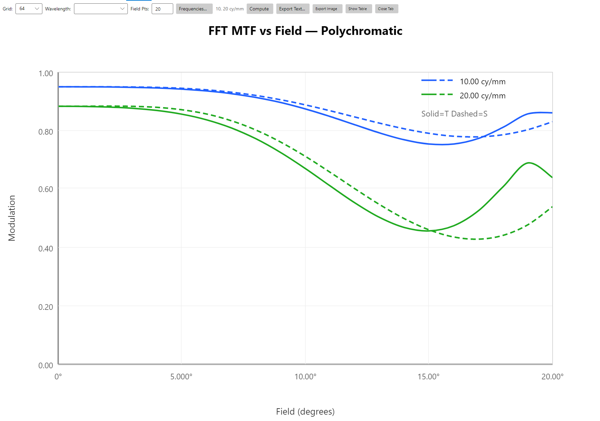

| Input | Meaning |
|---|---|
| **Frequencies** | One or several spatial frequencies (cy/mm) to evaluate. Default 10 and 20 cy/mm. |
| **Pupil Samples** | As above. |
| **Field Pts** | Number of field samples between 0 and max field. |

---

## FFT MTF Through Focus

**Analysis → FFT MTF Through Focus**

MTF at a single spatial frequency and field, plotted against an
image-plane offset. The peak of each curve marks best focus for
that field at that frequency; the spread between fields shows
field curvature converted into modulation.

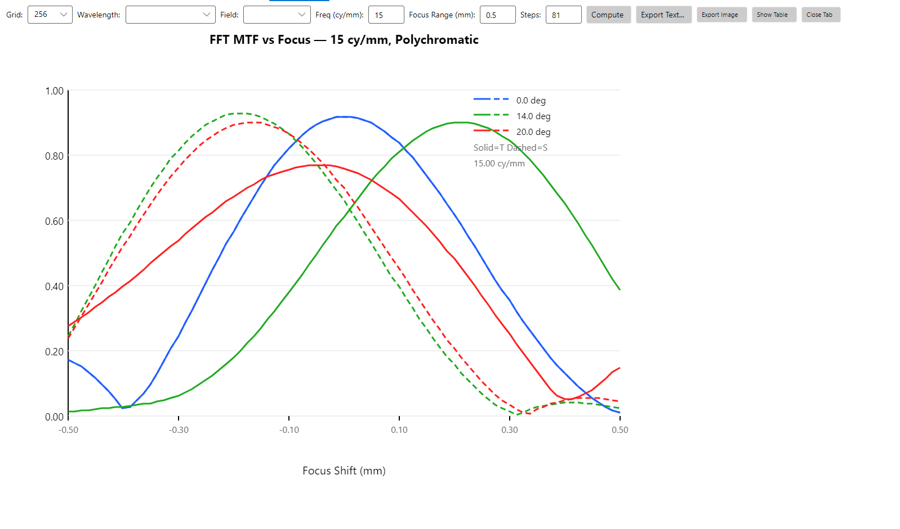

| Input | Meaning |
|---|---|
| **Frequency** | Spatial frequency to evaluate (cy/mm). |
| **Δz range** | Image-plane offset sweep (mm). |
| **Steps** | Number of focus positions. |

---

## Geometric MTF

**Analysis → Geometric MTF**

Geometric MTF computed by Kidger's Gaussian-quadrature method as
described in Michael J. Kidger, *Fundamental Optical Design* (SPIE
Press, 2002). The pupil is sampled on a Gauss-Legendre ring × arm
grid, real rays are traced to find the geometric spot, the spot
intensity is Fourier-transformed to give the geometric OTF, and
the result is multiplied by the diffraction-limited MTF for the
appropriate field-dependent cutoff.

The diffraction-limit multiplication is intentional: pure
geometric MTF can rise above the diffraction limit at moderate
spatial frequencies in nearly diffraction-limited systems, which
is non-physical. Multiplying by the DL gives a curve that's a
better proxy for the actual modulation when both aberration and
diffraction contribute. At low frequencies (geometric regime,
aberrations dominate) the curve is essentially the geometric
prediction; near and past the DL cutoff the multiplication forces
it toward zero.

Three variants share the same Kidger engine and parameters:

### Geometric MTF vs Frequency

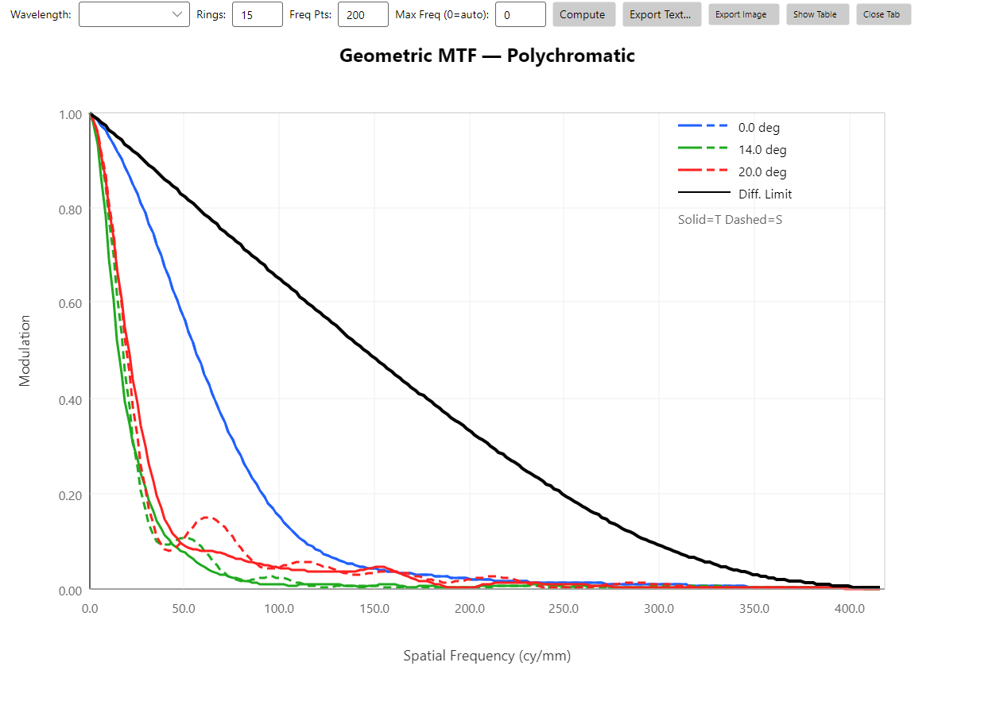

Curves: 0° (blue) tracks the diffraction limit out past 50 cy/mm
and is close to diffraction-limited overall. 14° (green) and 20°
(red) drop fast — aberrations dominate from below 30 cy/mm. The
scalloped shape at higher frequencies is real OTF structure (zero
crossings of the spot autocorrelation), not numerical noise.

### Geometric MTF vs Field

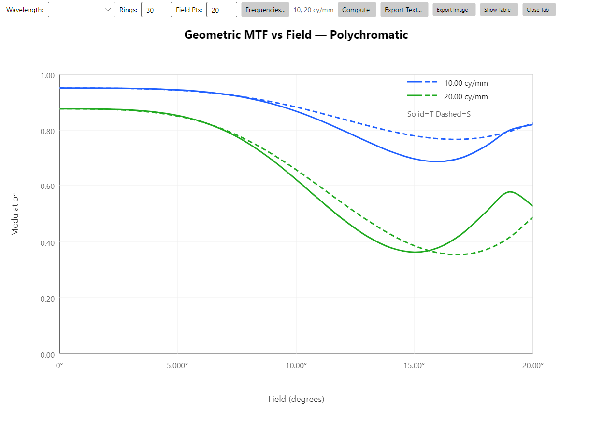

Holds the spatial frequency fixed (10 and 20 cy/mm in the
screenshot) and sweeps the field from on-axis to maximum. Reading
the 10 cy/mm trace: ~0.95 modulation through 5°, dropping to ~0.7
at 15°, and recovering somewhat at 19°-20° — the recovery near
maximum field is a sign that the design's residual aberration
reverses sign there.

### Geometric MTF Through Focus

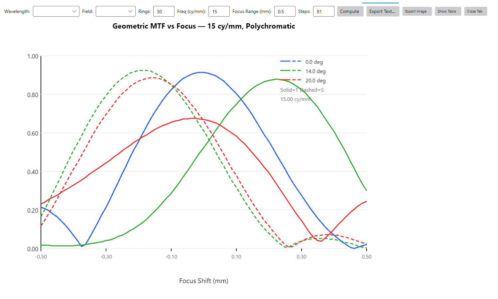

15 cy/mm modulation as a function of Δz. The 0° (blue) and 14°
(green) tangential peaks are offset along the focus axis — that's
the field curvature converted into MTF terms. The 20° (red)
tangential is broader and lower, mostly because the 20° spot is
also broader (see the Spot Diagram). Choose your image-plane
position to maximize the worst-field MTF, not the on-axis MTF.

| Input (all variants) | Meaning |
|---|---|
| **Rings** | Gauss-Legendre quadrature rings on the pupil. Default 15 (vs-frequency) or 30 (vs-field / through-focus). |
| **Field Pts** | Field samples (vs-field, through-focus). |
| **Frequency / Frequencies** | cy/mm (or cy/mrad afocal). |
| **Wavelength** | One or polychromatic. |

---

## Field Curvature

**Analysis → Field Curvature & Distortion**

Tangential (solid) and sagittal (dashed) best-focus position vs
field, plotted as **Focus Shift (mm)** along the X-axis and field
along the Y-axis (matches the standard convention).

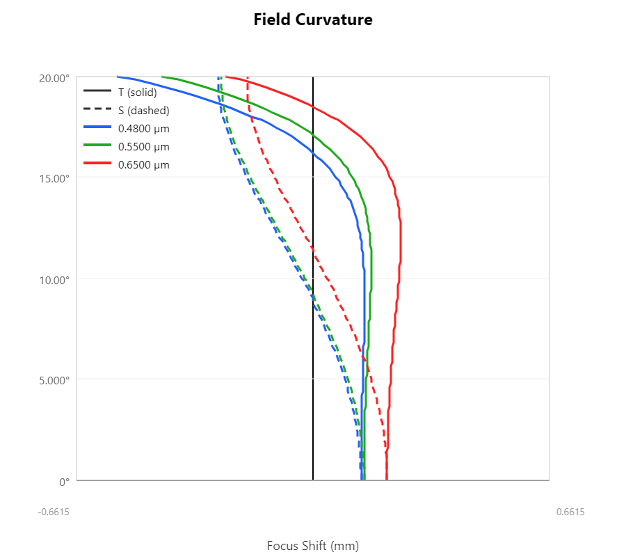

The intersection of the T and S curves at each field is the
Petzval surface for that wavelength; the gap between T and S at a
given field is the astigmatism. In the Cooke triplet:

- 0°-10° fields: T and S essentially overlap and stay within a few
  hundred microns of paraxial focus — the design is well-corrected
  in the inner field.
- 10°-20°: tangential and sagittal pull apart, with tangential
  bowing forward (smaller Z) and sagittal staying closer to flat.
  The maximum T-S separation at 20° is ~0.4 mm — the astigmatism
  budget at the field edge.
- Across wavelengths: the three curves are roughly parallel and
  shifted along Z — that's chromatic field curvature
  (longitudinal color × field curvature).

---

## Distortion

**Analysis → Field Curvature & Distortion**, *Type:* `F-Tan(θ)` or `F-θ`

Percent distortion vs field. The reference focal length is computed
from the slope `dY/d(tan θ)` of the chief ray near zero field — a
finite-difference between two small angles that removes any
constant chief-ray pupil-aberration bias and gives the true
effective focal length the chief ray actually sees. Same approach
as the `DITAN` / `DITHETA` merit operands.

Two reference types are selectable:

- **F-tan(θ)**: ideal `h = f × tan(θ)`. The standard rectilinear
  imaging convention. Cameras and most photographic lenses target
  this.
- **F-θ**: ideal `h = f × θ`. The scanner-lens convention, where a
  constant angular increment maps to a constant linear increment
  on the image — needed for laser scanners, document scanners,
  etc.

For the same Cooke triplet at the same fields, the two references
tell different stories:

| F-Tan(θ) | F-θ |
|---|---|
| 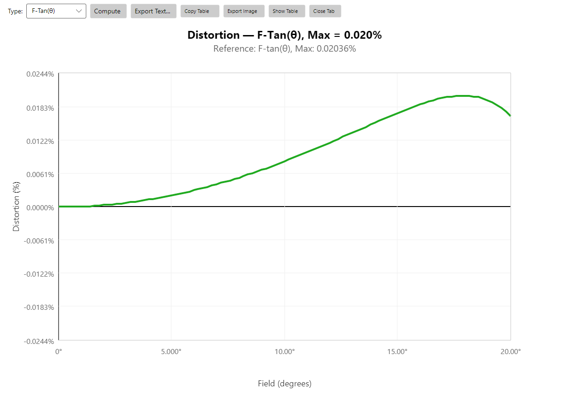 | 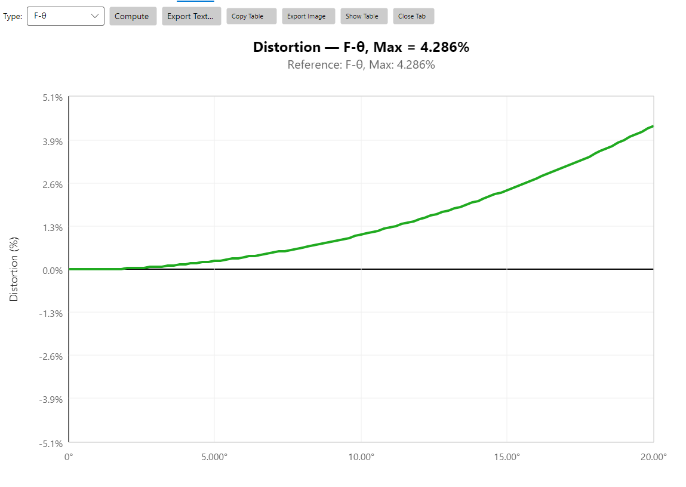 |

**F-Tan(θ)**: max 0.020 % at ~17° field. The Cooke triplet is a
well-corrected rectilinear lens; F-tan(θ) distortion is naturally
tiny.

**F-θ**: max 4.286 % at 20°. The same lens looks 200× worse
against an F-θ reference, because the lens is *not* an F-θ lens —
F-θ scanner lenses require a fundamentally different design with
strong negative third-order distortion built in to compensate.
This view is useful only if you actually need an F-θ output; for
imaging applications the F-tan(θ) plot is what matters.

---

## Relative Illumination

**Analysis → Relative Illumination**

Relative illumination as a function of normalized field:

```
RI(H) = (F/#_on-axis / F/#_field)²
```

Computed by tracing rays in 24 azimuthal directions (boundary search)
to measure the actual transmitting cone at each field, comparing to
the on-axis cone.

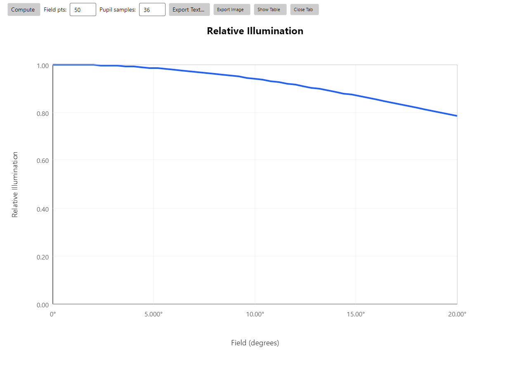

Reading: at 20° the Cooke triplet transmits ~79 % of the on-axis
illumination. Nearly all of that drop is the geometric `cos⁴(θ)`
effect (cos⁴(20°) ≈ 0.78); for a system with vignetting the curve
would drop substantially faster than `cos⁴`.

| Input | Meaning |
|---|---|
| **Field pts** | Field samples between 0 and max. Default 50. |
| **Pupil samples** | Boundary-search azimuth count. Default 36 — increase to 48 or 72 for systems with sharp vignetting boundaries. |

The same `RI` operand is available in the merit function — see
[Merit Function Reference](merit-function.md#first-order--system-operands)
— and uses the same boundary-search routine.

For wide-angle and retrofocus designs the curve can briefly exceed
1.0 (apparent concentration off-axis from pupil walking); that's
not a bug.

---

## Lateral Color

**Analysis → Lateral Color**

Chief-ray image-height difference at each non-primary wavelength
relative to the primary wavelength, plotted vs field. Output in µm
(focal mode) or arcmin (afocal mode). Matches the `LCF` merit
operand.

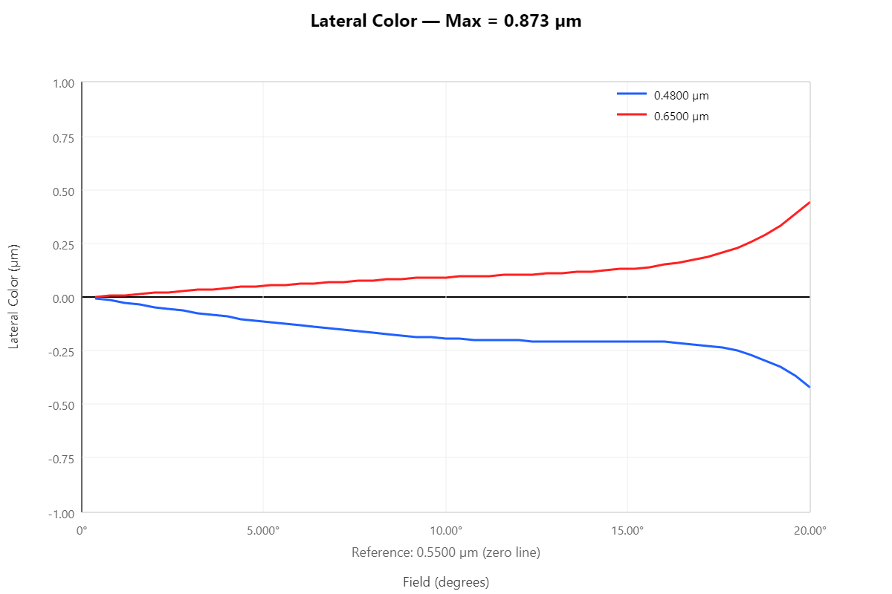

The reference (zero line) is the primary wavelength — the curves
show how far the other wavelengths' chief-ray heights deviate from
it. In the Cooke triplet the 0.48 µm (blue) and 0.65 µm (red)
spread is ≤0.5 µm out to about 16°, then widens to ~0.87 µm at the
20° field edge. The spread between extreme wavelengths at any
given field is the **lateral chromatic aberration** at that field.

The reported `Max` value at the top is the maximum across all
fields and all non-primary wavelengths — the same number `LCF`
returns when used at full field.

---

## Chromatic Focal Shift

**Analysis → Chromatic Focal Shift**

Paraxial best-focus offset vs wavelength, plotted as a curve. The
offset is image-plane Z displacement (µm) for focal systems and a
diopter shift for afocal systems.

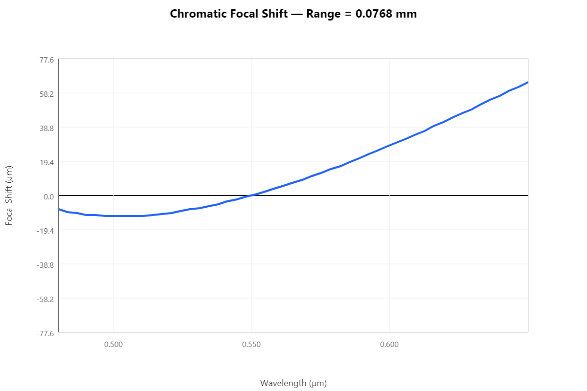

The zero line is the primary wavelength's focus position. Reading
the Cooke triplet curve: F-line (0.48 µm) sits at ~–8 µm relative
to d-line, blue → green crosses zero, and C-line (0.65 µm) is at
+62 µm — so the long-wavelength focal length is significantly
longer than the short-wavelength focal length. This is **secondary
spectrum** — the residual color a thin two-glass achromat can't
fully correct. Three-glass apochromats reduce this to a few µm; a
Cooke triplet only partially corrects it.

The title shows **Range** = peak-to-peak focal shift across the
swept wavelength interval.

| Input | Meaning |
|---|---|
| **Wavelength grid** | Number of sampled wavelengths between the system's min and max. Default 50. |

---

## Seidel Coefficients

**Analysis → Seidel**

Surface-by-surface third-order aberration coefficients with system
totals. Bar chart with one column per surface plus a `SUM` column;
each column has seven bars for the seven coefficient categories.

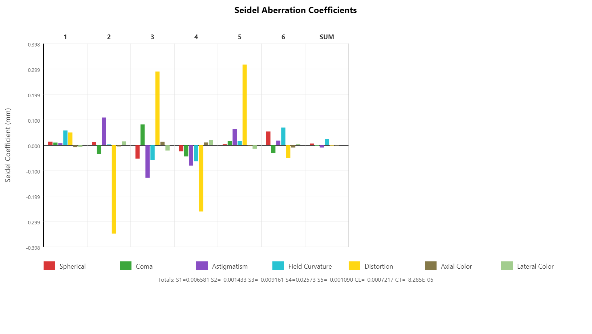

The seven categories:

| Symbol | Aberration |
|---|---|
| S1 | Spherical |
| S2 | Coma |
| S3 | Astigmatism |
| S4 | Petzval (field curvature) |
| S5 | Distortion |
| CL | Axial color |
| CT | Lateral color |

Bar height is the contribution of that surface to the system total
(in mm, except CL/CT which are in waves). The `SUM` column on the
right is the system total for each coefficient.

In the Cooke triplet screenshot, surfaces 2 and 3 contribute large
opposing distortion values (yellow bars at –0.32 and +0.29 mm) —
that's the classic positive-negative-positive cancellation a Cooke
triplet uses for field correction. The `SUM` distortion total (S5
in the legend) is much smaller than any single contribution
because of this cancellation.

The header shows the `Totals:` line with the seven sums. Glance at
this to see which coefficient is dominant; then look at the
per-surface bars to identify which surface is most responsible —
that's the surface to vary first when you optimize against that
coefficient.

| Input | Meaning |
|---|---|
| **Wavelength** | One wavelength at a time (defaults to primary). |

Values follow the standard third-order convention.

---

## Zernike Coefficients

> **CLI / MCP / API only — no GUI page.** Run via
> `lhlt analyze zernike` (CLI), the `lhlt_analyze_zernike` MCP tool,
> or `LensHHSession.AnalyzeZernike(...)` in the API. Tabular output
> is produced by `ZernikeTextExport`.

Decomposes the wavefront at one `(field, wavelength)` into Zernike
polynomial coefficients. Two ordering conventions are available:

- **Fringe** (sometimes "University of Arizona"): 37 terms,
  ordered by ascending mode-set within each radial order. Standard
  output for many interferometric instruments.
- **Standard** (Noll): 36 terms ordered by `n` then `m`. Standard
  for atmospheric / telescope work.

| Input | Meaning |
|---|---|
| **Number of terms** | How many coefficients to fit. Default 37 (Fringe) / 36 (Standard). |
| **Pupil Samples** | Grid resolution for the fit. |
| **Field / Wavelength** | One of each. |
| **Convention** | Fringe or Standard. |

The piston (Z1) and tilt (Z2, Z3) terms are typically tiny —
unaberrated tilt has been removed in the wavefront. The dominant
Zernike modes for a well-corrected lens are usually defocus (Z4),
spherical (Z9 / Z11 in Fringe), and the lower-order coma /
astigmatism modes.

Use the Zernike table to identify *which* aberration is dominant
in a residual wavefront — much faster than guessing from the
shape alone.

---

## Single Ray Trace

**Analysis → Single Ray Trace**

Trace one ray at a user-specified `(field, wavelength, pupil)` and
list its full state at every surface: position, direction cosines,
optical path length, accumulated waves, AOI (angle of incidence)
and AOE (angle of exitance).

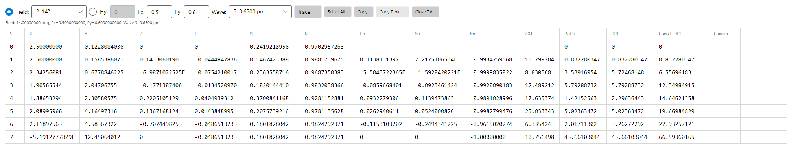

| Input | Meaning |
|---|---|
| **Field index** | 0-based index into the system's field list. |
| **Wavelength index** | 0-based index into the wavelength list. |
| **Px / Py** | Normalized pupil coordinate (–1 to +1). (0, 0) = chief ray; (0, 1) = upper marginal; (1, 0) = sagittal marginal. |

Use this when a higher-level analysis is giving a surprising
answer and you want to step through one ray manually. The same
ray-trace results are exposed in the merit function via the `RX` /
`RY` / `AOID` / etc. operands.

---

## System Data

**Analysis → System Data**

Summary table of first-order properties and derived scalars:

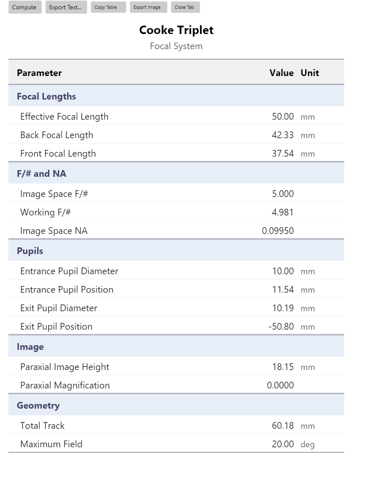

- **EFL** — paraxial effective focal length.
- **F/#** — system F-number (computed from EFL and entrance pupil
  diameter).
- **BFL** — back focal length (last surface to paraxial focus).
- **Total track** — first surface to image plane.
- **Entrance / exit pupil** — diameter and z-position.
- **Numerical aperture** — image-side NA.
- **Field angles / heights** — the user's field list.
- **Image-side angles / heights** — chief-ray image positions.

No inputs. Updates whenever the system changes.

---

## Layout

**Analysis → 2D Layout**

2D profile view of the lens with surface outlines, glass shading,
and rays from each field in each wavelength. Useful for sanity-
checking that chief rays do reach the image plane and that the
aperture stop is where you expect.

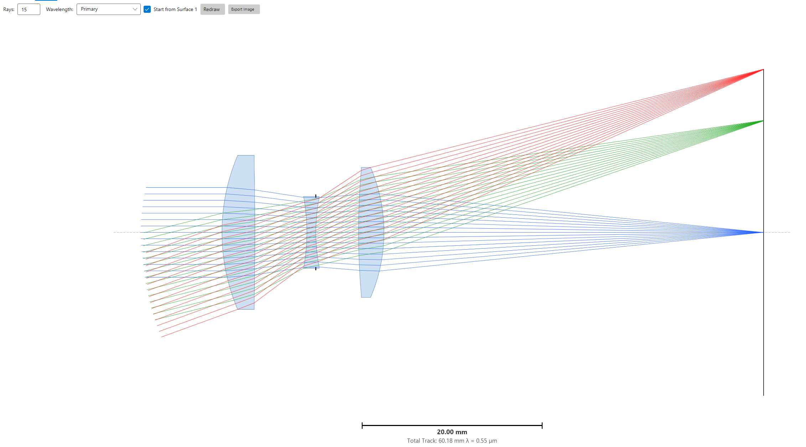

| Input | Meaning |
|---|---|
| **Rays per field** | Number of pupil rays drawn between the +py and –py marginals. |
| **Wavelength filter** | Draw one or all wavelengths. |
| **Layout mode** | `Off` (paraxial pupil aiming), `Real` (real-ray-aimed), or `Robust` (wide-angle iterative search). Match this to the system's RayAiming setting if you're cross-checking against the merit function. |

The 2D Layout is also available as its own always-on tab from the
sidebar — use that for live editing while watching ray paths
update; use the dedicated Analysis-menu version when you want a
captured image for a report.

---

## Performance and Accuracy Tips

- **Cache-friendliness.** Opening many analysis tabs at once is
  fine; each one caches its own ray traces. But an optimization
  run re-evaluates after every iteration — close analysis tabs
  during long optimizations if your machine feels sluggish.
- **Pupil samples are power-of-2.** FFT-based analyses pad
  internally to the next power of 2. Picking 64 / 128 / 256
  directly avoids the wasted pad cost.
- **Afocal systems.** All angular outputs (spot, lateral color,
  chromatic focal shift in diopters, MTF in cycles/mrad) switch
  automatically. No manual unit change needed.
- **Obscurations.** Central obscurations declared in the system
  aperture are honored — pupil sampling skips the obscured inner
  disk and Seidel / Zernike fits use the annular weight.
- **Field Y vs field height.** When `FieldType = ObjectAngle`,
  field values are degrees; when `FieldType = ObjectHeight`, they
  are millimeters. The plots show the correct unit on the X-axis
  in both cases.
