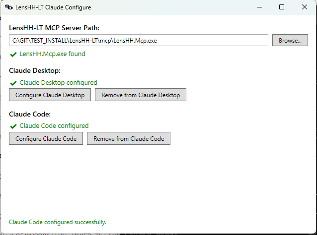

# Programmatic Access — API, CLI, and MCP

Three surfaces let you drive LensHH-LT without the GUI:

- **C# API** (`LensHH.API`, `LensHH.Core`) — embed or script the engine
  directly from your own .NET code.
- **CLI** (`LensHH.CLI`) — interactive REPL with scripted-input support.
- **MCP server** (`LensHH.Mcp`) — exposes the engine as tools for
  Model Context Protocol hosts (Claude Desktop, Cursor, etc.).

All three share the same `OpticalSystem` model, `MeritFunctionEvaluator`,
and optimizer implementations from `LensHH.Core`, so results are
identical across surfaces.

---

## C# API

The public entry point is **`LensHH.API.LensHHSession`**. One session
holds one optical system, its merit function, and a glass catalog
manager. Segregated interfaces let consumers depend on only the
surface they need.

### Quick Start

```csharp
using LensHH.API;
using LensHH.Core.Enums;

var session = new LensHHSession();
session.Initialize();               // load license / trial state

session.ImportZemax(@"C:\lenses\triplet.zmx");
session.SetAperture(ApertureType.EPD, 12.0);
session.SetFieldType(FieldType.ObjectAngle);

// Add a variable for surface 1 curvature:
session.AddVariable(surfaceIndex: 1, parameter: VariableParameter.Curvature);

// Build a minimal merit function:
session.AddMeritOperand(OperandType.SPOT, weight: 1.0);
session.AddMeritOperand(OperandType.EFL, weight: 1.0, target: 100.0);

// Run LM and inspect the result:
var result = session.OptimizeLocal();
Console.WriteLine($"Merit: {result.InitialMerit:E4} → {result.FinalMerit:E4}");

session.SaveAs(@"C:\lenses\triplet-optimized.lhlt");
```

### Segregated Interfaces

`LensHHSession` implements seven interfaces; you can narrow a
reference to just the capability you need:

| Interface          | Purpose |
|--------------------|---------|
| `ILicenseStatus`   | Activation state, trial days, machine ID. |
| `IFileIO`          | `.lhlt` load/save; import/export `.zmx`, `.seq`, `.len`, `.otx`, `.json`. |
| `ISystemEditor`    | Mutations: aperture, fields, wavelengths, surfaces, variables, pickups. |
| `IAnalysis`        | Spot diagram, MTF, wavefront, OPD/ray fans, Seidel, Zernike, lateral color, etc. |
| `IOptimization`    | Local LM, Multistart, Basin Hopping, split-element, SPC synthesis. |
| `IRendering`       | Plot/image rendering for GUI consumers (delegates to `LensHH.Rendering`). |
| `ITextExport`      | Plain-text dumps of analyses for scripting/reports. |

Example of a narrowly-typed consumer:

```csharp
IAnalysis analysis = session;
var spot = analysis.ComputeSpotDiagram(fieldIndex: 0, waveIndex: -1);
Console.WriteLine($"RMS = {spot.RmsRadius:F4} mm");
```

### Direct `LensHH.Core` Access

The API sits on top of `LensHH.Core`. If you need finer-grained
control — say, a custom optimizer that calls `MeritFunctionEvaluator`
directly — reference `LensHH.Core.dll` and use:

```csharp
using LensHH.Core.Glass;
using LensHH.Core.MeritFunction;

var glassMgr = new GlassCatalogManager();
glassMgr.LoadCatalogsFromFolder(@"catalogs\Glass");

var evaluator = new MeritFunctionEvaluator(session.System, glassMgr)
{
    ParallelEvaluation = true,
    AutoSolveSemiDiameters = true
};
double merit = evaluator.Evaluate(session.MeritFunction!);
```

Key `LensHH.Core` namespaces:

| Namespace                    | Contents |
|------------------------------|----------|
| `LensHH.Core.Models`         | `OpticalSystem`, `Surface`, `Aperture`, `Field`, `Wavelength`. |
| `LensHH.Core.Glass`          | `GlassCatalogManager`, `GlassData`, `AgfReader`. |
| `LensHH.Core.MeritFunction`  | `MeritFunction`, `Operand`, `OperandType`, `MeritFunctionEvaluator`. |
| `LensHH.Core.Optimization`   | `LocalOptimizer`, `BasinHoppingOptimizer`, `MultistartOptimizer`. |
| `LensHH.Core.Analysis`       | `SpotDiagram`, `FftMtf`, `WavefrontMap`, `SeidelCoefficients`, etc. |
| `LensHH.Core.RayTrace`       | `ArbitraryRay`, `ParaxialRayTracer`, `TracerBuffers`. |
| `LensHH.Core.IO`             | `.lhlt`/`.zmx`/`.seq`/`.len`/`.otx`/`.json` readers and writers. |

### License Gating

Every expensive operation (ray trace, optimization) goes through an
activation check before running. An unlicensed and expired install
throws `InvalidOperationException`. Call
`session.Initialize()` once at startup to load the persisted license;
`session.Activate(key)` or `session.ActivateOffline(tokenPath)` for
first-time setup.

---

## CLI

**Executable:** `<install>\cli\LensHH.CLI.exe` (Windows) or
`LensHH.CLI` (Linux/macOS).

An interactive REPL. Start with no arguments for an interactive
prompt, or pass `--script <file>` to run a batch of commands.

### Top-Level Commands

| Command   | Purpose |
|-----------|---------|
| `file`    | Open, save, import (`.zmx`, `.seq`, `.len`, `.otx`), export. |
| `system`  | System-level edits — aperture, field type, wavelengths, ray aiming, afocal flag. |
| `surface` | Add, remove, insert, edit surfaces; manage aspheric coefficients. |
| `glass`   | Search, load catalogs, show glass properties, generate filtered catalogs. |
| `pickup`  | Surface-to-surface parameter pickups. |
| `var`     | Mark parameters as variables with optional bounds. |
| `merit`   | Build and evaluate the merit function. |
| `optimize`| Run Local LM, Multistart, or Basin Hopping. |
| `analysis`| Run any analysis (spot, mtf, wavefront, seidel, etc.) and print results. |
| `log`     | Control log verbosity and output redirection. |
| `script`  | Execute a file of CLI commands. |
| `shell`   | Shell-out to the host OS. |
| `license` | Show license status, activate online or with a token file. |

Every command auto-completes sub-verbs and parameters. Type the
command alone (e.g. `merit` + Enter) for context help.

### Scripting

Commands accept the same arguments whether typed interactively or
loaded via `--script`. Example script:

```bash
# triplet-opt.lhscript
file import triplet.zmx
system aperture epd 12
system wavelength add 0.486
system wavelength add 0.656
var add 1 curvature
var add 2 curvature
var add 3 thickness
merit add spot weight=1
merit add efl target=100 weight=1
optimize local iterations=50
file save-as triplet-optimized.lhlt
analysis spot --field 0 --wave -1
```

Run with:

```bash
LensHH.CLI --script triplet-opt.lhscript
```

### Exit Codes

The CLI returns a non-zero exit code when a command fails or a script
aborts. Useful for CI/batch automation: `LensHH.CLI --script foo.txt ||
exit 1`.

---

## MCP Server

**Executable:** `<install>\mcp\LensHH.Mcp.exe` (Windows) or
`LensHH.Mcp` (Linux/macOS).

A Model Context Protocol server that exposes the engine as tools an
LLM can invoke. Uses standard stdio transport per MCP spec.

### Configuring Claude Desktop and Claude Code

LensHH-LT ships a small Windows utility — **Start Menu → LensHH-LT
Claude Configure** — that registers (or unregisters) the MCP server
with both Claude clients in one place. It auto-detects the bundled
`LensHH.Mcp.exe`; a green check appears once the path resolves.



| Section | Configure button | What it does | Remove button |
|---|---|---|---|
| **Claude Desktop** | Edits `%APPDATA%\Claude\claude_desktop_config.json`, adding an `mcpServers.LensHH-LT` entry that points at the MCP exe. | Reverts the edit. | Restart Claude Desktop for the change to take effect. |
| **Claude Code** | Shells out to `claude mcp add --transport stdio --scope user LensHH-LT -- "<exe>"`, so the registration goes through the official Claude Code CLI. If `claude` isn't on PATH the equivalent command is copied to your clipboard. | Runs `claude mcp remove --scope user LensHH-LT`. |

Status indicators below each section show whether the registration
is currently active, so you can use the same utility to verify the
setup after install or after moving the install path.

Manual configuration (Claude Desktop, if you prefer to edit JSON by
hand):

```json
{
  "mcpServers": {
    "LensHH-LT": {
      "command": "C:\\Program Files\\LensHH-LT\\mcp\\LensHH.Mcp.exe",
      "args": []
    }
  }
}
```

Manual configuration for Claude Code (the utility runs this verbatim):

```
claude mcp add --transport stdio --scope user LensHH-LT -- "C:\Program Files\LensHH-LT\mcp\LensHH.Mcp.exe"
```

Other MCP-aware hosts (Cursor, custom clients) use the same exe/args
as the Claude Desktop JSON block.

### Claude Code vs Claude Desktop — which to use

Both clients can drive every tool in the server, but they handle
*long-running* tools very differently. **Claude Code is the
recommended host for any optimization that runs for more than a
minute.** Specifically:

- **Multistart Optimization**
- **Basin Hopping (HJ-LM)**
- **Split Element**
- **Synthesis by SPC**

These four are not exposed as single blocking calls. They run as
**background jobs**: a `*_start` tool kicks the work off on a worker
thread and returns immediately with a `jobId`. The host then polls
`optimize_status(jobId)` for progress (phase, current trial / hop /
level, accepted vs rejected, current best merit, elapsed time) and
calls `optimize_cancel(jobId)` to stop early. `optimize_jobs` lists
every job tracked by the current session.

| Tool | Returns | Used to … |
|---|---|---|
| `optimize_multistart_start` | jobId | Start the optimizer in the background |
| `optimize_basin_hopping_start` | jobId | Same — BH variant |
| `optimize_split_element_start` | jobId | Same — Split Element variant |
| `optimize_synthesis_by_spc_start` | jobId | Same — SPC variant |
| `optimize_status` | progress fields | Poll a running job |
| `optimize_cancel` | confirmation | Request cancellation |
| `optimize_jobs` | one row per job | List every job tracked by the session |

The job pattern exists *because* these optimizers routinely run for
many minutes (Multistart) to many hours (SPC, Split Element). Claude
Code is a much better fit for this:

- It maintains a long-lived session and is comfortable polling on a
  10–30 second cadence over hours.
- It can be left to drive the optimization unattended.
- Its result-rendering doesn't share Claude Desktop's per-turn output
  / response-time constraints, which can stall on tool calls that
  emit lots of incremental progress.

Claude Desktop is fine for short interactive tool calls
(`spot_diagram`, `fft_mtf_vs_freq`, single `optimize_local` runs,
analyses in general). For the four long-running optimizers above,
use Claude Code — register both with the utility shown above and
pick the right one for the task at hand.

### Tool Categories

All tools operate on a single implicit session (`McpSession`) shared
across the server process. Loading a new system replaces the one in
the session. The ~123 tools group as:

| Category               | Tool count | Examples |
|------------------------|-----------:|----------|
| **System** (`SystemTools`)      | 24 | `system_new`, `system_load`, `system_save`, `system_import_zmx`, `system_set_aperture`, `system_set_wavelengths`, `system_set_fields`, `system_get_info`. |
| **Surface** (`SurfaceTools`)    |  7 | `surface_add`, `surface_insert`, `surface_remove`, `surface_set`, `surface_list`, `surface_set_asphere`. |
| **Glass** (`GlassTools`)        |  9 | `glass_load_catalogs`, `glass_list_catalogs`, `glass_search`, `glass_get_info`, `glass_get_index`, `glass_set_substitution`, `glass_generate_filtered_catalog`. |
| **Pickup** (`PickupTools`)      |  4 | `pickup_add`, `pickup_remove`, `pickup_list`, `pickup_clear`. |
| **Optimization** (`OptimizationTools`) | 16 | `merit_add_operand`, `merit_list`, `merit_edit_operand`, `merit_evaluate`, `variable_add`, `variable_list`, `optimize_local`, `optimize_basin_hopping`, `optimize_multistart`. |
| **Analysis** (`AnalysisTools`)  | 20 | `trace_ray`, `spot_diagram`, `ray_fan`, `pupil_aberration_fan`, `opd_fan`, `seidel`, `wavefront_map`, `fft_psf`, `fft_mtf_vs_freq`/`vs_field`/`through_focus`, `geo_mtf_*`, `zernike_standard`, `zernike_fringe`, `lateral_color`, `relative_illumination`, `chromatic_focal_shift`, `field_curvature_distortion`. |
| **Rendering** (`RenderingTools`)| 42 | `render_analysis_png`, `render_layout_png`, and per-analysis text-export tools (one `analysis_name_text` tool per analysis). |
| **License** (`LicenseTools`)    |  1 | `license_status` — shows activation/trial state. |

**Total:** ~123 tools.

Every tool has an `[McpServerTool, Description(...)]` attribute with a
plain-English description of what it does and what each parameter
means. An LLM discovering the server via MCP's introspection will see
those descriptions verbatim.

### Typical LLM Workflow

With LensHH-LT registered in Claude Desktop or Claude Code, a
conversation like this works end-to-end:

> **User:** Open `triplet.zmx` in `C:\lenses\`, add SPOT and EFL=100
> merit operands, make all curvatures variable, and run the LM
> optimizer.

The LLM issues: `system_import_zmx`, `variable_add` × 3,
`merit_add_operand` × 2, `optimize_local`, then `system_get_info` to
report back the final merit and surface data.

The rendering tools (`render_analysis_png` and friends) produce PNG
files the LLM can hand back to the user. Text-export tools produce
machine-readable CSV/text blocks the LLM can quote in its reply.

### Rendering Sub-Process

Plot rendering requires Skia, which in turn depends on the Avalonia
GPU bindings. Rather than pulling all of Avalonia into the MCP
server's memory space, the MCP server shells out to
`<install>\LensHH.RenderApp.exe` for PNG generation. This keeps the
MCP process lightweight (~50 MB) and means the RenderApp is only
launched on demand.

### Using a Local LLM (Ollama Bridge)

The MCP server is host-agnostic, but Claude Desktop and Cursor are
cloud-hosted. If you want to drive LensHH-LT from a **local** LLM —
no API key, no data leaving the machine — use the bundled
**`LensHH.OllamaBridge`**. It connects a tool-calling Ollama model to
the MCP server and runs an interactive REPL in your terminal.

#### Prerequisites

1. Install [Ollama](https://ollama.com) and start it:
   ```
   ollama serve
   ```
2. Pull a model that supports tool calling. Recommended starting
   points (any will work; bigger = better tool-call accuracy but
   slower):
   ```
   ollama pull qwen3:8b
   ollama pull llama3.1:8b
   ollama pull mistral-nemo
   ```

The bridge itself ships with the LensHH-LT installer — no source
build required. (Both the bridge and the MCP server it talks to are
already on disk after install.)

#### Launching

**Installed (Windows):** Start Menu → *LensHH-LT → Ollama Bridge
(Local LLM)*. Or run directly:

```
"%ProgramFiles%\LensHH-LT\ollama\LensHH.OllamaBridge.exe"
```

**Source build (any OS):** from the repo root,

```
# Windows
launch-ollama-bridge.bat

# Linux / macOS
./launch-ollama-bridge.sh
```

Or, equivalently:

```
dotnet run --project src/LensHH.OllamaBridge [mcp-server-path] [model-name]
```

Both arguments are optional. If omitted, the bridge probes standard
locations for `LensHH.Mcp` (installed sibling `mcp\` folder, or the
project's build output if you're running from source) and prompts
you to pick a model from the list returned by Ollama.

#### Environment Variables

| Variable           | Default                      | Purpose |
|--------------------|------------------------------|---------|
| `OLLAMA_URL`       | `http://localhost:11434`     | Ollama API endpoint. |
| `OLLAMA_MODEL`     | *(prompted if unset)*        | Skip the model-selection prompt. |
| `OLLAMA_TEMP`      | `0.1`                        | Sampling temperature. Low values keep tool-call JSON well-formed. |
| `OLLAMA_NUM_CTX`   | `8192`                       | Context window. Raise it (e.g. `32768`) for long sessions; the model must support it. |
| `OLLAMA_STREAM`    | `true`                       | Stream tokens as they arrive. Set to `false` for a single-block response. |
| `LENSHH_MCP_PATH`  | *(auto-discovered)*          | Absolute path to `LensHH.Mcp.exe`/`.dll` if it isn't in a standard location. |

Example — pin a model and raise the context window:

```
# Linux / macOS
OLLAMA_MODEL=qwen3:14b OLLAMA_NUM_CTX=32768 ./launch-ollama-bridge.sh

# Windows (PowerShell)
$env:OLLAMA_MODEL="qwen3:14b"; $env:OLLAMA_NUM_CTX="32768"; .\launch-ollama-bridge.bat
```

#### REPL Commands

Inside the prompt, type:

- A natural-language request — the model decides which MCP tools to
  call. Tool calls are echoed as `[Tool: tool_name]` with a truncated
  result preview; the full result is fed back to the model.
- `tools` — list every MCP tool the bridge discovered.
- `quit` or `exit` — shut down (also closes the MCP subprocess).

#### Example Session

```
You> Open C:\lenses\triplet.zmx, set the EPD to 12 mm, and tell me the EFL.
  [Tool: system_import_zmx]
  {"ok":true,"surfaces":5}
  [Tool: system_set_aperture]
  {"ok":true}
  [Tool: system_get_info]
  {"efl":99.83,"bfl":94.21,"track":108.4,...}
LensHH> Loaded triplet.zmx (5 surfaces) and set EPD = 12 mm.
        Effective focal length is 99.83 mm.
```

#### Choosing a Model

Tool-calling quality matters more than raw size. As of this writing:

- **`qwen3:8b`** — solid baseline, fast, reliable JSON.
- **`qwen3:14b`** / **`qwen3:32b`** — more accurate multi-step plans.
- **`llama3.1:8b`** — comparable to `qwen3:8b`; sometimes better at
  free-form explanation.
- **`mistral-nemo`** — fast on modest hardware; occasional
  malformed-tool-call retries.

Avoid models without explicit tool-call training (most pre-Llama-3.1
checkpoints) — they will either ignore the tools or emit JSON that
fails to parse.

#### Troubleshooting

- **`Cannot connect to Ollama`** — make sure `ollama serve` is
  running; check `OLLAMA_URL` if Ollama is on a different host or
  port.
- **`LensHH.Mcp server not found`** — build `LensHH.Mcp` first, or
  set `LENSHH_MCP_PATH` to the full path of the executable/dll.
- **Tool calls keep failing with parse errors** — the model is too
  small or not tool-call trained. Try `qwen3:8b` or larger, lower
  `OLLAMA_TEMP` further (e.g. `0.0`), and rerun.
- **`No models found`** — pull at least one model with
  `ollama pull <name>`.

### Writing Custom MCP Clients

The MCP server speaks standard MCP over stdio. Any MCP-compliant
client can drive it. If you're writing your own client:

1. Launch `LensHH.Mcp.exe` as a subprocess.
2. Use MCP introspection (`tools/list`) to enumerate tool schemas.
3. Call tools with `tools/call`; the response body is JSON.
4. Shut down by closing stdin or killing the process.

---

## When to Use Which

| Use case | Best choice |
|---|---|
| Embed the engine in a .NET GUI or service. | **C# API** — direct, typed, no IPC overhead. |
| Batch-run many designs in CI / nightly jobs. | **CLI** with `--script`. |
| Interactive exploration at a terminal. | **CLI** REPL. |
| LLM-assisted design ("ask Claude to tune this triplet"). | **MCP server** with Claude Desktop / Cursor. |
| Local LLM-assisted design (no cloud, no API key).        | **MCP server** via the **Ollama Bridge**. |
| Cross-language driver (Python, Node, etc.) that doesn't want to embed .NET. | **CLI** via subprocess, or **MCP** if the client supports it. |

All three share `LensHH.Core`, so any workflow you prototype in one
translates directly to the others.
