# Getting Started

## Install (Windows)

1. Run `LensHH-LT-Setup-<version>.exe`.
2. If the installer warns that .NET 8.0 Desktop Runtime is missing,
   accept the prompt to download it from Microsoft, install, then
   re-run the LensHH-LT installer.
3. Launch **LensHH-LT** from the Start Menu.

Sample lens files are installed under `<install>\samples\` with the
`.lhlt` extension.

## License & Trial

LensHH-LT is distributed under a **hybrid license**:

- **Source code** (GUI, CLI, MCP server, public C# API, IO,
  rendering, configurators) is open source under the **MIT
  license**. Fork it, modify it, redistribute it.
- **Optical engine binaries** (`engine/LensHH.Core.dll` plus the
  platform-specific native ray-trace libraries) are **proprietary**
  to Synapse Optics and require an activation token to run.

See `LICENSE` at the project root for the full terms.

Ray tracing, optimization, and analyses won't run until you've
activated either a free trial or a paid license. Both flows live
under the **Help** menu.

### Start a free trial (45 days)

1. **Help → Start Free Trial...**
2. Enter your email address and click **Send Code**. A six-digit
   verification code is sent to that address.
3. Enter the code in the dialog and click **Activate**.
4. The trial runs for 45 days from activation. **Help → License
   Status...** shows the days remaining at any time.

One trial per email address. Reinstalling does not reset the clock.

#### If your network blocks the activation server

If your corporate firewall cannot reach the licensing host (see
[Network requirements](#network-requirements) below), use the
offline path on the same dialog:

1. **Help → Start Free Trial...** → click **Activate offline from
   token file...** at the bottom of the dialog.

   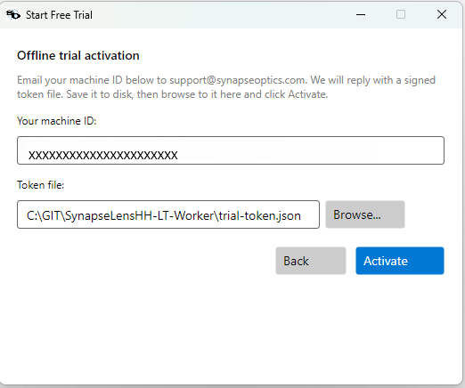

2. Email the **machine ID** shown in the dialog, plus the email
   address you'd like the trial bound to, to
   `support@synapseoptics.com`.
3. Synapse Optics replies with a signed `trial-token.json` file.
   Save it locally (USB transfer is fine — the machine doesn't
   need internet to receive the file).
4. Back in the dialog, click **Browse...**, select the token file,
   and click **Activate**. The 45-day clock starts at activation.

The token is bound to the machine ID you sent — the embedded
signature only verifies on that machine. The flow works on
fully air-gapped machines.

### Activate a paid license

1. **Help → Activate License...**
2. Paste your license key and click **Activate**. The dialog
   contacts the activation server, binds the seat to this machine,
   and stores a signed token locally — subsequent launches don't
   need network access.
3. The Help menu's **License Status...** entry shows the active
   license and machine binding.

### Move a license to another machine

A license is one seat. To free it up:

1. On the current machine: **Help → Deactivate This Machine...** —
   re-enter your license key to confirm. The server frees the seat.
2. On the new machine: **Help → Activate License...** with the same
   key.

### Offline activation

If the new machine has no internet access, request an offline
activation token from your distributor (mention your machine ID,
shown under **Help → License Status...**), save it as a `.json`
file, and import it via **Help → Activate License...** — the dialog
detects a token file vs a key string automatically.

## Network requirements

LensHH-LT only reaches the network for license activation and
deactivation. Ray tracing, optimization, analyses, and file I/O run
fully offline once activated.

If your IT department restricts outbound traffic, the values below
are everything they need to whitelist:

| Field           | Value                                                                                  |
|-----------------|----------------------------------------------------------------------------------------|
| Hostname        | `synapseoptics-license.javier-ruiz.workers.dev`                                        |
| Protocol / port | HTTPS / TCP 443                                                                        |
| Methods         | `POST` (trial request, trial verify, activate, deactivate)                             |
| Hosting         | Cloudflare Workers (anycast — whitelist by hostname / SNI; no fixed IP range)          |
| TLS             | TLS 1.2 or 1.3, public CA-signed certificate                                           |
| TLS inspection  | Do not intercept — the client pins to the hostname's certificate via SNI               |
| Direction       | Outbound only — LensHH-LT does not accept inbound connections                          |

If the host cannot be allowlisted, both the
[offline trial](#if-your-network-blocks-the-activation-server) and
the [offline paid-license activation](#offline-activation) flows
work with zero network access on the target machine.

## Your First Lens

1. **File → Open…** — point at any file in `<install>\samples\`
   (try `CookeTriplet.lhlt` for the classic three-element form, or
   `Heliar.lhlt` for a five-element triplet derivative).
2. The main window opens on the **Lens Editor** — the lens
   prescription table. Tabs along the top switch between the
   **Lens Editor**, the **2D Layout**, and the **Merit Function**
   editor.

   

3. Click **2D Layout** to see the design ray-traced:

   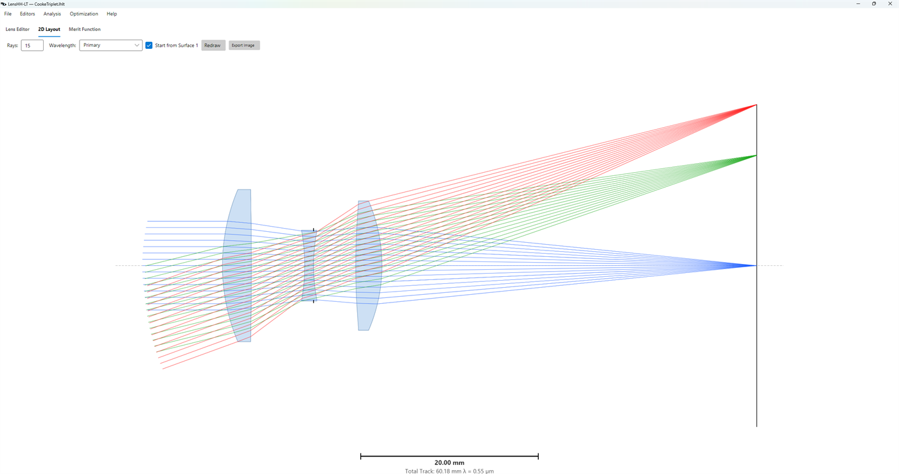

4. Open a spot diagram: **Analysis → Spot Diagram**.
5. Open a wavefront map: **Analysis → Wavefront Map**.
6. Close both and try optimization — read on.

## Your First Optimization

The optimizer moves any parameter you've tagged **Variable**. Picking
the right variable set is the central design decision; everything
else (merit function, optimizer choice, bounds) just shapes the
search. LensHH-LT gives you three ways to mark variables — pick
whichever matches the granularity you need.

### Marking variables

#### 1. Bulk: thickness or curvature across a surface range

The fastest way to start. Above the Lens Editor table:

- **Set/Clear Thickness Variables** opens a dialog with `Surface 1`,
  `Surface 2`, and a **Set / Clear** radio. Click **Set**, choose a
  range (e.g. surfaces 1 through 6 to vary every glass and air
  thickness in the Cooke triplet), and **OK**. Every thickness in
  the range is now a variable.

  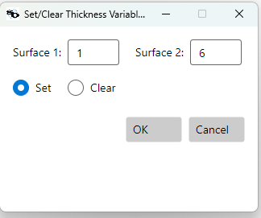

- **Set/Clear Curvature Variables** is the same idea for curvatures.
  An extra checkbox **Ignore Infinite Radius Surfaces** keeps flat
  surfaces fixed (you almost always want this on).

  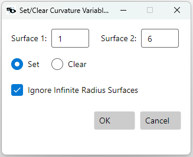

Each tagged parameter shows a **V** indicator next to its value in
the Lens Editor table:

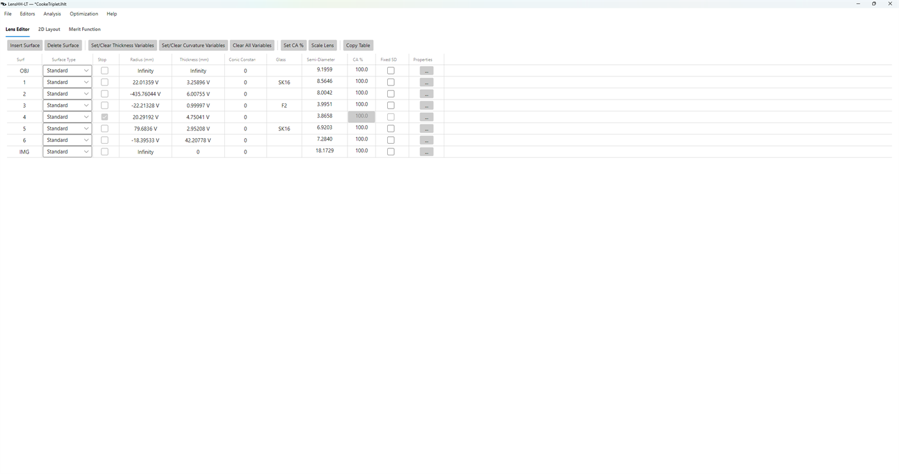

#### 2. Per-surface fine-grained: the Properties dialog

For one surface at a time, click the **`...` Properties** button in
that surface's row. The **Variable / Pickup** tab has a section for
each of **Curvature**, **Thickness**, and **Conic** with three radio
buttons:

- **Fixed** — the optimizer leaves this parameter alone.
- **Variable** — the optimizer is free to change it.
- **Pickup** — the parameter is computed from another surface's
  parameter as `Source × Scale + Offset`. Use a pickup to lock two
  curvatures together (e.g., a symmetric singlet) or to drive an
  airspace from a glass thickness.

Choose **Variable** to mark the parameter as free.

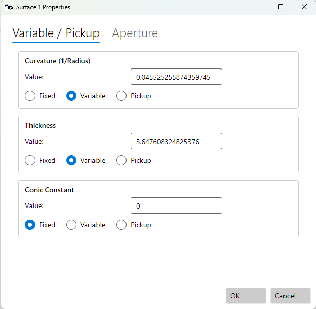

#### 3. Aspheric coefficients

On surfaces with aspheric type, the Properties dialog's **Aspheric**
tab lists every coefficient (`A2` through `A16`) with a per-row
**Var** checkbox. Tick the ones you want optimized.

### Setting bounds (Min/Max constraints)

Bounds live under **Optimization → Variable Editor** — *not* on the
Lens Editor table. Open it after you've marked your variables and
the dialog lists every variable as a row:

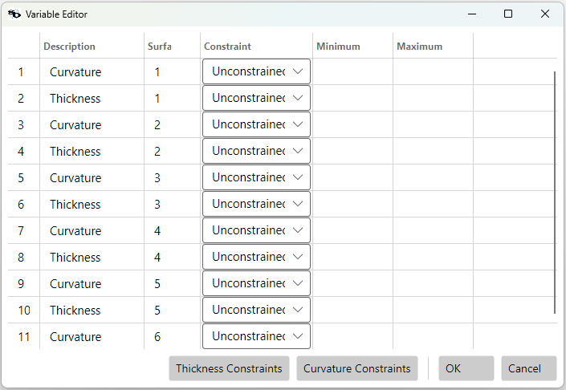

Each row shows:

| Column | Meaning |
|---|---|
| **#** | Variable number. |
| **Description** | What the variable is (e.g. *Curvature*, *Thickness*). |
| **Surf** | The surface index it lives on. |
| **Constraint** | A combo: **Unconstrained**, **Min**, **Max**, or **Min/Max**. |
| **Minimum** | Lower bound. Used if Constraint is `Min` or `Min/Max`. |
| **Maximum** | Upper bound. Used if Constraint is `Max` or `Min/Max`. |

Inside the optimizer, bounds are enforced via an unbounded parameter
transformation, so the LM solver never tries an illegal value — it
just slows down near the wall.

For broad ranges, the **Thickness Constraints** and **Curvature
Constraints** buttons at the bottom of the Variable Editor open a
bulk dialog. The thickness one is especially useful — pick a
surface range, an `All / Glass / Air` selector, a `Constraint`
mode, and a single `Min` / `Max` pair, and the dialog applies them
to every matching thickness variable in the range. Run it twice to
get separate glass and air rules:

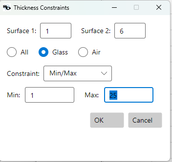

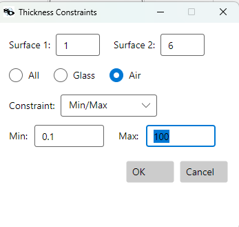

After both runs the Variable Editor reflects the populated
constraints — glass thicknesses bounded `[1, 25] mm`, air gaps
bounded `[0.1, 100] mm`:

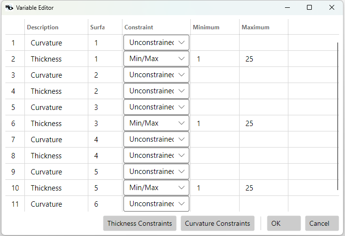

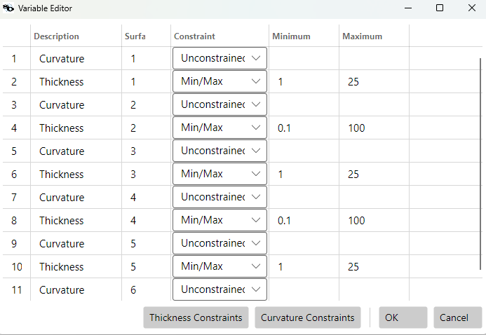

### Building a merit function

**Optimization → Merit Function**. Add operands via the **Insert**
button. A good starting merit function has three layers; cutting any
of them risks an unphysical or shallow-converged design.

> **A note on composite operands.** `WAVEX`, `SPOT`, `WAVEM`, and the
> other image-quality operands are *composite*: a single row evaluates
> over **every field point and every wavelength** in the system at
> once. You don't pick `Hx`/`Hy` or `Wave` for these — the operand
> automatically applies the per-field weights from the Field editor
> and the per-wavelength weights from the Wavelength editor as
> internal sub-weights (the engine multiplies
> `macro_weight × field_weight × wavelength_weight × pupil_weight`
> for each hidden expanded operand). One `WAVEX` row covers the
> whole field × wavelength × pupil grid, so you don't need a long
> merit function with many rows to control image quality.

> **Reading the merit grid: `Mode` and the two bound columns.** The
> Merit Function table doesn't have separate `Min` and `Max`
> columns. It has **`Bound 1`** and **`Bound 2`**, and how they're
> interpreted depends on the **`Mode`** combo on the same row:
>
> | `Mode`      | `Bound 1` is...        | `Bound 2` is...      |
> |---|---|---|
> | `Target`    | the target value        | (hidden, not used)   |
> | `Min`       | the minimum value       | (hidden)             |
> | `Max`       | **the maximum value**   | (hidden)             |
> | `Min/Max`   | the minimum value       | the maximum value    |
>
> Note that `Max` mode puts the upper bound in `Bound 1`, *not*
> `Bound 2` — `Bound 2` is only visible/editable when `Mode =
> Min/Max`. When the example rows further down say "`min=...`" and
> "`max=...`" together, set `Mode = Min/Max` and put the min in
> `Bound 1` and the max in `Bound 2`. When an example shows just
> "`target=...`", set `Mode = Target` and put the value in `Bound 1`.

> **What `Value` and `Error` mean in each row.** The two read-only
> columns at the right of every operand show:
>
> - **`Value`** — what the operand currently evaluates to in the
>   live design (e.g. for `EFL`, the focal length in mm; for `EG`
>   over a surface span, the worst edge thickness; see "Span
>   operands" below).
> - **`Error`** — the row's residual contribution. The LM solver
>   minimizes `Σ Error²` across the whole table. `Error` is always
>   `(value − reference) × weight`, where the reference depends on
>   `Mode`:
>
>   | `Mode`     | `Error` (residual) |
>   |---|---|
>   | `Target`   | `(value − target) × weight`. Always nonzero unless `value == target`. |
>   | `Min`      | `(value − min) × weight` **if** `value < min`, else 0. One-sided deadband. |
>   | `Max`      | `(value − max) × weight` **if** `value > max`, else 0. One-sided deadband. |
>   | `Min/Max`  | `(value − min) × weight` if below `min`; `(value − max) × weight` if above `max`; else 0. Two-sided deadband. |
>
> A row whose `Value` is inside its bounds shows `Error = 0` — it
> contributes nothing to the merit and acts purely as a guardrail
> ("don't go past this"). That's why boundary operands (`EG`,
> `CTG`, etc.) don't fight image quality while the design stays
> well-formed.
>
> **Span operands (`Surface` ≠ `Surface2`).** When the row covers a
> surface range, the operand evaluates the underlying parameter
> (center thickness, edge thickness, semi-diameter, etc.) at every
> surface in the span and tracks the per-span minimum and maximum.
> The displayed `Value` then represents the span as one number,
> chosen so the residual reflects the worst violation:
>
> - **Min violated** (any surface in the span has value below
>   `Min`): `Value` is the smallest value across the span — the
>   worst-offending surface.
> - **Max violated**: `Value` is the largest value across the span.
> - **Both violated**: `Value` is whichever side has the larger gap
>   from its bound (the more critical violation).
> - **All satisfied**: `Value` is the smaller of the two extremes
>   (closest to the lower constraint), so you can read how much
>   margin the worst surface still has.
> - **`Target` mode**: `Value` is the mid-point
>   `(minVal + maxVal) / 2` of the span.
>
> **One row → one residual, no matter how many surfaces violate.**
> A span operand produces exactly **one** residual per evaluation,
> computed from the single worst-offending surface in the span.
> Multiple violators **do not add together**. If three surfaces in
> the span have edge thicknesses `0.1`, `0.3`, `0.4` and `Min = 0.5`,
> the row's `Error` is `(0.1 − 0.5) × weight` — driven by the `0.1`
> surface alone; the other two contribute zero.
>
> In practice the optimizer resolves multi-surface violations
> iteratively: it fixes the worst surface this iteration, the
> next-worst becomes the new worst, and so on across iterations.
> This is normally what you want — it keeps geometric-bound rows
> from drowning out image quality just because the design happens
> to have many elements.
>
> **If you want additive behavior** — every violator contributing
> independently to `Σ Error²` — write one row per surface (set
> `Surface = Surface2` to a single index, repeat for each surface).
> You lose the auto-protection benefit when surfaces get inserted
> later, but each violation enters the merit on its own. A common
> hybrid: keep the span row for blanket protection and add a
> per-surface row for any surface you know is marginal (e.g., the
> one closest to the stop on a fast lens). Both contribute, so the
> marginal surface gets extra optimizer attention without losing
> the span coverage.
>
> Adding a new surface during design — split-element, doublet
> insertion — automatically becomes part of the span row's
> evaluation, so structural edits stay protected without merit-
> function maintenance.

#### 1. Image quality

Recommended: **`WAVEX`** — RMS wavefront error in waves, with piston
and tilt removed. Wavefront error is what diffraction-quality images
actually care about, and the LM solver converges on it more reliably
than on transverse ray aberration. Set `Rings = 6`, `Arms = 12`,
`Weight = 1`. That's it — no field or wavelength specifiers, because
`WAVEX` already integrates over both.

`SPOT` (RMS spot size) is also composite and also tempting because
the units (mm) feel intuitive, but it's a poorer proxy for image
quality near the diffraction limit and tends to leave the optimizer
stuck in shallow local minima. Start with `WAVEX` unless your design
is many times the diffraction limit (where wavefront and spot stop
tracking each other).

#### 2. First-order constraints

Lock the design's first-order properties so the optimizer doesn't
trade them away for image quality:

- `EFL` — locks focal length. `Target = <desired EFL>`, `Weight = 100`
  (see *Weights — telling the optimizer what's paramount* below for why).
- `TTRACK` (max total track), `MAG` (magnification), `DITHETA` (max
  F-θ distortion %), etc. — see the
  [Merit Function Reference](merit-function.md).

#### 3. Physical-thickness boundaries (almost always required)

Without explicit constraints, the optimizer will gladly drive a lens
to a vanishing center thickness or a negative edge thickness — both
unphysical, both common failure modes. **An effective optimization
always enforces thickness boundaries.**

The right tool depends on which thickness you're constraining:

- **Center thickness** (the `Thickness` field on a surface) is a
  single variable, so it's bounded most cleanly via **variable
  bounds** in the Variable Editor — see *Setting bounds* above. Set
  `Constraint = Min and Max` on every glass-thickness variable, with
  `Minimum ≈ 1 mm` and a sensible `Maximum`; same for every
  airspace, with `Minimum ≈ 0.1 mm`. The LM solver enforces these
  exactly through an unbounded parameter transformation, with no
  drag on convergence while the design is well-formed.

  **Alternative — merit operands.** Two operands cover the same
  ground for users who prefer to keep all geometric constraints in
  the merit function rather than split between Variable Editor and
  Merit Function: `CTG` (Center Thickness for glass elements) and
  `CTA` (the air-gap analog). Both accept `Surface`/`Surface2`
  spans and `Min`/`Max` bounds. Either approach works — pick one
  and apply it consistently to every center thickness in the
  design; mixing and matching surface-by-surface is how holes get
  left.

- **Edge thickness** is a derived quantity (function of curvature
  *and* center thickness *and* semi-diameter), so it can't be
  expressed as a variable bound at all. You **must** use merit
  operands:

  | Operand | Acts on | Meaning |
  |---|---|---|
  | `EG`  | Glass elements | Edge thickness — set `Min` (and `Max`) |
  | `EA`  | Air gaps       | Edge thickness of an air space |

  These are **almost always necessary**: a steeply-curved positive
  lens can have its edges cross zero even with a perfectly healthy
  center thickness. Set `Constraint = Min and Max`, `min = 0.5 mm`
  for glass, `min = 0.1 mm` for air, and a sensible max so the
  optimizer doesn't run away.

> **Use surface spans, not individual surfaces.** `EG`, `EA`, `CTG`,
> and `CTA` all accept a `Surface` and a `Surface2`. Set them to the
> range of all optical surfaces (e.g. `surface=1, surface2=6` for a
> six-surface triplet) and a single row covers the whole lens. The
> benefit isn't just brevity: when you later split an element, add
> a doublet, or otherwise insert surfaces, the merit function
> automatically protects the new geometry too. A merit function
> that names individual surfaces becomes silently incomplete after
> every structural edit.

#### 4. Weights — telling the optimizer what's paramount

The numbers in the `Weight` column are how you express priority to
the optimizer. The LM solver minimizes `Σ (weight × residual)²`,
so an operand with weight 100 contributes 10 000× more to the
residual sum-of-squares per unit of error than an operand with
weight 1. Operands the design *must* hit (focal length,
manufacturability bounds) get high weights; operands you want
minimized but not at any cost (image quality) get lower weights.

A typical hierarchy for a "hit the spec" design:

| Layer | Recommended weight |
|---|---|
| First-order constraints (`EFL`, `MAG`, `DITHETA`, ...)   | **100** |
| Physical-thickness boundaries (`EG`, `EA`, `CTG`, `CTA`) | **10**  |
| Image quality (`WAVEX`, `SPOT`)                           | **1**   |

With this hierarchy the optimizer will sacrifice wavefront error
before it lets focal length drift, and it will respect the geometry
boundaries before it lets focal length drift. Image quality is what
gets pushed down once the higher-priority operands are satisfied.

A natural variant is to raise the `EG` / `EA` weights (e.g., to 100)
when you want the optimizer to back well inside the geometric
bounds for **manufacturing margin hardening**, instead of just
sitting on the bound at the minimum.

The point is to set weights *deliberately*. Equal weights — leaving
every operand at the default 1 — is rarely the right priority
structure for a design that has both a hard focal-length spec and
image-quality goals.

#### Putting it together

A minimum-viable starter merit function for the Cooke triplet
(surfaces 1 through 6 are all the optical surfaces; surface 7 is the
image plane), with the recommended weights — exactly what's shown
in the screenshot below:

| Row | Type   | Weight | Mode    | Bound 1 | Surf | Surf2 | Rings | Arm | Notes |
|---|---|---|---|---|---|---|---|---|---|
| 1 | EFL    | 100    | Target  | 50      |      |       |       |     | Lock focal length to 50 mm   |
| 2 | WAVEX  | 1      | Target  | 0       |      |       | 6     | 12  | Image quality (composite)    |
| 3 | EA     | 10     | Min     | 0.1     | 1    | 6     |       |     | Air-gap edge thickness ≥ 0.1 |
| 4 | EG     | 10     | Min     | 1       | 1    | 6     |       |     | Glass edge thickness ≥ 1     |

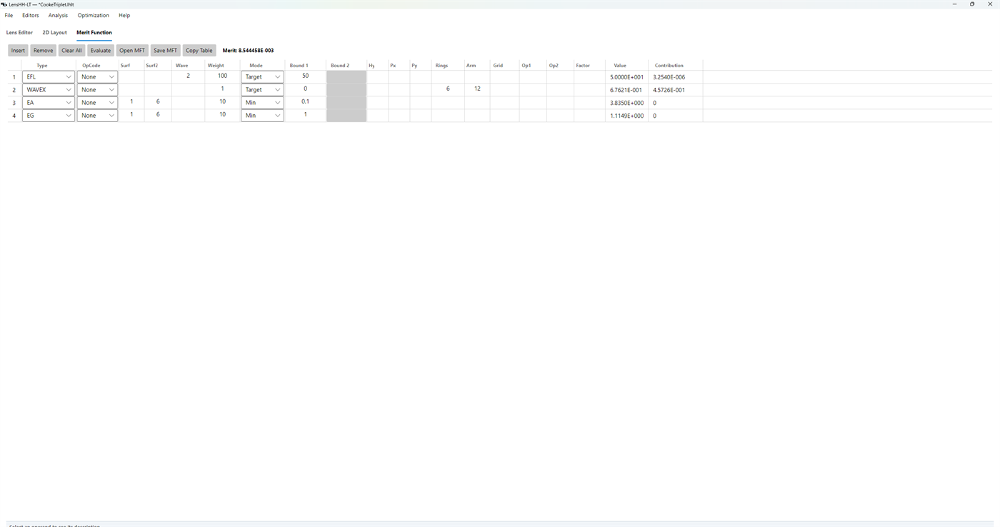

The `Value` column shows each row's live evaluation; the
`Contribution` column shows the row's residual squared (`Error²`).
On a well-aligned starting design the WAVEX `Contribution` dominates
— that's the operand the optimizer is actually working on. The
boundary rows contribute zero whenever the design is in-bounds.

Plus, in the Variable Editor, set `Constraint = Min/Max` on every
thickness variable (`Min ≈ 1 mm` for glass, `Min ≈ 0.1 mm` for air,
sensible `Max` values).

Four merit-function rows + bounded variables + a deliberate weight
hierarchy — that's the minimum for a well-protected optimization.
Add `MAG`, `DITHETA`, distortion bounds, etc. as your design's
specs require, and weight them in line with how strict the spec is.

### Running the optimizer

**Optimization → Local Optimization**. The dialog opens with
sensible defaults — Max Iterations 4000, Broyden Update on, Init
Damp 1e-3 (Levenberg-Marquardt starting damping; see the
[optimization reference](optimization.md#local-lm) for when to
override):

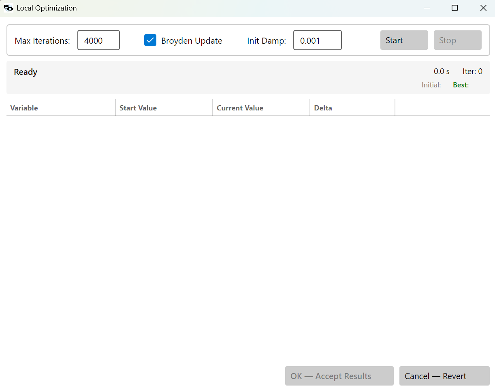

1. Press **Start**. The dialog populates a per-variable table
   showing **Start Value**, **Current Value**, and **Delta** for
   every variable, and the merit value updates live in the header
   strip.
2. **Stop** cancels mid-run; **OK — Accept Results** keeps the
   current state; **Cancel — Revert** restores the pre-run design.

A converged run on the Cooke-triplet starter (already close to
optimum) typically improves the merit by a few percent and finishes
within a fraction of a second:

The clearest picture of what changed is in the wavefront map. On
axis, the RMS wavefront error drops by roughly 3× — from about
0.21–0.27 waves down to under 0.10 waves at the central wavelength —
and the residual figure shifts from a clear spherical bowl to a
much flatter, near-diffraction-limited surface:

| Before | After |
|---|---|
| 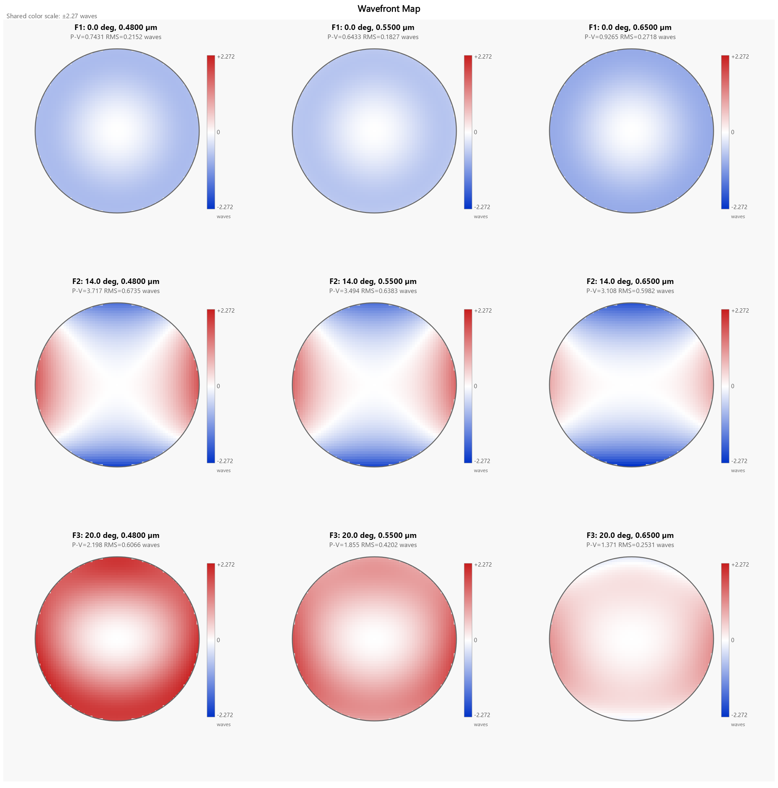 | 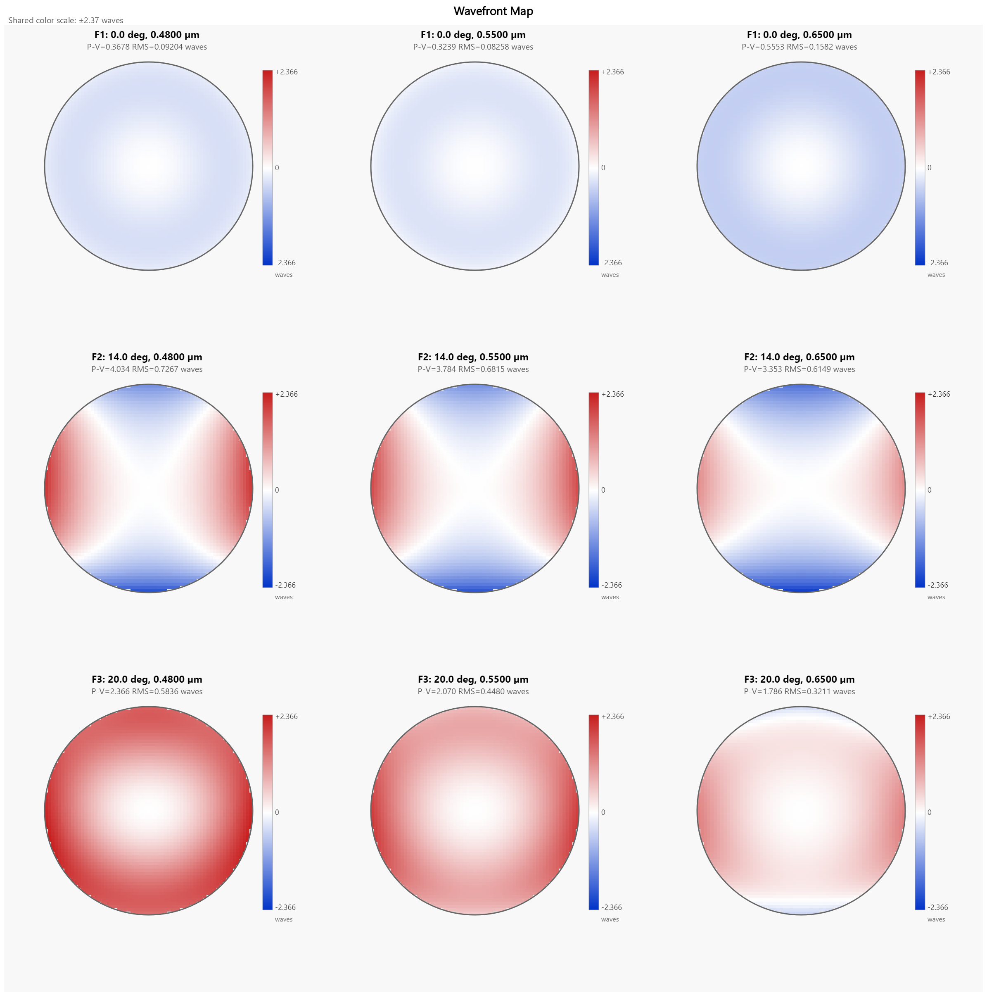 |

That on-axis improvement shows up immediately on the polychromatic
FFT MTF. Before, the on-axis (blue) curve falls almost as fast as
the off-axis curves; after, it pulls away and tracks the diffraction
limit out past 150 cy/mm. The 14° and 20° curves improve only
modestly — the 20° field is dominated by oblique aberrations the
spherical-only triplet can't fully correct:

| Before | After |
|---|---|
| 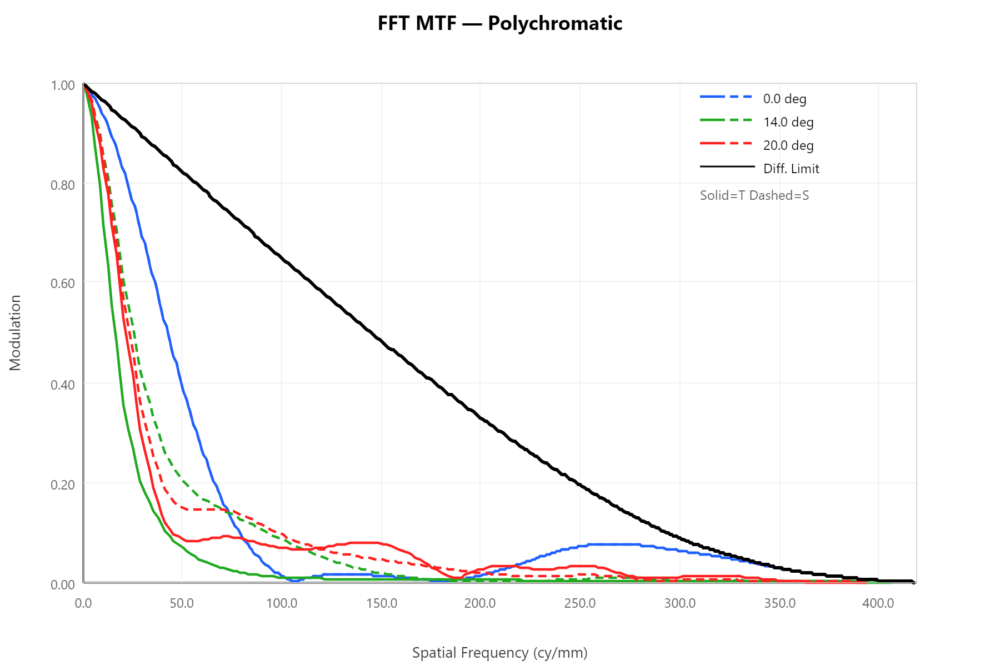 | 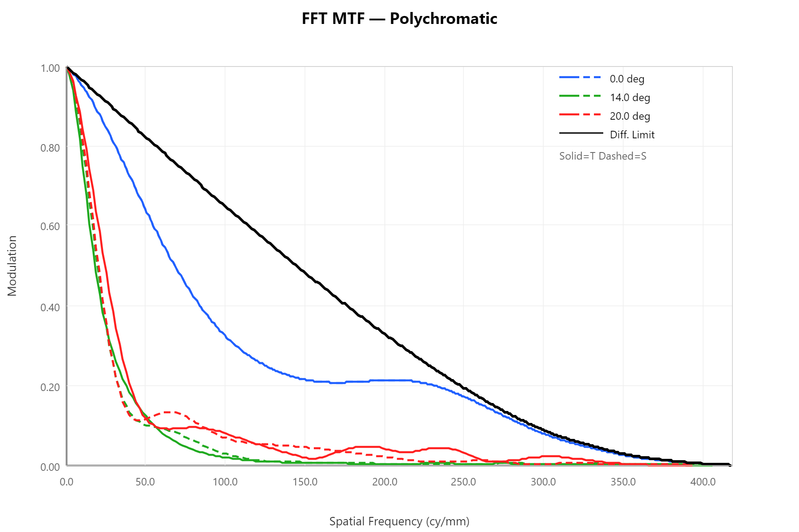 |

The geometric spot diagram changes much less between the two
states. Spot size is dominated by the same off-axis aberrations
that limit the off-axis MTF, so the optimizer's on-axis wavefront
gains barely register there. This is a useful reminder that
different metrics tell different parts of the story — in this
particular run the merit function (RMS wavefront, equally weighted
across fields) was pulled hardest by the field where it had the
most room to move, which happened to be on-axis.

For escaping local minima and pushing the off-axis fields harder,
see Multistart and Basin Hopping in the
[Optimization](optimization.md) page.

## File Types

| Extension | Meaning |
|-----------|---------|
| `.lhlt`   | LensHH-LT native format. Save/load from **File → Save/Open**. |
| `.zmx`    | ZEMAX prescription. Import via **File → Import ZMX**. Only standard and even-asphere surfaces are honored. |
| `.agf`    | Glass catalog. Loaded from `<install>\catalogs\Glass\` on startup. |

## Keyboard Shortcuts

| Shortcut | Action |
|---|---|
| `Ctrl+S` | Save |
| `Ctrl+O` | Open |
| `F5`     | Refresh all open analysis windows |
| `Esc`    | Close the focused analysis window |
