# Getting Started

## Install (Windows)

1. Run `LensHH-LT-Setup-<version>.exe`.
2. If the installer warns that .NET 8.0 Desktop Runtime is missing,
   accept the prompt to download it from Microsoft, install, then
   re-run the LensHH-LT installer.
3. Launch **LensHH-LT** from the Start Menu.

Sample lens files are installed under `<install>\samples\` with the
`.lhlt` extension.

## Install (macOS, Apple Silicon)

macOS builds ship as a zip archive — `LensHH-LT-osx-arm64-<version>.zip`
in the release downloads — containing the GUI, CLI, MCP server, Ollama
bridge, and benchmarking tool, plus the full sample-lens set, the
stock-lens catalog, and the documentation. All binaries are pre-signed;
there is no codesign step.

1. Unzip (double-click in Finder), then open Terminal in the unzipped
   folder.
2. Run the two first-run commands (also listed in the bundled
   `README-macOS.txt`):

   ```bash
   xattr -dr com.apple.quarantine .
   chmod +x app/LensHH.App cli/LensHH.CLI mcp/LensHH.Mcp \
            renderapp/LensHH.RenderApp ollama/LensHH.OllamaBridge \
            bench/MeritEvalBench
   ```

   The first clears the download-quarantine flag (macOS's equivalent of
   SmartScreen "Run anyway"); the second restores the Unix execute bits,
   which a zip archive built on Windows doesn't carry.
3. Launch the GUI:

   ```bash
   cd app && ./LensHH.App
   ```

Samples are in `samples/`, and the User Guide PDF plus searchable HTML
help are in `docs/`. Keep the package folder structure intact — the
tools locate the shared stock-lens catalog relative to their own
folders.

Requirements and limits:

- **Apple Silicon (M1 or later) only.** Intel Macs are not supported —
  the native ray-trace library ships arm64-only.
- **No GPU acceleration on macOS** — optimization runs on the CPU.
- If macOS still refuses to open a binary: **System Settings → Privacy
  & Security** → scroll to the blocked item → **Open Anyway**.

## License & Trial

LensHH-LT is distributed under a **hybrid license**:

- **Source code** (GUI, CLI, MCP server, public C# API, IO,
  rendering, configurators) is open source under the **MIT
  license**. Fork it, modify it, redistribute it.
- **Optical engine binaries** (`engine/LensHH.Core.dll` plus the
  platform-specific native ray-trace libraries) are **proprietary**
  to Synapse Optics and require an activation token to run.

See `LICENSE` at the project root for the full terms.

Ray tracing, optimization, and analyses won't run until you've
activated either a free trial or a paid license. Both flows live
under the **Help** menu.

### Start a free trial (45 days)

1. **Help → Start Free Trial...**
2. Enter your email address and click **Send Code**. A six-digit
   verification code is sent to that address.
3. Enter the code in the dialog and click **Activate**.
4. The trial runs for 45 days from activation. **Help → License
   Status...** shows the days remaining at any time.

One trial per email address. Reinstalling does not reset the clock.

#### If your network blocks the activation server

If your corporate firewall cannot reach the licensing host (see
[Network requirements](#network-requirements) below), use the
offline path on the same dialog:

1. **Help → Start Free Trial...** → click **Activate offline from
   token file...** at the bottom of the dialog.

   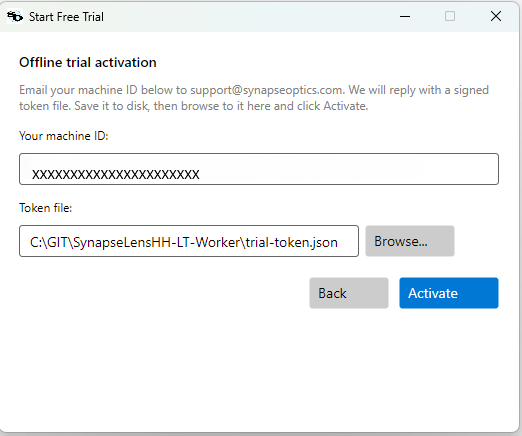

2. Email the **machine ID** shown in the dialog, plus the email
   address you'd like the trial bound to, to
   `support@synapseoptics.com`.
3. Synapse Optics replies with a signed `trial-token.json` file.
   Save it locally (USB transfer is fine — the machine doesn't
   need internet to receive the file).
4. Back in the dialog, click **Browse...**, select the token file,
   and click **Activate**. The 45-day clock starts at activation.

The token is bound to the machine ID you sent — the embedded
signature only verifies on that machine. The flow works on
fully air-gapped machines.

### Activate a paid license

1. **Help → Activate License...**
2. Paste your license key and click **Activate**. The dialog
   contacts the activation server, binds the seat to this machine,
   and stores a signed token locally — subsequent launches don't
   need network access.
3. The Help menu's **License Status...** entry shows the active
   license and machine binding.

### Move a license to another machine

A license is one seat. To free it up:

1. On the current machine: **Help → Deactivate This Machine...** —
   re-enter your license key to confirm. The server frees the seat.
2. On the new machine: **Help → Activate License...** with the same
   key.

### Offline activation

If the new machine has no internet access, request an offline
activation token from your distributor (mention your machine ID,
shown under **Help → License Status...**), save it as a `.json`
file, and import it via **Help → Activate License...** — the dialog
detects a token file vs a key string automatically.

## Network requirements

LensHH-LT only reaches the network for license activation and
deactivation. Ray tracing, optimization, analyses, and file I/O run
fully offline once activated.

If your IT department restricts outbound traffic, the values below
are everything they need to whitelist:

| Field           | Value                                                                                  |
|-----------------|----------------------------------------------------------------------------------------|
| Hostname        | `synapseoptics-license.javier-ruiz.workers.dev`                                        |
| Protocol / port | HTTPS / TCP 443                                                                        |
| Methods         | `POST` (trial request, trial verify, activate, deactivate)                             |
| Hosting         | Cloudflare Workers (anycast — whitelist by hostname / SNI; no fixed IP range)          |
| TLS             | TLS 1.2 or 1.3, public CA-signed certificate                                           |
| TLS inspection  | Do not intercept — the client pins to the hostname's certificate via SNI               |
| Direction       | Outbound only — LensHH-LT does not accept inbound connections                          |

If the host cannot be allowlisted, both the
[offline trial](#if-your-network-blocks-the-activation-server) and
the [offline paid-license activation](#offline-activation) flows
work with zero network access on the target machine.

## Your First Lens

1. **File → Open…** — point at any file in `<install>\samples\`
   (try `CookeTriplet.lhlt` for the classic three-element form, or
   `Heliar.lhlt` for a five-element triplet derivative).
2. The main window opens on the **Lens Editor** — the lens
   prescription table. Tabs along the top switch between the
   **Lens Editor**, the **2D Layout**, and the **Merit Function**
   editor.

   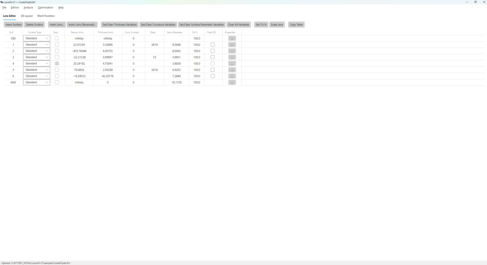

3. Click **2D Layout** to see the design ray-traced:

   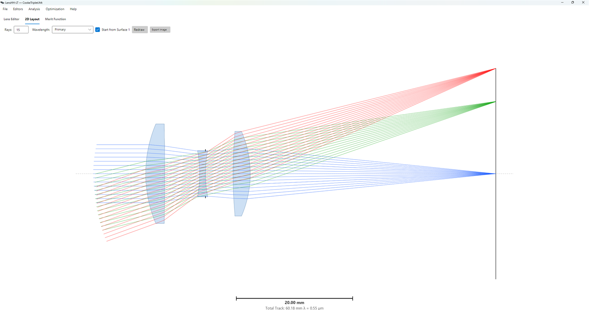

4. Open a spot diagram: **Analysis → Spot Diagram**.
5. Open a wavefront map: **Analysis → Wavefront Map**.
6. Close both and try optimization — read on.

### Reading the prescription table

Each row in the Lens Editor is one surface, ordered object → image:

| Column | What it is |
|---|---|
| **Surf** | Surface number (`OBJ`, then `1, 2, …`, `IMG`). |
| **Surface Type** | Standard (spherical), an aspheric type, **Paraxial** (an ideal thin lens defined by a focal length), or **ABCD** (a ray-transfer-matrix black box) — see below. |
| **Stop** | Checkbox marking the aperture stop. |
| **Radius (mm)** | Radius of curvature (`Infinity` for a flat surface). |
| **Thickness (mm)** | Axial distance to the next surface. |
| **Conic Constant** | Conic *k* (`0` = sphere). |
| **Glass** | Material of the space *after* the surface (blank = air). |
| **Semi-Diameter** | Clear-aperture radius — how it's set depends on **Fixed SD**. |
| **CA %** | Clear-aperture percent, on Auto surfaces (see below). |
| **Fixed SD** | Checkbox choosing how the semi-diameter is set. |
| **Properties** | The `…` button — per-surface variable / pickup, aspheric, and aperture settings. |

**Even Asphere surfaces and the `A2` term.** An **Even Asphere** surface is the
conic of the **Radius** and **Conic Constant** columns plus a polynomial in even
powers of the radial height `r`, edited on the **Aspheric** tab of the surface
**Properties** dialog:

```
        c·r²                                    1
z = ───────────────────── + A2·r² + A4·r⁴ + A6·r⁶ + … + A16·r¹⁶ ,    c = ─────
    1 + √(1 − (1+k)c²r²)                                                Radius
```

Note where the polynomial starts. **`A2` multiplies `r²`, and so does the conic
term — which makes `A2` a change of CURVATURE, not a figuring term.** Expanding
the sag gives `z = (c/2 + A2)·r² + …`, so a surface with base curvature `c` and a
non-zero `A2` has a *vertex* curvature of `c + 2·A2`. That is the curvature that
sets the surface's power, so an `A2` moves the focal length, the back focal
length, the pupils, the Petzval sum and every Seidel coefficient — even though
the **Radius** column still shows the base radius you typed.

Two consequences worth knowing:

- **The reported Radius is not the whole shape.** On a surface carrying an `A2`,
  read the first-order data (EFL / BFL / F/#) rather than inferring power from
  the radius. The two disagree by design.
- **`A2` is usually the wrong variable to optimize.** It duplicates the radius —
  any `A2` can be absorbed into the radius with a compensating `A4` — so making
  both variable gives the optimizer two knobs for one degree of freedom. Prefer
  the radius, and start the aspheric terms at `A4`. `A2` earns its place mainly
  when importing a prescription that was written that way.

Every route through the program agrees on this: the real ray trace uses the sag
above, and the paraxial, Seidel and Buchdahl routes use the vertex curvature and
measure the remaining figuring from the sphere it describes. (Releases before
this one read the base curvature in those routes and discarded `A2` entirely, so
a design carrying one was analysed as a different lens from the one its rays were
traced through. See the changelog.)

**Paraxial (ideal thin lens) surfaces.** Setting a surface's type to
**Paraxial** turns it into an ideal thin lens defined by a single **focal
length** (mm) — it bends rays with no aberration and no thickness. Radius,
conic, and glass are ignored and shown blank; the focal length is edited in the
surface **Properties** dialog (a positive *f* converges, negative diverges,
`Infinity` is afocal / no power). It carries the surrounding indices, so an
immersed ideal lens of focal length *f* in medium *n* focuses at *n·f*. Paraxial
surfaces are handy for representing a "perfect" element, a relay, or a stand-in
for a subsystem you have not designed yet. They run on CPU only (never the GPU),
and they are diffraction-limited: an on-axis WAVEX/OPD merit reads ≈ 0 at focus.

**ABCD (ray-transfer-matrix) surfaces.** An **ABCD** surface is a first-order
"black box" defined by four numbers — the paraxial ray-transfer matrix
`[x'; ω'] = [[A, B], [C, D]] · [x; ω]` acting on ray height `x` and geometric
slope `ω` (the same matrix applies in `y`). Like Paraxial, it has no radius,
conic, or glass — the four elements **A, B, C, D** are edited on the **ABCD** tab
of the surface **Properties** dialog, where each can be Fixed, Variable, or a
Pickup. The identity matrix (`A = D = 1`, `B = C = 0`) passes rays through
unchanged, which is the default for a new ABCD surface. It carries the
surrounding medium unchanged and contributes no aberration of its own.

ABCD surfaces are the tool for **first-order synthesis**: drop one (or several)
in as an ideal stand-in for a group you haven't designed, optimize the matrix
elements to meet your first-order and image-quality goals, then build real
lenses that reproduce the resulting matrices — using the `A`/`B`/`C`/`D` and
`DET` merit operands (see the [Merit Function Reference](merit-function.md)) to
match a real group's matrix to the target. A lossless group in a single medium
has determinant `A·D − B·C = 1`, so constrain **`DET = 1`** on each ABCD surface
to keep the optimized matrix physically realizable, and bound the elements
(especially `C`, the power) so the optimizer can't run them to infinity.

ABCD surfaces run on CPU only. Because a ray-transfer matrix carries no
wavefront/phase information, **analyses that require phase — OPD, MTF, Zernike,
wavefront map — are unavailable while an ABCD surface is present**; ray-based
analyses (layout, spot, ray fan, distortion, Seidel, first-order) still work.

**Apertures — the Semi-Diameter, CA %, and Fixed SD columns.** These
three work together to set each surface's clear aperture:

- **Fixed SD unchecked (Auto — the default):** LensHH re-solves the
  semi-diameter from the traced ray bundle every time the design
  changes, then scales it by that row's **CA %** (`100 %` = the full
  bundle; a lower value stops the surface down, deliberately vignetting
  the margin). The **Semi-Diameter** cell is read-only in this mode —
  edit **CA %** instead.
- **Fixed SD checked (Fixed):** you type the **Semi-Diameter** value
  directly and it's held regardless of the rays.

The **stop** is always Auto at `100 %`, and the object row has no
aperture. The **Set CA %** button above the table applies a CA % — and
the Auto/Fixed mode — across a range of surfaces at once. Both the
semi-diameter (Fixed) and the CA % (Auto) can also be *optimization
variables* — see **Aperture variables** under *Your First
Optimization*, below.

## Your First Optimization

The optimizer moves any parameter you've tagged **Variable**. Picking
the right variable set is the central design decision; everything
else (merit function, optimizer choice, bounds) just shapes the
search. LensHH-LT gives you three ways to mark variables — pick
whichever matches the granularity you need.

### Marking variables

#### 1. Bulk: thickness or curvature across a surface range

The fastest way to start. Above the Lens Editor table:

- **Set/Clear Thickness Variables** opens a dialog with `Surface 1`,
  `Surface 2`, and a **Set / Clear** radio. Click **Set**, choose a
  range (e.g. surfaces 1 through 6 to vary every glass and air
  thickness in the Cooke triplet), and **OK**. Every thickness in
  the range is now a variable.

  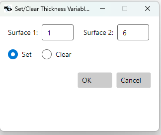

- **Set/Clear Curvature Variables** is the same idea for curvatures.
  An extra checkbox **Ignore Infinite Radius Surfaces** keeps flat
  surfaces fixed (you almost always want this on).

  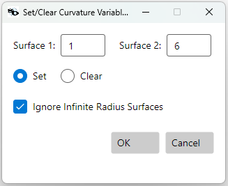

- **Set/Clear Surface Parameter Variables** does the same for the
  parameters of the special surface types. Choose a **Surface Type**
  (Even Asphere, Paraxial, or ABCD) and a **Parameter** — an aspheric
  coefficient `A2…A16`, a Paraxial focal length (`Diopters`), or an
  ABCD element `A/B/C/D` — then a surface range and **Set / Clear**.
  It applies to every surface of that type in the range, so you can,
  say, make the `A` element a variable on all your ABCD surfaces in one
  action. It only sets or clears the variable flag (no bounds — set
  those in the Variable Editor).

  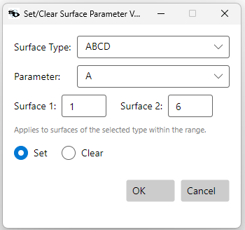

Each tagged parameter shows a **V** indicator next to its value in
the Lens Editor table:

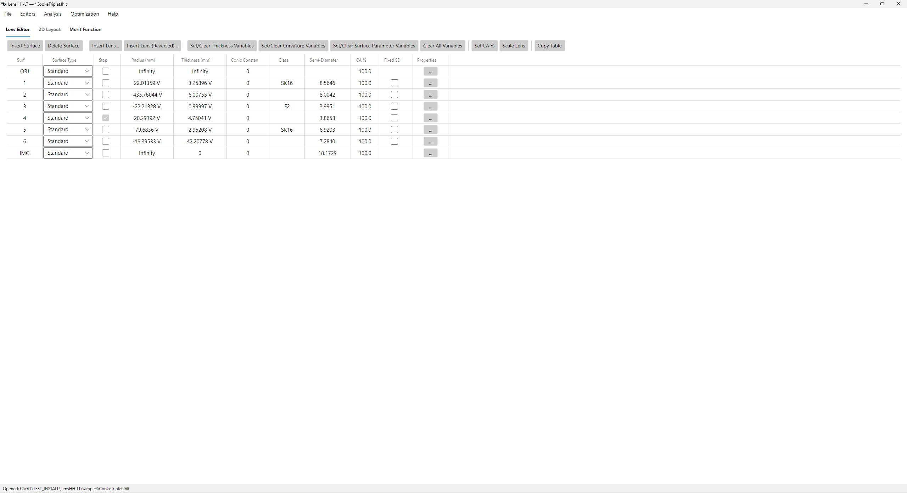

#### 2. Per-surface fine-grained: the Properties dialog

For one surface at a time, click the **`...` Properties** button in
that surface's row. The **Variable / Pickup** tab has a section for
each of **Curvature**, **Thickness**, and **Conic** with three radio
buttons:

- **Fixed** — the optimizer leaves this parameter alone.
- **Variable** — the optimizer is free to change it.
- **Pickup** — the parameter is computed from another surface's
  parameter as `Source × Scale + Offset`. Use a pickup to lock two
  curvatures together (e.g., a symmetric singlet) or to drive an
  airspace from a glass thickness.

Choose **Variable** to mark the parameter as free.

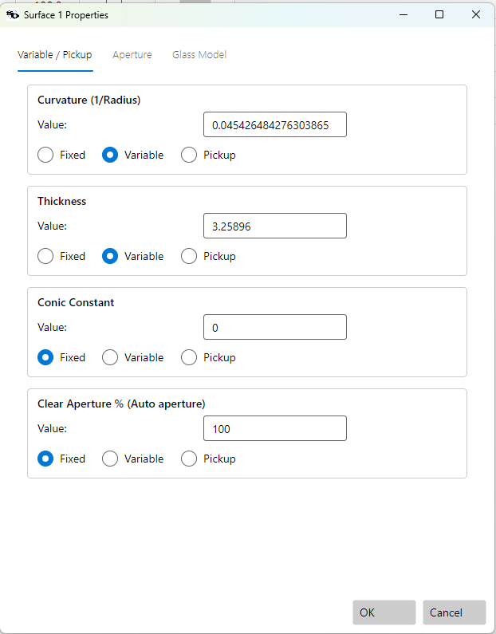

#### 3. Aspheric coefficients

On surfaces with aspheric type, the Properties dialog's **Aspheric**
tab lists every coefficient (`A2` through `A16`) with a per-row
**Var** checkbox. Tick the ones you want optimized.

#### 4. Aperture variables: semi-diameter and clear-aperture %

Recall from *Reading the prescription table* (above) that each
surface's aperture is either **Auto** — a ray-traced semi-diameter
scaled by its **CA %** — or **Fixed** — an explicit semi-diameter —
chosen by the **Fixed SD** checkbox. Either of those quantities can be
handed to the optimizer as a variable.

**Making the aperture a variable — to adjust vignetting.** The clear
aperture is exactly what clips off-axis rays, so it *is* the knob that
controls vignetting and relative illumination. You can hand that knob
to the optimizer:

- in **Auto** mode, mark the surface's **CA %** as a variable;
- in **Fixed** mode, mark its **semi-diameter** as a variable.

Both are set on the Properties dialog's **Variable / Pickup** tab, the
same way as curvature or thickness (a `V` marker then appears next to
the value in the Lens Editor). The **stop** surface is the one
exception: its semi-diameter *is* the system aperture (fixed by the
EPD / F‑number / NA), so it can never be an aperture variable — the
**Variable** option is disabled for it, and the optimizer ignores the
flag even if a loaded file sets it. The optimizer can now open or stop
down each *non-stop* surface's aperture to trade image quality against
vignetting —
for instance widening an aperture that was clipping the off-axis
bundle. Pair an aperture variable with a **dense rectangular
spot/wavefront grid** (see [Rectangular operands in
merit-function.md](merit-function.md)) so the merit's response to the
moving pupil edge stays smooth.

> **Always bound an aperture variable.** Unlike a curvature, a CA % or
> semi-diameter has no natural restoring force — left unconstrained,
> the optimizer will happily drive it to zero (closing the surface) or
> to an absurd value if that shaves the merit. Give it a **Min/Max**
> constraint in the Variable Editor (next section) — for example hold
> CA % between ~85 % and 100 %, or keep a Fixed semi-diameter inside
> the element's real mechanical range.

### Setting bounds (Min/Max constraints)

Bounds live under **Optimization → Variable Editor** — *not* on the
Lens Editor table. Open it after you've marked your variables and
the dialog lists every variable as a row:

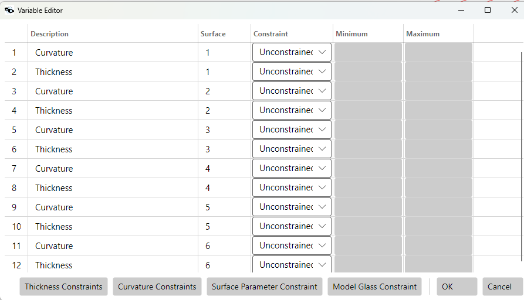

Each row shows:

| Column | Meaning |
|---|---|
| **#** | Variable number. |
| **Description** | What the variable is (e.g. *Curvature*, *Thickness*). |
| **Surf** | The surface index it lives on. |
| **Constraint** | A combo: **Unconstrained**, **Min**, **Max**, or **Min/Max**. |
| **Minimum** | Lower bound. Used if Constraint is `Min` or `Min/Max`. |
| **Maximum** | Upper bound. Used if Constraint is `Max` or `Min/Max`. |

Inside the optimizer, bounds are enforced via an unbounded parameter
transformation, so the LM solver never tries an illegal value — it
just slows down near the wall.

For broad ranges, the **Thickness Constraints** and **Curvature
Constraints** buttons at the bottom of the Variable Editor open a
bulk dialog. The thickness one is especially useful — pick a
surface range, an `All / Glass / Air` selector, a `Constraint`
mode, and a single `Min` / `Max` pair, and the dialog applies them
to every matching thickness variable in the range. Run it twice to
get separate glass and air rules:

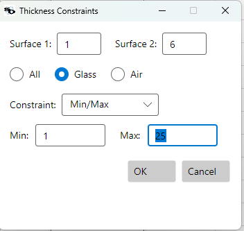

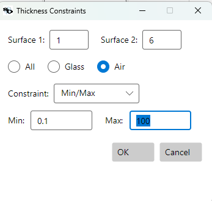

After both runs the Variable Editor reflects the populated
constraints — glass thicknesses bounded `[1, 25] mm`, air gaps
bounded `[0.1, 100] mm`:

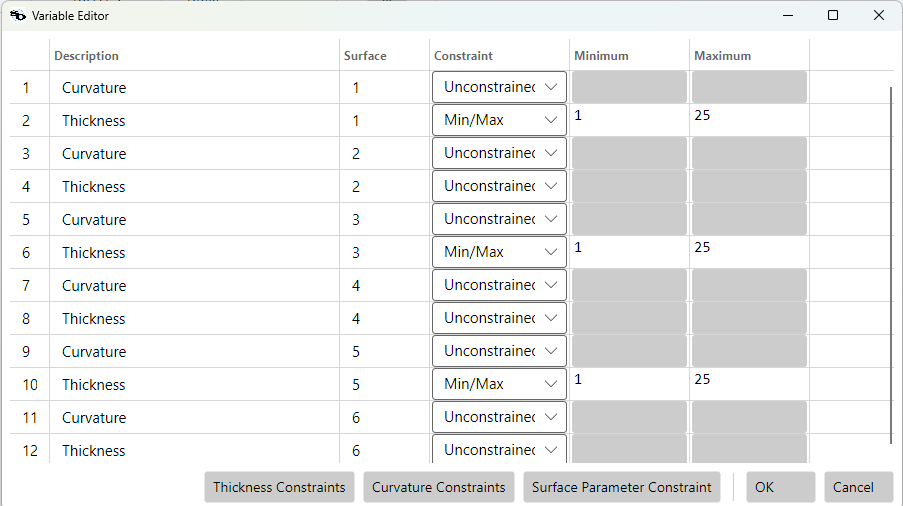

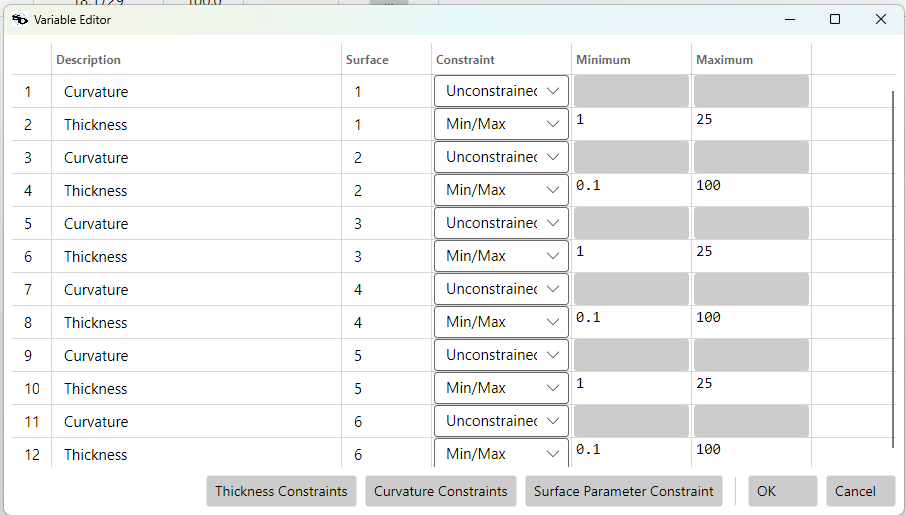

A third button, **Surface Parameter Constraints**, does the same for
the parameters of the special surface types. Pick a **Surface Type**
(Even Asphere, Paraxial, or ABCD) and a **Parameter** (an aspheric
coefficient, the Paraxial diopters, or an ABCD `A/B/C/D` element), a
surface range, a **Constraint** mode, and a `Min` / `Max` pair — the
dialog sets that parameter as a variable *with* the chosen bounds on
every surface of that type in the range. It's the one-step way to, for
example, make every ABCD `C` element a variable bounded to a realizable
power range across a whole synthesis stack.

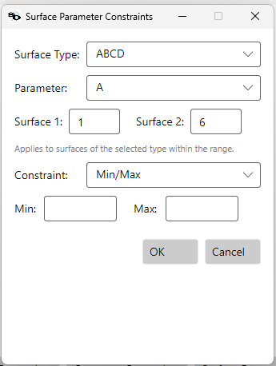

A fourth button, **Model Glass Constraint**, does the same for the
model-glass (fictitious-glass) parameters. Pick a **Variable Type** —
`Nd` (refractive index), `Vd` (Abbe number), or `dPgF` (partial-dispersion
deviation) — a surface range, a **Constraint** mode, and a `Min` / `Max`
pair, and the dialog sets that parameter as a variable *with* the chosen
bounds on every qualifying surface in the range. It applies **only to
surfaces already in model-index mode** — a real catalog glass has no
`Nd`/`Vd`/`dPgF` to vary, so it is skipped rather than converted. This is
the one-step way to turn a stack of model glasses loose inside a
manufacturable index / Abbe / partial-dispersion box before you substitute
real catalog glasses (see [Glass catalogs](glass-catalogs.md) for how model
glasses and substitution work):

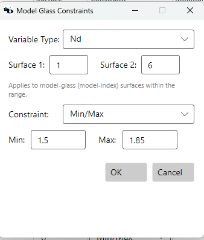

### Building a merit function

**Optimization → Merit Function**. Add operands via the **Insert**
button. A good starting merit function has three layers; cutting any
of them risks an unphysical or shallow-converged design.

> **A note on composite operands.** `WAVEX`, `SPOT`, `WAVEM`, and the
> other image-quality operands are *composite*: a single row evaluates
> over **every field point and every wavelength** in the system at
> once. You don't pick `Hx`/`Hy` or `Wave` for these — the operand
> automatically applies the per-field weights from the Field editor
> and the per-wavelength weights from the Wavelength editor as
> internal sub-weights (the engine multiplies
> `macro_weight × field_weight × wavelength_weight × pupil_weight`
> for each hidden expanded operand). One `WAVEX` row covers the
> whole field × wavelength × pupil grid, so you don't need a long
> merit function with many rows to control image quality.

> **Reading the merit grid: `Mode` and the two bound columns.** The
> Merit Function table doesn't have separate `Min` and `Max`
> columns. It has **`Bound 1`** and **`Bound 2`**, and how they're
> interpreted depends on the **`Mode`** combo on the same row:
>
> | `Mode`      | `Bound 1` is...        | `Bound 2` is...      |
> |---|---|---|
> | `Target`    | the target value        | (hidden, not used)   |
> | `Min`       | the minimum value       | (hidden)             |
> | `Max`       | **the maximum value**   | (hidden)             |
> | `Min/Max`   | the minimum value       | the maximum value    |
>
> Note that `Max` mode puts the upper bound in `Bound 1`, *not*
> `Bound 2` — `Bound 2` is only visible/editable when `Mode =
> Min/Max`. When the example rows further down say "`min=...`" and
> "`max=...`" together, set `Mode = Min/Max` and put the min in
> `Bound 1` and the max in `Bound 2`. When an example shows just
> "`target=...`", set `Mode = Target` and put the value in `Bound 1`.

> **What `Value` and `Error` mean in each row.** The two read-only
> columns at the right of every operand show:
>
> - **`Value`** — what the operand currently evaluates to in the
>   live design (e.g. for `EFL`, the focal length in mm; for `EG`
>   over a surface span, the worst edge thickness; see "Span
>   operands" below).
> - **`Error`** — the row's residual contribution. The LM solver
>   minimizes `Σ Error²` across the whole table. `Error` is always
>   `(value − reference) × weight`, where the reference depends on
>   `Mode`:
>
>   | `Mode`     | `Error` (residual) |
>   |---|---|
>   | `Target`   | `(value − target) × weight`. Always nonzero unless `value == target`. |
>   | `Min`      | `(value − min) × weight` **if** `value < min`, else 0. One-sided deadband. |
>   | `Max`      | `(value − max) × weight` **if** `value > max`, else 0. One-sided deadband. |
>   | `Min/Max`  | `(value − min) × weight` if below `min`; `(value − max) × weight` if above `max`; else 0. Two-sided deadband. |
>
> A row whose `Value` is inside its bounds shows `Error = 0` — it
> contributes nothing to the merit and acts purely as a guardrail
> ("don't go past this"). That's why boundary operands (`EG`,
> `CTG`, etc.) don't fight image quality while the design stays
> well-formed.
>
> **Span operands (`Surface` ≠ `Surface2`).** When the row covers a
> surface range, the operand evaluates the underlying parameter
> (center thickness, edge thickness, semi-diameter, etc.) at every
> surface in the span and tracks the per-span minimum and maximum.
> The displayed `Value` then represents the span as one number,
> chosen so the residual reflects the worst violation:
>
> - **Min violated** (any surface in the span has value below
>   `Min`): `Value` is the smallest value across the span — the
>   worst-offending surface.
> - **Max violated**: `Value` is the largest value across the span.
> - **Both violated**: `Value` is whichever side has the larger gap
>   from its bound (the more critical violation).
> - **All satisfied**: `Value` is the smaller of the two extremes
>   (closest to the lower constraint), so you can read how much
>   margin the worst surface still has.
> - **`Target` mode**: `Value` is the mid-point
>   `(minVal + maxVal) / 2` of the span.
>
> **One row → one residual, no matter how many surfaces violate.**
> A span operand produces exactly **one** residual per evaluation,
> computed from the single worst-offending surface in the span.
> Multiple violators **do not add together**. If three surfaces in
> the span have edge thicknesses `0.1`, `0.3`, `0.4` and `Min = 0.5`,
> the row's `Error` is `(0.1 − 0.5) × weight` — driven by the `0.1`
> surface alone; the other two contribute zero.
>
> In practice the optimizer resolves multi-surface violations
> iteratively: it fixes the worst surface this iteration, the
> next-worst becomes the new worst, and so on across iterations.
> This is normally what you want — it keeps geometric-bound rows
> from drowning out image quality just because the design happens
> to have many elements.
>
> **If you want additive behavior** — every violator contributing
> independently to `Σ Error²` — write one row per surface (set
> `Surface = Surface2` to a single index, repeat for each surface).
> You lose the auto-protection benefit when surfaces get inserted
> later, but each violation enters the merit on its own. A common
> hybrid: keep the span row for blanket protection and add a
> per-surface row for any surface you know is marginal (e.g., the
> one closest to the stop on a fast lens). Both contribute, so the
> marginal surface gets extra optimizer attention without losing
> the span coverage.
>
> Adding a new surface during design — split-element, doublet
> insertion — automatically becomes part of the span row's
> evaluation, so structural edits stay protected without merit-
> function maintenance.

#### 1. Image quality

Recommended: **`WAVEX`** — RMS wavefront error in waves, with piston
and tilt removed. Wavefront error is what diffraction-quality images
actually care about, and the LM solver converges on it more reliably
than on transverse ray aberration. Set `Rings = 6`, `Arms = 12`,
`Weight = 1`. That's it — no field or wavelength specifiers, because
`WAVEX` already integrates over both.

`SPOT` (RMS spot size) is also composite and also tempting because
the units (mm) feel intuitive, but it's a poorer proxy for image
quality near the diffraction limit and tends to leave the optimizer
stuck in shallow local minima. Start with `WAVEX` unless your design
is many times the diffraction limit (where wavefront and spot stop
tracking each other).

#### 2. First-order constraints

Lock the design's first-order properties so the optimizer doesn't
trade them away for image quality:

- `EFL` — locks focal length. `Target = <desired EFL>`, `Weight = 100`
  (see *Weights — telling the optimizer what's paramount* below for why).
- `TTRACK` (max total track), `MAG` (magnification), `DITHETA` (max
  F-θ distortion %), etc. — see the
  [Merit Function Reference](merit-function.md).

#### 3. Physical-thickness boundaries (almost always required)

Without explicit constraints, the optimizer will gladly drive a lens
to a vanishing center thickness or a negative edge thickness — both
unphysical, both common failure modes. **An effective optimization
always enforces thickness boundaries.**

The right tool depends on which thickness you're constraining:

- **Center thickness** (the `Thickness` field on a surface) is a
  single variable, so it's bounded most cleanly via **variable
  bounds** in the Variable Editor — see *Setting bounds* above. Set
  `Constraint = Min and Max` on every glass-thickness variable, with
  `Minimum ≈ 1 mm` and a sensible `Maximum`; same for every
  airspace, with `Minimum ≈ 0.1 mm`. The LM solver enforces these
  exactly through an unbounded parameter transformation, with no
  drag on convergence while the design is well-formed.

  **Alternative — merit operands.** Two operands cover the same
  ground for users who prefer to keep all geometric constraints in
  the merit function rather than split between Variable Editor and
  Merit Function: `CTG` (Center Thickness for glass elements) and
  `CTA` (the air-gap analog). Both accept `Surface`/`Surface2`
  spans and `Min`/`Max` bounds. Either approach works — pick one
  and apply it consistently to every center thickness in the
  design; mixing and matching surface-by-surface is how holes get
  left.

- **Edge thickness** is a derived quantity (function of curvature
  *and* center thickness *and* semi-diameter), so it can't be
  expressed as a variable bound at all. You **must** use merit
  operands:

  | Operand | Acts on | Meaning |
  |---|---|---|
  | `EG`  | Glass elements | Edge thickness — set `Min` (and `Max`) |
  | `EA`  | Air gaps       | Edge thickness of an air space |

  These are **almost always necessary**: a steeply-curved positive
  lens can have its edges cross zero even with a perfectly healthy
  center thickness. Set `Constraint = Min and Max`, `min = 0.5 mm`
  for glass, `min = 0.1 mm` for air, and a sensible max so the
  optimizer doesn't run away.

> **Use surface spans, not individual surfaces.** `EG`, `EA`, `CTG`,
> and `CTA` all accept a `Surface` and a `Surface2`. Set them to the
> range of all optical surfaces (e.g. `surface=1, surface2=6` for a
> six-surface triplet) and a single row covers the whole lens. The
> benefit isn't just brevity: when you later split an element, add
> a doublet, or otherwise insert surfaces, the merit function
> automatically protects the new geometry too. A merit function
> that names individual surfaces becomes silently incomplete after
> every structural edit.

#### 4. Weights — telling the optimizer what's paramount

The numbers in the `Weight` column are how you express priority to
the optimizer. The LM solver minimizes `Σ (weight × residual)²`,
so an operand with weight 100 contributes 10 000× more to the
residual sum-of-squares per unit of error than an operand with
weight 1. Operands the design *must* hit (focal length,
manufacturability bounds) get high weights; operands you want
minimized but not at any cost (image quality) get lower weights.

A typical hierarchy for a "hit the spec" design:

| Layer | Recommended weight |
|---|---|
| First-order constraints (`EFL`, `MAG`, `DITHETA`, ...)   | **100** |
| Physical-thickness boundaries (`EG`, `EA`, `CTG`, `CTA`) | **10**  |
| Image quality (`WAVEX`, `SPOT`)                           | **1**   |

With this hierarchy the optimizer will sacrifice wavefront error
before it lets focal length drift, and it will respect the geometry
boundaries before it lets focal length drift. Image quality is what
gets pushed down once the higher-priority operands are satisfied.

A natural variant is to raise the `EG` / `EA` weights (e.g., to 100)
when you want the optimizer to back well inside the geometric
bounds for **manufacturing margin hardening**, instead of just
sitting on the bound at the minimum.

The point is to set weights *deliberately*. Equal weights — leaving
every operand at the default 1 — is rarely the right priority
structure for a design that has both a hard focal-length spec and
image-quality goals.

#### Putting it together

A minimum-viable starter merit function for the Cooke triplet
(surfaces 1 through 6 are all the optical surfaces; surface 7 is the
image plane), with the recommended weights — exactly what's shown
in the screenshot below:

| Row | Type   | Weight | Mode    | Bound 1 | Surf | Surf2 | Rings | Arm | Notes |
|---|---|---|---|---|---|---|---|---|---|
| 1 | EFL    | 100    | Target  | 50      |      |       |       |     | Lock focal length to 50 mm   |
| 2 | WAVEX  | 1      | Target  | 0       |      |       | 6     | 12  | Image quality (composite)    |
| 3 | EA     | 10     | Min     | 0.1     | 1    | 6     |       |     | Air-gap edge thickness ≥ 0.1 |
| 4 | EG     | 10     | Min     | 1       | 1    | 6     |       |     | Glass edge thickness ≥ 1     |

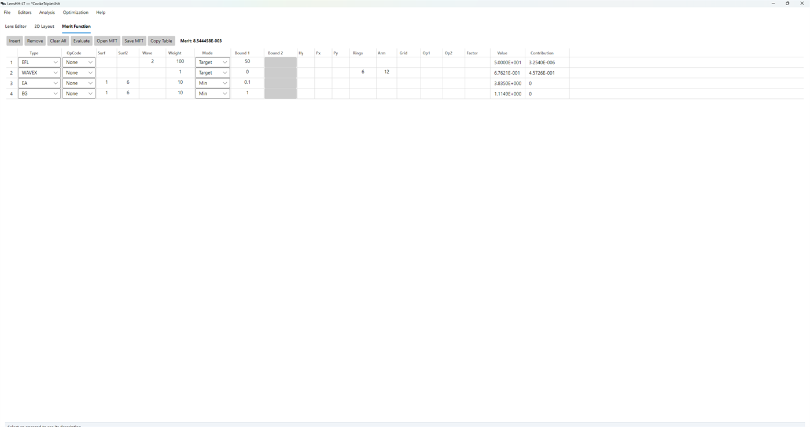

The `Value` column shows each row's live evaluation; the
`Contribution` column shows the row's residual squared (`Error²`).
On a well-aligned starting design the WAVEX `Contribution` dominates
— that's the operand the optimizer is actually working on. The
boundary rows contribute zero whenever the design is in-bounds.

Plus, in the Variable Editor, set `Constraint = Min/Max` on every
thickness variable (`Min ≈ 1 mm` for glass, `Min ≈ 0.1 mm` for air,
sensible `Max` values).

Four merit-function rows + bounded variables + a deliberate weight
hierarchy — that's the minimum for a well-protected optimization.
Add `MAG`, `DITHETA`, distortion bounds, etc. as your design's
specs require, and weight them in line with how strict the spec is.

### Running the optimizer

**Optimization → Local Optimization**. The dialog opens with
sensible defaults — Max Iterations 6000, Broyden Update on, Init
Damp 1e-3 (Levenberg-Marquardt starting damping; see the
[optimization reference](optimization.md#local-lm) for when to
override).

1. Press **Start**. The dialog populates a per-variable table
   showing **Start Value**, **Current Value**, and **Delta** for
   every variable, and the merit value updates live in the header
   strip.
2. **Stop** cancels mid-run; **OK — Accept Results** keeps the
   current state; **Cancel — Revert** restores the pre-run design.

On the Cooke-triplet starter — already a sensible triplet — the run
converges almost instantly and improves the merit only modestly,
from **0.0794 to 0.0757** (133 iterations, about 0.3 s on the native
analytic engine). The header strip reports which engine actually ran
(here *Native Analytic*):

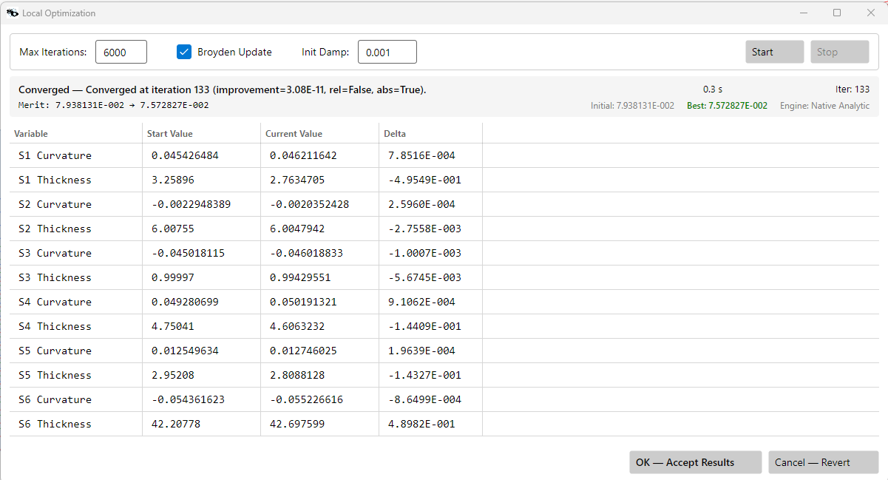

That few-percent gain is the defining trait of local optimization:
**it polishes the design you hand it — it does not transform it.**
Levenberg-Marquardt walks downhill to the *nearest* minimum of the
merit surface and stops. Our starting triplet already sits close to
a good local minimum, so "downhill" is a short walk.

The before/after analyses make the point. The wavefront map and the
polychromatic FFT MTF change only slightly — a small on-axis tidy-up,
with the 14° and 20° fields essentially where they started (their
oblique aberrations are baked into this glass/shape combination and a
local polish can't reach them):

| | Before (start, 0.0794) | After local opt (0.0757) |
|---|---|---|
| Wavefront | 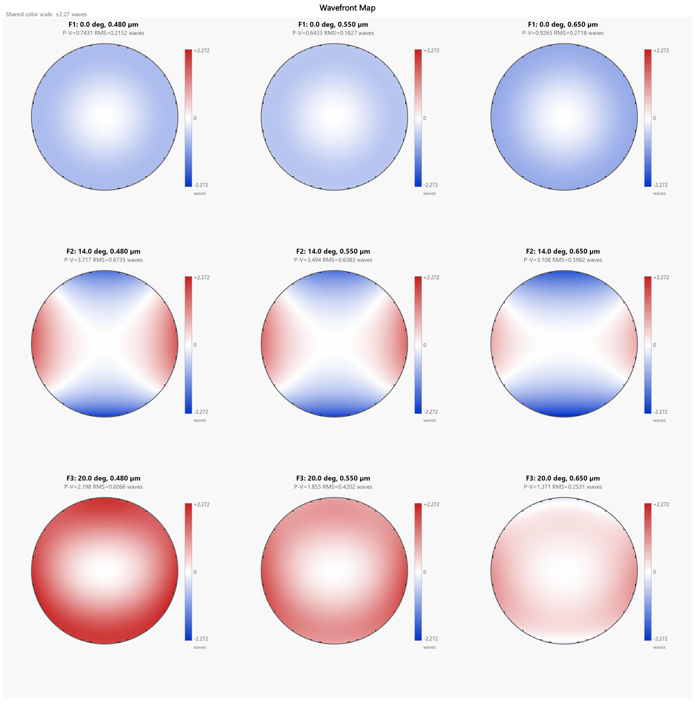 | 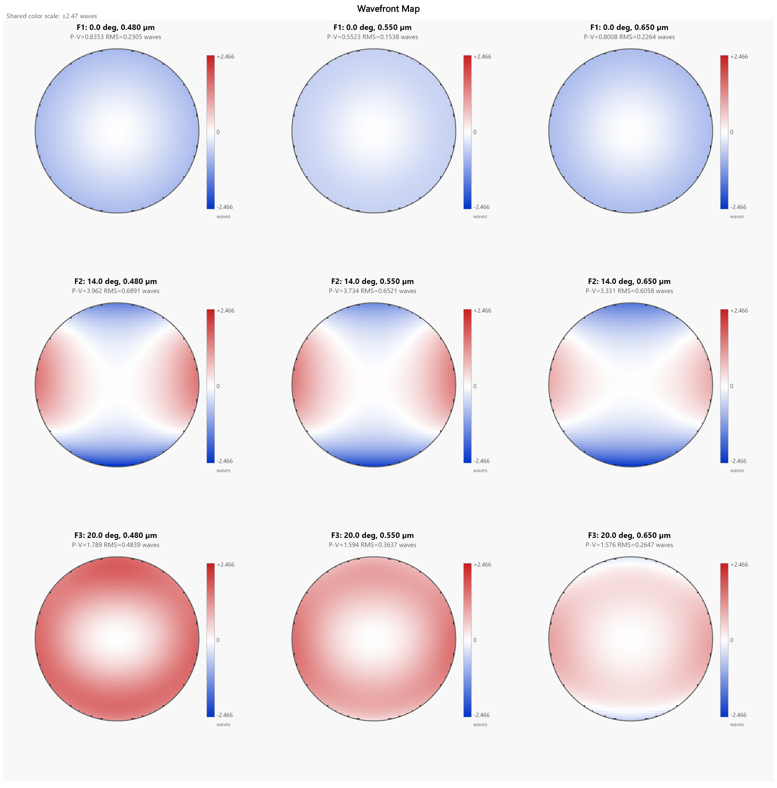 |
| FFT MTF | 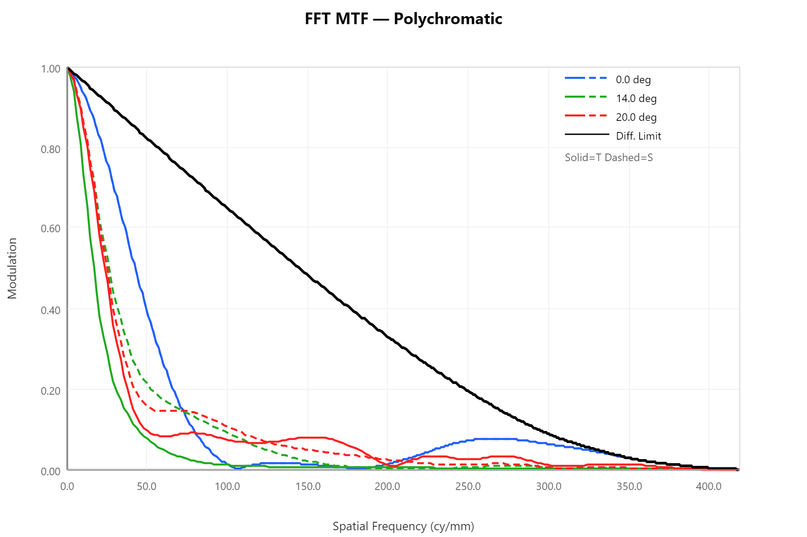 | 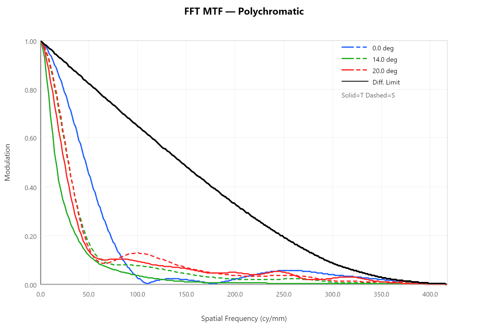 |

The geometric spot diagram barely moves at all — spot size here is
dominated by the same off-axis aberrations that limit the off-axis
MTF, so a local polish leaves it nearly untouched:

| Before (start) | After local opt |
|---|---|
| 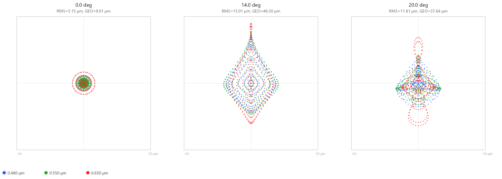 | 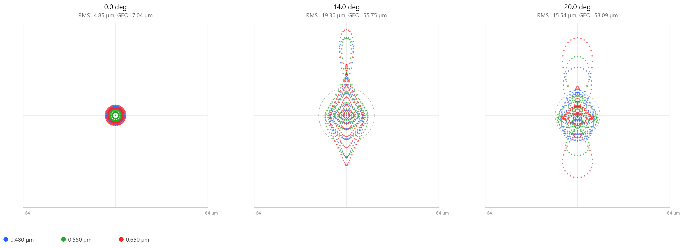 |

This is the moment to reach for a **global** method. To escape the
starting basin — and to let the optimizer re-choose the glasses —
see Multistart and Basin Hopping in the
[Optimization](optimization.md#multistart) page. On this
exact triplet they take the merit from 0.0794 all the way down to
**0.0190**, roughly a 4× improvement over this local polish, and in
one demonstration they rebuild the whole lens starting from nothing
but a stack of flat glass plates.

## System Aperture & Object-Space Telecentric

The **System Editor** (**System → System Editor**) sets how the aperture is
specified. Pick the **Aperture Type** and enter its **Aperture Value**:

| Aperture Type | Value means | Notes |
|---|---|---|
| **EPD**            | Entrance-pupil diameter (lens units) | The classic default. |
| **FNumber**        | Image-space F-number (EFL / EPD) | |
| **Object Space NA** | Object-space numerical aperture, `NA = n₀·sin u` (`n₀` = the object medium's index = Surface 0's material) | Finite-conjugate + **Object Height** fields only (see below). |

**Object Space NA** sizes the pupil from the marginal-ray cone leaving the
object, which is the natural specification for finite-conjugate work
(microscope objectives, relays, machine-vision lenses). It is valid **only**
when the object is at a finite distance (Surface 0 has a finite thickness) and
the **Field Type is Object Height**. If the system is infinite-conjugate or
uses Object Angle fields, the System Editor shows a red warning and analyses /
optimization return an error until you fix it.

**Telecentric Object Space** is a checkbox directly under the Afocal checkbox.
When enabled, the entrance pupil is placed at infinity, so the chief ray is
**parallel to the optical axis in object space** (the aperture stop appears at
the front focal plane) — the standard condition for metrology and measurement
optics, where magnification must not vary with object defocus. It is enabled
**only** when the aperture is **Object Space NA** *and* **Ray Aiming is Off**;
turning ray aiming on clears it. In the 2D layout you'll see each field's chief
ray run parallel to the axis before the first surface.

Both settings are saved in `.lhlt` and round-trip through ZEMAX `.zmx`
(`OBNA` aperture; the object-space telecentric flag rides on the `FTYP` line).

## File Types

| Extension | Meaning |
|-----------|---------|
| `.lhlt`   | LensHH-LT native format. Save/load from **File → Save/Open**. |
| `.zmx`    | ZEMAX prescription. **File → Import → Zemax (.zmx)…** and **File → Export → Zemax (.zmx)…**. Only standard and even-asphere surfaces are honored. Object Space NA (`OBNA`) and object-space telecentric are honored. |
| `.len`    | OSLO lens file. **File → Import → OSLO (.len)…** and **File → Export → OSLO (.len)…**. See [OSLO files](#oslo-files) below. |
| `.otx`    | Optalix lens file. **File → Import → Optalix (.otx)…** and **File → Export → Optalix (.otx)…**. See [Optalix files](#optalix-files) below. |
| `.seq`    | Code V sequence file. **File → Import → Code V (.seq)…** and **File → Export → Code V (.seq)…**. See [Code V files](#code-v-files) below. |
| `.agf`    | Glass catalog. Loaded from `<install>\catalogs\Glass\` on startup. |

### OSLO files

An OSLO `.len` file is a list of OSLO commands, and LensHH-LT writes it the way OSLO itself
saves a lens, so the file opens in OSLO as the lens you designed:

| In LensHH-LT | In the `.len` file |
|---|---|
| Primary wavelength | Written **first** on the `WV` line. OSLO has no primary-wavelength setting of its own: its wavelength 1 *is* the primary. The others follow shortest to longest, which gives OSLO's usual d, F, C order. |
| Aperture, object at infinity | `EBR`, the entrance beam radius. An F-number aperture is converted to it (EBR = EFL / 2F#). |
| Aperture, finite object | `NAO`, the object-space NA. An entrance pupil diameter or F-number is converted to it. |
| Field | `ANG` (the largest field angle) for an object at infinity; `OBH` (the largest object height) for a finite object, converted from an angle if need be. |
| Curved object surface | Its radius, on surface 0. |
| Ideal (paraxial) lens | OSLO's **perfect lens**: its focal length (`PFL`), and at a finite object the magnification it works at (`PFM`). |
| Model glass | `GLA MOD`, with the glass's index at each of the lens's wavelengths, computed by LensHH-LT's own model — so OSLO traces the same indices LensHH-LT does. |
| Fixed semi-diameter, or clear aperture under 100 % | A **checked** aperture (`AP CHK`): OSLO blocks rays outside it, as LensHH-LT does. |
| Automatic semi-diameter | An aperture that is **not checked** (`AP`): OSLO draws the surface at that size but never blocks a ray there. An automatic stop is left for OSLO to size from `EBR`. |
| Lens title | The OSLO lens name, without any word that is a number; the full title is kept in the first note (`SNO1`). OSLO reads a number in the name as a surface count, and refused a lens named "…R 200" as having too many surfaces. |

Import reads the same things back, whether OSLO or LensHH-LT wrote the file. An aperture that
is **not checked** in OSLO comes in as an automatic semi-diameter, since it never blocked a ray
there; a checked one comes in as fixed.

**Two things OSLO does its own way:**

- **OSLO's perfect lens obeys the sine condition** (ray height = f · sin of the image-space
  angle), where LensHH-LT's ideal lens — like ZEMAX's paraxial surface — follows the tangent
  (height = f · tan). For an object at infinity the two cones differ slightly: an f/5 ideal lens
  has an effective F/# of 5.000 in OSLO and 5.025 in LensHH-LT, and its relative illumination
  differs by up to 1 part in 10⁴. At a finite conjugate they agree.
- **OSLO EDU** accepts at most 10 surfaces and has no special apertures, so a lens with an
  obscuration or central hole — which LensHH-LT exports as an OSLO special aperture — needs OSLO
  Standard or Premium.

**`.len` files exported before 1.0.158** could put the wrong wavelength first, drop an ideal lens
or a model glass (the surface became air), replace any non-EPD aperture with `EBR 5`, and mark
every aperture checked. Export such lenses again.

### Optalix files

LensHH-LT writes an Optalix `.otx` file the way Optalix itself writes one, as found in the lens
files that ship with Optalix:

| In LensHH-LT | In the `.otx` file |
|---|---|
| Aperture | `EPD`, `FNO` (object at infinity) or `NAO` (finite object), as the lens states it. An F-number at a finite object goes out as the entrance pupil diameter it gives, since Optalix defines `FNO` at infinity. |
| Field | `FTYP 1` for field angles, `FTYP 2` for object heights. |
| Ray aiming | `RAIM 1` off (the paraxial entrance pupil), `RAIM 2` real (Optalix's default), `RAIM 3` for a telecentric object space. |
| Primary wavelength | `REF`, the primary's number. |
| Ideal (paraxial) lens | Optalix's **lens module**: two `SUT L` surfaces, its principal planes, with the power (1/f) in `LMOD`. Here the planes coincide. |
| Model glass | Optalix's fictitious-glass code — nd 1.6201, Vd 60.4 is `GLA 6201.604` — or, if it has a partial-dispersion offset or a Vd outside 10–100, its index at each wavelength (`PRI`). |
| Mirror | `SUT SM`, or `SUT AM` when it is aspheric. |
| Fixed semi-diameter, or clear aperture under 100 % | The aperture, with **`FH 1`**: Optalix blocks rays outside it. |
| Automatic semi-diameter | The aperture without `FH`: Optalix draws the surface at that size but never blocks a ray there. |
| Asphere | `ASP`: the conic, then the r⁴ to r¹⁸ coefficients. Optalix's even asphere has no r² term, so a surface with one cannot be exported. |

Import reads the same things back, and all of the lens files that ship with Optalix import.
An Optalix lens module comes in as one ideal lens: the gap between its two principal planes is
dropped and every other distance kept, which images exactly the same, though the lens is that much
shorter overall. Only apertures Optalix marks `FH 1` come in as fixed.

**An ideal lens at a finite conjugate is not perfect in Optalix.** LensHH-LT's ideal lens images
perfectly at any object distance; Optalix's lens module is perfect at only one magnification, which
Optalix sets separately and the `.otx` file does not carry, so it takes its default, an object at
infinity. An ideal lens with its object at infinity exports faithfully. One used with a finite
object — a relay, say, or the 1:1 lens of a curved-object test — keeps its focal length and
first-order layout in Optalix, but shows aberrations there that it does not have in LensHH-LT. To
make it perfect in Optalix, set its magnification there after opening the file, with Optalix's
`MRD` command on the lens module's first surface; `MRD` is the negative of the magnification, so
1 for a 1:1 relay.

**Some Optalix features have no counterpart here**, and import leaves them out: field types
given as image heights (`FTYP 3` and `4`, read as angles), an image-space NA (the aperture is then
taken from the stop's size), and surface types other than spheres, even aspheres, mirrors and lens
modules.

**`.otx` files exported before 1.0.158** could give the wrong aperture — an F-number or NA written
as a diameter — drop an ideal lens or a model glass (the surface became air), write object heights
with a field type Optalix does not have, and leave apertures that should clip unmarked. Export
such lenses again.

### Code V files

A Code V `.seq` file is a list of Code V commands. LensHH-LT writes it in the syntax Code V
itself saves a lens in:

| In LensHH-LT | In the `.seq` file |
|---|---|
| Aperture | `EPD`, `FNO` (object at infinity) or `NAO` (finite object), as the lens states it. An F-number at a finite object goes out as the entrance pupil diameter it gives, since Code V defines `FNO` at infinity. |
| Field | `XAN`/`YAN` for field angles, `XOB`/`YOB` for object heights. |
| Primary wavelength | `REF`, the primary's number. Wavelengths are in nanometres. |
| Glass | The catalog name without punctuation, qualified by its catalog when Code V has it: N-BK7 is `NBK7_SCHOTT`. |
| Model glass | Code V's fictitious-glass code — nd 1.5168, Vd 64.17 is `516800.641700` — or, if it has a partial-dispersion offset, a private glass (`PRV`) given by its index at each wavelength. |
| Mirror | `REFL`. |
| Fixed semi-diameter | `CIR`. An automatic one is left for Code V to size. |
| Obscuration or central hole | `CIR OBS`. |
| Asphere | `ASP`, then the conic (`K`) and the r⁴ to r¹⁶ coefficients (`A` to `G`); a conic alone is `CON` and `K`. Code V's asphere has no r² term, so a surface with one cannot be exported. |

Import reads the same things back, and also what Code V writes that LensHH-LT does not: several
commands on one line separated by `;`, lines continued with `&`, curvature mode (`RDM N`), MIL
glass codes (`517.642`), and Code V's large-number infinity (`0.1E+14`).

**An ideal lens cannot be exported to Code V**, since a `.seq` file has no ideal lens to name;
the export stops and says so rather than writing a flat surface in its place.

**Some Code V features have no counterpart here**, and import leaves them out: tilts and
decenters, special surfaces (`SPS`), toroidal and diffractive surfaces, zoom positions (the first
is read), fields given as image heights, and vignetting factors. Whatever was left out is listed
in the lens's notes.

**`.seq` files exported before 1.0.158** could write an object NA as an F-number, object heights as
angles, a model glass as air, and an asphere that Code V reads as a plain conic. Export such lenses
again.

## Keyboard Shortcuts

| Shortcut | Action |
|---|---|
| `Ctrl+S` | Save |
| `Ctrl+O` | Open |
| `F5`     | Refresh all open analysis windows |
| `Esc`    | Close the focused analysis window |
