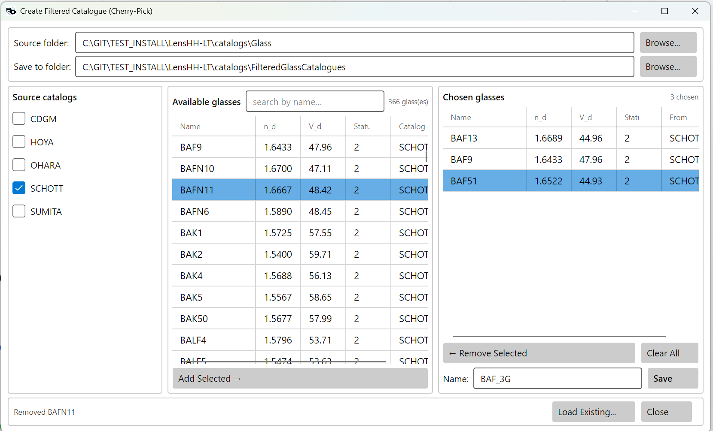
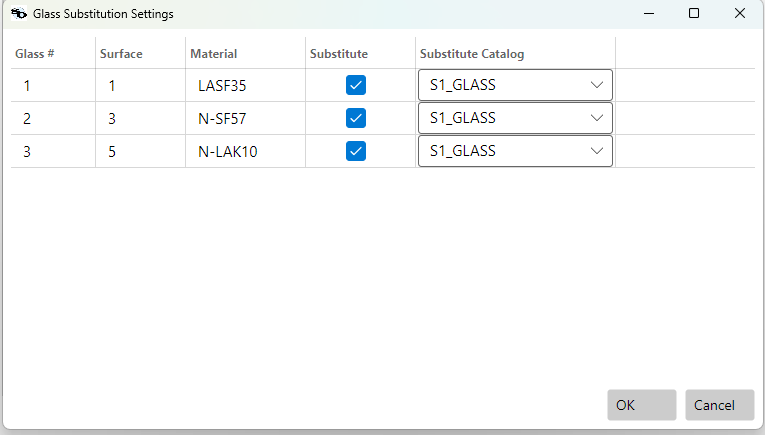

# Glass Catalogs

LensHH-LT represents every glass element with a reference to an entry
in a glass catalog. Catalogs are ZEMAX **AGF** (ASCII glass-file)
format. Five manufacturer catalogs ship with the installer; you can
add custom catalogs with the Glass Catalog Generator tool.

## What Ships

| Catalog  | Manufacturer              |
|----------|---------------------------|
| SCHOTT   | Schott AG (Germany)       |
| OHARA    | Ohara Corp. (Japan)       |
| HOYA     | Hoya Corp. (Japan)        |
| SUMITA   | Sumita Optical (Japan)    |
| CDGM     | CDGM Glass (China)        |

Files live in `<install>\catalogs\Glass\` and are loaded automatically
on startup.

If you maintain custom or filtered catalogs, drop them under
`<install>\catalogs\FilteredGlassCatalogues\`. Any `*.agf` file in
either folder is picked up.

## How a Glass Is Named

A glass entry is identified by its **name** (e.g. `N-BK7`, `LAK9`,
`S-TIH6`) plus the **catalog** it belongs to. A lens file's surface
record typically stores just the name; LensHH-LT resolves it by:

1. Exact match on `CATALOG:NAME` if the lens file uses that form.
2. Otherwise, searching the system's preferred catalog list
   (declared on the ZMX `GCAT` line, or set via **File → Catalog
   Preference…**).
3. Finally, a scan of every loaded catalog.

When two catalogs contain the same name (common — `SF5` exists in
SCHOTT and older catalogs), the preferred-catalog order decides which
one wins. Reorder the list via **File → Catalog Preference…** if the
resolver is picking the wrong one.

## Status Flags

AGF entries carry a status code that LensHH-LT reads and surfaces in
the glass picker:

| Code | Meaning   | When to use |
|------|-----------|-------------|
| 0    | Standard  | Production-ready. Default filter includes these. |
| 1    | Preferred | Manufacturer-recommended. Good default for new designs. |
| 2    | Obsolete  | Still characterized but no longer sold. Avoid for new designs. |
| 3    | Special   | Low-volume or custom. May be expensive or have long lead times. |
| 4    | Melt      | One-off melt data. Only meaningful for as-built analysis. |

The glass-substitution step in the multistart and basin-hopping
optimizers can be restricted to any subset of these statuses.

## Dispersion Formulas

Each catalog entry carries a formula code and a list of coefficients.
LensHH-LT supports:

| Code | Formula       | Coefficients |
|------|---------------|--------------|
| 1    | Schott        | 6 (`a0..a5`) |
| 2    | Sellmeier 1   | 3 terms (K₁, L₁², K₂, L₂², K₃, L₃²) |
| 3    | Herzberger    | 6 (returns `n` directly) |
| 4    | Sellmeier 2   | 3 terms (B₁, B₂, B₃, B₄, B₅, B₆) |
| 5    | Conrady       | 3 (`n = a + b/λ + c/λ^3.5`) |
| 6    | Sellmeier 3   | 4 terms (K, L² pairs) |

Wavelength is always in **micrometers**. An entry with no recognized
formula falls back to its `Nd` value (1.5 if unknown).

## Validity Range

Each entry carries `WavelengthMin` / `WavelengthMax` lines (AGF
`LD ...`). LensHH-LT **does not** automatically refuse wavelengths
outside this range — dispersion formulas extrapolate, and the glass
may not transmit. Check against the manufacturer's transmission chart
when you're using wavelengths far from the visible band.

## The Glass Picker

Every glass cell in the Surfaces table opens a picker dialog showing:

- Search box (live-filters by partial name).
- Catalog filter (multi-select).
- Status filter (Standard / Preferred / Obsolete / Special / Melt).
- Column sort for name, catalog, Nd, Vd, status.
- Per-row preview of Nd, Vd, partial dispersion ratios.

Double-click an entry (or press **OK**) to assign it to the current
surface.

## Custom / Filtered Catalogs

### Why

A full manufacturer catalog contains 200+ entries, many of which are
obsolete, special-order, or outside your wavelength band. For
optimization (glass substitution in particular), restricting the
search to a curated sub-catalog makes the search both faster and more
manufacturable.

### How

**Optimization → Create Glass Catalogue…**


Workflow:

1. **Catalogs / Output paths** at the top default to your install's
   `catalogs\Glass` and `catalogs\FilteredGlassCatalogues` folders;
   change either with **Browse…** if you want to pull from a
   non-standard location.
2. **Pick source catalogs.** The left pane lists every AGF in the
   Catalogs folder. Use **Add >** / **< Remove** to move catalogs
   between *Available* and *Selected*; the survivors are pulled from
   the union of *Selected*.
3. **Enable the filters you want.** Each filter has a checkbox; only
   checked filters are applied. The full filter set:

   | Filter | Meaning |
   |---|---|
   | **Preferred Only** | Status flag ≤ 1 (Standard or Preferred). Drops Obsolete / Special / Melt entries. |
   | **Distance Radius** | Multivariate distance from a target glass in (Nd, Vd, ΔPgF) space. `d = √(Wn·(Nd − Nd_t)² + Wa·(Vd − Vd_t)² + Wp·(ΔPgF − ΔPgF_t)²)`. Useful for "glasses near N-BK7" — set the targets to BK7's properties and lower `d` until the count is what you want. |
   | **BK7 Rel. Cost ≤** | Drop entries whose relative-cost factor exceeds this multiple of N-BK7. |
   | **Nd / Vd / dPgF / TCE ranges** | Rectangular bounds on each individual property. |
   | **Min / Max wavelength** | Keep only glasses with `LD` validity covering this range. Tied to your design band. |
   | **Melt frequency limit** | Drop melts characterized fewer than N times — a rough manufacturability proxy. |

4. **Generate Catalog.** The bottom-pane *Generated Glass List* fills
   with the surviving entries. Click any row to see its full
   properties in the *Details* panel on the right; **Remove
   Selected** drops a row by hand if you want to prune further. Sort
   the list by Name, Nd, Vd, ΔPgF, Relative Cost, or TCE.
5. **Catalog Name** + **Save Catalog**. The dialog writes a fresh
   AGF file under the Output folder.
6. **Restart LensHH-LT.** Filtered catalogs are loaded on startup
   only — there is no live-reload menu.

A typical starter pool for visible-band designs: **Preferred Only**
+ **Min wavelength = 0.42**, **Max wavelength = 0.7**, **BK7 Rel.
Cost ≤ 5**, sources = SCHOTT + OHARA. Yields ~80–120 glasses,
which is small enough that Multistart / Basin Hopping can sweep it
quickly while still spanning a wide Abbe range.

### Cherry-pick from existing catalogs

**Optimization → Create Filtered Catalogue (Cherry-_Pick)…**

The criteria-based generator is good when you can describe the
glasses you want as a set of property bounds. When you'd rather
hand-assemble a small catalog — say, "the eight glasses our shop
already has on the shelf", or "BK7 plus the four substitutes I
trust to swap for it" — the cherry-pick dialog lets you build the
catalog one entry at a time from the union of any source catalogs
you load.



Workflow:

1. **Source folder** / **Save to folder** at the top default to
   your install's `catalogs\Glass` and
   `catalogs\FilteredGlassCatalogues` folders. Change either with
   **Browse…** if you want to pull from or save to a non-standard
   location.
2. **Check the source catalogs** in the left pane. The middle
   *Available glasses* pane fills with the union of glasses from
   every checked catalog. The count next to *Available glasses*
   updates live; the **search by name…** box filters the list.
3. **Add glasses to your catalog.** Select rows in *Available
   glasses* and click **Add Selected →**, or double-click a single
   row. They appear in the right *Chosen glasses* pane.
4. **Refine the chosen list** with **← Remove Selected** (drop
   one) or **Clear All** (start over).
5. **Name it and click Save.** The dialog writes a fresh AGF file
   under the *Save to folder* with the entries you picked.
6. **Restart LensHH-LT.** Same as the criteria-based catalogs —
   filtered catalogs load on startup only.

The **Load Existing…** button at the bottom lets you open an
existing filtered AGF as the starting *Chosen glasses* list, so
you can extend or trim a catalog you already have without
re-picking everything.

Cherry-picked catalogs work identically to criteria-built ones —
both are AGF files in the FilteredGlassCatalogues folder, both
appear in the per-surface Glass Substitution dropdown and in the
Basin Hopping **Glass Source** dropdown.

### AGF Format Primer

An AGF catalog is plain text. Each glass occupies one block with a
handful of tagged lines. LensHH-LT uses three tags:

```
NM  name formula MIL Nd Vd Exclude Status
CD  c0 c1 c2 c3 c4 c5 ...
LD  wavelength_min wavelength_max
```

All other lines (`GC`, `TD`, `OD`, `IT`, …) are permitted in the file
but currently ignored by the reader. This means transmission curves
(`IT`), thermal coefficients (`TD`), and relative-cost data (`OD`) are
**not** consumed by LensHH-LT — if you need those for a secondary
tool, keep the original manufacturer AGF around.

Example entry:

```
NM N-BK7 1 517.642 1.51680 64.17 0 1
CD 1.03961212 2.31792344e-1 1.01046945 6.00069867e-3 2.00179144e-2 1.03560653e2
LD 0.3 2.5
```

Formula code `1` = Schott, 6 coefficients, valid 0.3–2.5 µm.

## Glass Substitution During Optimization

Multistart and Basin Hopping both can swap glasses during a search,
but they use very different mechanics. Pick the one that matches
the level of control you want.

### Multistart — per-surface table

Multistart reads a **per-surface substitution table** that lives on
the system itself (saved in the `.lhlt`). Each glass surface has its
own opt-in flag and its own catalog choice, so different surfaces
can draw from different filtered catalogs.

To populate the table, open **Optimization → Glass Substitution
Settings**:



The dialog lists every glass surface in the system. For each row:

- **Substitute** — tick to opt that surface into substitution.
- **Substitute Catalog** — pick a filtered catalog from the
  dropdown. The dropdown is populated from
  `<install>\catalogs\FilteredGlassCatalogues\`; if it's empty,
  generate one first via **Create Glass Catalogue…**.

**OK** writes the choices to the system (and they're persisted in
the `.lhlt` file). When Multistart runs with
`GlassSubstitutionProbability > 0`, every trial rolls per-surface:
with probability `p`, that trial picks a random glass from *that
surface's* catalog. Surfaces without `Substitute = true` are never
touched.

### Basin Hopping — single shared catalog

Basin Hopping doesn't use the per-surface table at all. Its
**Glass Source** dropdown picks **one** filtered catalog and
applies it to every glass element that has an active element-local
variable (curvature/thickness/conic/asphere on either face).
Surfaces without active variables are auto-detected and skipped.

See [Optimization → Basin Hopping](optimization.md#basin-hopping-hj--lm)
for the full eligibility rules and the run-start log line that
reports which elements made the cut.

### Choosing a pool

Whatever the mechanism, the pool you point at matters more than
either optimizer:

- **A full manufacturer AGF (200+ glasses) is too noisy** for most
  searches. Many glasses are obsolete, special-order, or outside
  your wavelength band; the optimizer wastes hops on them.
- **A 30–100-glass filtered catalog** (Preferred only, Vd ≥ some
  cutoff, valid through your wavelength range) typically converges
  faster *and* lands on more manufacturable designs.

Use **Optimization → Create Glass Catalogue…** (described above)
to build filtered catalogs; they're saved automatically to
`<install>\catalogs\FilteredGlassCatalogues\` and become available
in the substitution dropdowns after the next app start.

## Troubleshooting

| Symptom | Likely cause |
|---|---|
| "Glass 'X' not found" on load | The lens file names a glass that isn't in any loaded catalog. Check catalog-preference order; add the missing AGF. |
| Refractive index looks wrong at short or long wavelengths | Wavelength outside the glass's `LD` range — dispersion is extrapolated. Use a different glass that's valid at that wavelength. |
| Same glass name resolves to different properties in two lenses | Two catalogs define the name differently (e.g. `SF5` in SCHOTT vs. an older vendor). Make the preference order explicit, or reference as `CATALOG:NAME`. |
| Custom AGF loads but glasses don't appear | Filename must end in `.agf` (case-insensitive). Contents must start with valid `NM` blocks — catalog header-only lines without glasses load an empty catalog silently. |
