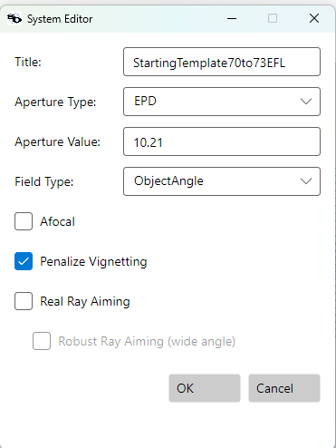

# Merit Function Reference

The merit function is a list of **operands**. Each operand produces one
value; the optimizer drives the weighted sum of squared residuals to
zero. A residual is the operand's value minus its target (in Target
mode), or the distance outside its Min/Max bounds (in Boundary mode).

## Operand Row — Common Columns

Every operand has these columns in the Merit Function Editor:

| Column | Meaning |
|---|---|
| **Type** | The operand type (e.g. `SPOT`, `EFL`, `CTG`). Determines what the operand computes. |
| **Mode** | `Target` (drive toward a value) or `Min/Max` (penalize if outside a bound). |
| **Target / Min / Max** | The reference value for the chosen mode. |
| **Weight** | Multiplier on the residual. 0 disables the row. |
| **OpCode** | Optional post-processing: `Abs`, `Sqrt`, `Sin`, `Cos`, `Tan`, `Asin`, `Acos`, `Atn`. Default `None`. |
| **Value** | Read-only — the last-computed value. |

The remaining columns depend on the operand type (see each category
below). Columns irrelevant to the selected type are greyed out.

---

## Spot Operands

Diffraction-quality merit — RMS transverse ray aberration over pupil
quadrature.

| Type | Reference | Sampling | Notes |
|---|---|---|---|
| `SPOT`   | Chief ray | Forbes Gauss-Legendre quadrature (`Rings × Arms`) | Tracks TRAD/TRAE per pupil point. |
| `SPOTM`  | Weighted centroid | same | Recommended for final-merit chromatic balancing. |
| `SPOTR`  | Chief ray | Rectangular grid (`GridSize × GridSize`) | Uniform sampling — see *Forbes vs rectangular* below. |
| `SPOTMR` | Weighted centroid | rectangular grid | |

**Inputs:** `Rings` (quadrature rings, 3–20), `Arms` (6, 8, 10, or 12)
for Forbes; `GridSize` (4–100) for rectangular.

**Units:** mm in focal mode, arcmin in afocal mode (automatic).

**Failure handling:** behavior depends on which field the failed
ray belongs to:

- **On-axis (|Hy| ≈ 0):** every vignetted or trace-failed pupil ray
  contributes a stiff per-ray penalty. On-axis vignetting is never
  a legitimate design choice — every defined pupil ray must reach
  the image. Without this penalty, the optimizer could "cheat" by
  letting most of the on-axis pupil get blocked: the spot RMS and
  OPD RMS are evaluated only over rays that survive, so a small
  surviving cluster could produce a tiny RMS while the design
  actually throws away most of the on-axis light. The per-ray
  penalty closes that loophole.
- **Off-axis (|Hy| > 0):** individual vignetted rays are silently
  excluded (residual = 0). Vignetting at field edges is often a
  deliberate aberration-relief choice, so the merit doesn't punish
  it ray-by-ray.
- **Whole-field collapse (any field):** if *every* hidden ray in a
  SPOT / WAVE group fails — or the chief ray fails for a SPOT or
  WAVE group — a synthetic per-group penalty fires so the optimizer
  backs away from designs that drop an entire spot.

### `PenalizeVignetting` — system-wide off-axis vignetting penalty

`OpticalSystem.PenalizeVignetting` is a system-level boolean (set in
the GUI's System Editor dialog, or via `set_penalize_vignetting` in
the MCP / CLI). When enabled, the engine **overrides the off-axis
tolerance described above** and applies the stiff per-ray penalty to
*every* failed ray, regardless of field — on-axis and off-axis alike.

| `PenalizeVignetting` | On-axis ray failure | Off-axis ray failure |
|---|---|---|
| `false` (default) | per-ray penalty fires | residual = 0 (tolerated) |
| **`true`** | per-ray penalty fires | **per-ray penalty fires** |

**When to enable it:**

- **Stock-lens designs.** The lens diameters are catalog-fixed. The
  optimizer must not "buy" aberration relief by quietly clipping the
  off-axis pupil — the as-built lens would vignette light the design
  has already used to compute its merit. Force it to design within
  the parts' apertures.
- **Specifications that quantify illumination.** Anywhere relative
  illumination is a delivered property (machine vision, projection,
  uniform-flux instruments), tolerating off-axis vignetting can mask
  designs that meet the spot/MTF target but fail the photometric one.
  Setting `PenalizeVignetting = true` keeps the optimizer from
  clipping rays; add an `ILL` operand on top of that only if the
  illumination value itself is part of the spec.
- **Any system whose pupil aperture is hard-fixed.** Beam-shaping
  systems with externally-determined stops, microscope tube lenses
  facing a real iris, etc.

**When to leave it disabled:**

- Wide-angle imagers and most photographic lenses where corner
  vignetting at field edges is a known and accepted trade-off — the
  merit function is allowed to find designs that vignette the
  outermost rays to relieve coma or astigmatism.
- Early-stage architecture exploration where you're more interested
  in spot/MTF behavior at the field center and don't want vignetting
  penalties dominating the merit gradient before the design has
  converged on a shape.

**`PenalizeVignetting` is an alternative to using merit operands as
vignetting controls — not a complement to them.** Pick one:

- **`PenalizeVignetting = true`** — the simplest path when lens
  diameters are fixed (stock-lens designs, hard-mounted apertures).
  No additional merit operands are needed to keep the design from
  clipping rays at field edges; the per-ray penalty does that
  directly. Operands like `ILL` are then only needed if relative
  illumination itself is a delivered specification — not as a
  vignetting guard.
- **`PenalizeVignetting = false`** with merit-operand vignetting
  control — use this when you want fine-grained control over which
  vignetting is acceptable. Add operands such as `ILL` (relative
  illumination at a field) with `Min` bounds to prevent the optimizer
  from buying aberration relief by clipping the off-axis pupil. Other
  per-field operands can be combined to keep specific field zones
  unvignetted while letting outer edges roll off.

In short: check `PenalizeVignetting` and you don't need separate
vignetting-control operands. Leave it unchecked and you must add them
yourself, otherwise the off-axis vignetting tolerance described above
will silently let the optimizer earn merit by dropping rays.

### Forbes (`Rings × Arms`) vs rectangular grid

The Forbes scheme places rays on `Arms` evenly-spaced radial spokes
at the `Rings` zeros of a Legendre polynomial in the area variable
`ρ = r²/R²`. The rectangular scheme samples on a uniform Cartesian
grid and discards points that fall outside the unvignetted pupil.
Both estimate the same RMS integral; they differ only in how the
pupil is sampled and weighted.

**Forbes is the default, and it should stay the default for almost
all design work.** The reason is integration efficiency, not pupil
shape. For a smooth integrand — which any unvignetted, well-behaved
optical wavefront is — Gauss-Legendre quadrature converges
exponentially in the polynomial degree it can integrate exactly.
Forbes (1988) showed that for typical lens systems, ~12 rays of
Gaussian quadrature give 1% RMS-spot accuracy where ~75 rays of
the polar-uniform Andersen scheme are required, and a uniform
Cartesian grid needs roughly 500 rays for the same accuracy. In an
optimizer that evaluates the merit thousands of times per run, that
40× ray-count ratio dominates wall-clock time. Defaults of `Rings = 6`,
`Arms = 12` (72 rays per field per wavelength) sit comfortably
inside the regime where the residual quadrature error is well below
the visible aberration content.

There are, however, cases where the rectangular operands (`SPOTR`,
`SPOTMR`, `WAVEXR`, etc.) are the right tool:

- **Heavy or asymmetric vignetting.** Forbes quadrature assumes a
  circular pupil; the Gauss-Legendre weights are derived for the
  full disk. When a substantial fraction of those weighted sample
  points fall in vignetted zones and are dropped, the remaining
  rays no longer carry the correct quadrature weights for the
  *transmitted* pupil. With only a handful of rings to begin with,
  losing two or three of them can bias the RMS estimate noticeably.
  A dense rectangular grid (e.g., `GridSize = 16`–`32`) over the
  same pupil degrades much more gracefully because each surviving
  ray still carries equal weight over its own grid cell — the loss
  is proportional, not weight-distorted. Forbes himself flags this
  in §3 of the 1988 paper: "for cases in which the effects of pupil
  distortion and vignetting need to be determined… simultaneously
  with the integration, pure Gaussian schemes are not possible."

- **Non-polynomial wavefronts.** Strong aspheres, freeforms, or
  diffractive surfaces can produce wavefronts that aren't well
  approximated by a low-order polynomial in `ρ`. Gaussian quadrature
  loses its accuracy advantage there; a denser uniform grid
  estimates the integral more honestly even if it costs more rays.

- **Validation.** When a Forbes-driven optimization converges to a
  surprisingly good merit value, re-evaluating the same design with
  a rectangular grid is a cheap independent check that the result
  isn't an artifact of the quadrature sample placement. If the two
  schemes disagree at the same total ray count, the design is
  probably exploiting structure the Gauss-Legendre points happen to
  miss.

In short: pick rectangular when you have reason to distrust the
smoothness or circularity assumptions Gauss-Legendre is built on.
Otherwise stay with Forbes — the speed difference matters more than
it looks, especially on global-search and multistart runs.

> **Reference:** G. W. Forbes, "Optical system assessment for design:
> numerical ray tracing in the Gaussian pupil," *J. Opt. Soc. Am. A*
> **5**, 1943–1956 (1988).

---

## Wavefront (OPD) Operands

RMS wavefront error over pupil quadrature, in waves.

| Type | Reference | Removed | Sampling |
|---|---|---|---|
| `WAVEX` | Chief ray | Piston **and** tilt | Forbes quadrature |
| `WAVEM` | Chief ray | Piston only | Forbes quadrature |
| `WAVEC` | Chief ray | Nothing | Forbes quadrature |
| `WAVEXR`, `WAVEMR`, `WAVECR` | same | same | Rectangular grid |

**Inputs:** `Rings` + `Arms` for Forbes; `GridSize` for rectangular.
The Forbes-vs-rectangular trade-off is the same as for spot
operands — see *Forbes (`Rings × Arms`) vs rectangular grid* above.

`WAVEX` is the standard diffraction-quality merit; the removed piston
and tilt prevent focus-shift and field-centroid shift from spuriously
driving the merit.

---

## Ray-Intercept Operands

Single-ray queries. Evaluate at one `(Surface, Wave, Hy, Px, Py)`.

| Type | Meaning | Unit |
|---|---|---|
| `RX`, `RY`, `RZ`    | Ray position at surface | mm |
| `RL`, `RM`, `RN`    | Ray direction cosines at surface | unitless |
| `AOID`, `AOIR`       | Angle of incidence | degrees / radians |
| `AOED`, `AOER`       | Angle of exitance | degrees / radians |
| `PX`, `PY`, `PZ`, `PL`, `PM`, `PN` | **Paraxial** equivalents of the above | |

**Inputs:** `Surface`, `Wave`, `Hy` (normalized field 0–1), `Px`, `Py`
(normalized pupil -1..+1).

---

## Angle Boundary Operands

Scan a surface range and report max/min angle of a chief ray.

| Type | Meaning |
|---|---|
| `RI` | Angle of incidence, degrees, across a surface range. |
| `RE` | Angle of exitance, degrees, across a surface range. |

**Inputs:** `Surface1`, `Surface2`. Typical use: set `Max` bound to
keep TIR margin on glass surfaces or to limit coating AOI.

---

## Boundary Operands

Scan a surface range. Report min/max for use with `Min`/`Max` bounds.
Penalize the optimizer when outside the bound.

| Type | Meaning |
|---|---|
| `CV`, `CVA`, `CVG` | Curvature: all / air-only / glass-only |
| `CT`, `CTA`, `CTG` | Center thickness |
| `ET`, `EA`, `EG`   | Edge thickness (at max SD) |
| `SD`               | Semi-diameter |
| `DTRG`             | **D**iameter-to-**T**hickness **R**atio, **G**lass-only: `2·SD / |CT|`. Fabrication constraint — a typical bound is `Max = 10` to keep elements thick enough for reliable grinding. |

**Inputs:** `Surface1`, `Surface2` (range inclusive).

Glass-only variants walk only surfaces whose outgoing material is not
air; air-only variants the complement; the plain variant both.

### Surface sentinel values

`Surface1` and `Surface2` both accept either an **absolute surface
index** (positive integer — `1`, `2`, `3`, …) or one of a small set of
**negative sentinels**. The **same sentinel works identically in
either field** — there is no separate "left-side" or "right-side"
sentinel set. Whichever endpoint you put it in, it resolves to the
position described below at evaluation time.

Use the sentinel form whenever the design will be edited by tools
(`add_singlet`, `replace_element`, `split_element`, surface insert/
remove) that shift the absolute indices — the sentinel auto-tracks
the renumbering, while a hard-coded positive index may end up
pointing at a different surface than you intended.

#### Sentinel values

| Value | Resolves to | Numeric position |
|---:|---|---|
| `0`  | **Mirror** of whichever value you put in the other field | (depends on the other endpoint) |
| `-1` | **Surface immediately before IMG** | `Surfaces.Count − 2` |
| `-2` | **Image surface** | `Surfaces.Count − 1` |
| `-3` | **First surface after the stop** | `StopIndex + 1` |
| `-4` | **Stop surface** | `StopIndex` |
| `-5` | **Surface immediately after OBJ** | `1` |

#### A note on `-5` and `-1` — position-based, not material-aware

`-5` and `-1` are **position sentinels**: they always resolve to index
`1` and `Surfaces.Count − 2` respectively, regardless of what surface
type or material sits there. For a clean design where OBJ is followed
directly by the first glass-front and the last glass-back is followed
directly by IMG, these positions ARE the first and last refractive
surfaces — which is how they're commonly used.

**Edge case to be aware of**: if you've placed a **dummy air surface**
at index `1` (e.g. an explicit stop placeholder, a buried-pupil dummy,
or any other non-optical placeholder), `-5` resolves to that dummy
surface, not to the actual first glass-front. Symmetrically, if a
trailing dummy sits between the last glass and IMG, `-1` resolves to
that trailing dummy, not the actual last glass-back.

Example layouts:

| Layout                                              | `-5` resolves to | `-1` resolves to |
|---|---|---|
| `OBJ → L1 → L2 → L3 → IMG`                          | L1 front (✓ first refractive) | L3 back (✓ last refractive) |
| `OBJ → DUMMY → L1 → L2 → L3 → IMG`                  | **DUMMY** (the placeholder, **not** L1 front) | L3 back |
| `OBJ → L1 → L2 → L3 → DUMMY → IMG`                  | L1 front | **DUMMY** (the placeholder, **not** L3 back) |

If you have dummy surfaces in your design and want a span operand to
target the actual first / last glass-bearing surface, use the absolute
positive index instead of `-5` / `-1`. (A material-aware "true first
refractive" sentinel is a planned future addition; for now, position
sentinels are what's available.)

#### Concrete examples

The same span operand `CTA` (center thickness, air-only) authored in
five common ways. Note that `Surface1` and `Surface2` are independent —
you can put a sentinel in either field, or both, or neither:

| `Surface1` | `Surface2` | Resolved span | Meaning |
|---:|---:|---|---|
| `-5` | `-1` | first refractive → last refractive | Every air gap between L1 and the last lens. Auto-tracks insertions/removals on either end. |
| `-3` | `-1` | first surface after stop → last refractive | Every air gap from the lens after the stop to the last lens. Excludes everything on the front side of the stop. |
| `-4` | `-2` | stop → image | Span starts AT the stop (covers the stop's trailing air) and ends at the image (covers the BFL gap). |
| `1`  | `-1` | absolute surface 1 → last refractive | Same range as `(-5, -1)` if your system has OBJ at index 0; if you later insert a surface at index 1, this hard-coded `1` will move with the renumbering only because `SurfaceIndexUpdater` shifts it — sentinel `-5` is safer. |
| `5`  | `0`  | absolute surface 5 → mirror of 5 | Just surface 5. The `0` "mirror" form is how you make a span operand evaluate at a single surface. |

You can also flip the order — the resolver normalizes the span so
`s1 ≤ s2` after sentinel substitution. `Surface1 = -1, Surface2 = -5`
reads the same as `Surface1 = -5, Surface2 = -1`.

#### Where sentinels apply

Every boundary operand
(`CT`, `CTA`, `CTG`, `ET`, `EA`, `EG`, `CV`, `CVA`, `CVG`, `SD`,
`DTRG`) and every angle operand (`RI`, `RE`) shares the same `Surface1`
/ `Surface2` semantics described above. So `DTRG(-5, -1, max=10)`
applies the diameter-to-thickness ratio constraint to every glass
element in the system without naming individual surfaces.

#### Where sentinels do NOT apply

Single-surface refs (the `Surface` column on `WAVEX`, `EFL`, `BFL`,
the `Hy`-driven distortion / lateral-color operands, and `DM`) take a
single absolute index. `0` on those fields means "system-level /
system default" — it is not a span-mirror sentinel because there's no
other endpoint to mirror.

---

## Surface Property Operand

| Type | Meaning |
|---|---|
| `DM` | Diameter (= 2·semi-diameter) of one surface. Input: `Surface`. |

---

## System Operands

Single value per system.

| Type | Meaning |
|---|---|
| `EFL`    | Effective focal length |
| `MAG`    | Paraxial lateral magnification |
| `AMAG`   | Paraxial angular magnification |
| `ENPZ`   | Entrance pupil Z (distance from surface 1) |
| `EXPZ`   | Exit pupil Z (distance from image) |
| `ENPD`   | Entrance pupil diameter |
| `EXPD`   | Exit pupil diameter |
| `TTRACK` | Total track — surface 1 to image |
| `ILL`    | Relative illumination at a field, `= (F/#_axis / F/#_field)²`. Inputs: `Hy`, `Arms` (pupil-boundary direction probes — default 36, minimum 8). |

**Optional input:** `Wave` (defaults to primary wavelength).

---

## Distortion and Lateral Color

| Type | Meaning |
|---|---|
| `DITAN`     | Maximum signed F-tan(θ) distortion % across all fields. Reference is the paraxial EFL (or paraxial magnification for finite-conjugate object-height fields). |
| `DITHETA`   | Maximum signed F-θ distortion % across all fields. Reference is the paraxial EFL. |
| `DITANF`    | F-tan(θ) distortion % at a specific field. Input: `Hy`. Reference is the paraxial EFL. |
| `DITHETAF`  | F-θ distortion % at a specific field. Input: `Hy`. Reference is the paraxial EFL. |
| `LCF`       | Lateral color at a specific field — max chief ray height spread across all wavelengths. µm for focal systems, arcmin for afocal. Input: `Hy`. |

---

## Sensitivity (As-Built Performance)

| Type | Meaning |
|---|---|
| `SENS` | Sum of `|Δn|·(1 − cosθ)/6` over every pupil ray × surface × field × wavelength. Penalizes high-sensitivity surfaces (Moore, *SPIE* 10925, 2019). Inputs: `Rings`, `Arms`. |

The conventional design workflow optimizes nominal performance
first and then runs a separate tolerance analysis on top. `SENS`
folds tolerance sensitivity directly into the merit function. The
ray-bend at each surface — driven by `(1 − cos θ)` of the ray's
angle to the local normal weighted by the index step `|Δn|` — is
both the dominant aberration contribution *and* the dominant
sensitivity to fabrication errors (radius, thickness, tilt,
decenter). Adding `SENS` alongside the usual spot or wavefront
target steers the optimizer toward designs whose surfaces bend the
rays less aggressively, which means smaller perturbations under
tolerances. The as-built design may have slightly worse nominal
performance but holds up better through fabrication, and the
optimizer can land on different design forms entirely. Approach
follows Kenneth Moore, *Photonic Instrumentation Engineering VI*,
SPIE Proc. 10925, 1092502 (2019),
[doi:10.1117/12.2508062](https://doi.org/10.1117/12.2508062).

`Rings` and `Arms` set a Gauss-Legendre pupil sampling identical to
the geometric MTF — start with `Rings = 6, Arms = 12` and increase
only if the operand value looks noisy iteration-to-iteration.

---

## Arithmetic Operands

Derive new values from other operands already in the list. All operand
references are **1-based indices** into the merit-function editor's
table (the number shown in the `#` column).

| Type | Meaning | Inputs |
|---|---|---|
| `MULTC` | `Factor × Op1`                  | `Op1`, `Factor` |
| `SUM`   | `Op1 + Op2`                      | `Op1`, `Op2` |
| `DIFF`  | `Op1 − Op2`                      | `Op1`, `Op2` |
| `MULT`  | `Op1 × Op2`                      | `Op1`, `Op2` |
| `DIV`   | `Op1 ÷ Op2`                      | `Op1`, `Op2` |
| `SUMR`  | Σ Op[Op1..Op2]                   | `Op1`, `Op2` (range) |
| `QSUMR` | √( Σ Op[k]² ) over Op1..Op2      | `Op1`, `Op2` (range) |
| `DEV`   | Σ `|Op[k] − mean|` over Op1..Op2 | `Op1`, `Op2` (range) |

---

## Target vs. Boundary Mode

Every operand can operate in either mode:

- **Target mode** — residual is `(value − target) × weight`. Good when
  you want the value to *equal* something (e.g. `EFL = 100`).
- **Min/Max mode** — residual is zero inside the bounds,
  `(value − min) × weight` or `(value − max) × weight` outside. Good
  for constraints like "CTG ≥ 2mm" where any value above the minimum
  is acceptable.

Switch via the **Mode** column. Target and bounds share the same
numeric input field.

---

## Tips

- **Start simple.** One `SPOT` or `WAVEX` with weight 1, plus a few
  boundary operands (`CTG min`, `EG min`, `TTRACK max`) is enough to
  optimize most classical designs.
- **Watch the displayed Value.** After each evaluation the editor
  shows each operand's current value. If an operand is way off,
  check its inputs before assuming the optimizer is broken.
- **Weights don't need to be normalized.** LensHH-LT rescales pupil
  quadrature weights internally so that SPOT/WAVE contributions
  match their analysis-tool RMS values.
- **Afocal systems.** SPOT/SPOTM and lateral color automatically
  switch to angular units (arcmin) when the system is afocal.
