# Optimization

LensHH-LT ships three optimizers. All of them minimize the same merit
function (see the [Merit Function Reference](merit-function.md)) but
differ in how they explore the variable space.

A typical workflow stages them:

1. **Search** with Multistart or Basin Hopping when you don't trust
   the starting basin.
2. **Refine** with the Local Optimizer once you're in the right
   basin.
3. **Polish** with one more Local pass at the end so the final state
   is tightly converged.

Skip step 1 if you start from a known-good design; never skip step 3.

## When to use which

| Optimizer | Good for | Not good for |
|---|---|---|
| **Local (LM)** | Refining a design you already trust — polish the last 10% of merit. | Escaping a bad starting point. |
| **Multistart** | Probing several random starts, LM from each. Cheap way to find a better basin and to vary glass choices. | Genuinely topology-changing exploration (it won't, e.g., find a Cooke triplet from a flat-plate start). |
| **Basin Hopping** | Heavy exploration. Random perturbations + Hooke-Jeeves pattern search + LM refinement, optionally with glass substitution. | Fast iteration — it's the slowest of the three. |

## Variables

The optimizer moves any parameter marked **Variable** in the Surfaces
table. Typical choices:

- Curvatures (all or selective).
- Thicknesses (glass and/or air).
- Conic constants — available on every surface (the surface stays
  Standard until you set a non-zero conic; even-aspheres carry a
  conic in addition to the polynomial coefficients).
- Aspheric coefficients on even-asphere surfaces.
- Glass choice — Multistart and Basin Hopping can substitute glasses
  during search.

Every variable carries optional `Min` / `Max` bounds. Internally the
LM solver works on an *unbounded* transformed variable, so the
bounds are never violated and the optimizer can't crash by trying
illegal values; the practical effect is that pushing against a
bound shows up as a vanishing gradient, not a hard wall.

See [Getting Started → Your First Optimization](getting-started.md)
for the GUI workflow of marking variables and setting bounds.

## Local (LM)

**Optimization → Local Optimizer**

A damped-least-squares Levenberg-Marquardt solver — the workhorse
of every modern lens optimizer. Each iteration:

1. Compute the residual vector `r` and Jacobian `J` (analytic where
   possible, finite-difference otherwise).
2. Solve `(JᵀJ + λI) Δx = −Jᵀ r` for the step `Δx`.
3. Take the step if the merit improves and shrink λ; otherwise
   reject, expand λ, and retry.

This adaptive damping is what makes LM robust: when λ is large the
step approaches gradient descent (safe but slow); when λ is small
the step approaches Gauss-Newton (fast but only valid near the
optimum). LM gracefully transitions between the two.

| Setting | Default | Meaning |
|---|---|---|
| **Max Iterations** | 4000 | Hard cap. The solver normally hits its tolerance long before this. |
| **Use Broyden Update** | on | Reuse a rank-1 Jacobian update between full finite-difference recomputes. A full J is rebuilt every 5 *accepted* steps; rejections reuse the existing J because `x` hasn't moved. The Broyden rank-1 step is applied only on accepts, using the actual old-x → new-x residual difference. Roughly 3–5× faster than a full Jacobian per step and matches results in almost all cases. Turn off if a run looks stuck or for very small systems where the speedup doesn't matter. |
| **Init Damp** | 1e-3 | Starting value of λ. The default is robust on aspheric mixes and well-conditioned problems alike. Drop to 1e-6 for gauss-newton-like behavior on very smooth, well-scaled designs; raise to 1e-2 if the optimizer keeps rejecting steps early. |

The merit-change tolerance (1e-10) and damping bounds are handled
internally — you don't normally tune them.

**Run it twice.** A single LM run can stop on a tolerance hit while
the merit is still detectably decreasing on a fresh restart. Hit
**Start** again from the result; the second pass either confirms
convergence or shaves another few percent.

### Two ways to keep thicknesses sane

The Local Optimizer has no built-in opinion about whether a glass
thickness or air gap is physically reasonable — it will happily
collapse or invert thicknesses to chase image quality unless you
constrain them. There are two equivalent ways to do that:

- **Merit-function operands** — `CTG`, `CTA` (per-surface-range
  centre thickness, glass and air), and `EG`, `EA` (edge thickness,
  glass and air). Each carries a Min/Max bound and a weight; the
  evaluator adds a smooth penalty when the bound is approached.
- **Per-variable Min/Max bounds** — set on the variable itself in
  the surface table (Thickness Min / Thickness Max columns). The
  LM solver works on a transformed unbounded variable internally,
  so the bound is never violated; pushing against it shows up as a
  vanishing gradient, not a hard wall.

Both are demonstrated below on the same Cooke triplet starting
point (50 mm EFL, EPD 10, three fields 0°/14°/20°, three
wavelengths 0.48/0.55/0.65 µm). Sample files:
`samples/CookeTripletLocalOptimization/`.

#### Starting point

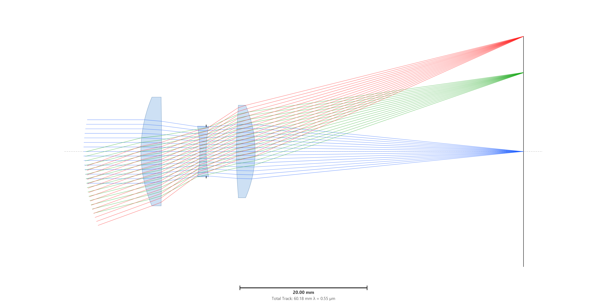

Variables are every curvature and every thickness from S1 through
S6. The starting design is noticeably uncorrected:

| Spot — start | FFT MTF — start |
|---|---|
| 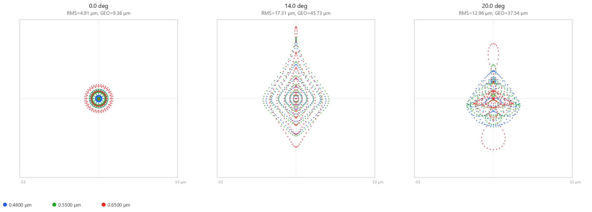 | 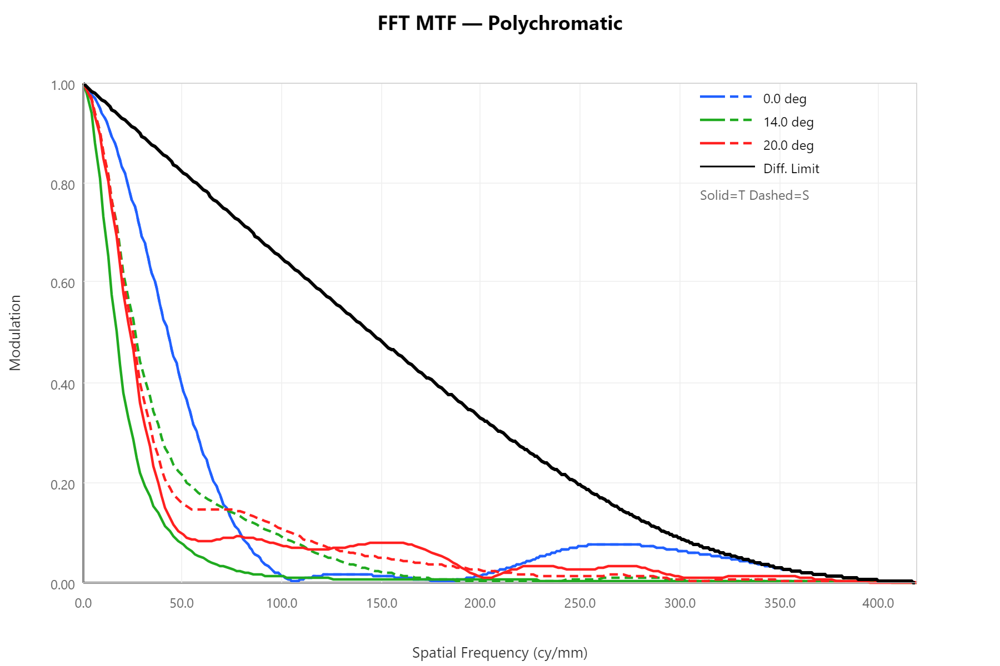 |

#### Case (a) — thickness handled entirely by the merit function

`CookeTriplet_UC.lhlt`. Variables carry no Min/Max bounds; the
merit function does all the work with `EFL`, `WAVEX`, `CTG`, `CTA`,
`EG`, `EA`, plus a `CTA[6,6] Min=40` to keep BFL above 40 mm.

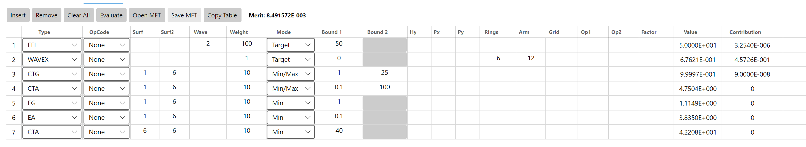

Convergence (28 iterations, 0.2 s):

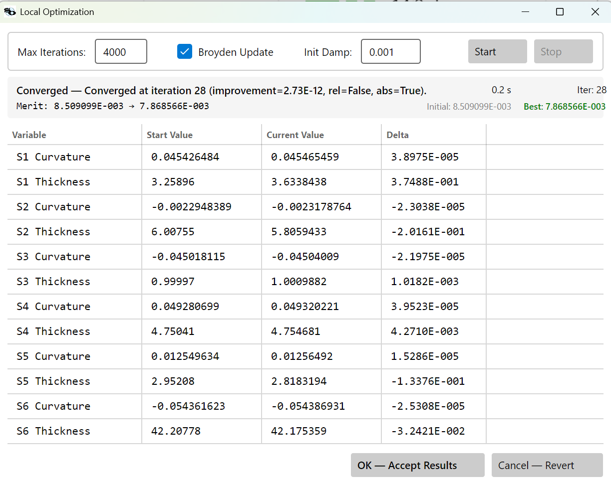

Merit goes from `8.51 × 10⁻³` to `7.87 × 10⁻³`. Optimized layout:

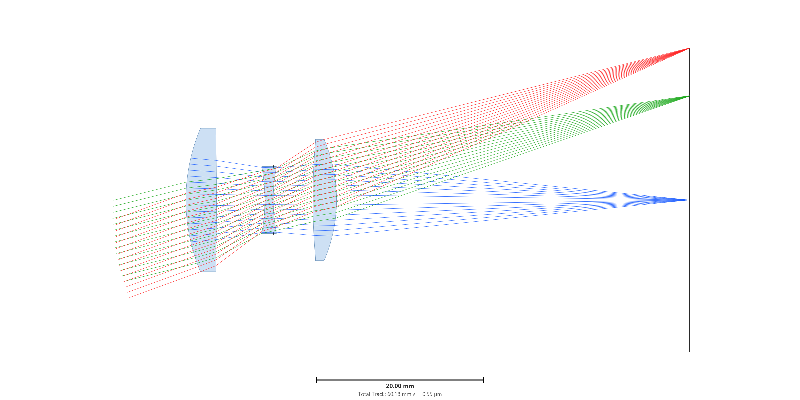

#### Case (b) — centre thickness handled by per-variable bounds, edges by merit function

`CookeTriplet_C.lhlt`. The merit function keeps only `EFL`,
`WAVEX`, `EG`, `EA` (edge thickness still belongs to the merit
function — there is no "edge" of a single variable). Centre
thicknesses are bounded directly on each thickness variable:
`[1, 25]` mm on glass thicknesses (S1, S3, S5), `[0.1, 100]` mm on
internal air gaps (S2, S4), and `[40, 100]` mm on the BFL (S6).

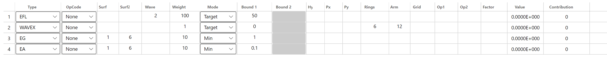

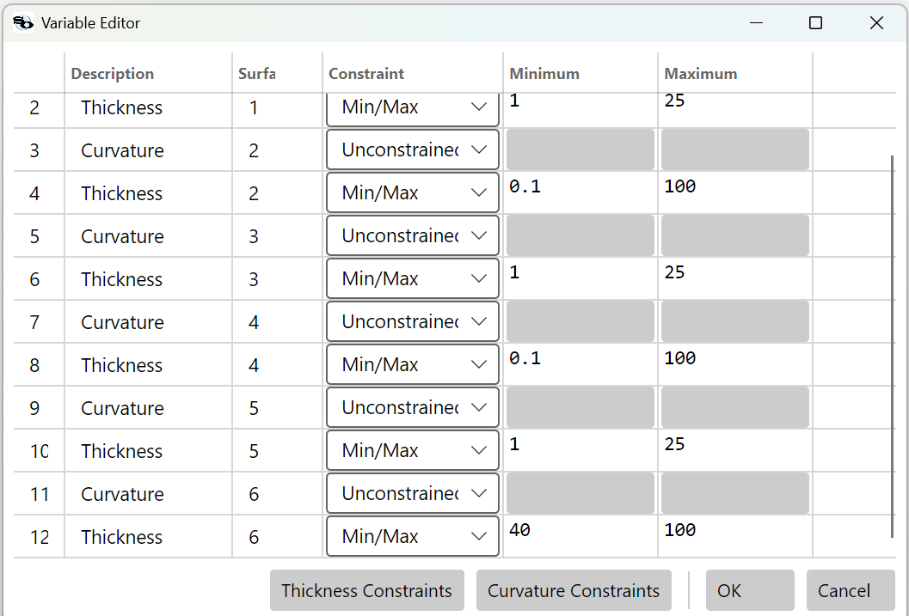

Convergence (411 iterations, 1.0 s):

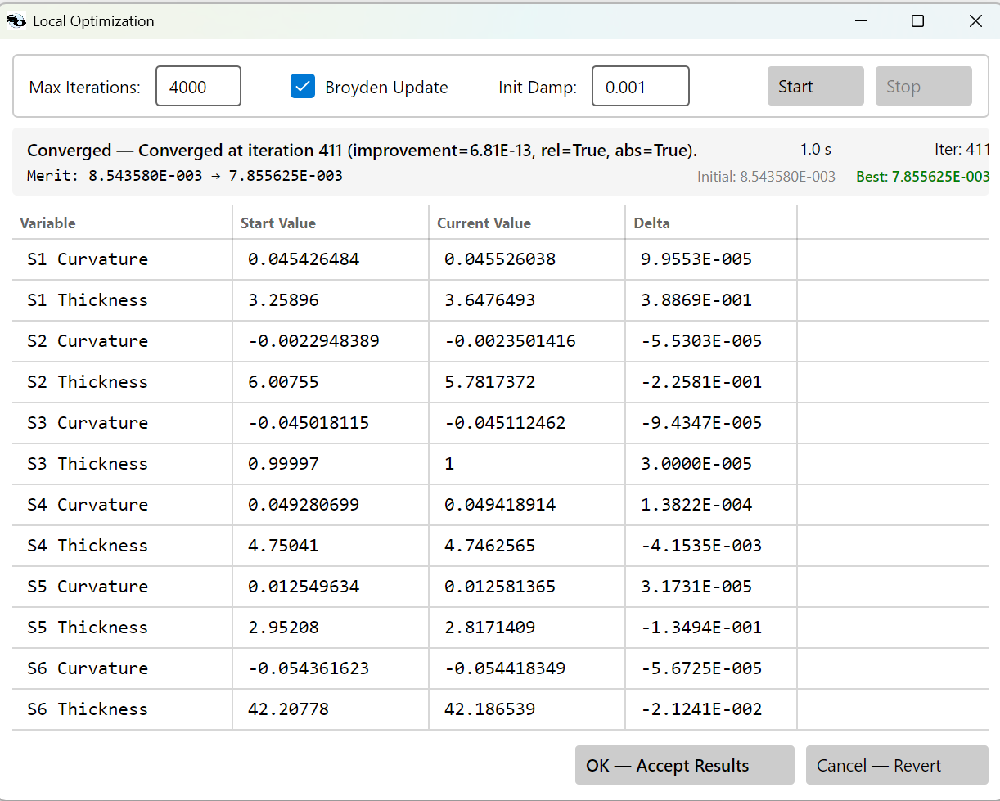

Merit goes from `8.54 × 10⁻³` to `7.86 × 10⁻³` — essentially the
same final merit as case (a), and the optimized layout is visually
identical. Constrained variables take more LM iterations because
the transform makes the gradient flatten as a bound is approached;
on this system the cost is fractions of a second, but on a much
larger system the gap can grow. Both forms of constraint are
supported and both reach the same optimum on this design — pick
whichever fits your style.

#### Case (c) — no thickness handling at all

`CookeTriplet_UC_NO_E_OR_CT.lhlt`. The merit function has only
`EFL` and `WAVEX`; thickness variables have no bounds and no
boundary operands. The result is what you'd expect: the optimizer
collapses inter-element air gaps to *negative* values to overlap
glass elements, since that lets it bend rays more aggressively
without paying any penalty.

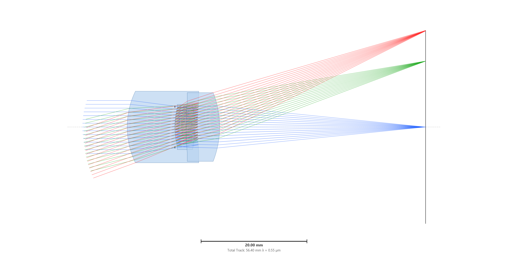

The reported merit is lower than (a) or (b), but the design is
physically meaningless — surface 2's air thickness comes out to
`−0.58` mm and surface 3's glass thickness to `−3.74` mm. Always
constrain thicknesses, by either of the two methods above, before
trusting an LM result.

## Multistart

**Optimization → Multistart…**

Runs many LM optimizations from randomly perturbed starting points,
keeps the best, and tracks accepted vs rejected counts. Glass
substitution can be enabled — every trial may swap glasses on
substitution-eligible surfaces with a chosen probability. The
per-trial perturbation magnitude (`Sigma`) adapts during the run
the same way Basin Hopping does (grow on rejects, reset on
accepts, reset at cap), so a single starting Sigma covers a wide
range of designs.

### Algorithm at a glance

Two phases. **Phase 1** runs one Initial LM polish from the user's
starting design — skip it (set `Init LM = 0`) when you already
trust the start. **Phase 2** is the actual multistart loop: each
batch spawns `N_CPU` parallel trials, every trial perturbs around
the **current center** (a Metropolis random walk that is allowed
to drift away from *best*), runs HJ-LM polish, then competes for
acceptance. Successful trials reset σ to its initial value;
rejected ones grow σ until it hits the cap and resets — a
sawtooth schedule that paces exploration without freezing the
search at a single scale.

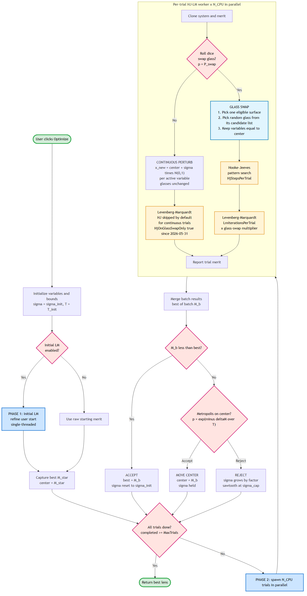

The HJ-LM atom (orange boxes in the parallel block above) is
where each trial actually does its work. Hooke-Jeeves is a
derivative-free pattern search that climbs gracefully across
discontinuities (vignetting, ray-trace failures, glass-boundary
jumps); LM is the workhorse damped-least-squares solver that
polishes the basin once HJ has dropped you into it. By default
HJ runs only on glass-swap trials (LM's damping handles smooth
continuous perturbations on its own) — flip
`HjOnGlassSwapOnly = false` in the engine settings to restore the
pre-1.0.115 always-HJ behaviour.

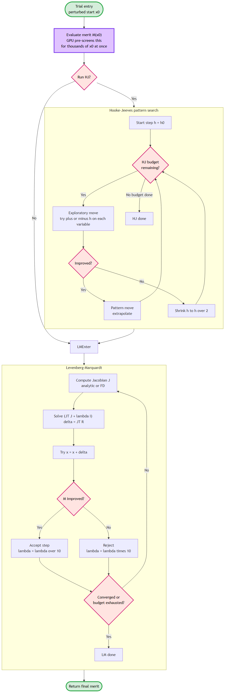

| Setting | Default | Meaning |
|---|---|---|
| **Trials** | 2000 | Hard cap on the number of LM optimizations. Stop earlier when satisfied. |
| **LM/Trial** | 4000 | Hard cap on LM iterations *inside* each trial. Per-trial wall-clock × Trials = total runtime budget. |
| **Init LM** | 4000 | One LM polish from the *current* design before the first random perturbation. Set to 0 to skip. |
| **Init Sigma** | 0.001 | Starting value of the Gaussian-perturbation scale (relative to each variable's natural scale). Sigma adapts during the run; 0.001 is sufficient even for very poor starts. |
| **Sigma Cap** | 0.5 | Upper bound on the adapted sigma. When sigma's reject-driven growth would exceed this, sigma resets to **Init Sigma** instead of being parked at the cap — the same sawtooth pattern Basin Hopping uses. |
| **HJ Steps** | 50 | Hooke-Jeeves probe steps per trial (derivative-free) before LM takes over. HJ is good at climbing out of merit-function discontinuities (vignetting, ray-trace failures, glass-boundary jumps) where LM gets trapped. Set 0 to disable. |
| **Init Damp** | 1e-3 | LM initial damping for every trial's per-trial LM run. Same meaning and default as the Local Optimizer's Init Damp. |
| **Glass Sub %** | 50 | Probability that a trial picks a fresh random glass for each substitution-eligible surface. 0 = never; 100 = every trial. The pool comes from the per-surface Glass Substitution Settings (each surface can draw from a different filtered catalog) — see [Glass Substitution During Optimization](glass-catalogs.md#glass-substitution-during-optimization). |
| **Constrained Only** | off | If on, only perturb variables that have `Min`/`Max` bounds. Useful when you want unbounded variables held fixed (e.g., a fixed-radius element). |
| **Broyden Update** | on | Same meaning as for Local LM. Leave on. |
| **Metropolis Acceptance** | on | When on, Multistart keeps a *current centre* state separate from *best* and may accept a worse-than-best trial as the next centre with probability `exp(−ΔM/T)` (T autotunes from early `|ΔM|` samples). Lets the search walk out of basins it has already mined. *Best* is always strict-improvement; the returned design is monotone. |

Multistart's strength is variability — it's the cheapest way to
sample several glass sets and several nearby basins with only modest
perturbations. With **Init Sigma = 0.001** it isn't designed to
flip a topology (a positive-power element won't become a
negative-power element); for that, raise Sigma toward the cap, or
use Basin Hopping.

**Aspheric coefficients are perturbed with a per-order natural
scale** rather than a single sigma applied uniformly. The natural
magnitude of an even-asphere term drops by *y²* per order
(A4 ≈ 10⁻⁶, A6 ≈ 10⁻⁹, A8 ≈ 10⁻¹², …) where *y* is the surface
semi-diameter, so a uniform sigma would kick A8 by orders of
magnitude more than its natural scale and produce NaN ray traces.
Multistart instead uses a per-coefficient reference scale of
`1e-3 / y^(2(k+1))` for the *k*-th term and applies sigma
relative to that scale. Bounded aspherics (both `Min` and `Max`
set) use the bound-width-relative scale shared with the other
bounded variables; unbounded aspherics use the per-order rule.
Either way the perturbation magnitude tracks the term's natural
scale and an unbounded aspheric is now an honest variable in
Multistart, not a hold-current placeholder.

### GPU pre-screen (Beta, new in 1.0.115)

Most random perturbations produce designs that are strictly
worse than the current best — running the full HJ-LM cycle on
them is wasted work. The **GPU pre-screen** filter, available
when LensHH-LT detects a CUDA-capable NVIDIA GPU, evaluates a
much larger candidate pool than `N_CPU` in a single GPU launch
(~60 µs per design on an RTX 4060), sorts by merit, and feeds
only the top survivors into the parallel HJ-LM workers.
Discarded candidates pay one merit evaluation each instead of
the 50–300 LM iterations a full trial would cost.

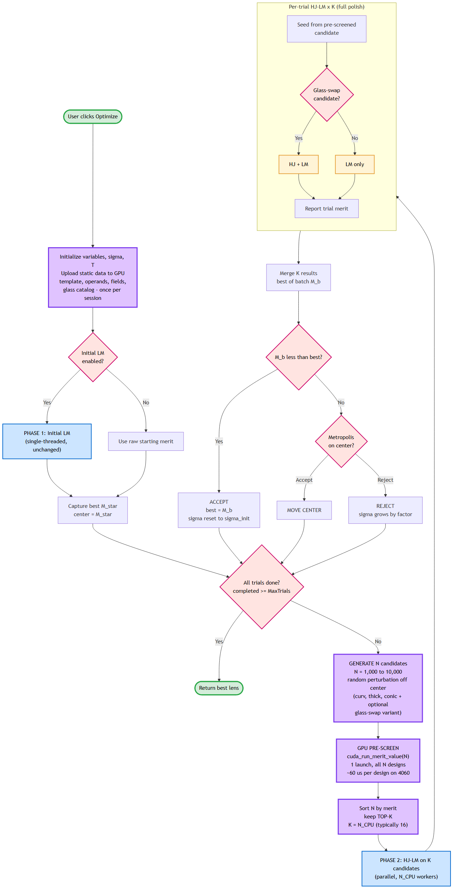

**How to enable.** In the Multistart dialog, look at the
**Hardware acceleration** strip at the top:

- If a CUDA device is detected, the **`Use GPU pre-screen (Beta)`**
  checkbox is enabled.
- If your design uses **aspheric, FieldY, or ConfigValue**
  variables, the checkbox is greyed out and the status line
  tells you which variable type is the blocker. The GPU kernel
  takes only curvature, thickness, and conic coefficients per
  design; aspheric-variable designs fall back to the CPU path
  with no UI surprises.
- With no compatible GPU, the checkbox is greyed out and the
  status line says so.

**What runs on the GPU.** Each Phase-2 batch generates
`16 × N_CPU` candidates (continuous perturbations and, when
glass substitution is on, single-surface glass swaps mixed in
the same launch). The whole-merit kernel computes the merit of
every candidate bit-equal to the CPU path; the top `N_CPU`
survivors go to HJ-LM polish exactly as in the non-GPU flow.
Acceptance / Metropolis / sigma schedule are unchanged.

**Performance.** On real production-class merits (Tanabe,
21-surface, 3 waves, 3 fields, 241 operands) the consumer-class
RTX 4060 delivers ~1.7× the raw merit-evaluation throughput of
a 16-thread laptop CPU. The pre-screen's *wall-clock* impact is
larger because most candidates would have failed HJ-LM anyway:
discarding them at ~60 µs each instead of running a 50–300-eval
HJ-LM cycle compounds the 1.7× hardware win into a far bigger
algorithm-level speedup. A100-class FP64 GPUs project to
~10–25× over the same CPU baseline.

**Result message telemetry.** When a run uses the GPU
pre-screen, the result line at the bottom of the dialog adds
`| GPU pre-screen: N candidates sieved across M batches`. When
glass substitution is on, it also reports how many of the
HJ-LM survivors were glass-swap candidates, so you can tell at
a glance that the sieve actually evaluated the glass-swap
variants alongside the continuous ones.

### Three Multistart cases on the same design

Sample files: `samples/CookeTripletMultiStartParallelPlate/` and
`samples/CookeTripletMultiStartOptimizationFixedGlass/`. The
target is the same Cooke triplet specification used in the Local
Optimization section (50 mm EFL, EPD 10, three fields, three
wavelengths). What changes case-to-case is the starting state and
whether glass substitution is on.

#### Case 1 — Parallel-plate start, glass substitution on

`PPP_TRIPLET_ANY_GLASS_UC.lhlt`. The starting design is three
flat plates separated by air gaps, all radii infinity, with the
default Schott triplet glasses (SK16 / F2 / SK16). All three
glass surfaces are flagged for substitution from the
**CoreSet28** filtered catalog.

| Before — three parallel plates | After — Multistart converged |
|---|---|
| 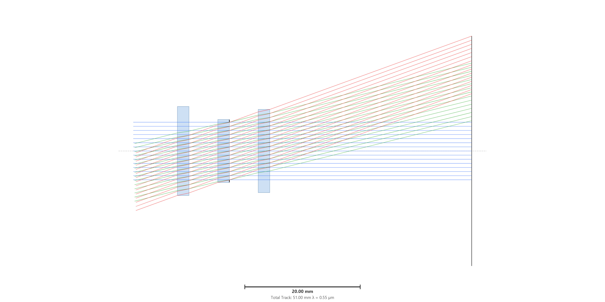 | 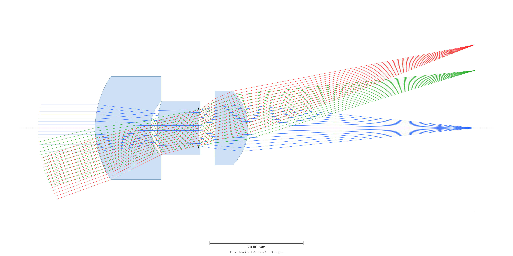 |

Settings — defaults except `Trials = 4000` (cancelled at 1232 of
4000), `Glass Sub % = 50`. The run was stopped manually after
1198 s when the merit had plateaued:

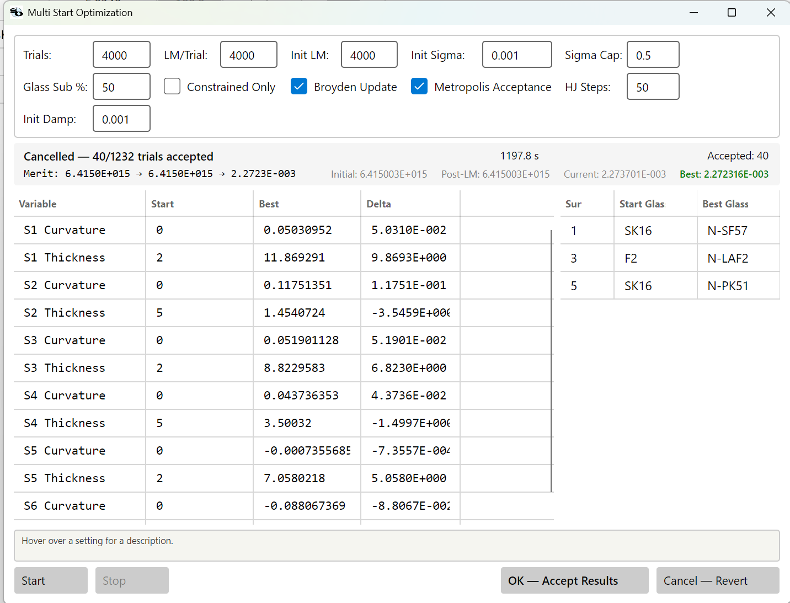

Result: merit `6.42 × 10¹⁵ → 2.27 × 10⁻³` in 20 minutes. 40 of
1232 trials were accepted. The substitution found a different
glass set than the starting Schott triplet:

| Surface | Start glass | Best glass |
|---|---|---|
| 1 | SK16 | N-SF57 |
| 3 | F2 | N-LAF2 |
| 5 | SK16 | N-PK51 |

#### Case 2 — Local-optimization result + Multistart, no glass substitution

`CookeTripletMultiStartOptimizationFixedGlass/CookeTriplet_UC_AfterMultiStart.lhlt`.
The starting state is the result of the Local Optimization case
(a) above (merit ≈ 7.87 × 10⁻³). Glass substitution is off; only
curvatures and thicknesses are perturbed.

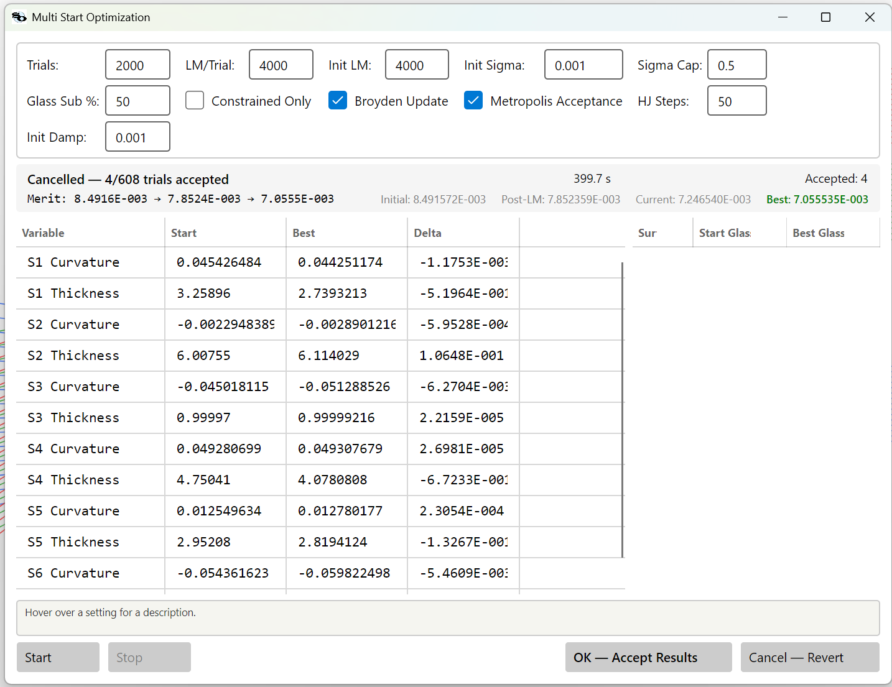

Result: merit `7.81 × 10⁻³ → 7.05 × 10⁻³` after 4108 attempted
trials in ≈ 6.7 minutes; only 4 trials were accepted. Multistart
found a slightly deeper basin (~10 % improvement) but the
acceptance rate (~0.1 %) is the headline: small Sigma
perturbations of an already-converged design rarely improve on it,
which is exactly what you'd expect.

| After — Multistart on fixed glasses | FFT MTF after |
|---|---|
| 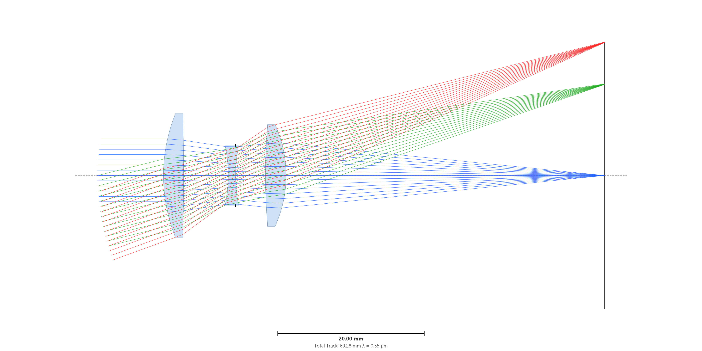 | 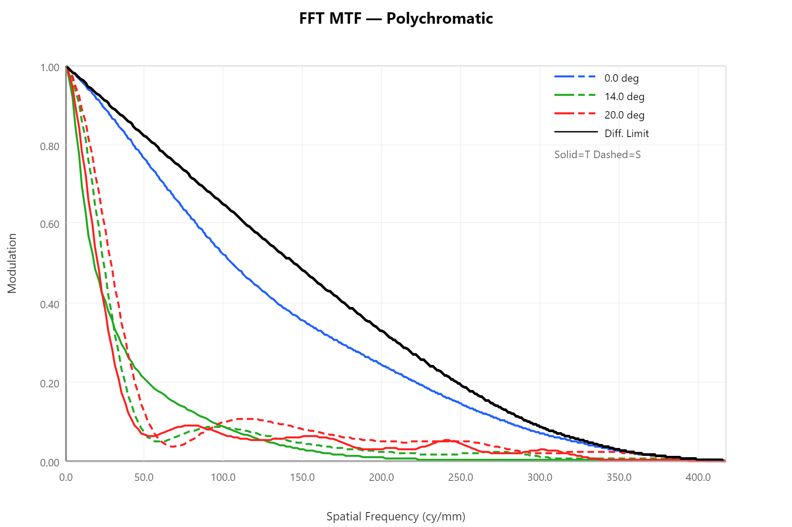 |

#### Case 3 — Local-optimization result + Multistart, glass substitution on (Sigma matters)

Same starting state as Case 2 but with substitution enabled on
S1 / S3 / S5 from CoreSet28. The story splits cleanly on
**Init Sigma**.

**At default Init Sigma = 0.001**: the design did not budge. Every
glass-swap trial that LM tried produced a worse-than-best post-LM
merit and got rejected; without an LM-driven perturbation big
enough to compensate for the index change, the design stayed
locked in its current basin. (A separate Basin Hopping run on the
same start with default Sigma = 0.001 + glass substitution behaved
the same way: 3 of 1997 hops accepted, merit `7.06e-3 → 7.05e-3`.)

**At Init Sigma = 0.01** (one decade larger):
`CookeTriplet_UC_AllowGlassSigma0p01.lhlt`. The design escaped:

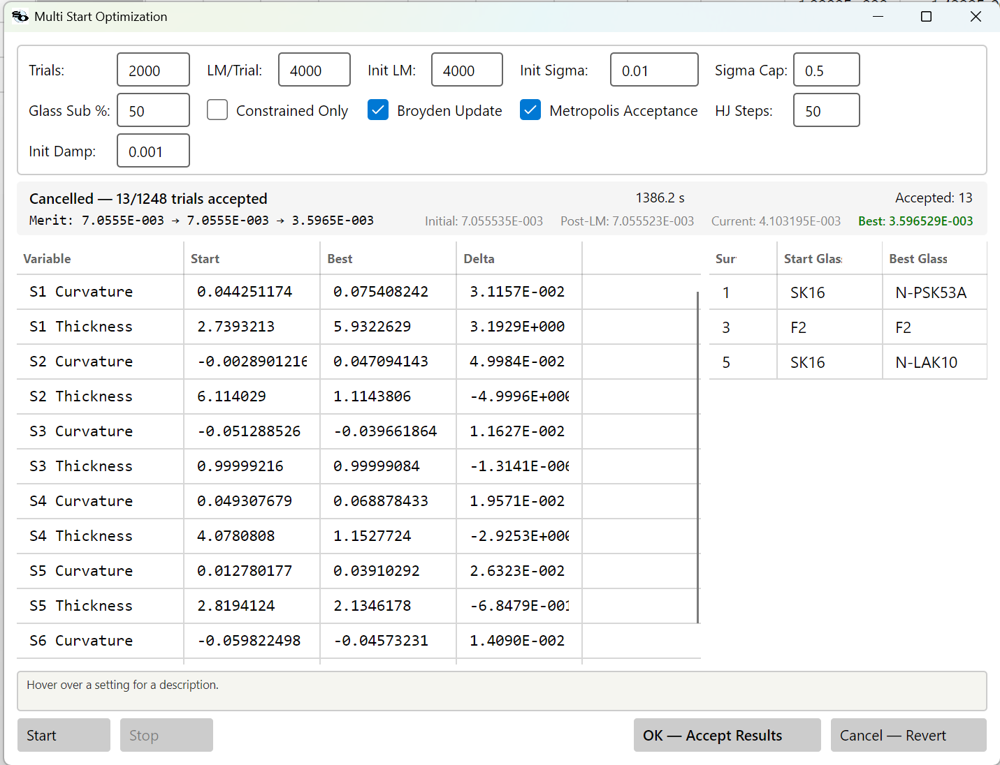

Result: merit `7.85e-3 → 3.95e-3` after 13 of 3248 trials accepted
(~23 min), with substitutions on S1 (SK16 → N-PSK53A) and S5
(SK16 → N-LAK10); F2 stayed on S3.

| Layout after Init Sigma = 0.01 | FFT MTF after Init Sigma = 0.01 |
|---|---|
| 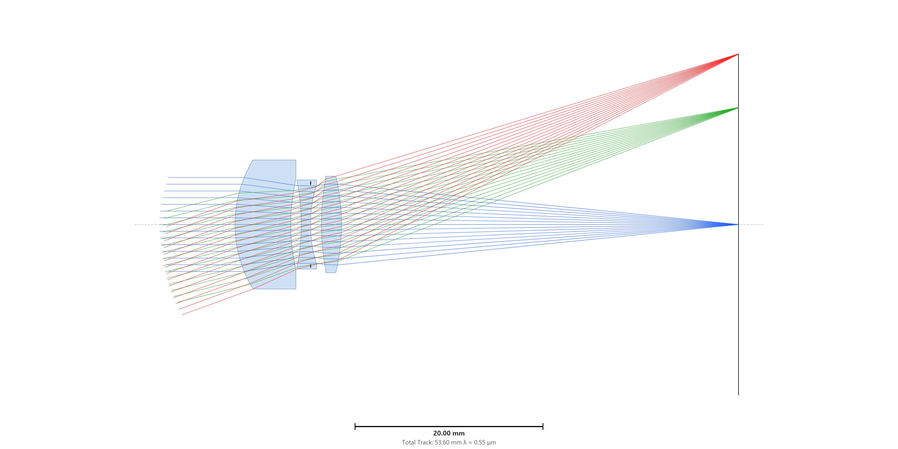 | 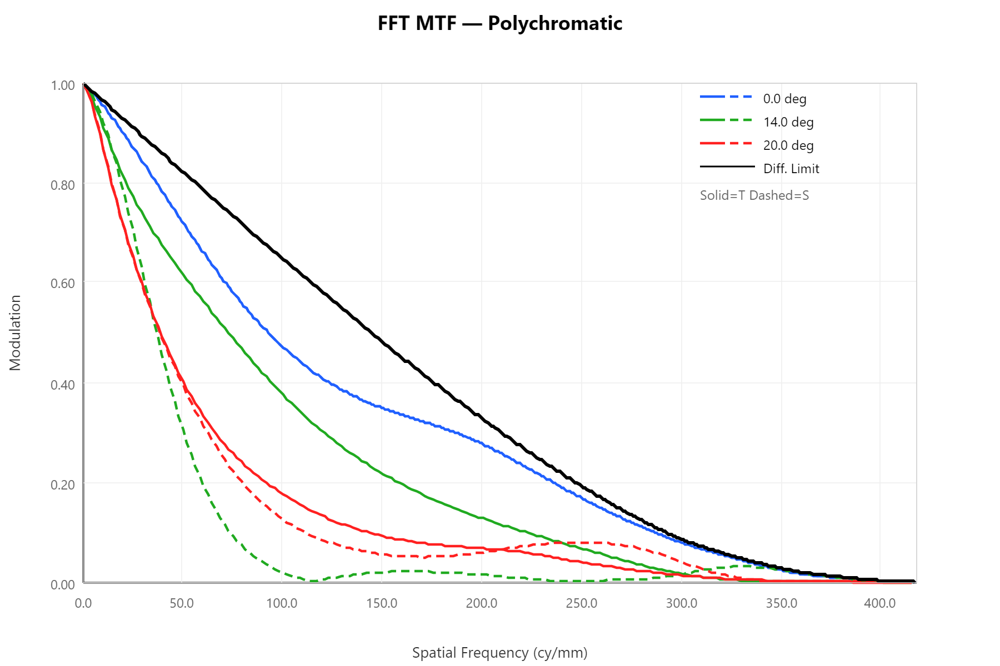 |

After this jump the run plateaued — a second pass found no
further improvement.

The takeaway from Cases 2 and 3 is concrete: once a design is at
the bottom of its basin, the *floor* of the kick distribution is
the only knob that matters for escape. Default Sigma 0.001 is
tuned for refining around a known-good point, not jumping
basins; raising Init Sigma by one decade (0.01) was enough to
unlock this design *and* give glass substitution room to
contribute. If 0.01 still locks, raise further (0.05–0.1) before
deciding the design is converged for the chosen topology.

## Basin Hopping (HJ + LM)

**Optimization → Basin Hopping HJ+LM…**

The most exploratory of the three. Each *hop* runs:

1. **Random perturbation.** Every variable gets a Gaussian kick of
   standard deviation `Sigma × variable_scale`. This pulls the
   design into a fresh starting point.
2. **Hooke-Jeeves pattern search.** A derivative-free local search
   that works on the merit value alone. Steps along axes; expands
   the step on every successful direction; contracts only when no
   axis helps. Cheap and oblivious to local Jacobian smoothness —
   it's good at climbing out of shallow ridges that fool LM.
3. **LM refinement.** Up to `LM/Hop` Levenberg-Marquardt iterations
   to land at the bottom of whatever basin HJ found.
4. **Accept/reject.** If the post-LM merit improves on the previous
   best, the hop is accepted and becomes the new starting point;
   otherwise the design reverts and the next hop perturbs from the
   best-so-far.

Optionally, every hop also swaps glasses on user-selected
substitution-eligible surfaces, drawing from a filtered catalog.
Glass swaps and continuous-variable hops cooperate: a swap that
gets accepted often stays in the design while later hops fine-tune
curvatures and thicknesses around it.

| Setting | Default | Meaning |
|---|---|---|
| **Hops** | 20 | Outer loop count. Typical exploratory runs: 50–200. Long overnight runs: 500–1000. |
| **LM / Hop** | 4000 | Max LM iterations per hop. Reduce to 200–500 for cheaper hops if you'd rather trade refinement depth for breadth. |
| **HJ Steps** | 30 | Maximum Hooke-Jeeves steps per hop before handing off to LM. 30 is balanced; 0 disables HJ entirely. |
| **Sigma** | 0.001 | *Starting* value of the Gaussian-perturbation scale. Sigma is adapted automatically during the run (see below). 0.001 is sufficient even for severe starts; you rarely need to raise it. |
| **Seed** | 1234 | RNG seed. Change it to get a different random trajectory while keeping all other knobs identical — useful for confirming a result isn't a fluke. |
| **Broyden Update** | on | Same as Local LM. |
| **Only randomize constrained variables** | off | Limit perturbation to bounded variables. Useful for surgical exploration when most variables are already where you want them. |
| **Glass Substitution** | off | Enable glass swaps. Pick the source from the **Glass Source** dropdown — filtered catalogs (small curated lists, cheap) or one of the loaded full catalogs (broad exploration, slower). |
| **Glass Source** | first filtered catalog | Pool used when Glass Substitution is on. Filtered catalogs in `<install>/catalogs/Filtered/` are typically 30–100 glasses curated by status, manufacturer, refractive-index range, etc. See [Glass Catalogs](glass-catalogs.md). |

**Sigma adapts during the run.** The value you enter in the dialog
is just the starting value; the optimizer grows or resets it
between hops based on what's working:

- **On reject:** sigma is multiplied by 1.5. After a few consecutive
  rejections the per-hop kick has grown enough to push the design
  hard enough to cross into a different basin.
- **On accept:** sigma is reset to its starting value. A new
  minimum means the local region is fertile, so the next kick should
  be a *small* fine-tuning perturbation — not the inflated value
  left over from a recent rejection streak.
- **At the 2.0 cap:** if sigma's geometric growth would push it past
  2.0 (a ~200 % relative kick), it is reset to the starting value
  instead of being parked at the cap. Without this, rejected hops
  near the cap fire huge perturbations that LM can't recover from
  in one hop's iteration budget — basin hopping gets stuck firing
  catastrophic kicks forever. The reset gives a clean small-kick
  restart and lets the optimizer climb back up via the 1.5×
  reject-growth ladder.

This adaptation is why setting `Sigma` very high rarely helps: the
optimizer escalates on its own when it needs to explore, and
collapses back to small steps the moment it lands in a productive
basin. The reset-on-accept also means you cannot reproduce a
previous run's *trajectory* by changing Sigma — only the starting
size of the first hop's kick is yours to set.

**Aspheric coefficients are never randomly perturbed by Sigma in
Basin Hopping.** Aspheric terms span many orders of magnitude
(A4 ≈ 10⁻⁶, A6 ≈ 10⁻⁹, A8 ≈ 10⁻¹²) and Basin Hopping skips them
unconditionally in the per-hop Gaussian kick. They are still
moved by Hooke-Jeeves pattern search and by the per-hop LM, just
not by the outer perturbation that drives basin-to-basin jumps.
If you want aspherics nudged across basins, run Multistart — its
per-order kick rule scales each coefficient by its natural
magnitude (`1e-3 / y^(2(k+1))` for the *k*-th term).

**Glass-substitution scope is determined by variables, not by an
opt-in flag.** Multistart and Basin Hopping use very different
substitution mechanics:

- *Multistart* reads the per-surface table you populate in the
  GUI's Glass Substitution dialog. Each surface has its own
  `Substitute` checkbox and its own `CatalogName` — different
  surfaces can draw from different catalogs. See [Glass Substitution
  During Optimization](glass-catalogs.md#glass-substitution-during-optimization).
- *Basin Hopping* doesn't use that table at all. The **Glass
  Source** dropdown in the BH dialog selects **one** filtered
  catalog and supplies every eligible glass element in the system.
  There is no per-surface flag.

A glass element is "eligible" only if it has at least one
*element-local* variable — i.e., a variable the optimizer can move
to compensate for an index swap:

| Variable on… | Lights up the element? |
|---|---|
| Front-face (S_i) curvature | Yes |
| Front-face thickness (= glass thickness) | Yes |
| Front-face conic / aspheric coefficient | Yes |
| Back-face (S_(i+1)) curvature | Yes |
| Back-face conic / aspheric coefficient | Yes |
| Back-face thickness (= air gap *after* the element) | **No** |

The last row is the subtle one: a variable air gap after a glass
element lets the optimizer move the *next* element axially, but
can't reshape *this* glass — so swapping its index would land in a
basin LM has no degrees of freedom to climb out of. Such elements
are quietly skipped, with a log line at run start:

```
Glass source: S1_GLASS (28 glasses)
Substitution-eligible elements: 2 of 3 (1 fixed glass has no active variable — not eligible)
```

If you intended an element to participate but it's reported skipped,
mark a curvature, conic, or glass-thickness variable on one of its
faces.

### Case study: parallel plates → Cooke triplet

This is about as demanding a starting point as the program is asked
to handle: three *parallel plates* — every radius infinity, no
optical power — that need to become a converged, real-glass triplet.

Sample files:
`samples/CookeTripletBasinHoppingParallelPlate/`. The starting
prescription is three flat plates separated by air gaps, EFL
target 50 mm, EPD 10, three fields (0°/14°/20°) and three
wavelengths (0.48/0.55/0.65 µm). Every curvature and every
thickness is variable, with bounds `[1, 25]` mm on glass and
`[0.1, 100]` mm on air. The merit function carries `EFL = 50`
(weight 100), `WAVEX` (weight 1, 6 × 12 quadrature), `EG ≥ 1` mm,
`EA ≥ 0.1` mm, and `CTG`/`CTA` thickness bounds. Glass
substitution is enabled on all three glass surfaces, drawing from
the **CoreSet28** filtered catalog (28 glasses).

| Before — three parallel plates, no power | After — basin-hopping result |
|---|---|
|  | 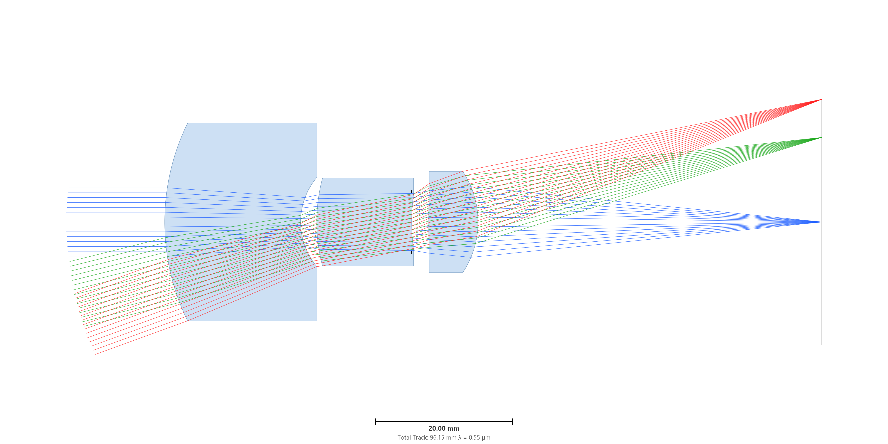 |

Settings: defaults except `Hops = 2000`, `Glass Substitution = on`,
`Glass Source = CoreSet28`. The run was cancelled manually at hop
475 of 2000 once the merit had clearly plateaued:

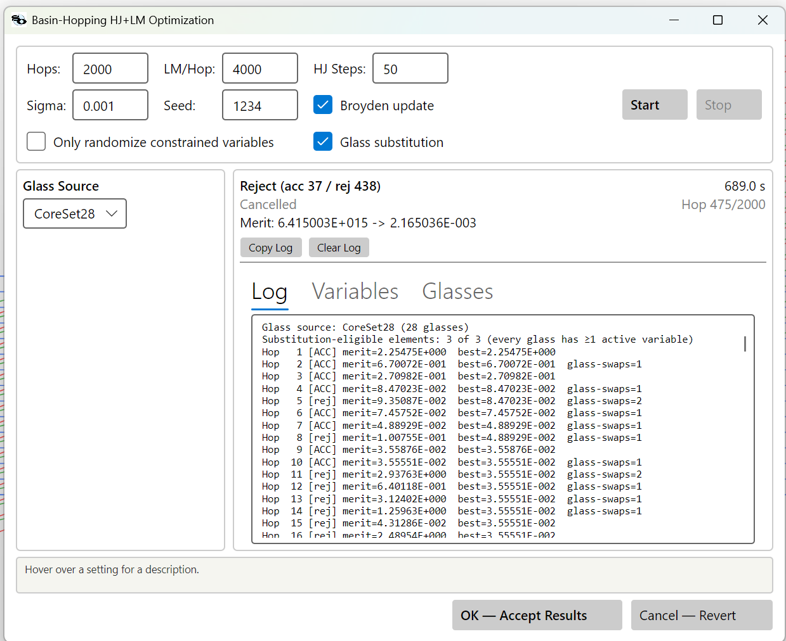

Result: merit dropped from `6.42 × 10¹⁵` to `2.17 × 10⁻³` in
**689.5 s (≈ 11.5 min)**. The log records 37 accepted hops, 438
rejected, and 13 glass-surface swaps across the accepted hops.
The merit trajectory of the accepted hops tells the story:

| Hop | Accepted merit | Wall-clock | Note |
|---:|---:|---:|---|
| 1 | 2.255 | < 1 s | Hop 1's LM run alone takes the merit from 10¹⁵ → ~2. The bulk of this is the EFL=50 target and the EA bound forcing curvature on the plates. |
| 2 | 0.670 | — | First glass swap that paid off. |
| 4 | 0.0847 | — | Cooke-like topology essentially settled. |
| 7 | 0.0489 | — | Glass swap, triplet basin recognized. |
| 10 | 0.0356 | — | Local refinement inside the triplet basin. |
| 36 | 0.0246 | — | **Plateau breaks** after a 25-hop rejection streak (hops 11–35 with merit excursions up to 10⁵ that LM couldn't recover from). |
| 46 | 0.00386 | ~ 50 s | Crossed 1 × 10⁻² and dropped a further 6× — most of the headline merit reduction is done. |
| 64 | 0.00308 | — | LM refinement inside the basin. |
| 200 | 0.00302 | — | Long quasi-plateau — many improving hops worth ≤ 1%. |
| 239 | 0.00264 | — | Glass swap unblocks another step down. |
| 320 | 0.00232 | — | Glass swap, ~13% gain. |
| 364 | 0.00216 | — | Glass swap, final-tier basin. |
| 384 | 0.002165 | — | Final best. |
| 475 | — | 689.5 s | Run cancelled: no improvement in the 91 hops since 384. |

Three useful observations:

- **Hop 1 + the first ~50 seconds do the headline work.** Hops 1
  through 46 take the merit from `10¹⁵ → 3.86 × 10⁻³` — a 17-order
  improvement that fits in less than a minute on this hardware.
  That's not basin hopping — it's the per-hop LM run starting from
  variables that all have analytic gradients toward the EFL target
  and the thickness bounds. Basin hopping's actual contribution
  shows up in the long tail (0.0386 → 0.00216, a further ~18×
  refinement over the next 11 minutes) and in *getting out of
  plateaus*.
- **The hop-11 → hop-35 rejection streak is exactly why Basin
  Hopping exists.** A pure Local optimizer at hop 10 would have
  stopped at merit `0.0356` and reported convergence. The
  Sigma-driven random kicks fired huge merit excursions
  (10⁰ to 10⁵) for 25 consecutive hops before one finally landed
  in a basin LM could descend into — and that basin (hop 36, merit
  `0.0246`) unblocked the rapid drop to 10⁻³.
- **Sigma = 0.001 was sufficient *for this start*.** Even with a
  small per-hop kick, the LM refinement that follows amplifies it
  across 4000 iterations into large effective displacements. The
  log shows occasional huge spikes (merit > 10⁴) where LM didn't
  recover from a perturbation — those naturally get rejected. The
  default Sigma is right whenever the per-hop LM has an obvious
  gradient direction to follow (like the EFL target here);
  it is *not* sufficient when starting from an already-converged
  design with no obvious next step (see the Multistart Case 3
  story above for that scenario).

The converged design is a recognizable Cooke triplet — positive
front, negative middle around the stop, positive rear — built
from glasses chosen by the substitution step rather than
user-specified.

| Spot | FFT MTF |
|---|---|
| 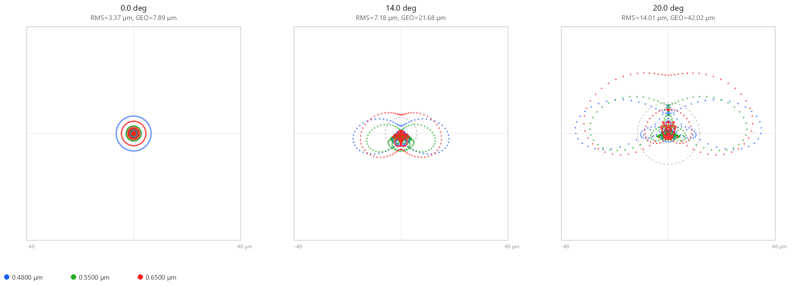 | 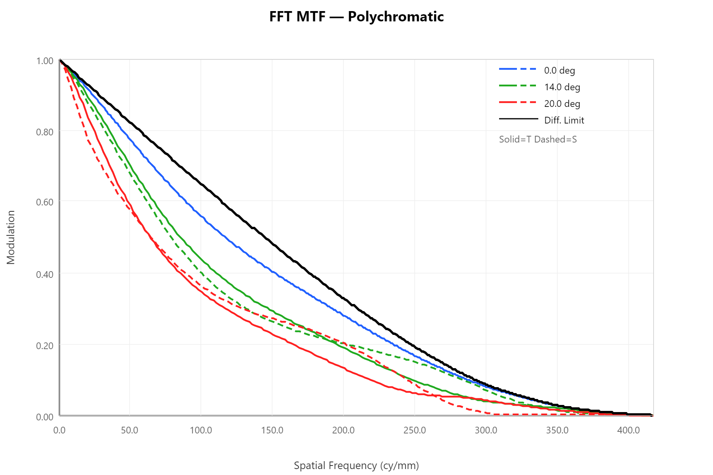 |

After basin hopping, the standard finish is a Local LM pass for
the last few percent.

### Reading the log

The basin-hopping dialog prints one line per hop:

```
Hop  14 [ACC] merit=4.87551E-002  best=4.87551E-002  glass-swaps=1
Hop  15 [rej] merit=5.37427E-002  best=4.87551E-002
```

`[ACC]` means the post-LM merit beat the previous best. `glass-swaps=N`
shows how many glass surfaces were re-randomized for that hop (0 if
omitted). When a hop's `merit` is dramatically larger than `best`
(e.g., 10⁴ or 10⁵), the perturbation pushed the design into a
non-tracing or otherwise broken state and LM couldn't recover —
those hops just get rejected.

Watch for two patterns:

- **Quick early plunge, long tail.** Like the case study: 99 % of
  the gain in the first 10–20 hops, then slow refinement. Normal.
- **Long flat plateau.** Best merit unchanged for many tens of
  hops. Either you're at the global optimum for the chosen
  topology, or you need a larger Sigma / more variables / a glass
  substitution pool.

When the plateau persists for 50–100 hops with no improvement,
stopping is usually the right call.

## Split Element

**Optimization → Split Element**

Adds a degree of freedom to a converged design by splitting a
glass element into two thinner elements with a small air gap
between them. The motivation is the same one that turned the
classical Cooke triplet into a four-element Tessar: at some
point the existing surface count runs out of correction power
and the only path forward is more surfaces. Multistart and
Basin Hopping can move the design around in the space it has;
Split Element grows the space.

A run does five things in order:

1. **Pick an element.** Each element gets an aberration score
   from the sum of `|S1| + |S2| + |S3|` (spherical + coma +
   astigmatism Seidel coefficients) across its two surfaces; the
   highest scorer is the candidate. The log line `Selected:
   surface 5 (N-PSK53A), aberration score: 0.27` reports the
   chosen element by its front surface and material.
2. **Insert the new surface.** The element is split into a
   front-glass + air-gap + back-glass triple, sized so the
   geometry initially preserves the parent's optical effect.
   Merit jumps temporarily because the merit function now has
   two more thickness operands and the new airspace adds an
   `EA` row.
3. **Pre-glass Multistart** (with the *original* glass on both
   halves of the split). Continuous variables only. Walks the
   merit down to whatever the new geometry can do without
   changing materials.
4. **Glass trials.** Enumerates pairs of glasses from the
   selected filtered catalog and runs a short LM on each pair.
   The capped count (`Glass Trials`) sets the budget; the actual
   number can be smaller after the catalog filters out
   incompatible pairs (the run below tried 202 of 300).
5. **Post-glass Multistart** (with the best pair from step 4)
   refines around the new material choice.

Both Multistart phases auto-advance after a configurable idle
window (`Skip phase if no improvement for (s)` — default 600 s)
so a stuck phase doesn't block the run.

| Setting | Default | Meaning |
|---|---|---|
| **Max Splits** | 1 | Number of split passes. Each pass picks the highest-aberration surface from the *current* state and splits it. |
| **Glass Trials** | 300 | Cap on glass-pair combinations tried in the glass-trial phase. Actual count may be lower after catalog-pair filtering. |
| **LM/Trial** | 4000 | Per-trial LM iterations during glass trials. |
| **Pre-Glass MS** | 4000 | Multistart trials before glass swaps. |
| **Post-Glass MS** | 2500 | Multistart trials after the best glass pair is locked in. |
| **Post LM** | 4000 | Final LM iteration cap after both Multistart phases. |
| **MS Sigma** | 0.001 | Init Sigma for both Multistart phases. Same sawtooth-on-cap behavior as the standalone Multistart. |
| **Min Glass / Max Glass** | 1 / 25 mm | Centre-thickness bounds enforced on the split's glass halves. |
| **Min Air / Max Air** | 0.1 / 25 mm | Bounds on the new air gap between the split halves. |
| **Min Edge** | 0.5 mm | Minimum edge thickness on the split element. |
| **Skip phase if no improvement for (s)** | 600 | Idle window before a Multistart phase auto-advances. |
| **Constrained only** | off | Per-Multistart-phase setting; restricts perturbation to bounded variables. |
| **Reject if worse** | on | If the post-pass merit is worse than the pre-split merit, the original geometry is restored. The merit usually improves substantially, but this is the safety net. |
| **Glass Source** | first filtered catalog | Filtered catalog supplying glass-pair candidates. Cherry-picked or criteria-built — see [Glass Catalogs](glass-catalogs.md). |

### Case study: post-Multistart Cooke triplet → split element

Sample files: `samples/CookeTripletSplit/`. The starting state
is a Cooke triplet that was first synthesized from three parallel
plates (finite conjugate, 500 mm working distance) by Multistart
with glass substitution. By the time Split Element runs, the
design is already at merit `2.19 × 10⁻³` and Local LM finds no
further improvement.

| Before — converged Cooke triplet | After — split rear element |
|---|---|
| 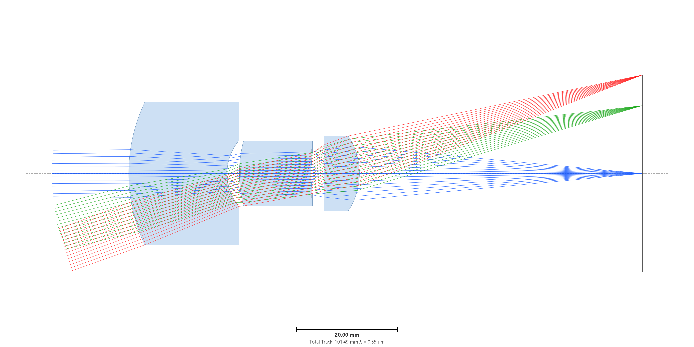 | 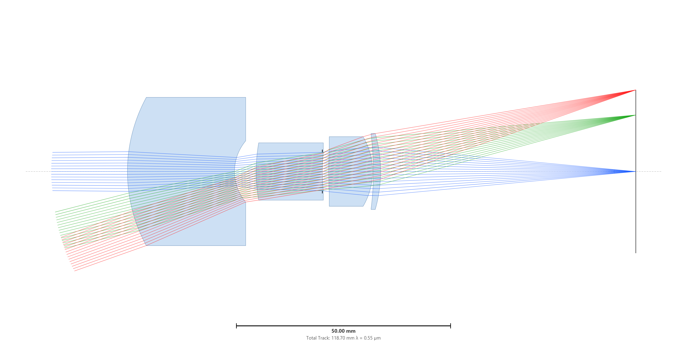 |

Settings: defaults except `Glass Source = CoreSet28`. The dialog
on completion:

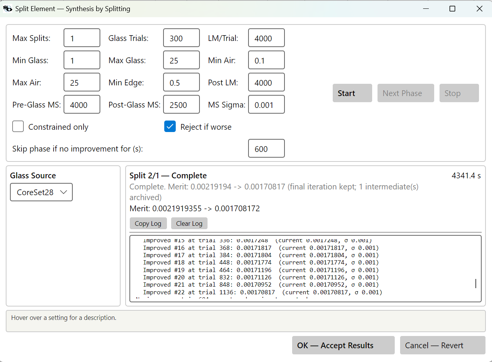

The trajectory from the log:

| Phase | Merit | Note |
|---|---:|---|
| Start | 0.00219 | Converged Cooke triplet input. |
| Surface picked | — | Surface 5 (N-PSK53A), aberration score 0.27. |
| After insertion | 41.4 | Merit spikes — new operands and a 3-into-3 element split with the original glass on both halves. |
| Pre-glass MS, trial 16 | 0.0131 | Continuous variables alone recover most of the geometry. |
| Pre-glass MS, trial 704 | 0.00193 | 39 improvements; auto-advances after 610 s idle. |
| Glass trials, trial 124 | 0.00188 | Best pair: **N-FK58 + N-LAK10**. Tried 202 of 300 generated combinations. |
| Post-glass MS, trial 1136 | 0.00171 | 22 further improvements; auto-advances after 604 s idle. |
| **Final** | **0.00171** | Total wall-clock 4341 s (≈ 72 min). |

Net: merit `0.00219 → 0.00171` (~22 % reduction). Total track
grew from 101.5 mm to 118.7 mm. The headline gain is modest
*relative* to what Multistart and Basin Hopping had already done,
but it's gain you cannot get without adding the surface — the
input was the floor of its own basin.

| Spot before | Spot after |
|---|---|
| 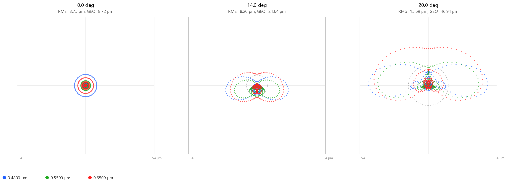 | 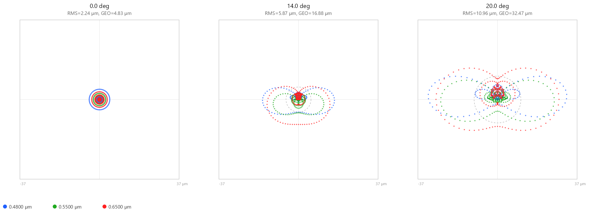 |

| FFT MTF before | FFT MTF after |
|---|---|
| 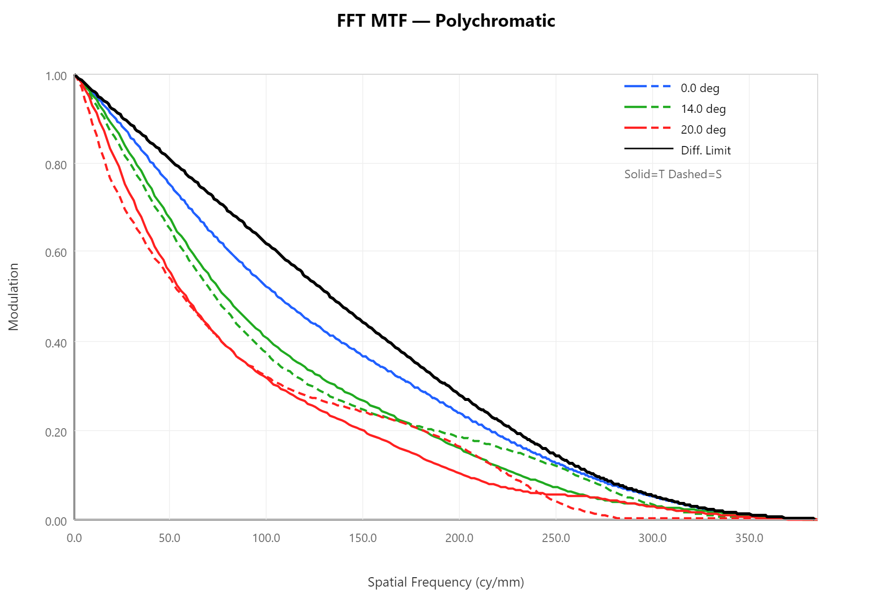 | 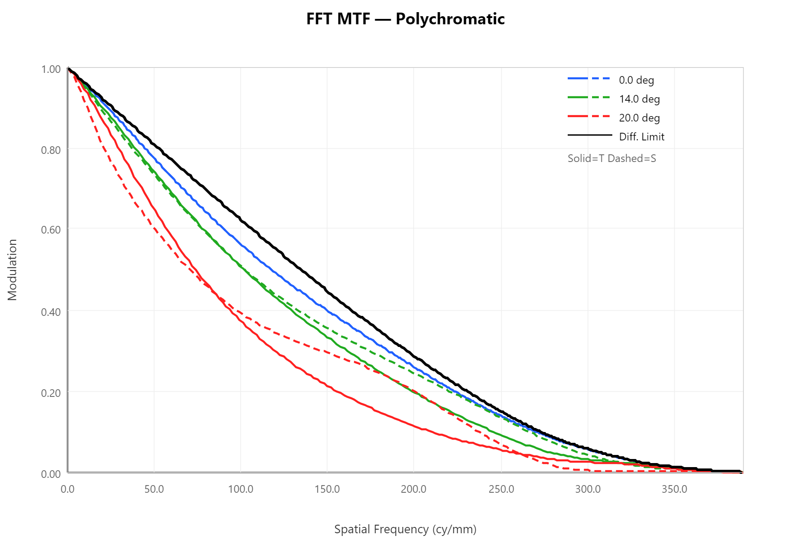 |

When to reach for Split Element:

- After Multistart / Basin Hopping have plateaued and Local LM
  finds no further improvement on the *current* topology.
- When the merit shows a clear residual aberration concentrated
  on one element. The aberration scorer ranks all elements by
  their summed `|S1|+|S2|+|S3|` and picks the top one; you can
  see its choice in the log on every run.
- When the design budget tolerates one more lens element — Split
  Element strictly *adds* a surface, never collapses one back.

What it isn't:

- A topology search. Split Element only refines around an
  existing topology by adding one surface at a time. To go from
  a doublet to a triplet, you'd run Split twice on different
  surfaces; to go from parallel plates to a Cooke triplet, run
  Multistart or Basin Hopping with glass substitution first.

## Search Best Asphere Surface

**Optimization → Search Best Asphere Surface…**

Different way to add a degree of freedom: instead of inserting a
new surface (Split Element), pick existing surfaces and turn them
into even-aspheres. The dialog enumerates every glass surface,
runs a short LM trial with that surface aspherized, ranks the
surfaces by post-trial merit, applies the top-N changes
permanently, and finishes with one final LM polish.

A run does four things in order:

1. **Enumerate candidate surfaces.** Every glass surface is a
   candidate (the log line `Candidate surfaces: 4 (1, 3, 5, 7)`
   reports them).
2. **Per-surface trial.** For each candidate, the surface is
   converted to Even Asphere with the selected coefficients (A4,
   A6, A8) marked variable, then `LM/Trial` LM iterations run.
   The post-trial merit and Δ % vs the starting merit are
   recorded; after each trial the surface is reverted.
3. **Apply top N.** Trials are ranked by post-trial merit and
   the top `Top N` are applied permanently — those surfaces stay
   as Even Asphere with the LM-optimized coefficients.
4. **Final LM polish** (`Final LM` iterations) runs on the
   composite design (now with N aspheric surfaces simultaneously
   variable) to pick up the cross-coupling gain.

| Setting | Default | Meaning |
|---|---|---|
| **A4 / A6 / A8** | all on | Which even-asphere coefficients to mark variable on each trial. Higher orders give finer correction but slower convergence and tighter manufacturability requirements. |
| **Top N** | 3 | How many of the ranked candidate surfaces to apply after the trial sweep. 1 = single best, larger N = composite improvement at the cost of more aspheric surfaces in the final design. |
| **LM/Trial** | 4000 | LM iterations per per-surface trial. Default is more than enough for most designs; reduce only if the candidate count × trial cost is excessive. |
| **Final LM** | 4000 | LM iterations for the post-application polish across all newly aspheric surfaces. |
| **Min Δ %** | 1 | Minimum trial improvement (over the starting merit) required to consider a candidate surface. Trials below this are still listed in the table but the picker skips them when applying. |
| **Reject if worse** | on | If the post-final-LM merit is worse than the pre-search merit, the original geometry is restored. |

### Case study: post-Split Cooke triplet → 3 aspheric surfaces

Sample files: `samples/CookeTripletSearchAsphericSurfaces/`. The
starting state is the result of the Split Element case study
above (merit `0.001708`).

Settings — defaults: A4/A6/A8 all on, Top N = 3, LM/Trial = 4000,
Final LM = 4000, Min Δ % = 1, Reject if worse on.

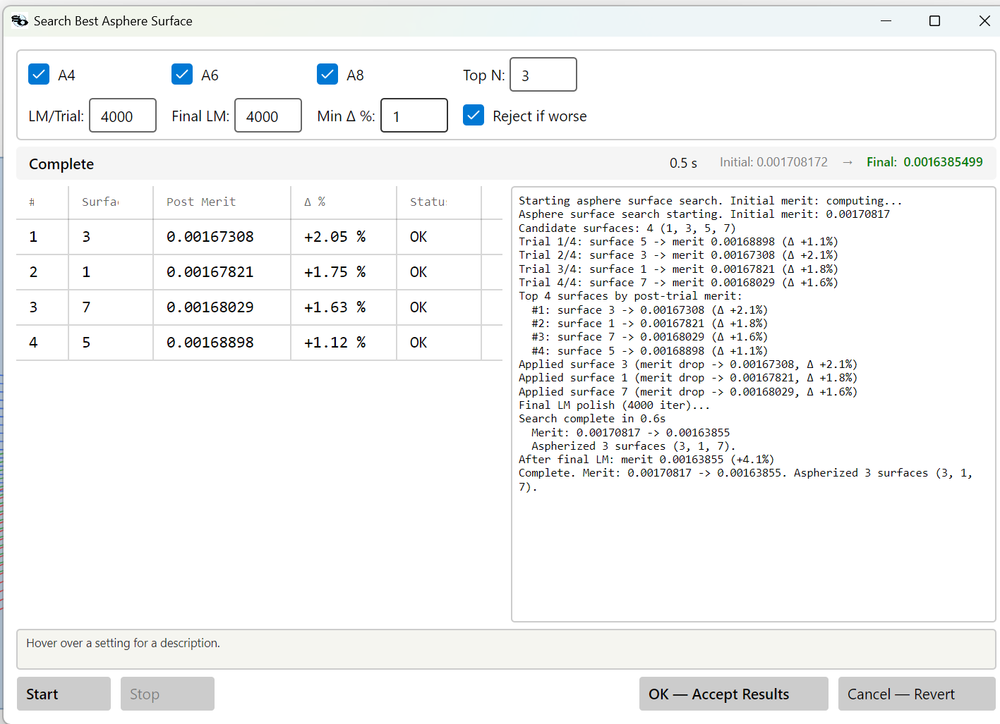

The trial sweep took 0.6 s (every per-surface LM is fast on this
system). Trial results, ranked:

| # | Surface | Post-trial merit | Δ % |
|---|---:|---:|---:|
| 1 | 3 | 0.001673 | +2.05 % |
| 2 | 1 | 0.001678 | +1.75 % |
| 3 | 7 | 0.001680 | +1.63 % |
| 4 | 5 | 0.001689 | +1.12 % |

With **Top N = 3**, surfaces 3, 1, and 7 were aspherized; surface
5 was kept spherical despite being a viable candidate. The final
LM polish across the three new aspheric surfaces took the merit
the rest of the way: `0.001708 → 0.001639` (+4.1 %).

Net: merit `0.001708 → 0.001639` (~4 % reduction) in under a
second of compute, at the cost of three aspheric surfaces.

| FFT MTF after asphere search | Spot after asphere search |
|---|---|
| 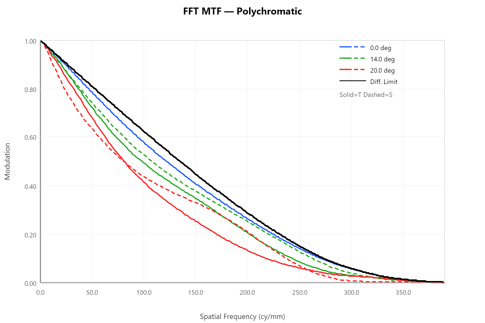 | 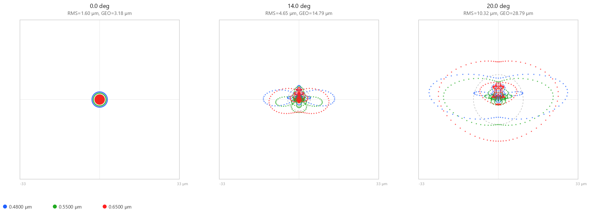 |

Two practical notes:

- **The composite gain (Top N > 1) usually beats the
  best-single-surface gain.** In this run the best single trial
  was +2.1 % on surface 3, but applying surfaces 3 + 1 + 7
  together and re-polishing gave +4.1 %. The cross-coupling is
  free — it costs the same final-LM pass either way.
- **Aspheric surfaces are not free in fabrication.** Each one
  added is a real cost in the production lens. If you're
  prototyping or budget-constrained, set Top N = 1; if you're
  exploring the limits of the design, leave it at 3 and decide
  per-surface afterward whether to keep the change.

#### Follow-on: Multistart on the aspherized design

The asphere search's final-LM polish only finds the local
optimum around the *initial* aspheric coefficients. Multistart
with the new aspheric variables in play kicks them across basins
using the per-order scale rule (`1e-3 / y^(2(k+1))`); for an
already-aspherized design this routinely finds another factor of
1.2–1.5× of merit reduction.

Sample file:
`samples/CookeTripletSearchAsphericSurfaces/PPP_TRIPLET_ANY_GLASS_UC_T1_AfterSplit_AfterAshpere_MultiStart.lhlt`.
Settings — defaults except `Glass Sub % = 50` (substitution still
on, surfaces 1 / 3 / 5 / 7 eligible); the run was cancelled
manually after a long plateau.

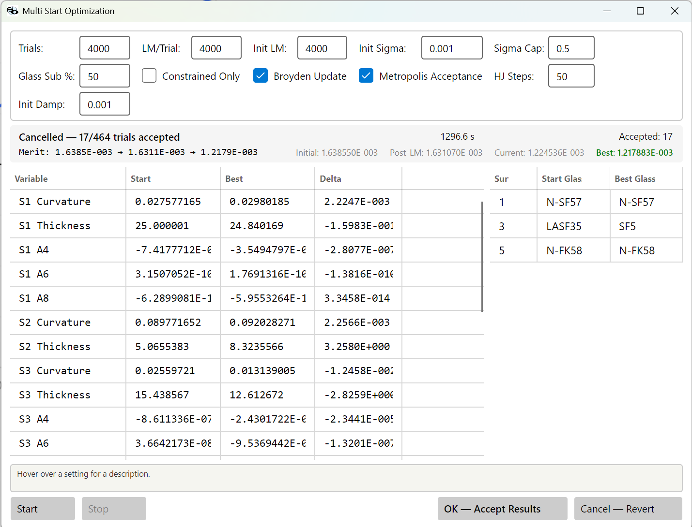

Result: merit `1.638 × 10⁻³ → 1.228 × 10⁻³` after 17 of 7464
trials accepted in ≈ 21.6 min. One glass swap was kept (S3:
`LASF35 → SF5`); S1 and S5/7 stayed put. All three previously-
aspherized surfaces (1, 3, 7) had their A4 / A6 / A8 coefficients
revisited by the per-order kick rule; their final values appear
in the Lens Editor:

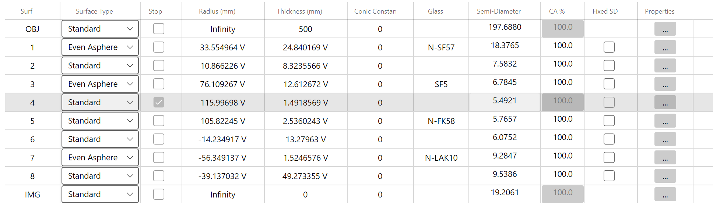

| Layout after asphere + Multistart | FFT MTF after asphere + Multistart |
|---|---|
| 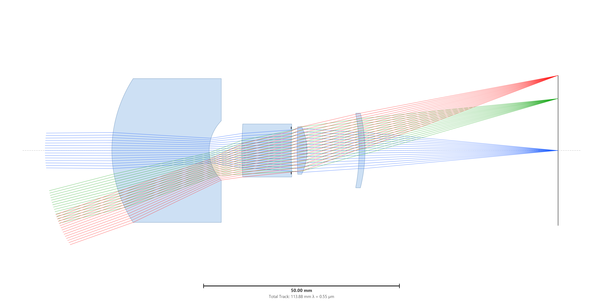 | 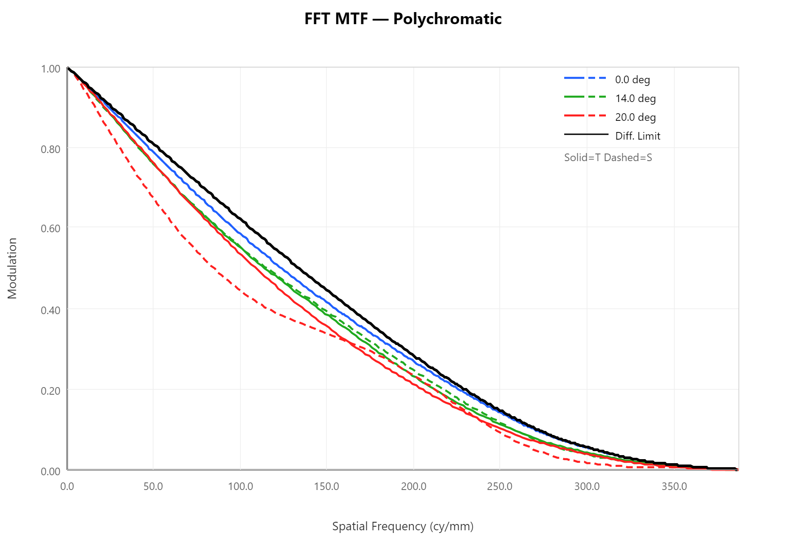 |

Net: a further ~25 % reduction (`1.638e-3 → 1.228e-3`) on top of
the asphere-search gain, taking the cumulative chain
*parallel-plates → Multistart → Split → Asphere search →
Multistart* to merit `1.228 × 10⁻³` from a starting `6.4 × 10¹⁵`.
The headline observation is the same one Multistart Case 3
made earlier: small-Sigma kicks of an already-converged design
rarely escape the basin — but on aspheric surfaces, where the
per-order scale rule produces small but well-conditioned
perturbations, the acceptance rate is enough to chip away at
the merit even when curvature/thickness alone wouldn't.

## SPC (Synthesis by Saddle-Point Construction)

**Optimization → Synthesis by SPC…**

A topology generator. SPC grows a design one element at a time
by finding *saddle points* in merit-vs-curvature space and
branching off them — perturbing the saddle in either direction
spawns two distinct local minima, and the better of each pair
becomes the seed for the next round. Where Multistart and Basin
Hopping shuffle parameters within an existing topology and Split
Element grows a topology by one surface per call, SPC is the only
tool in the box that can grow a design from a single lens to an
arbitrary multi-element topology in one run.

The method follows Hou et al., *Optics Express* 24, 21 (2016).

A run does five things per **level** (one new element added per level):

1. **Pick insertion positions.** Every air gap in every surviving
   parent design is a candidate. The **Insert side** dropdown can
   restrict to pre-stop only (objective-style) or post-stop only
   (eyepiece-style); default is both sides.
2. **Insert a near-zero null element.** A glass element that is
   optically inert (front and rear curvatures equal, infinitesimal
   thickness) is dropped into the air gap. The merit jumps because
   the bootstrap penalty grows the null element to a real thickness.
3. **Scan curvature for saddles.** The shared front+rear curvature
   is swept across `[Scan c-min, Scan c-max]` in `Steps` samples.
   Saddle points — where the merit's first derivative changes sign
   non-monotonically — become the branch seeds.
4. **Perturb and optimize.** Each saddle spawns two branches (`+ε`
   and `−ε` perturbations of the curvature). A bootstrap LM grows
   the null element above `Min Glass`, then a full LM runs on each
   branch. After convergence, **glass trials** swap in random
   glasses (or glass *pairs* for cemented doublets) and re-optimize.
5. **Prune to Top-N.** All branches are ranked by final merit and
   the best `Top N` survive to seed the next level.

### Element topology

The **Element** dropdown picks what gets inserted at each saddle:

- **Single** — one glass element with two surfaces (the original
  Hou paper formulation). Cheapest per candidate.
- **Cemented Doublet** — three surfaces (front-glass A,
  cemented A-B interface, back-glass B). The saddle scan locks all
  three curvatures together so the seed remains a null element;
  glass trials enumerate (A,B) pairs and the post-saddle LM relaxes
  the doublet into an achromat. The crown glass comes from
  **Null glass** and the flint partner from **Flint glass** (defaults
  N-BK7 + SF5). Seeding both surfaces with the same glass collapses
  the doublet to a single thicker block during the scan, which is
  why a real flint partner is required from the start.
- **Single + Cemented Doublet** — runs both topologies at every
  position; the Top-N ranking picks the best across topologies.
  Roughly 2× the per-position compute cost. Modes that include
  doublets auto-drop Top N from 5 to 3 because doublet candidates
  are much more expensive to optimize.

`Max Elements` counts **insertions**, not lens elements — a doublet
counts as one insertion but two lenses. With `Max Elements = 2` in
"Single + Cemented Doublet" mode the result can be 2 singlets,
2 doublets (4 lenses), or 1 of each (3 lenses), depending on which
the Top-N ranking picks at each level.

### Selected settings

| Setting | Default | Meaning |
|---|---|---|
| **Max Elements** | 2 | Number of insertion levels. Each level adds one element (single = 1 lens, doublet = 2 lenses). |
| **Top N** | 5 (3 if doublets enabled) | Branches kept per level. Higher → broader search; lower → faster. |
| **Threads** | CPU cores | Outer-parallel branch evaluation. |
| **Scan c-min / c-max** | −0.1 / +0.1 | Curvature scan range applied to the inserted surface. Widen if the log reports saddles outside the range. |
| **Steps** | 100 | Samples between c-min and c-max. |
| **Glass Trials** | 50 | Random glasses (or pairs) tried per branch after the geometry converges. |
| **LM/Trial** | 4000 | Per-glass-trial LM iteration cap. |
| **Min Glass / Max Glass** | 1 / 25 mm | Centre-thickness bounds applied to inserted glass elements. |
| **Min Air / Max Air** | 0.1 / 50 mm | Air-gap bounds. |
| **Min Edge** | 1 mm | Edge-thickness floor enforced via `EG`/`EA` operands. |
| **Post LM** | 4000 | Final LM after the glass trials on each surviving branch. |
| **Insert side** | Both | Restrict insertions to pre-stop or post-stop air gaps. |
| **Element** | Single | Topology of each new insertion (see above). |
| **Null glass / Flint glass** | N-BK7 / SF5 | Crown / flint seed for the inserted element. The trial phase replaces these later. |
| **Glass Source** | first filtered catalog | Glass pool for the trial phase. |

### Constraining proportions: the `DTRG` operand

SPC is unusually willing to make extreme element shapes — the
saddle scan happily lands on configurations with a wafer-thin
meniscus or a brick-thick block if those locally minimize the
image-quality residuals. The `EG` / `EA` operands keep edges
above a floor, but they don't prevent the *centre* from growing
absurd relative to the lens diameter.

The fix is the **`DTRG`** operand (Diameter-to-Thickness Ratio,
Glass-only) — see [Merit Function § Boundary operands](merit-function.md).
`DTRG = 2·SD / |CT|`; bounding it to roughly `[2, 10]` enforces
fabricable proportions: the centre thickness can be at most half
the diameter (no super-thick blocks) and at least one tenth of the
diameter (no wafer lenses). One row covering the inserted-element
range with weight `0.3` is enough — the case study below uses it.

### Case study: BK7 singlet → 3-element design (singlet + doublet)

Sample folder: `samples/SPC_BK7_SINGLET/SPC_DESIGNS7/`. The
starting design is a single biconvex N-BK7 element (50 mm EFL,
F/4, 12.5 mm entrance pupil, fields 0/7/10°, three visible wavelengths).
Glass substitution is enabled on S1 against the `S1_GLASS`
filtered catalog. The merit function carries the full boundary
set — `EG`, `EA`, `CTG`, `CTA` plus an explicit BFL operand —
and a **`DTRG` row** with weight `0.3`, bounds `[2, 10]`, covering
the inserted-element span.

| Before — single biconvex BK7 | After — singlet + cemented doublet around the stop |
|---|---|
| 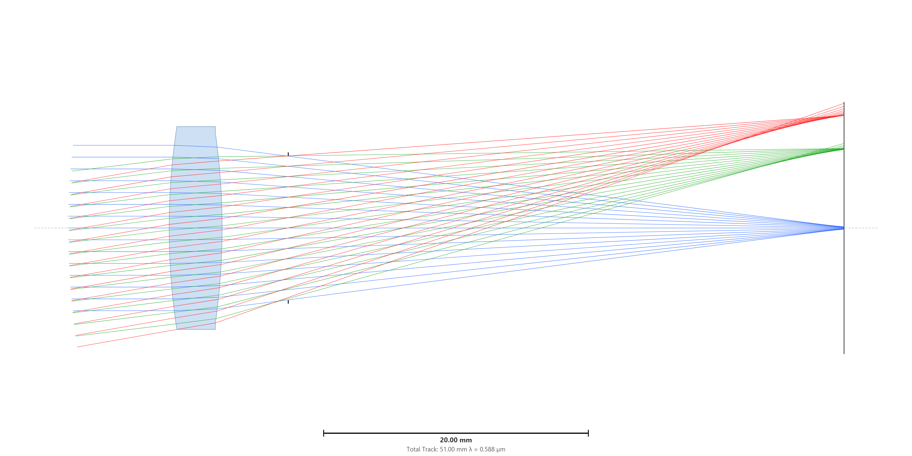 | 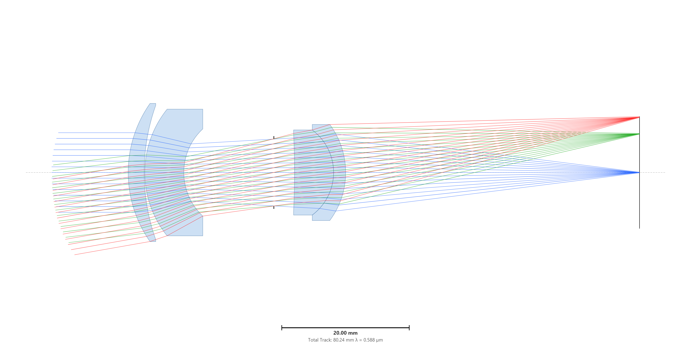 |

The starting merit function — note the `DTRG` row (#7, weight
0.3, bounds 2-10, span S1-S3) and the dedicated BFL `CTA` row
(#8, S3 only, min 40 mm). Boundary operands span the full
inserted range so SPC's geometry stays manufacturable as the
design grows:

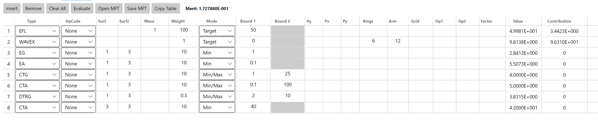

Settings used:

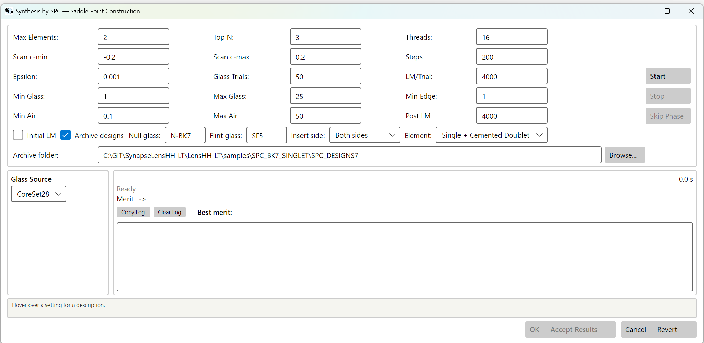

`Max Elements = 2`, `Element = Single + Cemented Doublet`,
`Top N = 3` (auto-set when doublets are enabled), `Glass Source
= CoreSet28`. The two non-default knobs that mattered: **Scan
range widened to ±0.2 and Steps raised to 200** — the BK7 starting
design has surface curvatures around `±0.02 mm⁻¹`, but the saddles
the SPC method needs to find sit out near `±0.1` (you can see this
in the L2 BEST line: `c = 0.0671`). Default `±0.1` would have
clipped half of them; doubling the range and the steps keeps the
sample density matched.

The Top-N ranking picked one **single** insertion at one level and
one **cemented doublet** at the other — exactly the mix the "Both"
topology mode is designed to surface.

The trajectory from the log:

| Phase | Best merit | Note |
|---|---:|---|
| Start | 0.925 | Biconvex BK7, severe spherical + chromatic. |
| L1 BEST | 0.0192 | First insertion (a singlet on the pre-stop side). ~48× drop. |
| L2 BEST | 0.00622 | Second insertion (a cemented doublet on the post-stop side), best pair from glass trials. SPC output. |
| **+ Multistart pass** | **0.00434** | Multistart with glass substitution on every glass surface; 23 / 648 trials accepted, merit `6.22 × 10⁻³ → 4.34 × 10⁻³` (~30 % further drop). Three of the four glass picks changed in the process — S1: `N-BK7 → N-FK58`, S3: `LASF35 → SF4`, S7: `LAFN7 → N-BASF2` — so Multistart was both refining curvatures and finding a better glass combination than SPC's per-branch glass trials had landed on. |

Net: merit `0.925 → 4.34 × 10⁻³` — a ~210× reduction from a
single-element starting point in two SPC levels plus a Multistart
polish. Final topology: N-FK58 meniscus + SF4 element pre-stop,
then a N-BK7 + N-BASF2 cemented doublet post-stop.

| Spot after SPC | Spot after SPC + Multistart |
|---|---|
| 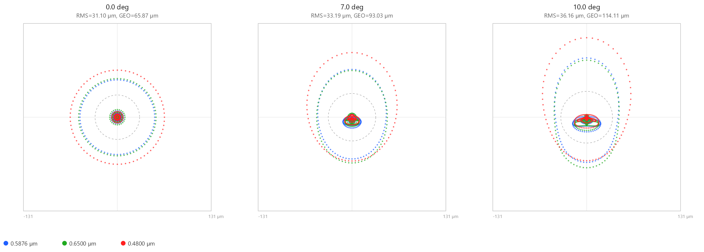 | 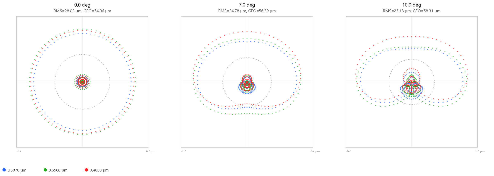 |

| FFT MTF after SPC | FFT MTF after SPC + Multistart |
|---|---|
| 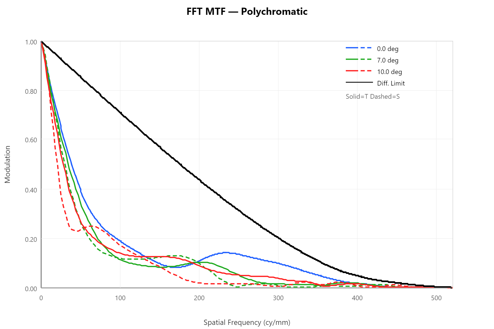 | 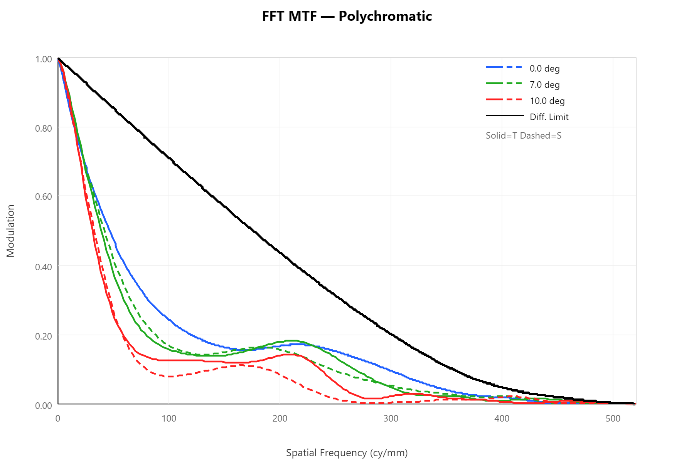 |

The follow-on Multistart dialog — initial merit `6.22 × 10⁻³`
(SPC output) → best `4.34 × 10⁻³`, 23 of 648 trials accepted:

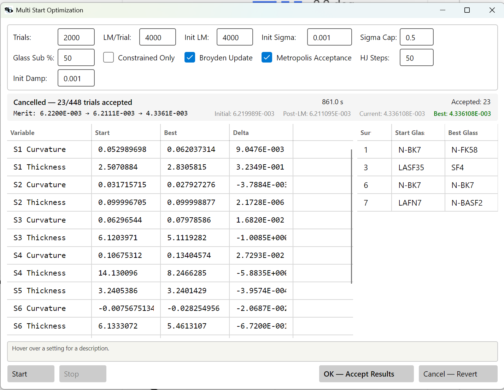

When to reach for SPC:

- The starting design has too few elements for the aberration
  budget (one or two lenses trying to do an apochromat's job).
- You want the program to discover topology — pre-stop vs
  post-stop, singlet vs doublet — rather than handing it a fixed
  surface count to refine.
- You don't already know how many elements the design needs.
  `Max Elements = 2` lets you watch the merit drop level by level
  and stop when the gains plateau.

What it isn't:

- A polish step. Always finish with Local LM and a Multistart pass
  with glass substitution. SPC's per-branch glass trials only
  sample a random subset and its per-branch LM is bounded —
  enough to rank branches, not to grind out the last percent of
  merit. The case study above shows Multistart finding ~30 %
  further improvement on top of the SPC output and shuffling 3
  of 4 glass picks; that's typical, not exceptional.
- A short-budget tool when doublets are enabled. "Single +
  Cemented Doublet" with `Max Elements = 2` and a real catalog
  takes minutes to tens of minutes per level on a multi-core
  machine.

## Common Workflow

1. Load a starting design that already traces. On-axis vignetting is
   heavily penalized — see
   [Merit Function § Failure handling](merit-function.md#spot-operands)
   — so the start needs at least all on-axis pupil rays reaching the
   image.
2. Tag curvatures and airspaces as **Variable** with physical
   bounds — typically 1–2 mm minimum on glass, 0.1 mm minimum on
   air, generous maxima.
3. Set up a merit function: a `WAVEX` or `SPOT` operand for image
   quality, an `EFL` target with high weight (≥ 100), boundary
   operands (`EG`/`EA`/`TTRACK`) to keep the geometry manufacturable.
4. Run **Local Optimizer** first. If merit stops far from where you
   want, run **Multistart** (a few hundred trials, ~2 % perturbation,
   glass substitution on if you have substitution surfaces).
5. Still stuck? Run **Basin Hopping** — defaults plus 100–500 hops,
   ideally with glass substitution. Stop early when you see the
   merit has plateaued.
6. **Always finish with a Local Optimizer pass** so the final state
   is LM-converged.

## Stopping an Optimization

Press **Stop** on the optimizer dialog at any time. The current
operation cancels at the next safe point and the best value found
so far is kept until you click **OK — Accept Results** (commits the
optimized state) or **Cancel — Revert** (restores the original).

## Performance Tips

- **Broyden on, default tolerance.** 3–5× faster than a full Jacobian
  every iteration and matches results in almost all cases.
- **Lock the focal length.** Adding an `EFL` operand with a tight
  target (weight ≥ 100) often dramatically stabilizes the search —
  the optimizer can't "cheat" by shifting focus to hide aberrations.
- **Bound air thicknesses below.** Without an `EA` minimum operand
  or a per-variable `Min` on each airspace, the optimizer can collapse
  airspaces to zero or negative values during exploration.
- **Don't over-vary.** Marking every available parameter Variable
  inflates the dimensionality and makes basins shallower. Start
  minimal; add more only when the merit plateaus.
- **Multistart for glass searches, Basin Hopping for topology.** If
  your topology is already good and you only want to vary glass,
  Multistart at ~50 % glass-swap probability iterates faster.
  Basin Hopping is the right tool when the *shape* of the design
  is in play.
