# Optimization

LensHH-LT ships three core optimizers — Local, Multistart, and Basin
Hopping — plus two global modes: **Global Multi Start Optimization**
(many Multistart restarts) and **Global Evolutionary Optimization** (a
GPU-capable Differential-Evolution population search). All of them
minimize the same merit function (see the
[Merit Function Reference](merit-function.md)) but differ in how they
explore the variable space.

A typical workflow stages them:

1. **Search** with Multistart, Basin Hopping, Global Multi Start
   Optimization, or Global Evolutionary Optimization when you don't
   trust the starting basin.
2. **Refine** with the Local Optimizer once you're in the right
   basin.
3. **Polish** with one more Local pass at the end so the final state
   is tightly converged.

Skip step 1 if you start from a known-good design; never skip step 3.

## When to use which

| Optimizer | Good for | Not good for |
|---|---|---|
| **Local (LM)** | Refining a design you already trust — polish the last 10% of merit. | Escaping a bad starting point. |
| **Multistart** | Probing several random starts, LM from each. Cheap way to find a better basin and to vary glass choices. | Genuinely topology-changing exploration (it won't, e.g., find a Cooke triplet from a flat-plate start). |
| **Basin Hopping** | Heavy single-design exploration — the deepest one run can travel (can change topology). Random perturbations + Hooke-Jeeves pattern search + LM refinement, optionally with glass substitution. | Fast iteration — it's the slowest per run. |
| **Global Multi Start Optimization** | Surveying the solution space — collecting a *gallery* of distinct, locally-optimized design forms (different power patterns + glasses) to choose among, rather than one winner. | Driving a single design to its absolute lowest merit (use Local/Multistart). |
| **Global Basin Hopping** | The deepest *single* answer — many parallel Basin-Hopping (HJ+LM) chains that pool their best basin and reseed each stalled chain from the others' elite, running until you stop. The most thorough escape for one design when you can spend the compute. | Surveying many forms or quick iteration — it pours all chains into one answer (use Global Multi Start for a gallery) and is the most compute-intensive. |
| **Global Evolutionary Optimization** | Building a *gallery* of polished starting designs from a poor or power-free start (e.g. parallel plates) by evolving a whole population in parallel — GPU-accelerated. The fastest "no design → many viable forms" route. | Driving a single chosen design to its absolute lowest merit. |

## Variables

The optimizer moves any parameter marked **Variable** in the Surfaces
table. Typical choices:

- Curvatures (all or selective).
- Thicknesses (glass and/or air).
- Conic constants — available on every surface (the surface stays
  Standard until you set a non-zero conic; even-aspheres carry a
  conic in addition to the polynomial coefficients).
- Aspheric coefficients on even-asphere surfaces.
- Focal length of a **Paraxial** (ideal-lens) surface. You enter and read
  the focal length in millimetres, but — exactly like Radius vs Curvature —
  the optimizer varies the **power** (diopters, `1000/f`). Power is what makes
  the bounds meaningful: it is continuous through afocal (`f = ±∞ ↔ 0 D`) and
  sign-symmetric, so a `Min`/`Max` range like `−20 … 20 D` is well defined
  whereas a focal-length range spanning infinity is not. The variable is
  labelled *Focal Power (D)* in the editor.
- Glass choice — Multistart and Basin Hopping can substitute glasses
  during search.
- Clear-aperture semi-diameter on Fixed-aperture surfaces — let the
  optimizer size the aperture directly, with automatic vignetting
  factors keeping the pupil sampling correct and an on-axis
  clearance floor protecting the axial beam. See
  [Semi-Diameter as an Optimization Variable](semi-diameter-variables.md)
  for the worked Cooke-triplet-with-vignetting case study.

Every variable carries optional `Min` / `Max` bounds. Internally the
LM solver works on an *unbounded* transformed variable, so the
bounds are never violated and the optimizer can't crash by trying
illegal values; the practical effect is that pushing against a
bound shows up as a vanishing gradient, not a hard wall.

### Bound handling: Sigmoid or Reflect (new in 1.0.147)

That vanishing gradient is a real limitation, and you can now choose the
mapping that produces it. **System → System Editor → Bound Handling** offers
two modes; the setting is system-level (it applies to every optimizer — Local,
Multistart, Basin Hopping, the evolutionary searches) and is saved in `.lhlt`.

| Mode | Mapping | Behaviour at a bound |
|---|---|---|
| **Sigmoid** (default) | Scaled logit/sigmoid between the bounds | Smooth and monotonic, but the slope flattens toward zero as the variable approaches `Min` or `Max`. A variable pushed onto a limit effectively stops responding to the optimizer. |
| **Reflect** | The variable stays in physical units; out-of-range values fold back inside (a triangle wave) | The slope magnitude is always exactly 1, so there is no dead zone. A variable sitting on a limit keeps its full sensitivity. The cost is a kink in the derivative at each fold point. |

**When to switch to Reflect.** Use it on *constrained* problems — designs where
several variables genuinely want to sit against their limits (edge and centre
thickness floors, a maximum diameter, a bounded focal power). Under Sigmoid
those variables go quiet one by one as they reach their bounds and the search
loses dimensions it still needs; under Reflect they keep contributing. It also
helps the stochastic searches, whose random kicks routinely land out of range.

**When to stay on Sigmoid.** Unconstrained or lightly constrained designs, where
nothing spends time on a limit, gain nothing from Reflect — and Sigmoid's
smoothness is friendlier to LM's quadratic model. Sigmoid remains the default so
existing designs reproduce exactly.

> **Note.** Variables with *no* `Min`/`Max` are unaffected: with nothing to fold
> against, both modes are the identity. If switching to Reflect changes nothing
> on your design, check whether your variables actually carry bounds — a design
> that constrains thicknesses with `CT`/`CTA`/`CTG` *penalty operands* rather than
> variable bounds has unbounded variables, and bound handling does not apply.

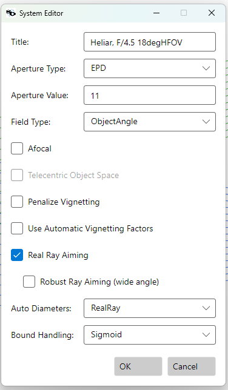

Outside the GUI: `system set-bound-handling sigmoid|reflect` in the CLI, and
`set_bound_handling` in MCP; `system info` reports the current mode.

See [Getting Started → Your First Optimization](getting-started.md)
for the GUI workflow of marking variables and setting bounds.

## Local (LM)

**Optimization → Local Optimizer**

A damped-least-squares Levenberg-Marquardt solver — the workhorse
of every modern lens optimizer. Each iteration:

1. Compute the residual vector `r` and Jacobian `J` (analytic where
   possible, finite-difference otherwise).
2. Solve `(JᵀJ + λI) Δx = −Jᵀ r` for the step `Δx`.
3. Take the step if the merit improves and shrink λ; otherwise
   reject, expand λ, and retry.

This adaptive damping is what makes LM robust: when λ is large the
step approaches gradient descent (safe but slow); when λ is small
the step approaches Gauss-Newton (fast but only valid near the
optimum). LM gracefully transitions between the two.

| Setting | Default | Meaning |
|---|---|---|
| **Max Iterations** | 4000 | Hard cap. The solver normally hits its tolerance long before this. |
| **Use Broyden Update** | on | Reuse a rank-1 Jacobian update between full finite-difference recomputes. A full J is rebuilt every 5 *accepted* steps; rejections reuse the existing J because `x` hasn't moved. The Broyden rank-1 step is applied only on accepts, using the actual old-x → new-x residual difference. Roughly 3–5× faster than a full Jacobian per step and matches results in almost all cases. Turn off if a run looks stuck or for very small systems where the speedup doesn't matter. |
| **Init Damp** | 1e-3 | Starting value of λ. The default is robust on aspheric mixes and well-conditioned problems alike. Drop to 1e-6 for gauss-newton-like behavior on very smooth, well-scaled designs; raise to 1e-2 if the optimizer keeps rejecting steps early. |

The merit-change tolerance (1e-10) and damping bounds are handled
internally — you don't normally tune them.

**Run it twice.** A single LM run can stop on a tolerance hit while
the merit is still detectably decreasing on a fresh restart. Hit
**Start** again from the result; the second pass either confirms
convergence or shaves another few percent.

### Two ways to keep thicknesses sane

The Local Optimizer has no built-in opinion about whether a glass
thickness or air gap is physically reasonable — it will happily
collapse or invert thicknesses to chase image quality unless you
constrain them. There are two equivalent ways to do that:

- **Merit-function operands** — `CTG`, `CTA` (per-surface-range
  centre thickness, glass and air), and `EG`, `EA` (edge thickness,
  glass and air). Each carries a Min/Max bound and a weight; the
  evaluator adds a smooth penalty when the bound is approached.
- **Per-variable Min/Max bounds** — set on the variable itself in
  the surface table (Thickness Min / Thickness Max columns). The
  LM solver works on a transformed unbounded variable internally,
  so the bound is never violated; pushing against it shows up as a
  vanishing gradient, not a hard wall.

Both are demonstrated below on the same Cooke triplet starting
point (50 mm EFL, EPD 10, three fields 0°/14°/20°, three
wavelengths 0.48/0.55/0.65 µm). Sample files:
`samples/UserGuide/LensFilesForManual/`.

#### Starting point

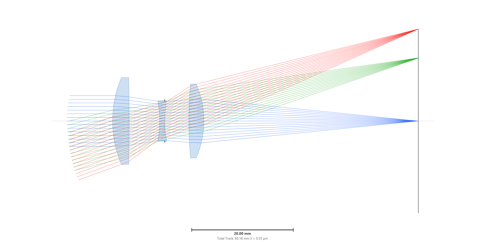

Variables are every curvature and every thickness from S1 through
S6. The starting design is noticeably uncorrected:

| Spot — start | FFT MTF — start |
|---|---|
|  | 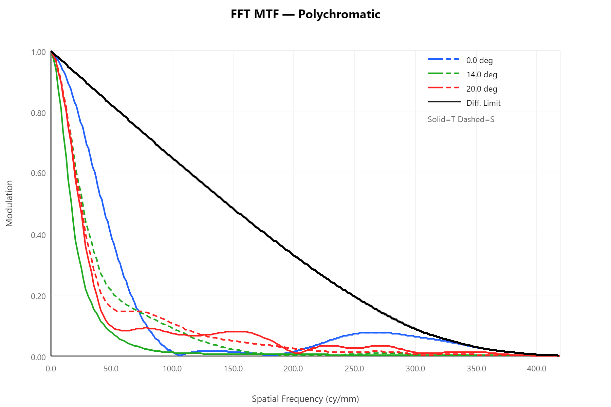 |

#### Case (a) — thickness handled entirely by the merit function

`CookeTriplet_UC.lhlt`. Variables carry no Min/Max bounds; the
merit function does all the work with `EFL`, `WAVEX`, `CTG`, `CTA`,
`EG`, `EA`, plus a `CTA[6,6] Min=40` to keep BFL above 40 mm.

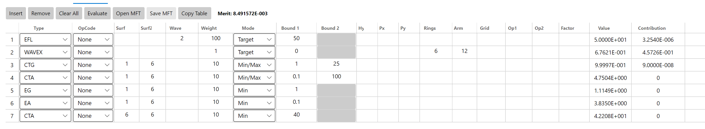

Convergence (133 iterations, 0.3 s):

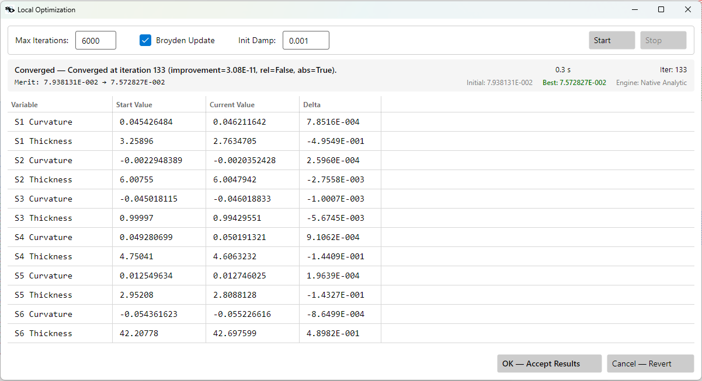

Merit goes from `0.0794` to `0.0757`. Optimized layout:

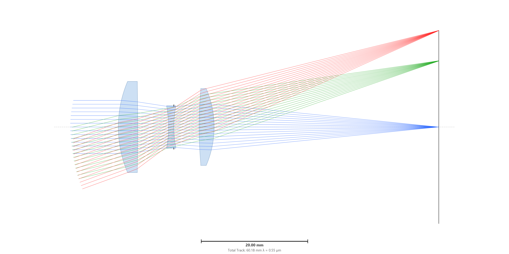

#### Case (b) — centre thickness handled by per-variable bounds, edges by merit function

`CookeTriplet_C.lhlt`. The merit function keeps only `EFL`,
`WAVEX`, `EG`, `EA` (edge thickness still belongs to the merit
function — there is no "edge" of a single variable). Centre
thicknesses are bounded directly on each thickness variable:
`[1, 25]` mm on glass thicknesses (S1, S3, S5), `[0.1, 100]` mm on
internal air gaps (S2, S4), and `[40, 100]` mm on the BFL (S6).

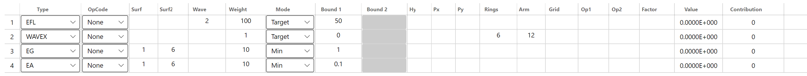

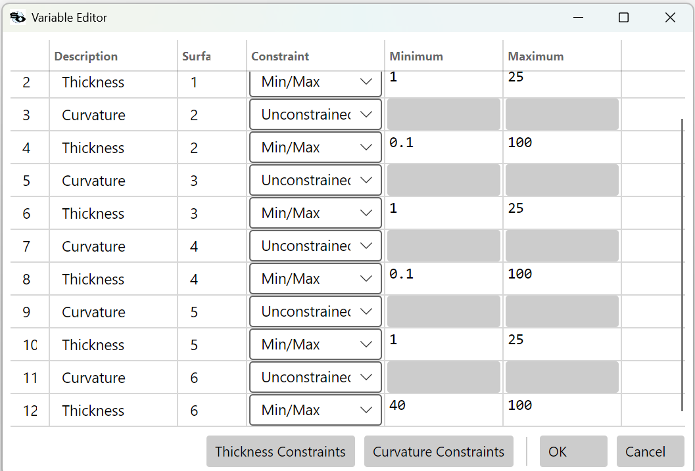

Convergence (566 iterations, 0.9 s):

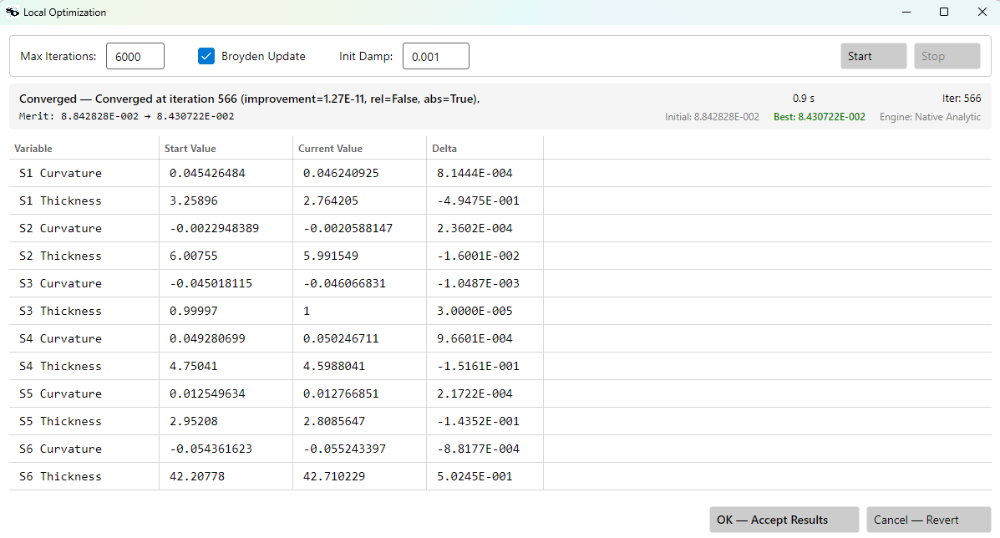

Merit goes from `0.0884` to `0.0843`, and the optimized layout is
visually identical to case (a)'s — both constraint strategies reach
the same design. (The two merit *values* are not directly comparable:
case (a)'s merit also sums the `CTG`/`CTA` centre-thickness operands,
which case (b) replaces with variable bounds.) Constrained variables
take more LM iterations because the transform flattens the gradient as
a bound is approached — 566 here versus 133 for case (a), still well
under a second, though on a much larger system the gap can grow. Both
forms of constraint are supported; pick whichever fits your style.

#### Case (c) — no thickness handling at all

`CookeTriplet_UC_NO_E_OR_CT.lhlt`. The merit function has only
`EFL` and `WAVEX`; thickness variables have no bounds and no
boundary operands. The result is what you'd expect: the optimizer
collapses inter-element air gaps to *negative* values to overlap
glass elements, since that lets it bend rays more aggressively
without paying any penalty.

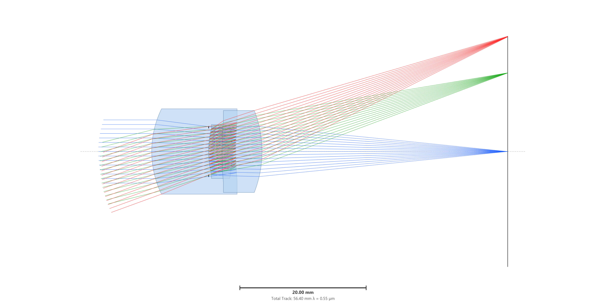

The reported merit is lower than (a) or (b), but the design is
physically meaningless — surface 2's air thickness comes out to
`−0.58` mm and surface 3's glass thickness to `−3.74` mm. Always
constrain thicknesses, by either of the two methods above, before
trusting an LM result.

## Multistart

**Optimization → Multistart…**

Runs many LM optimizations from randomly perturbed starting points,
keeps the best, and tracks accepted vs rejected counts. Glass
substitution can be enabled — every trial may swap glasses on
substitution-eligible surfaces with a chosen probability. The
per-trial perturbation magnitude (`Sigma`) adapts during the run:
it starts small, **grows when the search stalls** (after several
consecutive non-improving batches, up to a cap) to climb out of a stuck
basin, and resets to its small starting value on every new best — so a
single starting Sigma covers a wide range of designs.

### Algorithm at a glance

Two phases. **Phase 1** runs one Initial LM polish from the user's
starting design — skip it (set `Init LM = 0`) when you already
trust the start. **Phase 2** is the actual multistart loop: each
batch spawns `N_CPU` parallel trials, every trial perturbs around
the **current center** (a Metropolis random walk that is allowed
to drift away from *best*), runs HJ-LM polish, then competes for
acceptance. Successful trials reset σ to its small initial value;
when the search goes several consecutive batches without a new best,
σ **grows** one step (×1.5, up to the cap) to climb out of the current
basin — escalating exploration gradually as the search stalls.

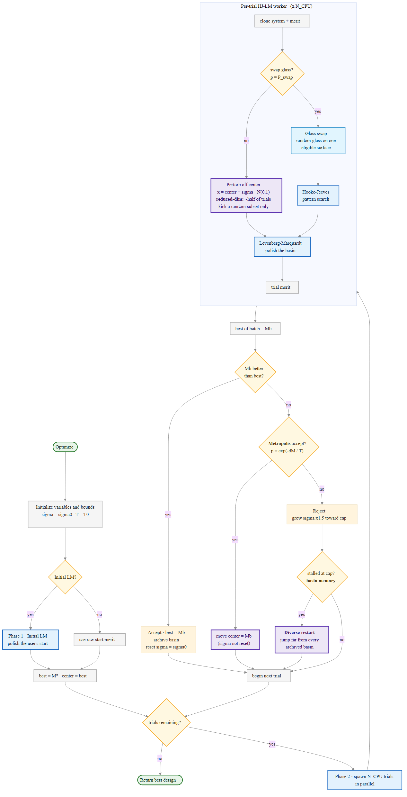

The HJ-LM atom (the Hooke-Jeeves and Levenberg-Marquardt steps in the per-trial block above) is
where each trial actually does its work. Hooke-Jeeves is a
derivative-free pattern search that climbs gracefully across
discontinuities (vignetting, ray-trace failures, glass-boundary
jumps); LM is the workhorse damped-least-squares solver that
polishes the basin once HJ has dropped you into it. By default
HJ runs only on glass-swap trials (LM's damping handles smooth
continuous perturbations on its own) — flip
`HjOnGlassSwapOnly = false` in the engine settings to restore the
pre-1.0.115 always-HJ behaviour.

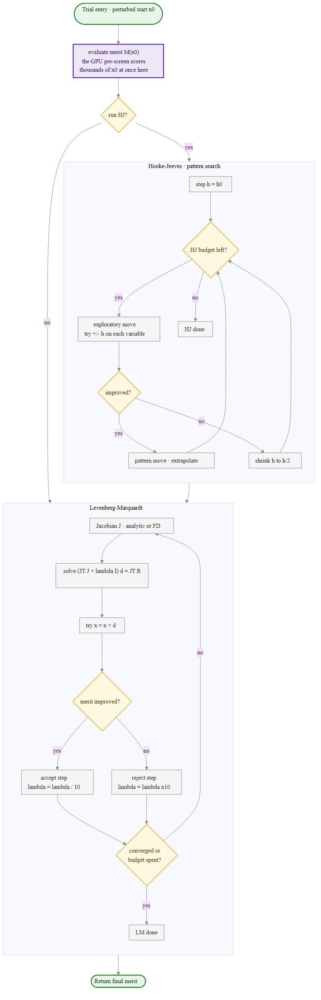


| Setting | Default | Meaning |
|---|---|---|
| **Trials** | 2000 | Hard cap on the number of LM optimizations. Stop earlier when satisfied. |
| **LM/Trial** | 4000 | Hard cap on LM iterations *inside* each trial. Per-trial wall-clock × Trials = total runtime budget. |
| **Init LM** | 4000 | One LM polish from the *current* design before the first random perturbation. Set to 0 to skip. |
| **Init Sigma** | 0.001 | Starting (and reset) value of the Gaussian-perturbation scale, relative to each variable's natural scale. σ starts here, **grows on rejection** toward **Sigma Cap** to escape, and resets here on every accepted improvement. The small default keeps each kick within LM's capture radius — it still escapes because σ grows when the search stalls. |
| **Sigma Cap** | 0.1 | Upper bound on σ — the largest kick the escape phase reaches. On a rejection streak σ grows ×1.5 per rejection up to this cap; any acceptance resets σ to **Init Sigma**. Raise it for wider exploration when refinement stalls. |
| **Init Damp** | 1e-3 | LM initial damping for every trial's per-trial LM run. Same meaning and default as the Local Optimizer's Init Damp. |
| **Glass Sub %** | 50 | Probability that a trial picks a fresh random glass for each substitution-eligible surface. 0 = never; 100 = every trial. The pool comes from the per-surface Glass Substitution Settings (each surface can draw from a different filtered catalog) — see [Glass Substitution During Optimization](glass-catalogs.md#glass-substitution-during-optimization). |
| **Rescale on Glass Swap** | on | When a glass is swapped, also rescale that element's curvatures by `(n_old−1)/(n_new−1)` so its optical power is preserved to first order — keeps the swapped design feasible instead of broken, which improves the typical (median) result. **Only has any effect when glass substitution is active** (Glass Sub % > 0 with substitutable surfaces); on fixed-glass designs it is a no-op. (Basin Hopping keeps this off — its small-step trajectory is over-perturbed by the per-swap curvature jump.) |
| **Constrained Only** | off | If on, only perturb variables that have `Min`/`Max` bounds. Useful when you want unbounded variables held fixed (e.g., a fixed-radius element). |
| **Broyden Update** | on | Same meaning as for Local LM. Leave on. |
| **Seed** | 1 | RNG seed for the run. The same seed with the same settings and the same starting design reproduces a run exactly — which is what makes it possible to change *one* setting and attribute the difference to that setting rather than to luck. Change it (1, 2, 3, …) for a genuinely independent run. *Caveat:* the GPU pre-screen draws its candidates from an unseeded generator, so runs with the GPU sieve enabled are not reproducible even with a seed set. |
| **Metropolis Acceptance** | on | When on, Multistart keeps a *current centre* state separate from *best* and may accept a worse-than-best trial as the next centre with probability `exp(−ΔM/T)` (T autotunes from early `\|ΔM\|` samples). Lets the search walk out of basins it has already mined. *Best* is always strict-improvement; the returned design is monotone. |
| **Reduced-dim perturbation** | on | About half of trials perturb only a random *subset* of the variables — up to roughly a third of them — leaving the rest at their centre values, instead of kicking every variable at once. A full-dimension kick is usually pulled straight back to the same basin by LM; moving along these lower-dimensional manifolds lets the search slip into *adjacent* basins a full kick overshoots. |
| **Basin memory / diverse restart** | on | Keeps an archive of the distinct minima the walk has visited. Once sigma has saturated at the cap for several batches with no new best, the walk *restarts* from a fresh point chosen to lie far from every archived basin (with its glasses randomized), systematically mapping new regions instead of circling the same minimum. The run-wide best is tracked separately and is never lost — it, not the current region's best, is the reported answer. |

**Convergence levers.** The last three rows — Metropolis Acceptance,
Reduced-dim perturbation, and Basin memory / diverse restart — are the
convergence levers, all on by default. Together they turn Multistart from
independent small kicks into a memory-guided walk that reaches deeper basins;
leave them on unless you are deliberately reproducing the older
kick-and-polish behaviour, in which case turn all three off.

Multistart's strength is variability — it's the cheapest way to
sample several glass sets and several nearby basins with only modest
perturbations. With the small default **Init Sigma = 0.001** it isn't designed to
flip a topology (a positive-power element won't become a
negative-power element) in a single kick; for that, raise Sigma
toward the cap, or use Basin Hopping.

**Aspheric coefficients are perturbed with a per-order natural
scale** rather than a single sigma applied uniformly. The natural
magnitude of an even-asphere term drops by *y²* per order
(A4 ≈ 10⁻⁶, A6 ≈ 10⁻⁹, A8 ≈ 10⁻¹², …) where *y* is the surface
semi-diameter, so a uniform sigma would kick A8 by orders of
magnitude more than its natural scale and produce NaN ray traces.
Multistart instead uses a per-coefficient reference scale of
`1e-3 / y^(2(k+1))` for the *k*-th term and applies sigma
relative to that scale. Bounded aspherics (both `Min` and `Max`
set) use the bound-width-relative scale shared with the other
bounded variables; unbounded aspherics use the per-order rule.
Either way the perturbation magnitude tracks the term's natural
scale and an unbounded aspheric is now an honest variable in
Multistart, not a hold-current placeholder.

### GPU pre-screen (Beta, new in 1.0.115; tuning knobs added 1.0.128)

> **Note (1.0.138):** GPU acceleration is now enabled globally in
> **Editors → Preferences** rather than through per-dialog checkboxes, and each
> optimizer dialog shows a live **⚡ GPU** status chip — see
> [GPU Acceleration](gpu-acceleration.md). The dialog controls described below
> reflect an earlier layout and are being updated.

Most random perturbations produce designs that are strictly
worse than the current best — running the full HJ-LM cycle on
them is wasted work. The **GPU pre-screen** filter, available
when LensHH-LT detects a CUDA-capable NVIDIA GPU, evaluates a
much larger candidate pool than `N_CPU` in a single GPU launch
(~60 µs per design on an RTX 4060), ranks by merit, and feeds
only the top survivors into the parallel HJ-LM workers.
Discarded candidates pay one merit evaluation each instead of
the 50–300 LM iterations a full trial would cost.

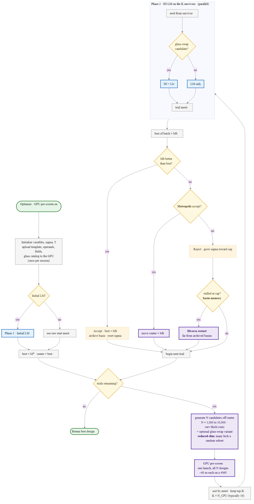

**How to enable.** In the Multistart dialog, look at the
**Hardware acceleration** strip at the top:

- If a CUDA device is detected, the **`Use GPU pre-screen (Beta)`**
  checkbox is enabled.
- If your design uses **aspheric, FieldY, or ConfigValue**
  variables, the checkbox is greyed out and the status line
  tells you which variable type is the blocker. The GPU kernel
  takes only curvature, thickness, and conic coefficients per
  design; aspheric-variable designs fall back to the CPU path
  with no UI surprises.
- With no compatible GPU, the checkbox is greyed out and the
  status line says so.


**Tuning the sieve (1.0.128).** Two knobs sit next to the
checkbox; they turn the pre-screen from a *refiner* into a
*basin-escape* tool:

- **`Min change (%)`** — the *difference gate* plus the
  *survivor-distinctness* threshold. A candidate is only worth
  GPU-evaluating if it is structurally different from the
  running best: a glass swap (|Δn_d| > 0.001) **or** a
  refractive surface whose curvature moved by more than this
  percent (a previously-flat surface gaining any curvature
  counts). The same threshold also keeps the surviving designs
  apart from *each other*, so a bigger pool spreads across the
  feasible region instead of collapsing onto the lowest-merit
  point. Survivors are still ranked by merit. `0` disables the
  gate. Default 2 %; values around 5–10 % give the most
  aggressive escape.
- **`Population ×`** — the sieve evaluates this many *times* the
  GPU's device-fill candidate count per batch (default 1 = one
  device fill, ≈6,000 designs on an RTX 4060). The GPU is
  otherwise idle, so a larger pool — e.g. 10× — is a near-free
  way to give the value-only sieve more shots at a design that
  polishes well under LM. Scales GPU kernel time and device
  scratch roughly linearly; if it runs out of GPU memory it
  falls back to CPU for that batch.

**What runs on the GPU.** Each Phase-2 batch generates a
device-filling candidate pool (`Population ×` × device fill),
mixing continuous perturbations and — when glass substitution
is on — single-surface glass swaps in the same launch. The
whole-merit kernel computes the merit of every candidate
**bit-equal to the CPU path**; the difference gate forces each
candidate to clear `Min change (%)`, and diversity-aware
selection then keeps the best `N_CPU` *distinct* survivors for
HJ-LM polish. Acceptance / Metropolis / sigma schedule are
unchanged. The GPU base design (curvatures **and** glasses)
tracks the Metropolis centre, so the sieve always scores
exactly the design the LM worker reconstructs.

**Performance.** On real production-class merits (Tanabe,
21-surface, 3 waves, 3 fields, 241 operands) the consumer-class
RTX 4060 delivers ~1.7× the raw merit-evaluation throughput of
a 16-thread laptop CPU. The pre-screen's *wall-clock* impact is
larger because most candidates would have failed HJ-LM anyway:
discarding them at ~60 µs each instead of running a 50–300-eval
HJ-LM cycle compounds the 1.7× hardware win into a far bigger
algorithm-level speedup. A100-class FP64 GPUs project to
~10–25× over the same CPU baseline.

**Result message telemetry.** When a run uses the GPU
pre-screen, the result line at the bottom of the dialog adds
`| GPU pre-screen: N candidates sieved across M batches`,
followed by a **`GPU↔CPU parity gap`** (≈0 confirms the sieve
scored exactly the design LM polishes) and a **`survivor
spread`** (worst survivor merit + mean change from best — if
this is near zero the survivors are hugging the merit floor and
LM has little to do). When glass substitution is on, it also
reports how many of the HJ-LM survivors were glass-swap
candidates.

### Multistart on the Cooke triplet

Sample file:
`samples/UserGuide/LensFilesForManual/CookeTriplet_UC.lhlt` — the
same 50 mm EFL triplet from the Local Optimization section (EPD 10,
three fields 0°/14°/20°, three wavelengths), every curvature and
thickness variable, thicknesses kept physical by the merit function
(`CTG`/`CTA`/`EG`/`EA`). Its starting merit is **0.0794**. Where the
local optimizer only polished it to 0.0757, Multistart's random
restarts can jump out of that basin entirely.

Three scenarios show what that buys you — all from the defaults
(**Trials 3000**, **LM/Trial 6000**, **Init Sigma 0.001**, Broyden
and Metropolis on).

#### Fixed glass — curvatures and thicknesses only

With the glasses held fixed, Multistart perturbs only the continuous
variables, and finds a basin far deeper than the local polish reached:

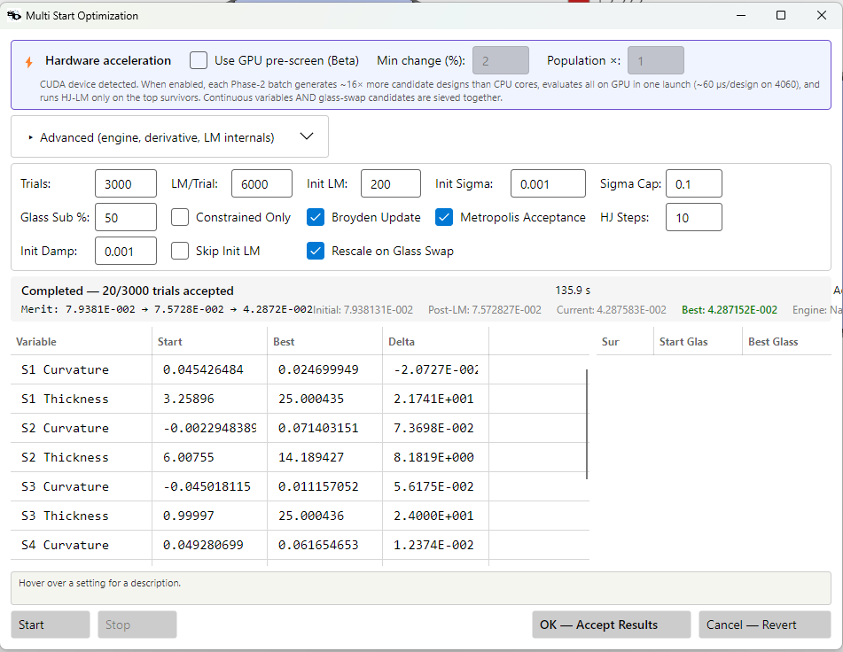

Result: **0.0794 → 0.0429** (136 s, 20 of 3000 trials accepted) — a
~1.85× improvement the local optimizer could not reach, because it
was trapped in the starting basin.

| After — wavefront | After — FFT MTF |
|---|---|
| 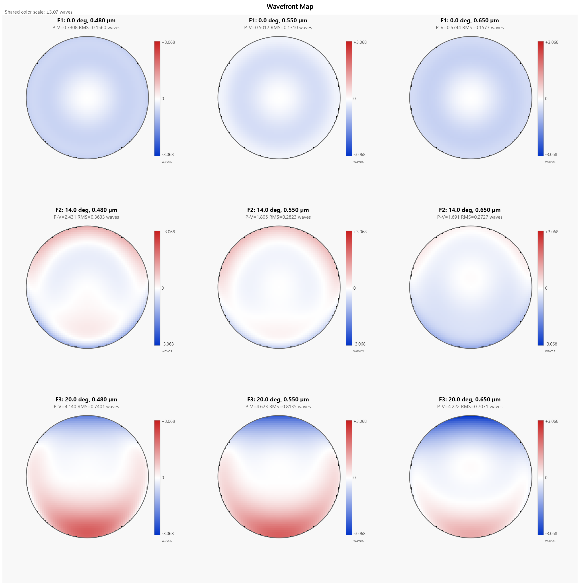 | 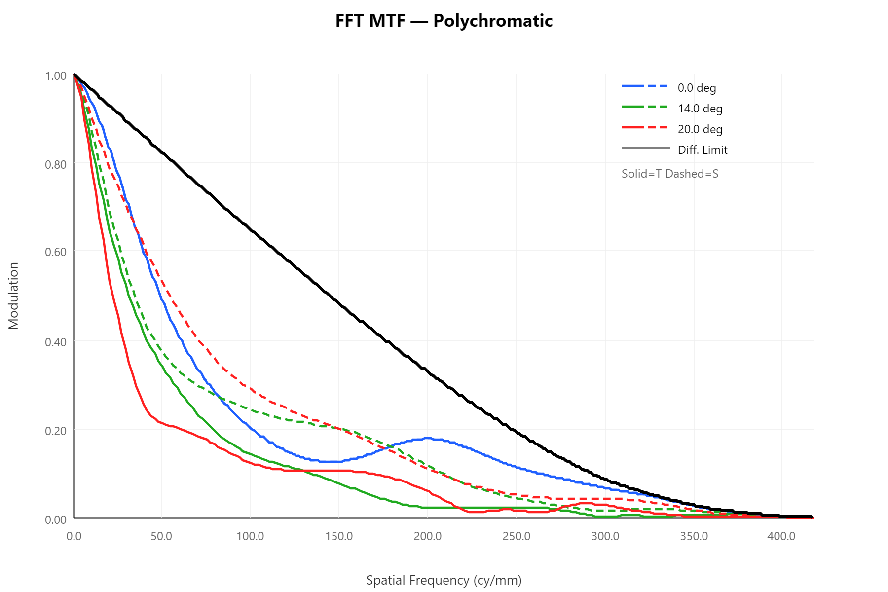 |

#### Glass substitution on

Letting the optimizer re-choose the three glasses from the
**CoreSet28** filtered catalog opens up more of the design space:

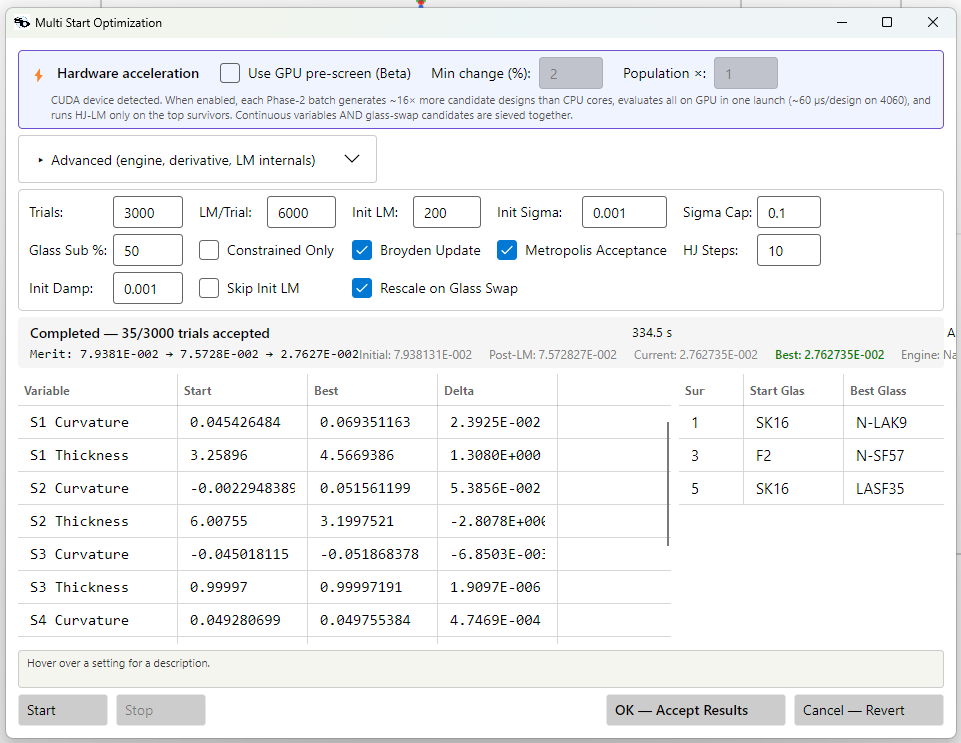

Result: **0.0794 → 0.0276** (335 s). The substitution replaced the
starting Schott triplet with a set the search chose on its own:

| Surface | Start glass | Best glass |
|---|---|---|
| 1 | SK16 | N-LAK9 |
| 3 | F2 | N-SF57 |
| 5 | SK16 | LASF35 |

| After — wavefront | After — FFT MTF |
|---|---|
| 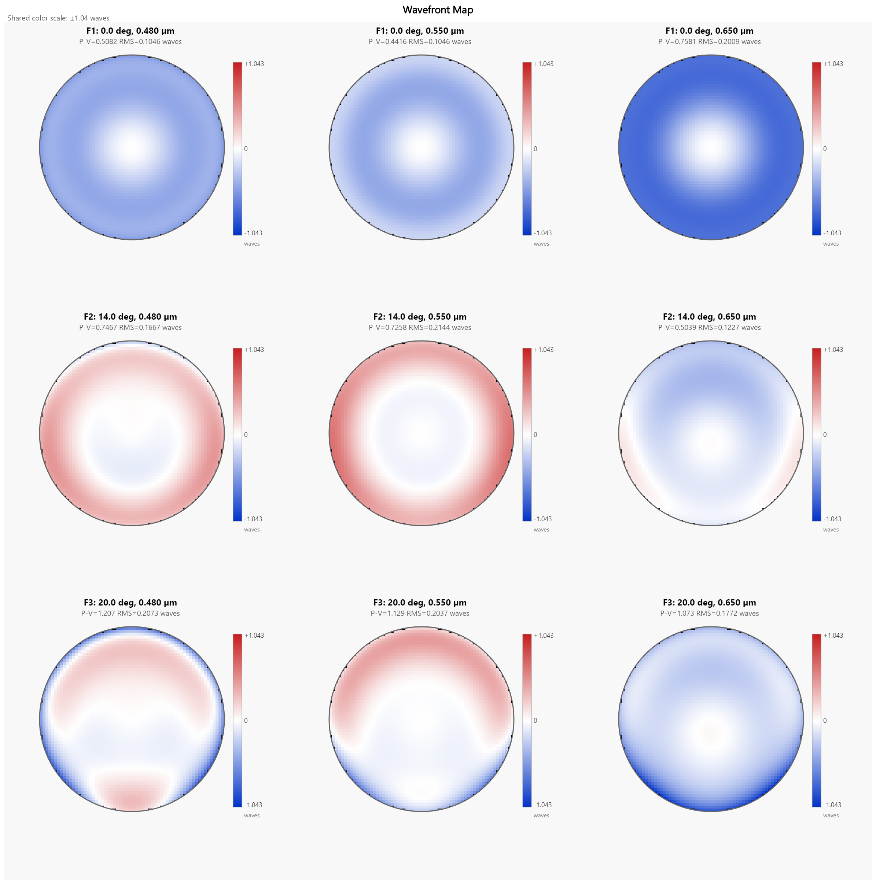 | 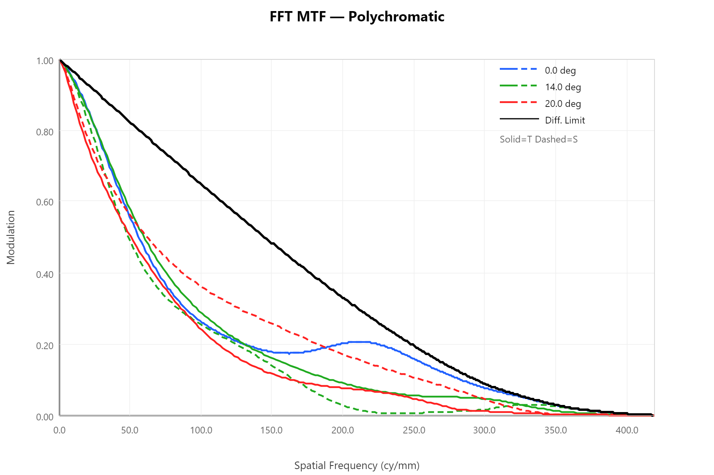 |

#### From a bare parallel plate

Multistart does not need a working lens to start from. Handed three
**flat plates** — every radius infinity, no optical power — it
rebuilds a real triplet:

| Before — three flat plates (merit 8.0 × 10¹⁴) | After — Multistart triplet |
|---|---|
| 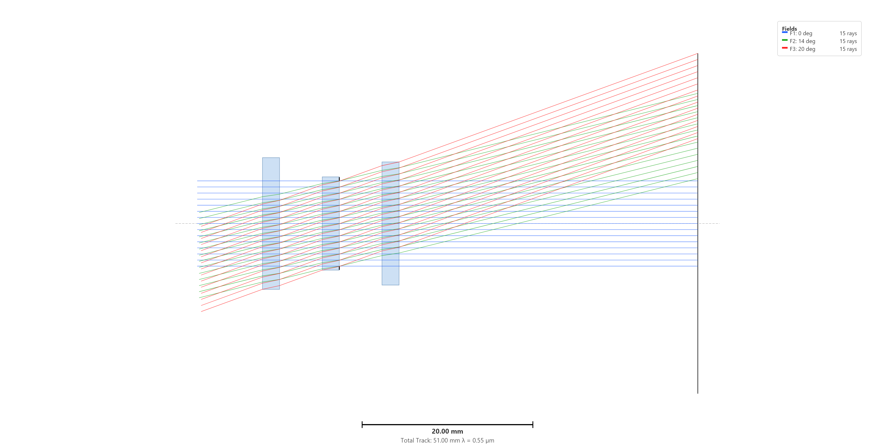 | 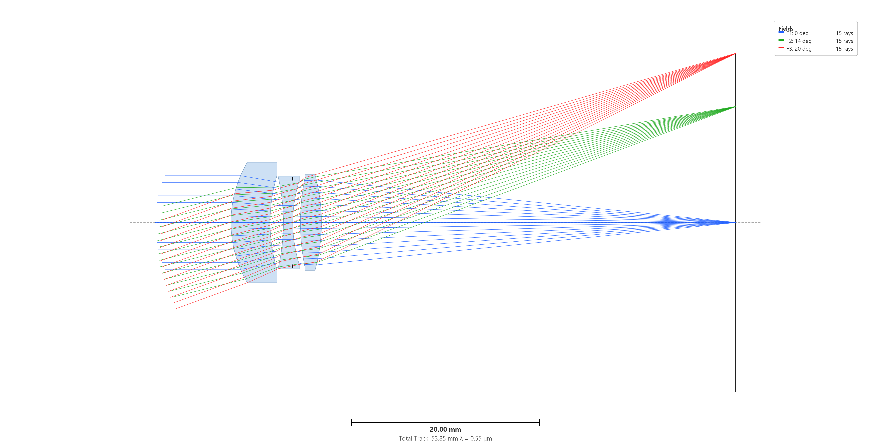 |

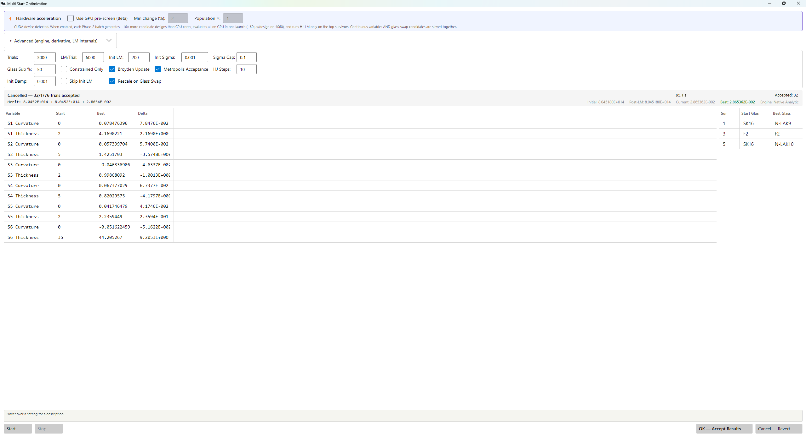

Result: **8.0 × 10¹⁴ → 0.0287** (95 s). Read the header carefully: the
Phase-1 initial LM left the merit at 8.0 × 10¹⁴ *untouched* — a
zero-curvature plate has no gradient for LM to follow — so every bit
of progress came from the random restarts. Notice too that Multistart
settles near ~0.028 from **both** the finished triplet (0.0276) and
the flat plate (0.0287): consistent, but it lands in the same
moderately-deep basin either way. Basin Hopping, next, digs deeper
from the identical starts.

> **Init Sigma.** These runs all use the default **0.001**. The
> per-hop kick is small, but the LM refinement that follows amplifies
> it, and with *Rescale on Glass Swap* (on by default) keeping swapped
> designs feasible, 0.001 escapes basins readily here. If a converged
> design refuses to move, raise Init Sigma toward the cap (0.01–0.1)
> before deciding it is done for the chosen topology.

## Global Multi Start Optimization

**Optimization → Global Multi Start Optimization…**

*(Named "Global Search" before 1.0.122.)*

Where Multistart returns the *single best* design it found, Global Multi Start
Optimization returns a **gallery of structurally-distinct, locally-optimized
designs** — so
you can compare genuinely different solution forms (different element
power-sign patterns, different glass sets) and choose the one that best suits
your manufacturing and packaging constraints, not only the one with the lowest
merit.

It runs **many independent Multistart restarts** from your starting design and
keeps a result **only if its lens *form* is new**. Designs are de-duplicated by
a form signature — the glass set plus the per-element power-sign pattern — so
the gallery fills with distinct forms rather than many near-copies of the same
basin. The gallery is sorted best-merit-first.

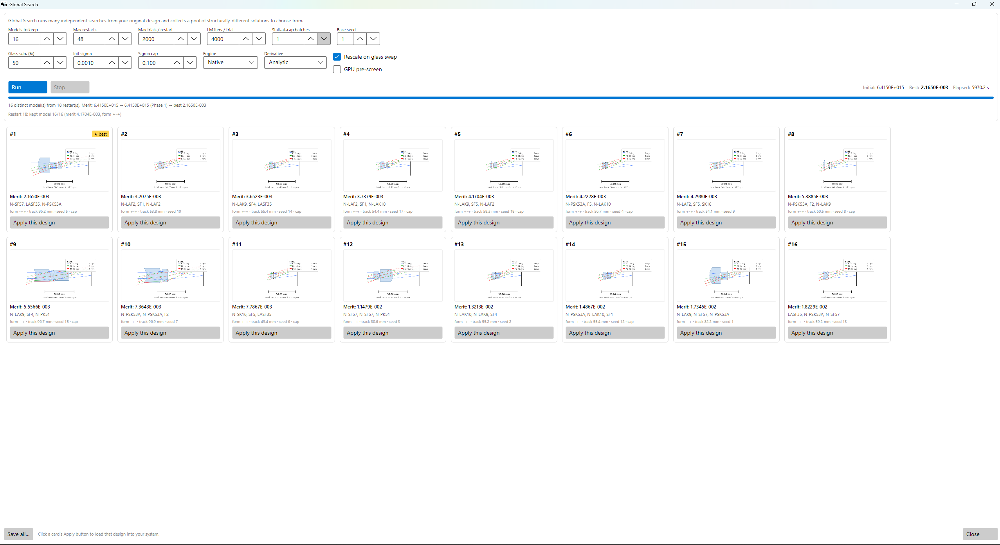

### Algorithm at a glance

**Phase 1** runs one deterministic LM polish from your starting design (call it
*D0*); it is computed once and seeds every restart. **Phase 2** then runs
independent restarts: restart *i* is a full Multistart run from *D0* with seed
`BaseSeed × 100000 + i`, so the restart batches never overlap and the whole
search reproduces from a single base seed (base seed 1 → 100000, 100001, …;
base seed 2 → 200000, …). After each restart converges, its best design's form
signature is computed; if that form is already in the gallery (within a small
merit tolerance) the restart is discarded as a duplicate, otherwise it is kept.
The search stops when it has collected **Models** distinct forms, exhausted
**Max Restarts**, or stalled (no new distinct form for several restarts).


| Setting | Default | Meaning |
|---|---|---|
| **Models** | 16 | Target number of distinct designs to collect in the gallery. |
| **Max Restarts** | 48 | Upper bound on independent restarts (default 3× Models — restarts that land on an already-seen form are discarded, so you need several per kept model). |
| **Trials / restart** | 2000 | Multistart trial cap *within* each restart. |
| **Base Seed** | 1 | Restart *i* uses `BaseSeed × 100000 + i`. Run base seed 1, then 2, … for genuinely independent extra batches that never re-walk the same seeds. |
| **Dedup tolerance** | 0.02 | Two designs of the same form within this relative merit count as the same gallery entry. |
| Sigma, Glass Sub %, LM/Trial, Rescale on Glass Swap, … | | Inherited from Multistart — each restart *is* a Multistart run. |
| **Reduced-dim perturbation**, **Basin memory / diverse restart**, **Metropolis acceptance** | on | The three [convergence levers](#multistart), exposed here as their own checkboxes. Because each restart is a full Multistart run they behave exactly as in Multistart; on by default. |
| **GPU pre-screen** + **GPU min change (%)** / **GPU population ×** | off / 2 % / 1× | Same GPU sieve and tuning knobs as the Multistart dialog (1.0.128). Applied to every restart, so the gallery search gets the same basin-escape pre-screen. See [GPU pre-screen](#gpu-pre-screen-beta-new-in-10115-tuning-knobs-added-10128). |


Every gallery entry is a complete, loadable `.lhlt` design. From the CLI the
pool is written to `out=DIR` (default `global_search_results`), one file per
rank named by rank, seed, merit, and glass set.

### When to use it

Use Global Multi Start Optimization to **survey the solution space** of a specification — "what
triplet forms reach this f/number and field, and with which glasses?" — rather
than to drive a single design to its lowest merit. It costs more than one
Multistart (it is many of them), but it surfaces alternative forms a best-only
run hides. A good staged workflow: Global Multi Start Optimization to enumerate
candidate forms → pick one → Local (or Basin Hopping) to refine it.

## Global Evolutionary Optimization

**Optimization → Global Evolutionary Optimization…**

A population-based **Differential-Evolution (DE)** search that generates a pool
of distinct starting designs from a poor — or even power-free — start (e.g.
parallel plates), then polishes the best of them into a gallery. Where
Multistart and Global Multi Start Optimization perturb *one* design at a time,
DE evolves a whole **population** of candidates in parallel; and on an NVIDIA
GPU the entire population is evaluated on-device every generation, so the search
scales to tens of thousands of members. It is LensHH-LT's fastest route from
"no design" to "a gallery of viable, polished starting forms."

The run has three stages:

1. **DE seed search.** A population of trial designs is evolved for a number of
   generations. Each generation mutates and recombines members (DE/rand/1/bin)
   and keeps the better of trial vs. parent. Glass substitution is part of the
   search, so members explore both geometry and material.
2. **Focus + EFL conditioner (§8.5).** After a member is formed, an optional
   fast solver refocuses it (a secant solve on a compensator thickness) and,
   when the merit has an EFL target, drives the effective focal length onto
   target (a Newton solve on a control curvature) — so the population stays near
   the spec instead of spending generations rediscovering focus. The surfaces it
   touches are user inputs (auto by default).
3. **Polish.** The best *N* distinct seeds are polished — **Multistart-LM** by
   default (a full Multistart run per seed, like the standalone Multistart
   Optimization) or Local-LM — and shown as a gallery, best-merit-first. **All
   pre-polish seeds are saved automatically**, so the raw DE pool is never lost.

GPU is a *flag*, not a requirement: with a CUDA device the population is sized to
fill the GPU automatically (≈6,000 designs on an RTX 4060, ≈34,000 on an H100);
without one, the same search runs on the CPU at a population you set. The result
is identical either way.

### Settings

| Setting | Default | Meaning |
|---|---|---|
| **Use GPU** | on if available | Run the population on a CUDA device, sized to fill it. Off / no device → CPU at the **Population** you set. |
| **Generations** | 10000 | DE generations — the dominant cost knob. Reduce on CPU. |
| **Population** | GPU auto / 256 CPU | CPU population size. Ignored on GPU (auto-filled to device occupancy). |
| **Seeds to emit** | 16 | How many distinct seeds the DE keeps for polishing. |
| **Glass sub. %** | 50 | Probability a member draws a fresh glass per substitution-eligible surface, from the per-surface Glass Substitution Settings. |
| **Base seed** | 1 | RNG seed — the whole run reproduces from it: the DE search **and** the Multistart polish (each candidate's polish is seeded `BaseSeed + rank`). Same Base seed → identical results. |
| **Focus+EFL conditioner** | on | Master switch for the §8.5 per-member refocus + EFL solve. |
| **Focus surface** | auto | Surface whose *thickness* the focus solve adjusts. Auto = the airspace before the image plane. |
| **EFL surface** | auto | Surface whose *curvature* the EFL solve adjusts. Auto = the last powered surface. Only runs when the merit has an EFL target. |
| **Adjust curvature for EFL** | on | Off → refocus only, never touch curvature for EFL. |
| **EFL adjust tol** | 0.05 | Only solve EFL when the member is within this fraction of target (0.05 = ±5%); members further off are left for the merit to cull. ≤0 = always. |
| **Polish** | Multistart LM | How the best seeds are polished: **Multistart LM** (most thorough — a full Multistart run per seed), **Local LM**, or **None** (raw seeds). |
| **Polish best N** | 16 | How many of the best distinct seeds to polish. |
| **LM iters** | 4000 | LM iteration cap per candidate on the Local-LM path. |
| **Output folder** | …/de_pipeline | Pre-polish seeds are auto-saved here; the polished gallery can be saved too. |
| **Polish previously-saved DE results** | off | Skip the search and re-polish a folder of previously-saved seeds (see below). |

### Live reporting

During a run the dialog reports, in order:

- **DE phase** — the running best merit, **elapsed time**, and **average seconds
  per generation** (so a long run's finish is predictable).
- **DE complete** — the best seed merit *before* any polish, and how many
  distinct seeds were found.
- **Polish phase** — which candidate is being polished (**"Polishing 5 of 16"**),
  that candidate's current best merit, and the **best merit across the whole pool
  so far** — whether the polish runs on the CPU or with the GPU pre-screen.

The same elapsed-time / seconds-per-generation figures and polish progress are
available from the CLI (`optimize deseed`) and the MCP (`de_pipeline_status`).

### Polish a previously-saved DE result set

A DE search can take a while, and you don't have to repeat it to try a different
polish. Tick **Polish previously-saved DE results**, point the folder picker at a
saved seed folder (any folder of `.lhlt` files from a previous run — e.g. the
auto-saved `seeds_pre_polish/`), and the run **skips the DE search** and polishes
those designs with the current polish settings. Every file in the folder must
share the loaded design's structure (same surface count and merit operands); if
one doesn't, the run stops and names the offending file. From the CLI:
`optimize deseed polish-folder=DIR`; from the MCP: `de_pipeline_start(...,
polishFolder="DIR")`; from the API: `DePolishSavedSeeds(...)`.

### When to use it

Reach for Global Evolutionary Optimization when you have **no good starting
design** — a flat-plate or rough sketch — and want a *spread* of polished, viable
forms quickly, especially on a GPU. It overlaps Basin Hopping (both can build a
triplet from parallel plates) and Global Multi Start Optimization (both return a
gallery), but it gets there by evolving a large population in parallel rather
than perturbing one design — which is exactly what makes the GPU path so
effective. A good staged workflow: Global Evolutionary Optimization to generate +
polish candidate forms → pick one → Local (or Basin Hopping) to refine.

### Case study: parallel plates → polished triplets (GPU)

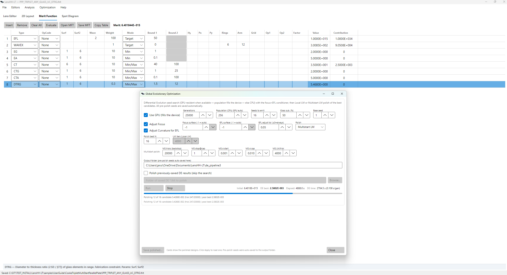

Sample:
`samples/UserGuide/LensFilesForManual/PPP_TRIPLET_ANY_GLASS_UC.lhlt`
— three flat plates, 50 mm EFL target, EPD 10, three fields, three wavelengths,
glass substitution on (CoreSet28). With **Use GPU** on, the population fills the
device automatically; the DE evolves it for the chosen number of generations, the
conditioner keeps every member near 50 mm EFL and in focus, and the best 16
distinct seeds are polished with Multistart-LM. The gallery comes back as a set
of structurally-distinct triplets, best-merit-first, with all pre-polish seeds
auto-saved alongside.

## Basin Hopping (HJ + LM)

**Optimization → Basin Hopping HJ+LM…**

The deepest *single-run* explorer: one Basin Hopping run can travel far
enough from the start to change topology (e.g. flat plates → Cooke
triplet), where Multistart's small kicks cannot. (Global Multi Start
Optimization explores along a different axis — it casts the *widest net*,
collecting many
distinct forms, rather than driving one design as far as possible.)
Each *hop* runs:

1. **Random perturbation.** Each continuous *shape* variable gets a
   Gaussian kick of standard deviation `Sigma × variable_scale`,
   pulling the design into a fresh starting point. Aperture
   semi-diameters and aspheric coefficients are not kicked — they are
   left for the LM to tune, so aperture/asphere noise doesn't disrupt
   the shape exploration.
2. **Hooke-Jeeves pattern search.** A derivative-free local search
   that works on the merit value alone. Steps along axes; expands
   the step on every successful direction; contracts only when no
   axis helps. Cheap and oblivious to local Jacobian smoothness —
   it's good at climbing out of shallow ridges that fool LM.
3. **LM refinement.** Up to `LM/Hop` Levenberg-Marquardt iterations
   to land at the bottom of whatever basin HJ found.
4. **Accept/reject.** If the post-LM merit improves on the previous
   best, the hop is accepted and becomes the new starting point;
   otherwise the design reverts and the next hop perturbs from the
   best-so-far.

Optionally, every hop also swaps glasses on user-selected
substitution-eligible surfaces, drawing from a filtered catalog.
Glass swaps and continuous-variable hops cooperate: a swap that
gets accepted often stays in the design while later hops fine-tune
curvatures and thicknesses around it.


| Setting | Default | Meaning |
|---|---|---|
| **Hops** | 3000 | Outer-loop cap **per chain**. With **Stop on no improvement** on (the usual mode) a chain plateaus and stops long before this — the cap is just a backstop. Lower it only if you want a hard wall on runtime. |
| **LM / Hop** | 6000 | Max LM iterations per hop. LM stops early on tolerance once a hop converges (~30 iterations for an easy basin), so this is generous *headroom*, not a fixed cost — a hop that is still improving is never cut off. Reduce only if you deliberately want shallow, cheap hops. |
| **HJ Steps** | 30 | Maximum Hooke-Jeeves steps per hop before handing off to LM. 30 is balanced; 0 disables HJ entirely. |
| **Sigma** | 0.001 | *Starting* value of the Gaussian-perturbation scale. Sigma is adapted automatically during the run (see below). 0.001 is sufficient even for severe starts; you rarely need to raise it. |
| **Seed** | 1234 | RNG seed. Change it to get a different random trajectory while keeping all other knobs identical — useful for confirming a result isn't a fluke. |
| **Chains** | 0 (auto) | Number of independent hopping chains run in parallel; the single best design across all of them is returned. **0** = automatic, one chain per physical CPU core. **1** = the classic single chain with the full live per-variable trace. Higher values fill the CPU and explore more basins at once — see [Parallel chains](#parallel-chains). |
| **Broyden Update** | on | Same as Local LM. |
| **Only randomize constrained variables** | off | Limit perturbation to bounded variables. Useful for surgical exploration when most variables are already where you want them. |
| **Glass Substitution** | off | Enable glass swaps. Pick the source from the **Glass Source** dropdown — filtered catalogs (small curated lists, cheap) or one of the loaded full catalogs (broad exploration, slower). |
| **Glass Source** | first filtered catalog | Pool used when Glass Substitution is on. Filtered catalogs in `<install>/catalogs/Filtered/` are typically 30–100 glasses curated by status, manufacturer, refractive-index range, etc. See [Glass Catalogs](glass-catalogs.md). |
| **Stop on no improvement / Timeout (s)** | off / 600 | Per-chain watchdog. When on, a chain ends early if *its own* best merit hasn't improved within this many seconds — see [Stop on no improvement](#stop-on-no-improvement). |
| **Metropolis walk** | on | Governs how a *non-improving* hop is handled. **On** (default): the chain may still accept a *worse* design as its next centre with probability `exp(−ΔMerit/T)`, so it can step through a worse basin to reach a better one — thorough exploration. **Off**: *greedy* hopping — every non-improving hop is rejected and the chain restores to its best. Greedy converges quickly but can stick in the first basin. |
| **Temp** | 0 (autotune) | Metropolis temperature *T* in `exp(−ΔMerit/T)`. **0** autotunes it to the mean of the first several uphill `\|ΔMerit\|` samples. Larger *T* accepts more worse moves (more exploration). Ignored when Metropolis walk is off. |
| **Restart@stall** | 20 | Full-range "long-jump" restart trigger (see [Escaping a stalled search](#escaping-a-stalled-search-full-range-restarts) below). After this many consecutive hops with no new global best, the chain re-randomizes its *shape* variables across their whole range and continues from there. **0** disables it — a pure local walk that only reaches basins near the start. |
| **Restart σ** | 0.5 | Magnitude of that long-jump kick, in the same units as Multistart's Sigma Cap. **1.0** spans a variable's full bound half-range, like a Multistart trial; smaller values land on a traceable design more often. Only used when Restart@stall > 0. |
| **Save chains to** | (empty) | Folder to write every chain's final design (one `.lhlt` each) when the run finishes. Empty = keep only the global best in the workspace. See [Saving every chain's design](#saving-every-chains-design). |

### Escaping a stalled search (full-range restarts)

*New in 1.0.138.* Basin Hopping's small per-hop kicks are ideal for
refining a basin and for short hops to nearby ones, but on a hard design a
chain can circle the same local minimum. When a chain goes a number of hops
without a new best, it now performs a **full-range restart**: it returns to
its best design, re-randomizes the *shape* variables (curvatures,
thicknesses, glasses) across their whole range — the same magnitude a
Multistart trial uses — and continues hopping from there. A restart that
lands somewhere better is kept; otherwise the chain returns to its best and
tries a fresh jump.

This gives each chain the global-restart reach that previously only
Multistart had, layered on top of Basin Hopping's Hooke-Jeeves and LM
refinement. In practice a Basin-Hopping run — especially with several
[parallel chains](#parallel-chains) — now reaches the deep basins Multistart
finds *and* polishes each one it visits, so it is competitive with (and
often beats) Multistart on the same design instead of freezing at the first
local minimum. The restart is on by default and needs no setup; since 1.0.146
you can tune *when* it fires (**Restart@stall**, in hops) and *how far* it
jumps (**Restart σ**) from the dialog, or disable it entirely by setting
**Restart@stall** to 0.

### Parallel chains

A single hopping chain is sequential — one perturb-optimize step at a
time — so it leaves most of your CPU idle. Set **Chains** above 1 (or
leave it at **0** for one chain per physical core) to run several
independent chains at once, each from its own random perturbation. They
don't share state; the run simply returns the **single best design found
across all of them**. Because each chain explores a different basin, a
parallel run typically reaches a markedly better merit than one chain in
the same per-chain hop budget — and it actually uses the cores you paid
for.

While a parallel run is going, the **Chains** tab is the live view. Each
row is one chain, showing its hops completed, running best merit,
accepted/rejected counts, and a **◄ best** marker on the chain currently
holding the global best. The headline merit at the top of the dialog is
the global best across all chains and only ever decreases; the log
records each new global best as it's found. The **Variables** and
**Glasses** tabs fill in **at completion** from the winning chain —
while many chains are exploring different designs at once there is no
single "current" design to track live.


**Chains = 1** is unchanged from earlier versions: one chain with the
full live per-variable / per-glass trace in the Variables and Glasses
tabs as it runs.

> **Physical vs. logical cores.** Auto uses *physical* cores, leaving the
> hyperthread siblings free so the rest of the machine (and the app's own
> UI) stays responsive during a long run. On a dedicated machine you can
> set Chains to your *logical* core count for ~40 % more throughput at the
> cost of a busier system.

### Stop on no improvement

Long runs often plateau well before they hit the **Hops** cap. The
**Stop on no improvement** watchdog ends a run that has gone quiet so you
don't pay for hops that aren't buying anything. Tick the box and set
**Timeout (s)** to the idle window you're willing to wait.

The watchdog is **per chain, and each chain is independent**:

- Each chain runs its own timer. The timer resets **only** when *that
  chain's own* best merit makes a strict improvement — activity alone
  (rejected hops, equal-merit basins) does not reset it.
- A chain stops itself once its timer exceeds the timeout. The check
  happens **between hops**, so an in-progress hop always finishes — a
  long hop can overshoot the timeout by up to one hop's duration.
- There is **no cross-chain coordination**. One chain finding a new
  *global* best does not reset any other chain's timer; a stalled chain
  stops and frees its core even while another chain is still improving.
- With *N* parallel chains the whole run finishes when the **last**
  chain stops (or any chain reaches **Hops**, or you press **Stop**).
  Chains therefore time out at different wall-clock moments.

The timeout measures wall-clock time, not hop count, so its practical
length depends on how long each hop takes (`LM/Hop`, variable count,
quadrature density). For `Chains = 1` the watchdog behaves identically —
it's simply the one chain's timer.

### Saving every chain's design

By default a parallel run returns only the single global-best design,
loaded into the workspace. Set **Save chains to** (type a path or use
**Browse…**) to also persist **every** chain's final design as its own
`.lhlt` file in that folder when the run completes. Each chain explores a
different basin, so this captures the full spread of forms the run found —
useful starting points for a later split, asphere search, or a fresh
Multistart, not just the winner.

Files are written best-merit-first and named so they sort that way:

```
<base>_rank01_chain07_m3.59010E-002.lhlt   ← global best
<base>_rank02_chain03_m4.03307E-002.lhlt
<base>_rank03_chain09_m4.15517E-002.lhlt
…
```

`rank01` is the global best; `chainNN` records which chain produced it;
`mNNN` is that design's merit. The shared merit-function definition is
embedded in each file. The same folder-save is available from the CLI,
MCP, and API so scripted runs persist their chains identically.

**Sigma adapts during the run.** The value you enter in the dialog
is just the starting value; the optimizer grows or resets it
between hops based on what's working:

- **On reject:** sigma is multiplied by 1.5. After a few consecutive
  rejections the per-hop kick has grown enough to push the design
  hard enough to cross into a different basin.
- **On accept:** sigma is reset to its starting value. A new
  minimum means the local region is fertile, so the next kick should
  be a *small* fine-tuning perturbation — not the inflated value
  left over from a recent rejection streak.
- **At the 2.0 cap:** if sigma's geometric growth would push it past
  2.0 (a ~200 % relative kick), it is reset to the starting value
  instead of being parked at the cap. Without this, rejected hops
  near the cap fire huge perturbations that LM can't recover from
  in one hop's iteration budget — basin hopping gets stuck firing
  catastrophic kicks forever. The reset gives a clean small-kick
  restart and lets the optimizer climb back up via the 1.5×
  reject-growth ladder.

This adaptation is why setting `Sigma` very high rarely helps: the
optimizer escalates on its own when it needs to explore, and
collapses back to small steps the moment it lands in a productive
basin. The reset-on-accept also means you cannot reproduce a
previous run's *trajectory* by changing Sigma — only the starting
size of the first hop's kick is yours to set.

**Aspheric coefficients are never randomly perturbed by Sigma in
Basin Hopping.** Aspheric terms span many orders of magnitude
(A4 ≈ 10⁻⁶, A6 ≈ 10⁻⁹, A8 ≈ 10⁻¹²) and Basin Hopping skips them
unconditionally in the per-hop Gaussian kick. They are still
moved by Hooke-Jeeves pattern search and by the per-hop LM, just
not by the outer perturbation that drives basin-to-basin jumps.
If you want aspherics nudged across basins, run Multistart — its
per-order kick rule scales each coefficient by its natural
magnitude (`1e-3 / y^(2(k+1))` for the *k*-th term).

**Glass-substitution scope is determined by variables, not by an
opt-in flag.** Multistart and Basin Hopping use very different
substitution mechanics:

- *Multistart* reads the per-surface table you populate in the
  GUI's Glass Substitution dialog. Each surface has its own
  `Substitute` checkbox and its own `CatalogName` — different
  surfaces can draw from different catalogs. See [Glass Substitution
  During Optimization](glass-catalogs.md#glass-substitution-during-optimization).
- *Basin Hopping* doesn't use that table at all. The **Glass
  Source** dropdown in the BH dialog selects **one** filtered
  catalog and supplies every eligible glass element in the system.
  There is no per-surface flag.

A glass element is "eligible" only if it has at least one
*element-local* variable — i.e., a variable the optimizer can move
to compensate for an index swap:

| Variable on… | Lights up the element? |
|---|---|
| Front-face (S_i) curvature | Yes |
| Front-face thickness (= glass thickness) | Yes |
| Front-face conic / aspheric coefficient | Yes |
| Back-face (S_(i+1)) curvature | Yes |
| Back-face conic / aspheric coefficient | Yes |
| Back-face thickness (= air gap *after* the element) | **No** |

The last row is the subtle one: a variable air gap after a glass
element lets the optimizer move the *next* element axially, but
can't reshape *this* glass — so swapping its index would land in a
basin LM has no degrees of freedom to climb out of. Such elements
are quietly skipped, with a log line at run start:

```
Glass source: S1_GLASS (28 glasses)
Substitution-eligible elements: 2 of 3 (1 fixed glass has no active variable — not eligible)
```

If you intended an element to participate but it's reported skipped,
mark a curvature, conic, or glass-thickness variable on one of its
faces.

### Case study: Basin Hopping on the Cooke triplet

Basin Hopping runs the same HJ+LM engine as Multistart, but it
*chains* its hops: each hop perturbs the current best and accepts or
rejects it by a Metropolis rule, so it explores by walking rather than
restarting cold. On the same triplet
(`samples/UserGuide/LensFilesForManual/CookeTriplet_UC.lhlt`, merit
**0.0794**) it reaches deeper minima than Multistart — and it is far
more robust from a bad starting point.

Settings are the defaults except **Glass Source = CoreSet28** and
**Chains = 0 (auto)**, which on this machine launched **10 parallel
chains, one per physical core**. Each chain explores its own basin;
the header merit is the single global best across all ten and only
ever decreases.

#### Fixed glass

With glasses held fixed, Basin Hopping reaches the very same basin
Multistart found — independent confirmation that **0.0429** is the
real continuous-variable optimum for this triplet:

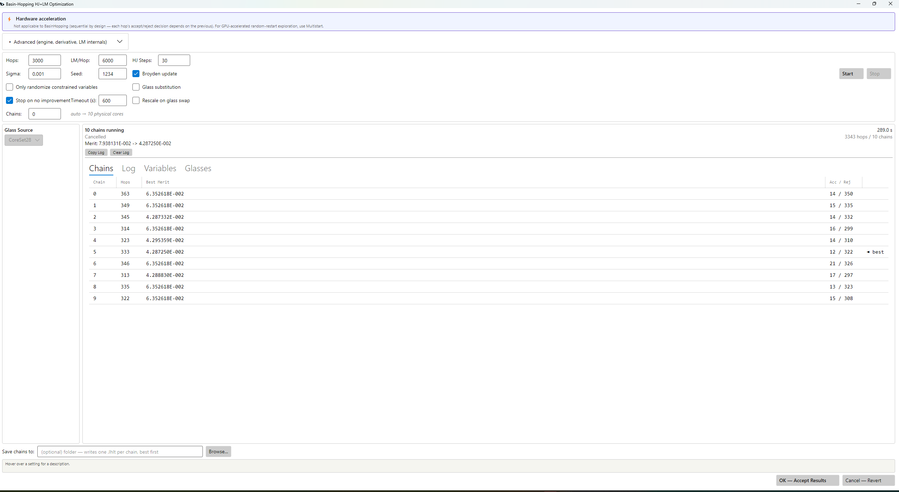

Result: **0.0794 → 0.0429** (289 s, 10 chains). Several chains reached
0.0429 while the rest settled near 0.063 — the spread across chains is
the method telling you which basin is genuinely deepest.

#### Glass substitution on

Allowing substitution from CoreSet28, Basin Hopping digs well past
Multistart's 0.0276:

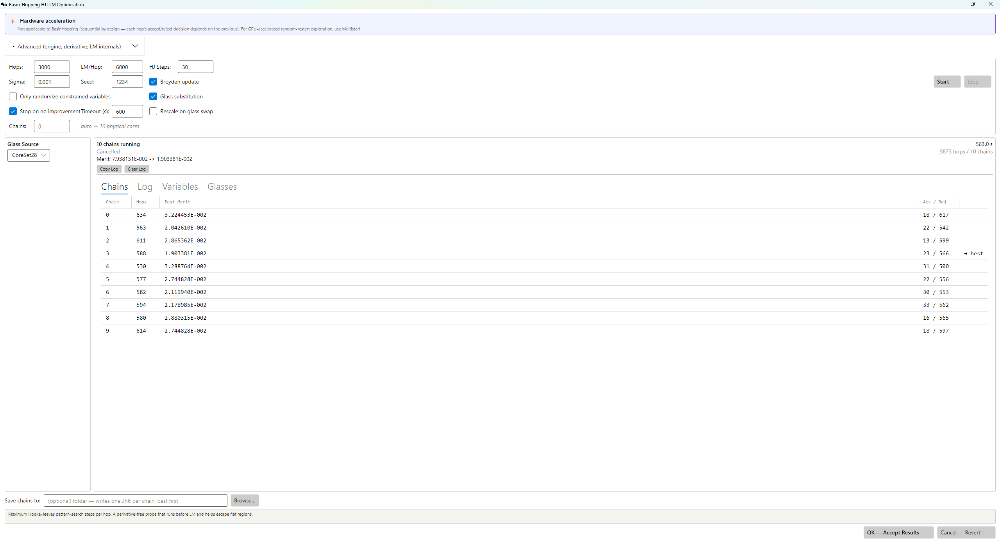

Result: **0.0794 → 0.0190** (563 s) — the deepest minimum any method
reached on this design.

| After — wavefront | After — FFT MTF |
|---|---|
| 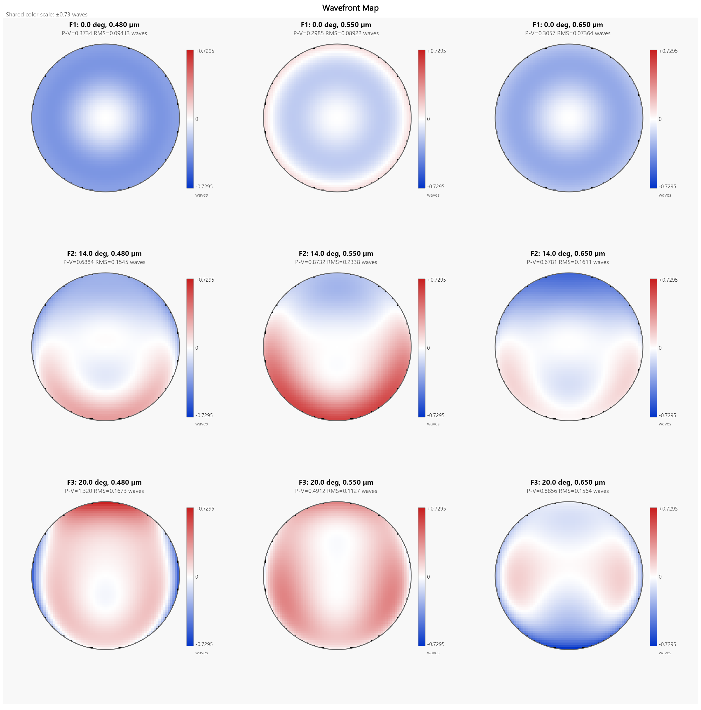 |  |

#### From a bare parallel plate — and why Basin Hopping is more reliable

The demanding test: hand Basin Hopping the same three **flat plates**
Multistart got — every radius infinity, merit 8.0 × 10¹⁴ — and let it
rebuild the lens from nothing.

| Before — three flat plates | After — Basin-Hopping triplet |
|---|---|
|  | 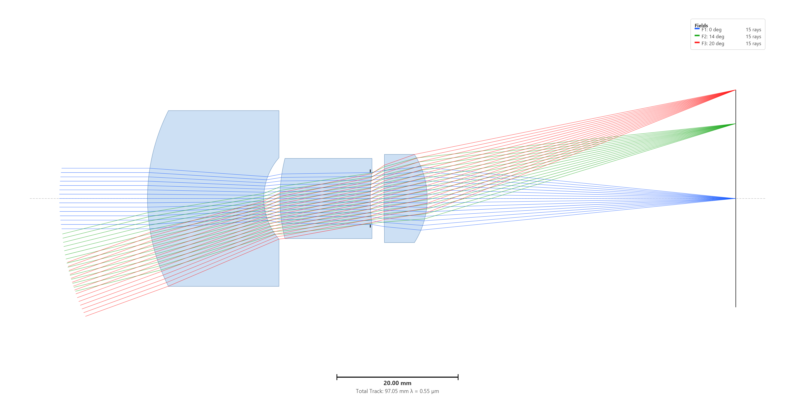 |

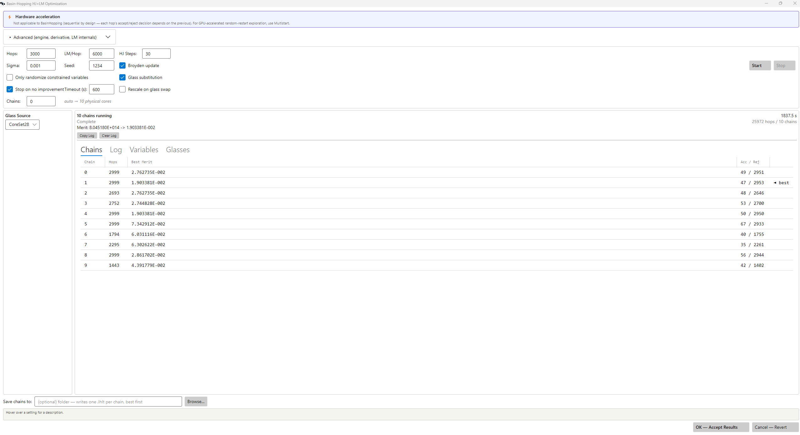

Result: **8.0 × 10¹⁴ → 0.0190** (1837 s, 25 972 hops across 10
chains). That is the **same 0.0190** Basin Hopping reached from the
*finished* triplet — the optimum is **starting-point-independent**; it
simply took longer to get there from nothing. The header also shows the
Phase-1 LM leaving the plate untouched at 8.0 × 10¹⁴ (a zero-curvature
surface has no gradient), so every bit of progress came from the hops.
The converged design is a recognizable Cooke triplet — positive front,
negative middle around the stop, positive rear — built from glasses the
substitution step chose, not any the user specified:

| Spot | FFT MTF |
|---|---|
| 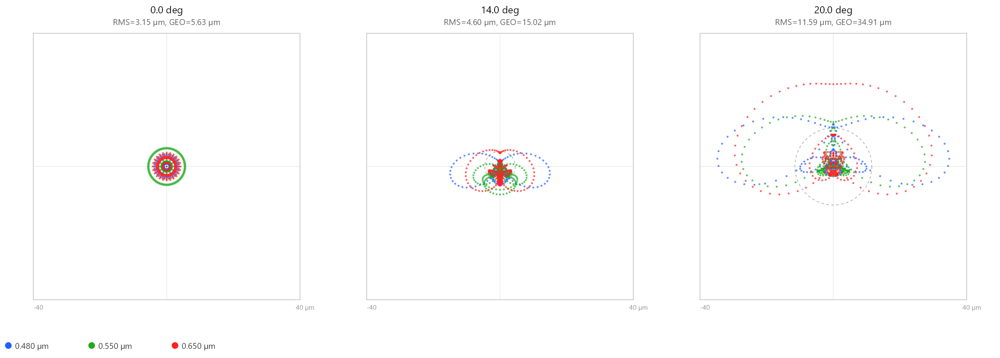 | 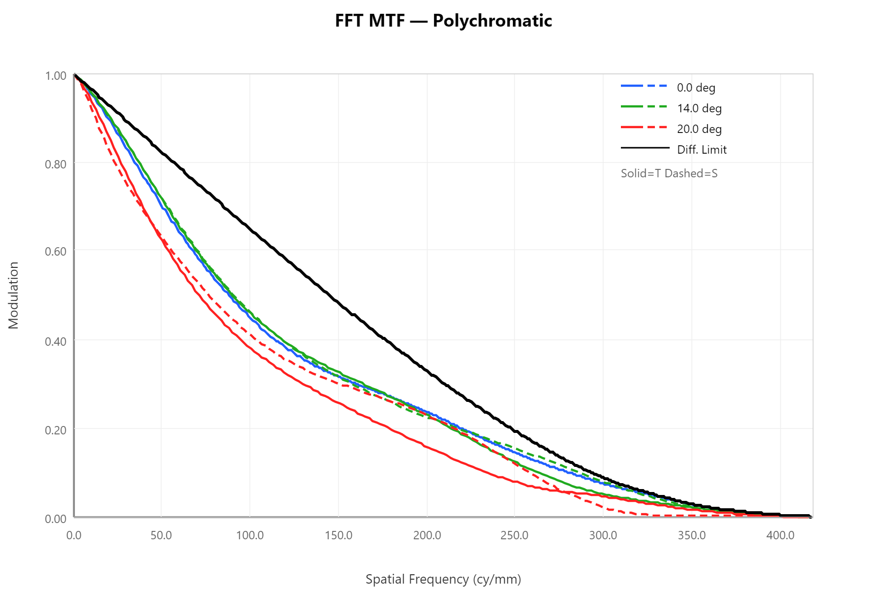 |

**Basin Hopping vs Multistart from the plate.** From the *identical*
flat-plate start, the two methods diverge:

| Method | Result from the plate | Time |
|---|---|---|
| Multistart, glass sub | 0.0287 | 95 s |
| Basin Hopping, glass sub | **0.0190** | 1837 s |

Multistart's independent restarts each land in whatever basin they
happen to hit, and it keeps the best — here that plateaus near ~0.028.
Basin Hopping's *chained* hops, with the Hooke-Jeeves pattern search
running before each LM, walk out of shallow basins toward the deepest
one. So Basin Hopping is slower but more reliable when the start is far
from any good design; Multistart is faster and, with the GPU
pre-screen, scales to far more restarts. After either, the standard
finish is a Local LM pass for the last fraction of a percent.

### Reading the log

A parallel run (Chains > 1) is too noisy to print every hop from every
chain, so the log records only **new global bests** — the moments when
some chain beats the best merit any chain had reached so far:

```
new global best  6.086659E-002   (hop 369)
new global best  5.276065E-002   (hop 1258)
new global best  2.979231E-002   (hop 1283)
```

The hop number is a cumulative counter across all chains, so it climbs
faster than any single chain's own hop count. The header keeps the
running totals — global best merit, and cumulative accepted / rejected /
glass-swap counts — and the **Chains** tab shows each chain's own
progress with a **◄ best** marker on whichever chain currently holds the
global best.

With **Chains = 1** the log is the classic per-hop trace instead:

```
Hop  14 [ACC] merit=4.87551E-002  best=4.87551E-002  glass-swaps=1
Hop  15 [rej] merit=5.37427E-002  best=4.87551E-002
```

`[ACC]` means the post-LM merit beat the previous best; `glass-swaps=N`
is how many glass surfaces were re-randomized for that hop. When a hop's
`merit` is dramatically larger than `best` (10⁴–10⁵), the perturbation
pushed the design into a non-tracing or broken state that LM couldn't
recover from — those hops simply get rejected.

Watch for two patterns:

- **Quick early plunge, long tail.** Like the case study: most of the
  gain in the first fraction of the run, then slow refinement. Normal.
- **Long flat plateau.** Global best unchanged for a long stretch.
  Either you're at the best form for the chosen topology and glass pool,
  or you need a larger Sigma, more variables, or a broader substitution
  catalog — that's what **Stop on no improvement** is for.

## Global Basin Hopping (HJ + LM)

**Optimization → Global Basin Hopping HJ+LM…**

Global Basin Hopping is the **cooperative, run-until-you-say-stop** version of
parallel [Basin Hopping](#basin-hopping-hj-lm). Plain parallel basin hopping
launches one chain per core, runs each to completion once, and returns the best;
the global version never stops a chain — when a chain **stalls** it **restarts
from the best basin any *other* chain has found** and keeps digging, for as long
as you give it. Where [Global Multi Start](#global-multi-start-optimization)
casts the *widest net* (a gallery of distinct forms), Global Basin Hopping drills
the *deepest single answer*: all the chains pool their best basin and pile effort
into it.

The loop, per chain:

1. Run a basin-hopping **episode** (the same hop = perturb → Hooke-Jeeves → LM →
   accept/reject loop described above) with your settings.
2. The episode ends when **either** the per-chain **no-improvement watchdog**
   fires (best merit hasn't improved within the timeout) **or** the chain reaches
   its **Hops** cap.
3. The chain then **restarts**, seeded with a clone of the **best design found so
   far by all the *other* chains** (excluding its own), with its random seed
   advanced so it doesn't retrace — and goes back to step 1.
4. This continues until the **global time limit** elapses or you press **Stop**.

This is why the watchdog is **mandatory** here (you can only edit its timeout,
not turn it off): the restart-from-elite migration is the entire mechanism, and a
chain has to be *allowed to stall* in order to jump to a better basin.


### Settings

The per-chain HJ-LM knobs are the **same as Basin Hopping** — Hops, LM/Hop, HJ
Steps, Sigma, Seed, Broyden update, Glass substitution, Rescale on glass swap,
Only-randomize-constrained, the Glass Source, the **Metropolis walk** (with its
**Temp**), and the full-range restart (**Restart@stall**, **Restart σ**) — and
behave identically *inside* each episode. The differences are the three controls
that govern the global loop:


| Setting | Default | Meaning |
|---|---|---|
| **Chains** | auto (physical cores) | **Fixed** — not editable. One chain per physical core; shown read-only as "auto → N physical cores". |
| **Stop on no improvement** / **Timeout (s)** | on / 600 | **Always on.** A chain restarts (from the elite of the other chains) when its best merit hasn't improved within this many seconds. Only the timeout is editable. |
| **Global (min)** | 120 | Total wall-clock budget. The whole run stops when this elapses (or you press Stop). 0 = run until you stop it. |

`Hops` is now the **episode** cap rather than the run length — set it high (the
default 2000 rarely caps an episode before the watchdog does) unless you
specifically want short, frequent restarts.

### Reading the dialog

- **Header** (e.g. *"9503 hops / 10 chains / 43 restarts"*) — totals across the
  whole run: every hop summed over all chains, and how many times chains have
  reseeded from the elite.
- **Chains tab** — one row per chain:
  - **Hops** is that chain's **cumulative** total; it **does not reset on
    restart** (so the per-chain Hops sum equals the header's total).
  - **Best Merit** is the chain's best-ever design.
  - **Restarts** counts how many times that chain has reseeded from the others.
  - **◄ best** marks the chain currently holding the global best.

A healthy run shows the per-chain *Best Merit* values converging — that's the
elites propagating — while *Restarts* climbs as stalled chains keep jumping to the
shared best basin.

### Finishing

When the run ends, the **Chains tab becomes a gallery** of each chain's best
design (sorted best-first, the global best pre-selected). The global best is
already applied to your system; to take a different chain instead, select its row
and click **Apply Selected**. Set **Save chains to** to write every chain's best
design as its own `.lhlt` (best-merit first) — feed those into a later
[Split Element](#split-element), asphere search, or a fresh Multistart.

Global Basin Hopping is available everywhere the other optimizers are: the GUI
dialog above, the CLI (`optimize global-basin … timeout= globalmin= savechains=`),
the MCP tool `global_basin_hopping_start` (non-blocking — poll `optimize_status`),
and the .NET API (`IOptimization.GlobalBasinHopping`).

## Split Element

**Optimization → Split Element**

Adds a degree of freedom to a converged design by splitting a
glass element into two thinner elements with a small air gap
between them. The motivation is the same one that turned the
classical Cooke triplet into a four-element Tessar: at some
point the existing surface count runs out of correction power
and the only path forward is more surfaces. Multistart and
Basin Hopping can move the design around in the space it has;
Split Element grows the space.

A run does five things in order:

1. **Pick an element.** Each element gets an aberration score
   from the sum of `|S1| + |S2| + |S3|` (spherical + coma +
   astigmatism Seidel coefficients) across its two surfaces; the
   highest scorer is the candidate. The log line `Selected:
   surface 5 (N-PSK53A), aberration score: 0.27` reports the
   chosen element by its front surface and material.
2. **Insert the new surface.** The element is split into a
   front-glass + air-gap + back-glass triple, sized so the
   geometry initially preserves the parent's optical effect.
   Merit jumps temporarily because the merit function now has
   two more thickness operands and the new airspace adds an
   `EA` row.
3. **Pre-glass Multistart** (with the *original* glass on both
   halves of the split). Continuous variables only. Walks the
   merit down to whatever the new geometry can do without
   changing materials.
4. **Glass trials.** Enumerates pairs of glasses from the
   selected filtered catalog and runs a short LM on each pair.
   The capped count (`Glass Trials`) sets the budget; the actual
   number can be smaller after the catalog filters out
   incompatible pairs (the run below tried 202 of 300).
5. **Post-glass Multistart** (with the best pair from step 4)
   refines around the new material choice.

Both Multistart phases auto-advance after a configurable idle
window (`Skip phase if no improvement for (s)` — default 600 s)
so a stuck phase doesn't block the run.

| Setting | Default | Meaning |
|---|---|---|
| **Max Splits** | 1 | Number of split passes. Each pass picks the highest-aberration surface from the *current* state and splits it. |
| **Glass Trials** | 300 | Cap on glass-pair combinations tried in the glass-trial phase. Actual count may be lower after catalog-pair filtering. |
| **LM/Trial** | 4000 | Per-trial LM iterations during glass trials. |
| **Pre-Glass MS** | 4000 | Multistart trials before glass swaps. |
| **Post-Glass MS** | 2500 | Multistart trials after the best glass pair is locked in. |
| **Post LM** | 4000 | Final LM iteration cap after both Multistart phases. |
| **MS Sigma** | 0.001 | Init Sigma for both Multistart phases — the same grow-on-rejection schedule as the standalone Multistart. |
| **Min Glass / Max Glass** | 1 / 25 mm | Centre-thickness bounds enforced on the split's glass halves. |
| **Min Air / Max Air** | 0.1 / 25 mm | Bounds on the new air gap between the split halves. |
| **Min Edge** | 0.5 mm | Minimum edge thickness on the split element. |
| **Skip phase if no improvement for (s)** | 600 | Idle window before a Multistart phase auto-advances. |
| **Constrained only** | off | Per-Multistart-phase setting; restricts perturbation to bounded variables. |
| **Reject if worse** | on | If the post-pass merit is worse than the pre-split merit, the original geometry is restored. The merit usually improves substantially, but this is the safety net. |
| **Glass Source** | first filtered catalog | Filtered catalog supplying glass-pair candidates. Cherry-picked or criteria-built — see [Glass Catalogs](glass-catalogs.md). |

### Case study: post-Multistart Cooke triplet → split element

Sample files: `samples/UserGuide/CookeTripletSplit/`. The starting state
is a Cooke triplet that was first synthesized from three parallel
plates (finite conjugate, 500 mm working distance) by Multistart
with glass substitution. By the time Split Element runs, the
design is already at merit `2.19 × 10⁻³` and Local LM finds no
further improvement.

| Before — converged Cooke triplet | After — split rear element |
|---|---|
| 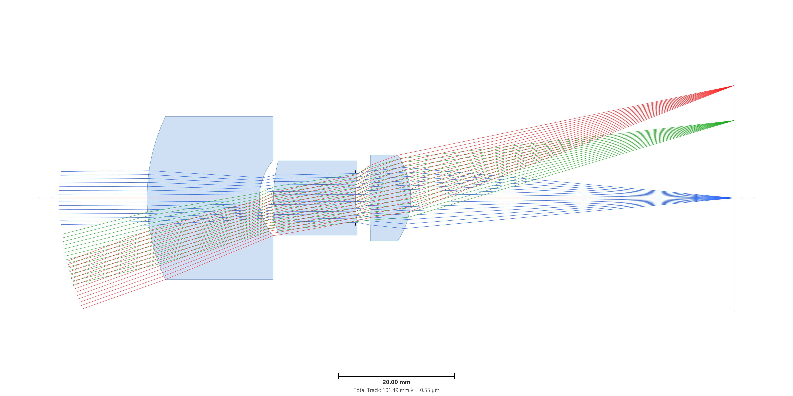 | 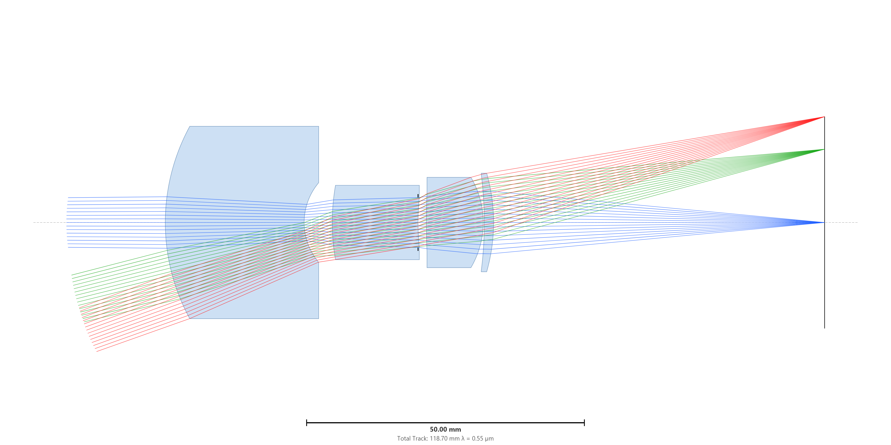 |

Settings: defaults except `Glass Source = CoreSet28`. The dialog
on completion:

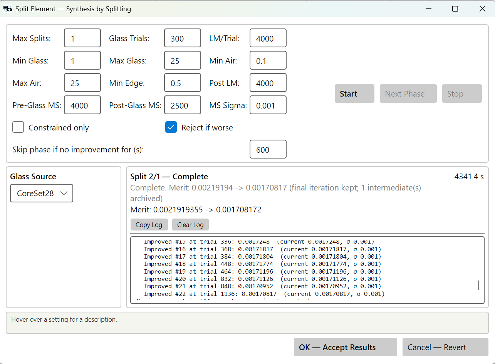

The trajectory from the log:

| Phase | Merit | Note |
|---|---:|---|
| Start | 0.00219 | Converged Cooke triplet input. |
| Surface picked | — | Surface 5 (N-PSK53A), aberration score 0.27. |
| After insertion | 41.4 | Merit spikes — new operands and a 3-into-3 element split with the original glass on both halves. |
| Pre-glass MS, trial 16 | 0.0131 | Continuous variables alone recover most of the geometry. |
| Pre-glass MS, trial 704 | 0.00193 | 39 improvements; auto-advances after 610 s idle. |
| Glass trials, trial 124 | 0.00188 | Best pair: **N-FK58 + N-LAK10**. Tried 202 of 300 generated combinations. |
| Post-glass MS, trial 1136 | 0.00171 | 22 further improvements; auto-advances after 604 s idle. |
| **Final** | **0.00171** | Total wall-clock 4341 s (≈ 72 min). |

Net: merit `0.00219 → 0.00171` (~22 % reduction). Total track
grew from 101.5 mm to 118.7 mm. The headline gain is modest
*relative* to what Multistart and Basin Hopping had already done,
but it's gain you cannot get without adding the surface — the
input was the floor of its own basin.

| Spot before | Spot after |
|---|---|
| 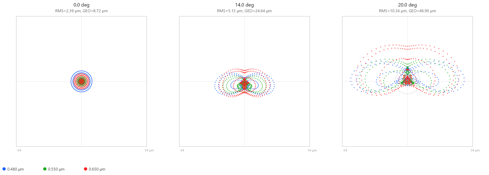 | 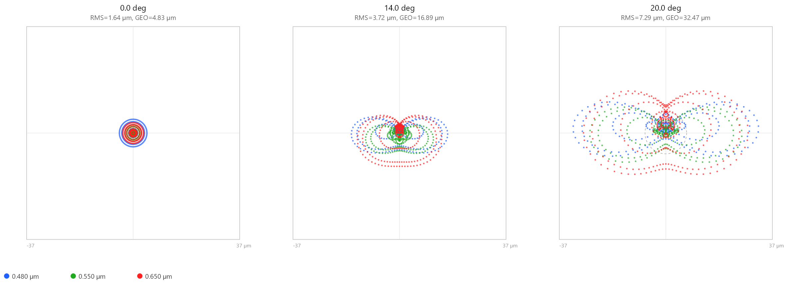 |

| FFT MTF before | FFT MTF after |
|---|---|
| 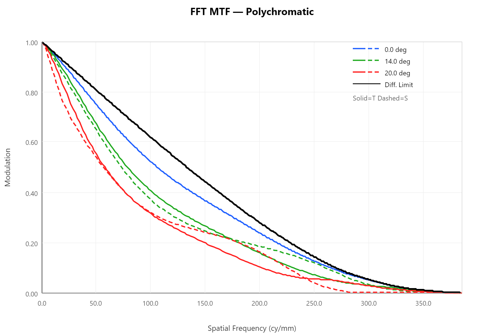 | 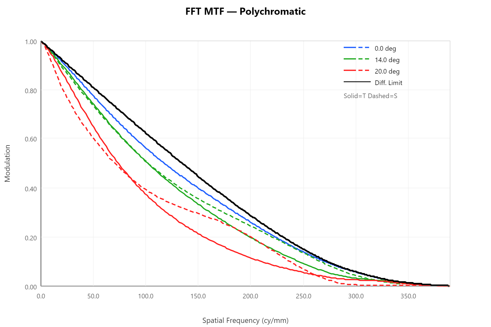 |

When to reach for Split Element:

- After Multistart / Basin Hopping have plateaued and Local LM
  finds no further improvement on the *current* topology.
- When the merit shows a clear residual aberration concentrated
  on one element. The aberration scorer ranks all elements by
  their summed `|S1|+|S2|+|S3|` and picks the top one; you can
  see its choice in the log on every run.
- When the design budget tolerates one more lens element — Split
  Element strictly *adds* a surface, never collapses one back.

What it isn't:

- A topology search. Split Element only refines around an
  existing topology by adding one surface at a time. To go from
  a doublet to a triplet, you'd run Split twice on different
  surfaces; to go from parallel plates to a Cooke triplet, run
  Multistart or Basin Hopping with glass substitution first.

## Search Best Asphere Surface

**Optimization → Search Best Asphere Surface…**

Different way to add a degree of freedom: instead of inserting a
new surface (Split Element), pick existing surfaces and turn them
into even-aspheres. The dialog enumerates every glass surface,
runs a short LM trial with that surface aspherized, ranks the
surfaces by post-trial merit, applies the top-N changes
permanently, and finishes with one final LM polish.

A run does four things in order:

1. **Enumerate candidate surfaces.** Every glass surface is a
   candidate (the log line `Candidate surfaces: 4 (1, 3, 5, 7)`
   reports them).
2. **Per-surface trial.** For each candidate, the surface is
   converted to Even Asphere with the selected coefficients (A4,
   A6, A8) marked variable, then `LM/Trial` LM iterations run.
   The post-trial merit and Δ % vs the starting merit are
   recorded; after each trial the surface is reverted.
3. **Apply top N.** Trials are ranked by post-trial merit and
   the top `Top N` are applied permanently — those surfaces stay
   as Even Asphere with the LM-optimized coefficients.
4. **Final LM polish** (`Final LM` iterations) runs on the
   composite design (now with N aspheric surfaces simultaneously
   variable) to pick up the cross-coupling gain.

| Setting | Default | Meaning |
|---|---|---|
| **A4 / A6 / A8** | A4, A6 on; A8 off | Which even-asphere coefficients to mark variable on each trial. A4 and A6 are on by default; enable A8 when a surface is working hard. Higher orders give finer correction but slower convergence and tighter manufacturability requirements. |
| **Top N** | 1 | How many of the ranked candidate surfaces to apply after the trial sweep. Default **1** = the single best surface; a larger N applies several for a composite improvement at the cost of more aspheric surfaces in the final design. |
| **LM/Trial** | 500 | LM iterations per per-surface trial. A short trial is enough to *rank* the candidates; the real polish happens in the Final LM step, so this stays small to keep the candidate × trial sweep fast. |
| **Final LM** | 6000 | LM iterations for the post-application polish across all newly aspheric surfaces. |
| **Min Δ %** | 1 | Minimum trial improvement (over the starting merit) required to consider a candidate surface. Trials below this are still listed in the table but the picker skips them when applying. |
| **Reject if worse** | on | If the post-final-LM merit is worse than the pre-search merit, the original geometry is restored. |

> **Why A4/A6/A8 and not the conic constant.** The search fits the even-aspheric
> polynomial coefficients and deliberately holds the conic constant `k` at 0. To lowest
> order the conic is *degenerate* with A4: the base conic's departure from a sphere is
> `((1+k)/8)·c³·r⁴ + …` — a term in **r⁴**, exactly what A4 controls. Free both `k` and
> A4 and they push on the same handle, giving a rank-deficient, ill-conditioned fit. The
> conic's higher-order effect (r⁶, r⁸…) is itself a constrained subset of what A6/A8
> already span, so once the polynomial is free the conic adds little but conditioning
> trouble. The polynomial is the more general parameterization, so it's the one the
> search uses — if a surface "wants" a strong conic, you'll see it show up as a large A4.

### Case study: aspherizing a well-corrected Cooke triplet

Sample files (`samples/UserGuide/LensFilesForManual/`):
`CookeTriplet_UC_GS_Best_BeforeAspherization.lhlt` (start),
`CookeTriplet_UC_GS_Best_AfterAspherization.lhlt`, and
`CookeTriplet_UC_GS_Best_AfterAspherization_AfterBasinHoppimg.lhlt`.

The starting design is an already well-corrected Cooke triplet —
the best result of an earlier Basin-Hopping run — with a merit of
`0.02627`. The goal is to squeeze it further by aspherizing two
surfaces, then let Basin Hopping re-explore the glasses on the
aspheric design.

#### First: add intermediate fields

Before adding aspheres, **widen the field sampling**. This design
was corrected on the usual three fields (0°, 14°, 20°), which is
fine for all-spherical surfaces. But an even asphere adds several
new degrees of freedom per surface, and the optimizer will happily
spend them driving the merit down *at the sampled fields* — which
can leave large gaps in between. The symptom is an MTF-vs-field
curve that is excellent at 0 / 14 / 20° but sags badly at the
un-sampled fields between them.

The remedy is to sample the field more densely before optimizing.
Here the field set was expanded to seven points — 0, 5, 8, 11, 14,
17, 20° — so the optimizer has to keep *every* field honest:

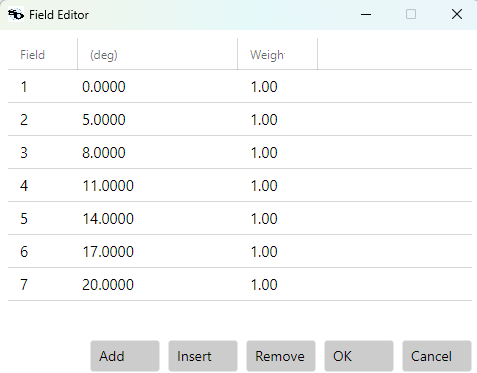

On this denser field set the starting design's merit is `0.02627`.

#### The asphere search

Settings — A4 / A6 / A8 all on (A8 enabled manually), **Top N = 2**,
LM/Trial = 500, Final LM = 6000, Min Δ % = 1, Reject if worse on:

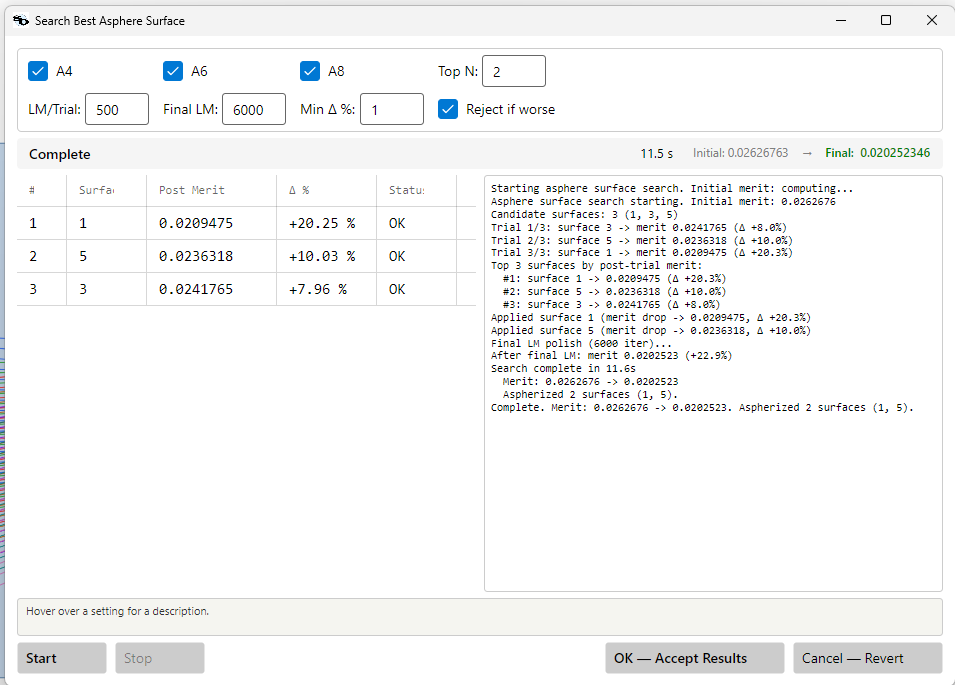

The candidate surfaces are the three glass front surfaces (1, 3, 5).
The per-surface trial sweep (11.6 s) ranks them:

| # | Surface | Post-trial merit | Δ % |
|---|---:|---:|---:|
| 1 | 1 | 0.020947 | +20.3 % |
| 2 | 5 | 0.023632 | +10.0 % |
| 3 | 3 | 0.024176 |  +8.0 % |

With **Top N = 2**, surfaces 1 and 5 are aspherized; surface 3 is
left spherical. The final LM polish across the two new aspheric
surfaces takes the merit to `0.020252` — a **+22.9 %** reduction
from the `0.026268` start.

#### Follow-on: Basin Hopping on the aspheric design

This is exactly the workflow that used to abort before 1.0.137 —
a global search on a design that already carries aspheric surfaces.
It now runs to completion (see the release note for 1.0.137).

The aspherized design still uses the exotic glasses inherited from
the earlier optimization (S1 `N-SF57`, S3 `LASF35`, S5 `N-PSK53A`).
Running Basin Hopping with **Glass substitution on** and **Glass
Source = CoreSet28** (a curated 28-glass, readily-manufacturable
set) lets it trade those for catalog glasses while re-tuning the
aspheric coefficients:

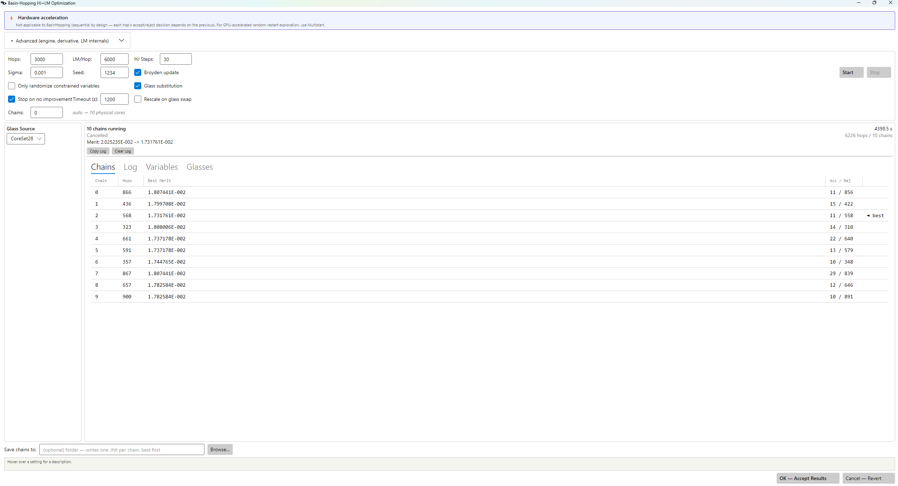

Settings — Hops 3000, LM/Hop 6000, HJ Steps 30, Sigma 0.001,
Broyden update on, 10 chains (auto), stop-on-no-improvement after
1200 s. The run stopped on the no-improvement timeout after 6226
hops across 10 chains (~73 min); the best chain (chain 2) reached
merit `0.017318` in 568 hops.

Result: merit `0.020252 → 0.017318` (a further −14.5 %). All three
glasses were swapped onto the CoreSet28 catalog —
`N-SF57 → F2`, `LASF35 → SF2`, `N-PSK53A → N-PK51` — and both
aspheric surfaces (1, 5) were kept, with re-optimized coefficients.

#### Progression across the three stages

**MTF vs field** — the payoff from the denser field sampling: the
response stays uniform across the whole field instead of sagging
between the corrected points.

| Before | After asphere | After asphere + Basin Hopping |
|---|---|---|
| 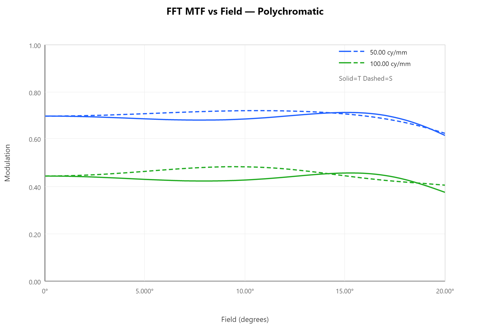 | 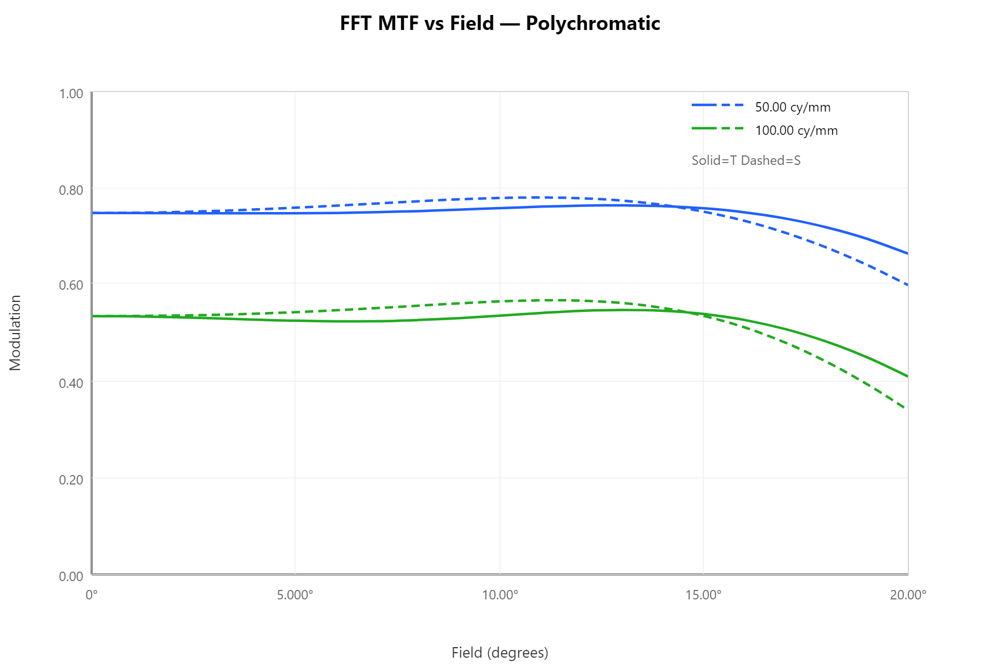 | 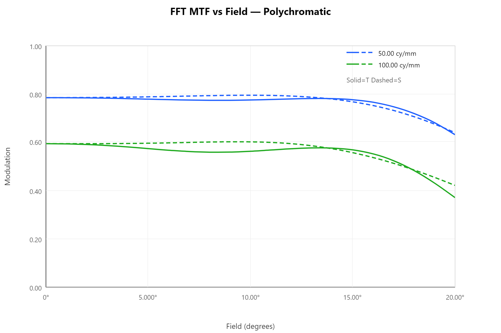 |

**FFT MTF**

| Before | After asphere | After asphere + Basin Hopping |
|---|---|---|
| 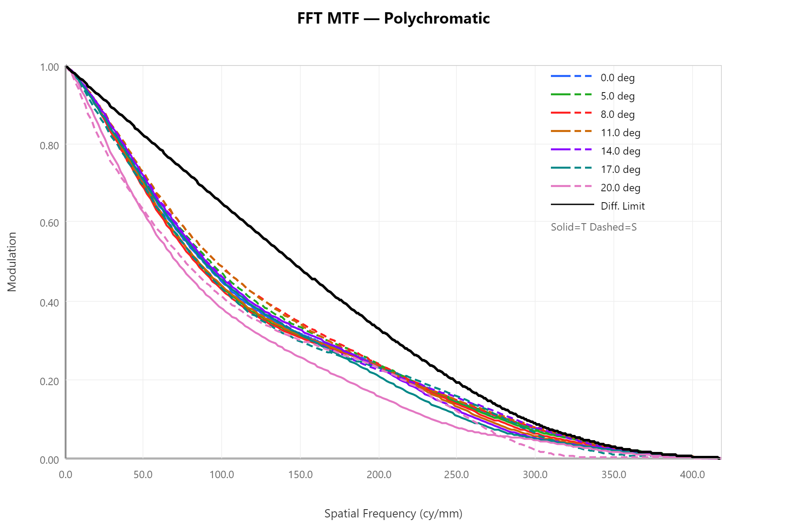 | 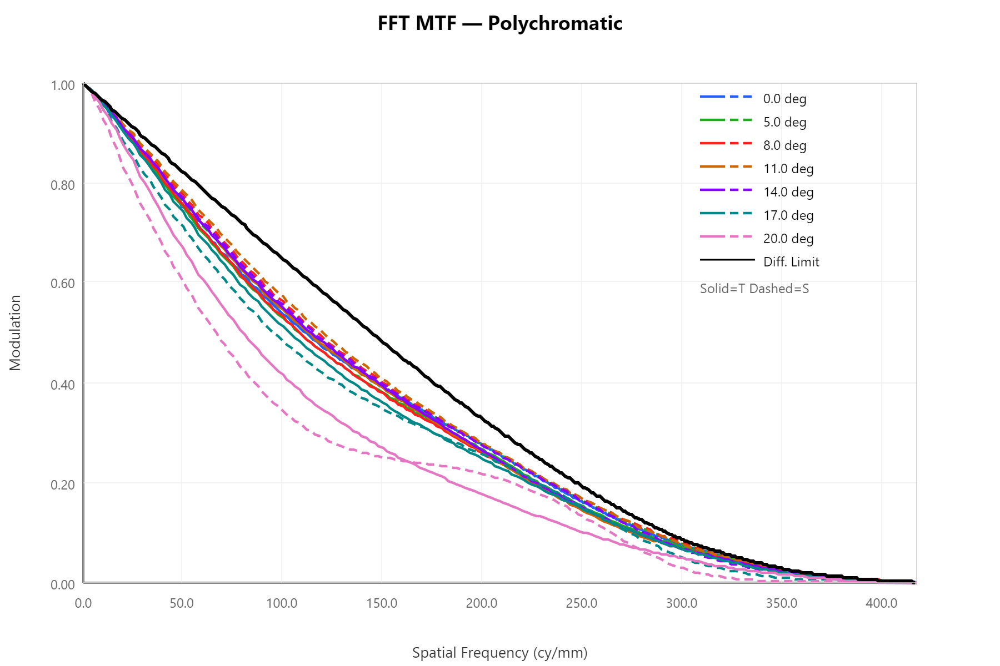 | 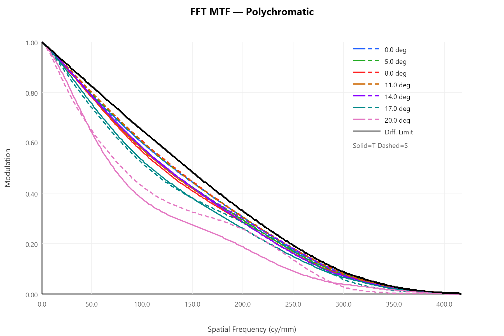 |

**Spot size — RMS radius (µm), polychromatic**

The spot radii are tabulated rather than shown as diagrams (the
per-field spot images are hard to read at print size). Note the
trade the added fields force: the on-axis spot grows a little
(3.15 → 4.49 µm) while the 20° edge improves by ~38 %
(11.59 → 7.21 µm). The design is redistributed for uniformity
across the field instead of being peaked on-axis — which is what
keeps the MTF-vs-field curve flat.

| Field (°) | Before | After asphere | After asphere + BH |
|---:|---:|---:|---:|
| 0  |  3.15 | 3.34 | 4.49 |
| 5  |  3.02 | 2.87 | 4.16 |
| 8  |  2.92 | 2.33 | 3.64 |
| 11 |  3.22 | 2.33 | 2.92 |
| 14 |  4.60 | 3.63 | 2.56 |
| 17 |  7.40 | 6.03 | 4.03 |
| 20 | 11.59 | 9.21 | 7.21 |

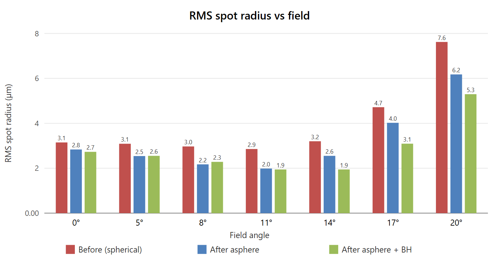

**Wavefront map**

| Before | After asphere | After asphere + Basin Hopping |
|---|---|---|
| 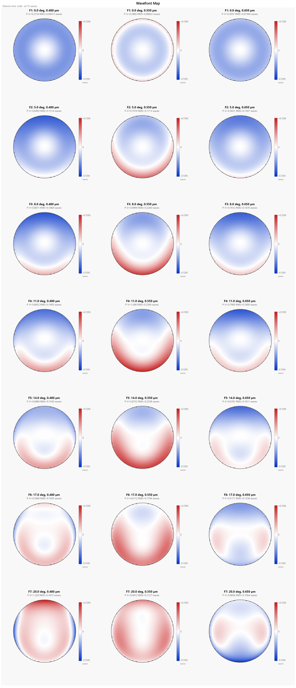 | 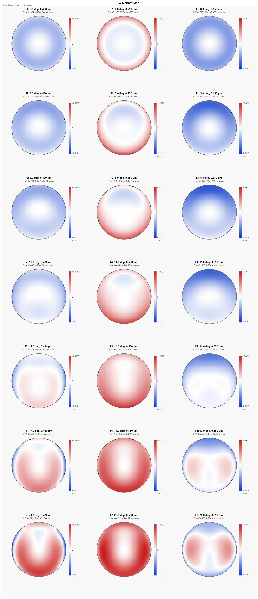 | 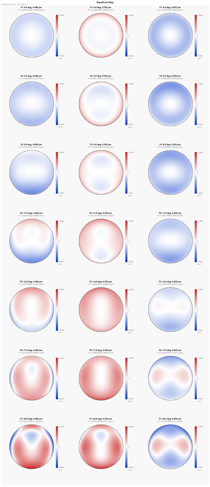 |

**Wavefront error — RMS (waves), polychromatic**

Weighted-RMS over the three lines (0.48 / 0.55 / 0.65 µm), the same
convention as the merit function. The worst-field error falls from
0.209 to 0.126 waves and flattens across the field — the aspheres
correct the mid-field zones, and the Basin-Hopping glass swap takes
the on-axis error down to λ/22.

| Field (°) | Before | After asphere | After asphere + BH |
|---:|---:|---:|---:|
| 0  | 0.086 | 0.067 | 0.045 |
| 5  | 0.152 | 0.086 | 0.052 |
| 8  | 0.195 | 0.091 | 0.056 |
| 11 | 0.209 | 0.087 | 0.069 |
| 14 | 0.187 | 0.087 | 0.064 |
| 17 | 0.137 | 0.105 | 0.077 |
| 20 | 0.147 | 0.132 | 0.126 |

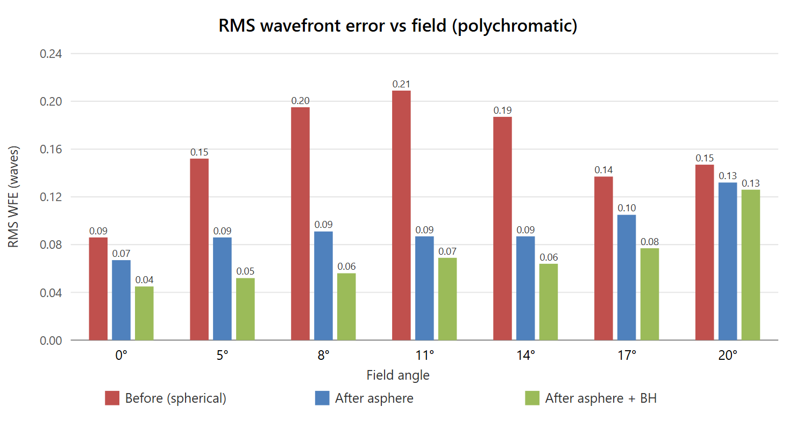

**Layout**

| Before | After asphere | After asphere + Basin Hopping |
|---|---|---|
| 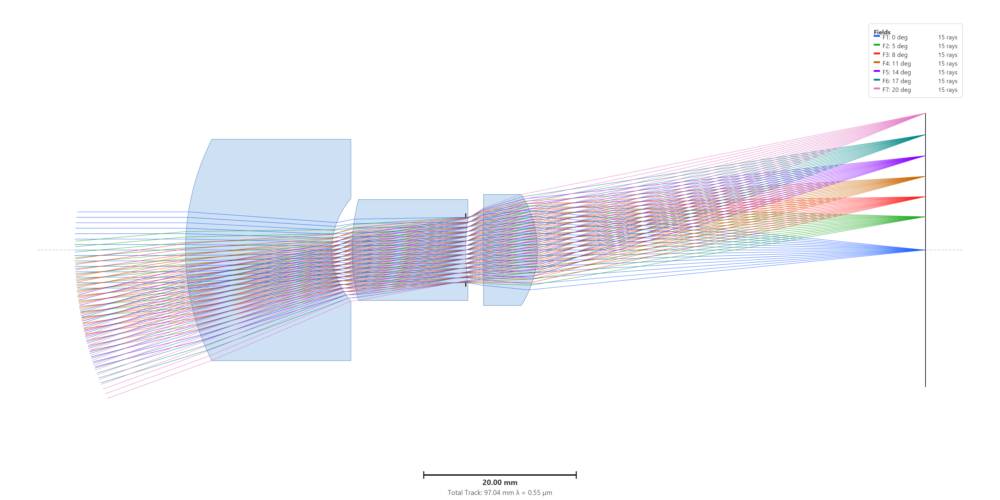 | 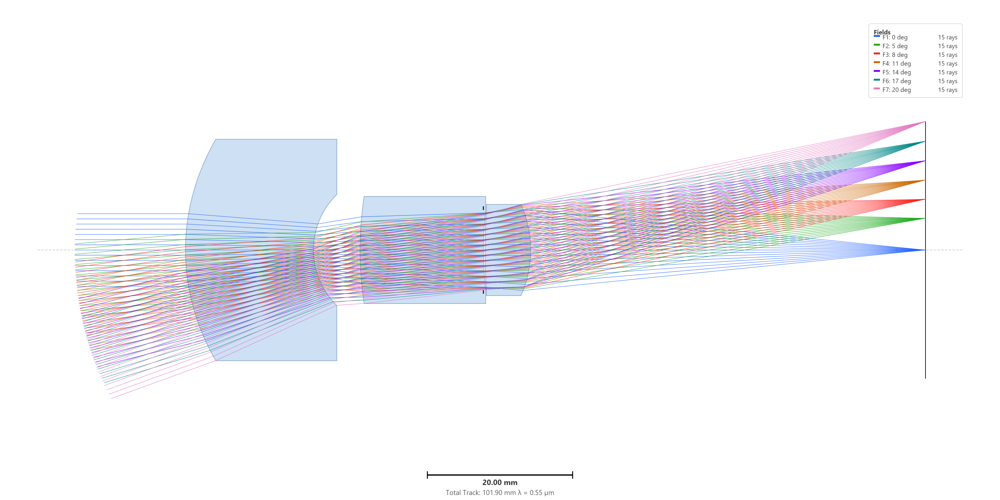 | 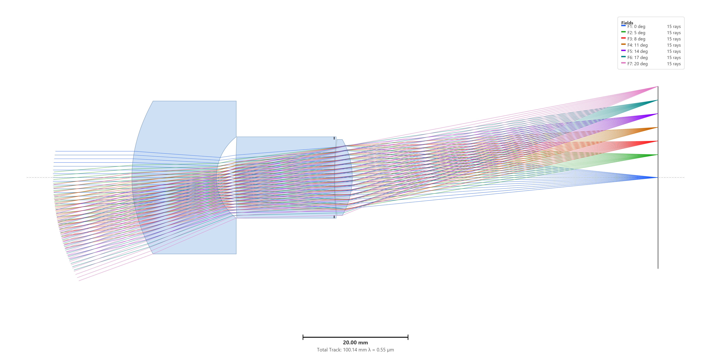 |

Net: the chain took the merit from `0.02627` (spherical) to
`0.02025` (two aspheres) to `0.01732` (aspheres + a manufacturable
glass swap) — a **34 % reduction** overall, and the final design
sits on catalog glasses. Two practical notes:

- **Aspheric surfaces are not free to fabricate.** Keep Top N as
  low as the design allows — here two surfaces bought the bulk of
  the gain, and surface 3 was left spherical on purpose.
- **Add fields before you add degrees of freedom.** The extra
  aspheric coefficients make it easy to over-fit the sampled
  fields; the denser 7-field set is what keeps the MTF-vs-field
  curve uniform through the whole image.

## SPC (Synthesis by Saddle-Point Construction)

**Optimization → Synthesis by SPC…**

A topology generator. SPC grows a design one element at a time
by finding *saddle points* in merit-vs-curvature space and
branching off them — perturbing the saddle in either direction
spawns two distinct local minima, and the better of each pair
becomes the seed for the next round. Where Multistart and Basin
Hopping shuffle parameters within an existing topology and Split
Element grows a topology by one surface per call, SPC is the only
tool in the box that can grow a design from a single lens to an
arbitrary multi-element topology in one run.

The method follows Hou et al., *Optics Express* 24, 21 (2016).

A run does five things per **level** (one new element added per level):

1. **Pick insertion positions.** Every air gap in every surviving
   parent design is a candidate. The **Insert side** dropdown can
   restrict to pre-stop only (objective-style) or post-stop only
   (eyepiece-style); default is both sides.
2. **Insert a near-zero null element.** A glass element that is
   optically inert (front and rear curvatures equal, infinitesimal
   thickness) is dropped into the air gap. The merit jumps because
   the bootstrap penalty grows the null element to a real thickness.
3. **Scan curvature for saddles.** The shared front+rear curvature
   is swept across `[Scan c-min, Scan c-max]` in `Steps` samples.
   Saddle points — where the merit's first derivative changes sign
   non-monotonically — become the branch seeds.
4. **Perturb and optimize.** Each saddle spawns two branches (`+ε`
   and `−ε` perturbations of the curvature). A bootstrap LM grows
   the null element above `Min Glass`, then a full LM runs on each
   branch. After convergence, **glass trials** swap in random
   glasses (or glass *pairs* for cemented doublets) and re-optimize.
5. **Prune to Top-N.** All branches are ranked by final merit and
   the best `Top N` survive to seed the next level.

### Element topology

The **Element** dropdown picks what gets inserted at each saddle:

- **Single** — one glass element with two surfaces (the original
  Hou paper formulation). Cheapest per candidate.
- **Cemented Doublet** — three surfaces (front-glass A,
  cemented A-B interface, back-glass B). The saddle scan locks all
  three curvatures together so the seed remains a null element;
  glass trials enumerate (A,B) pairs and the post-saddle LM relaxes
  the doublet into an achromat. The crown glass comes from
  **Null glass** and the flint partner from **Flint glass** (defaults
  N-BK7 + SF5). Seeding both surfaces with the same glass collapses
  the doublet to a single thicker block during the scan, which is
  why a real flint partner is required from the start.
- **Single + Cemented Doublet** — runs both topologies at every
  position; the Top-N ranking picks the best across topologies.
  Roughly 2× the per-position compute cost. Modes that include
  doublets auto-drop Top N from 5 to 3 because doublet candidates
  are much more expensive to optimize.

`Max Elements` counts **insertions**, not lens elements — a doublet
counts as one insertion but two lenses. With `Max Elements = 2` in
"Single + Cemented Doublet" mode the result can be 2 singlets,
2 doublets (4 lenses), or 1 of each (3 lenses), depending on which
the Top-N ranking picks at each level.

### Selected settings

| Setting | Default | Meaning |
|---|---|---|
| **Max Elements** | 2 | Number of insertion levels. Each level adds one element (single = 1 lens, doublet = 2 lenses). |
| **Top N** | 5 (3 if doublets enabled) | Branches kept per level. Higher → broader search; lower → faster. |
| **Threads** | CPU cores | Outer-parallel branch evaluation. |
| **Scan c-min / c-max** | −0.1 / +0.1 | Curvature scan range applied to the inserted surface. Widen if the log reports saddles outside the range. |
| **Steps** | 100 | Samples between c-min and c-max. |
| **Glass Trials** | 50 | Random glasses (or pairs) tried per branch after the geometry converges. |
| **LM/Trial** | 4000 | Per-glass-trial LM iteration cap. |
| **Min Glass / Max Glass** | 1 / 25 mm | Centre-thickness bounds applied to inserted glass elements. |
| **Min Air / Max Air** | 0.1 / 50 mm | Air-gap bounds. |
| **Min Edge** | 1 mm | Edge-thickness floor enforced via `EG`/`EA` operands. |
| **Post LM** | 4000 | Final LM after the glass trials on each surviving branch. |
| **Insert side** | Both | Restrict insertions to pre-stop or post-stop air gaps. |
| **Element** | Single | Topology of each new insertion (see above). |
| **Null glass / Flint glass** | N-BK7 / SF5 | Crown / flint seed for the inserted element. The trial phase replaces these later. |
| **Glass Source** | first filtered catalog | Glass pool for the trial phase. |

### Constraining proportions: the `DTRG` operand

SPC is unusually willing to make extreme element shapes — the
saddle scan happily lands on configurations with a wafer-thin
meniscus or a brick-thick block if those locally minimize the
image-quality residuals. The `EG` / `EA` operands keep edges
above a floor, but they don't prevent the *centre* from growing
absurd relative to the lens diameter.

The fix is the **`DTRG`** operand (Diameter-to-Thickness Ratio,
Glass-only) — see [Merit Function § Boundary operands](merit-function.md).
`DTRG = 2·SD / |CT|`; bounding it to roughly `[2, 10]` enforces
fabricable proportions: the centre thickness can be at most half
the diameter (no super-thick blocks) and at least one tenth of the
diameter (no wafer lenses). One row covering the inserted-element
range with weight `0.3` is enough — the case study below uses it.

### Case study: BK7 singlet → 3-element design (singlet + doublet)

Sample folder: `samples/UserGuide/SingletBK7SPC/`. The
starting design is a single biconvex N-BK7 element (50 mm EFL,
F/4, 12.5 mm entrance pupil, fields 0/7/10°, three visible wavelengths).
Glass substitution is enabled on S1 against the `S1_GLASS`
filtered catalog. The merit function carries the full boundary
set — `EG`, `EA`, `CTG`, `CTA` plus an explicit BFL operand —
and a **`DTRG` row** with weight `0.3`, bounds `[2, 10]`, covering
the inserted-element span.

| Before — single biconvex BK7 | After — singlet + cemented doublet around the stop |
|---|---|
| 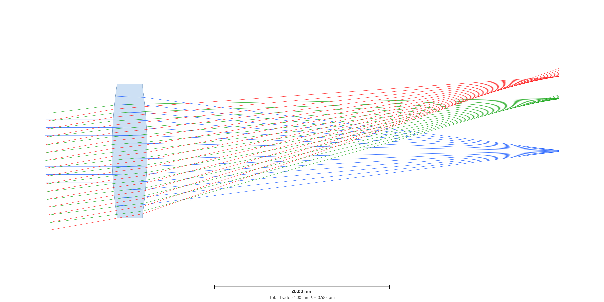 | 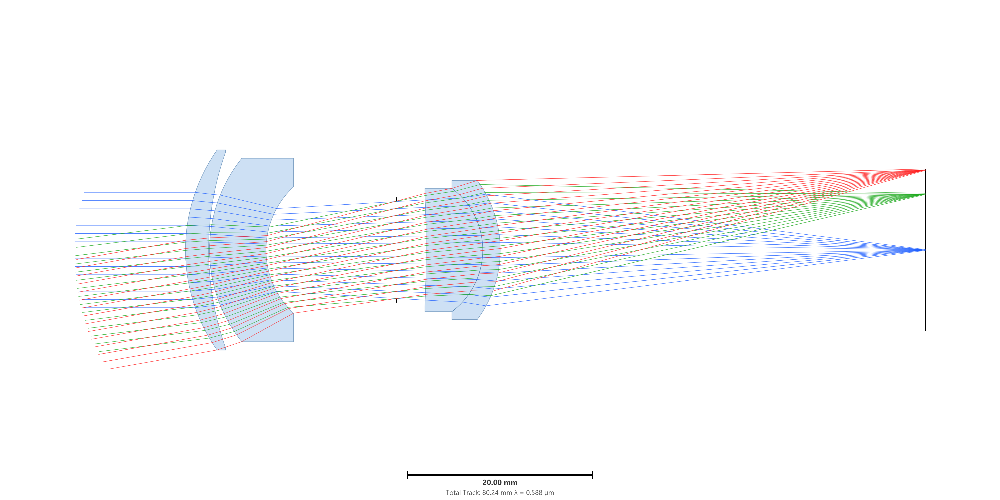 |

The starting merit function — note the `DTRG` row (#7, weight
0.3, bounds 2-10, span S1-S3) and the dedicated BFL `CTA` row
(#8, S3 only, min 40 mm). Boundary operands span the full
inserted range so SPC's geometry stays manufacturable as the
design grows:

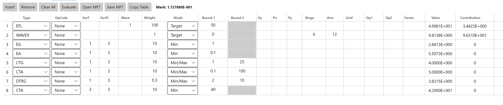

Settings used:

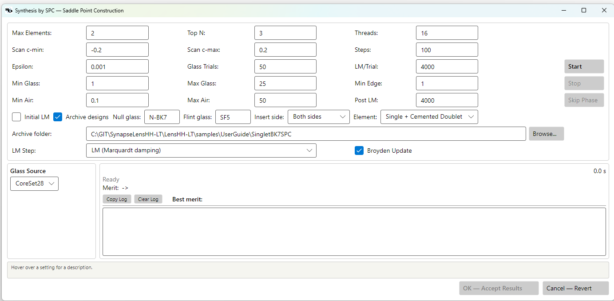

`Max Elements = 2`, `Element = Single + Cemented Doublet`,
`Top N = 3` (auto-set when doublets are enabled), `Glass Source
= CoreSet28`. The two non-default knobs that mattered: **Scan
range widened to ±0.2 and Steps raised to 200** — the BK7 starting
design has surface curvatures around `±0.02 mm⁻¹`, but the saddles
the SPC method needs to find sit out near `±0.1` (you can see this
in the L2 BEST line: `c = 0.0671`). Default `±0.1` would have
clipped half of them; doubling the range and the steps keeps the
sample density matched.

The Top-N ranking picked one **single** insertion at one level and
one **cemented doublet** at the other — exactly the mix the "Both"
topology mode is designed to surface.

The trajectory from the log:

| Phase | Best merit | Note |
|---|---:|---|
| Start | 0.925 | Biconvex BK7, severe spherical + chromatic. |
| L1 BEST | 0.0192 | First insertion (a singlet on the pre-stop side). ~48× drop. |
| L2 BEST | 0.00622 | Second insertion (a cemented doublet on the post-stop side), best pair from glass trials. SPC output. |
| **+ Multistart pass** | **0.00434** | Multistart with glass substitution on every glass surface; 23 / 648 trials accepted, merit `6.22 × 10⁻³ → 4.34 × 10⁻³` (~30 % further drop). Three of the four glass picks changed in the process — S1: `N-BK7 → N-FK58`, S3: `LASF35 → SF4`, S7: `LAFN7 → N-BASF2` — so Multistart was both refining curvatures and finding a better glass combination than SPC's per-branch glass trials had landed on. |

Net: merit `0.925 → 4.34 × 10⁻³` — a ~210× reduction from a
single-element starting point in two SPC levels plus a Multistart
polish. Final topology: N-FK58 meniscus + SF4 element pre-stop,
then a N-BK7 + N-BASF2 cemented doublet post-stop.

| Spot after SPC | Spot after SPC + Multistart |
|---|---|
| 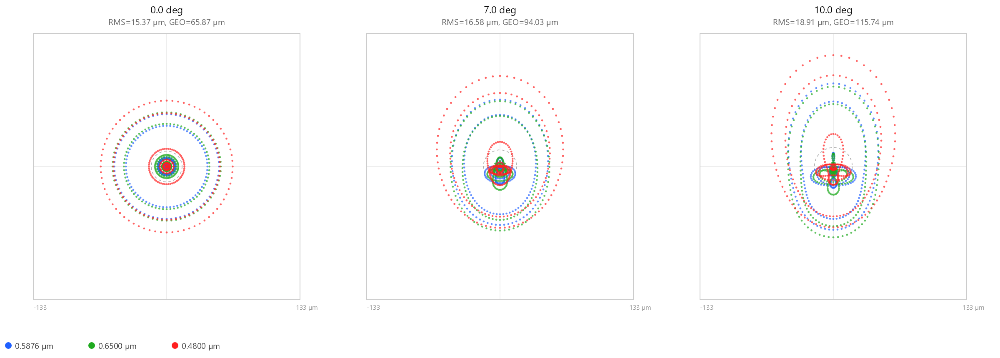 | 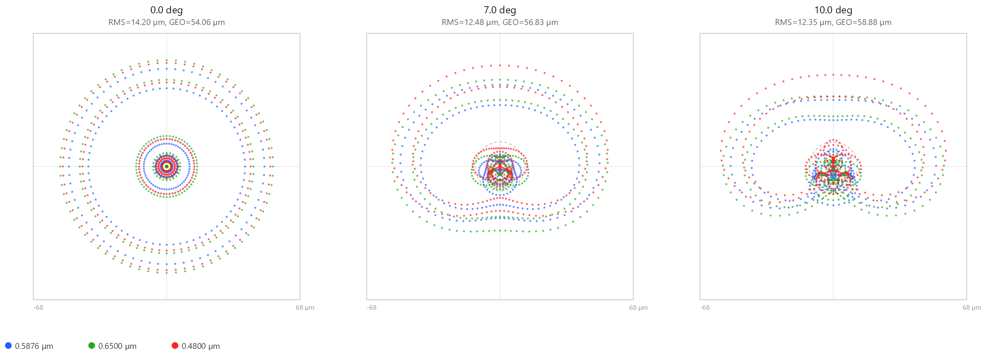 |

| FFT MTF after SPC | FFT MTF after SPC + Multistart |
|---|---|
| 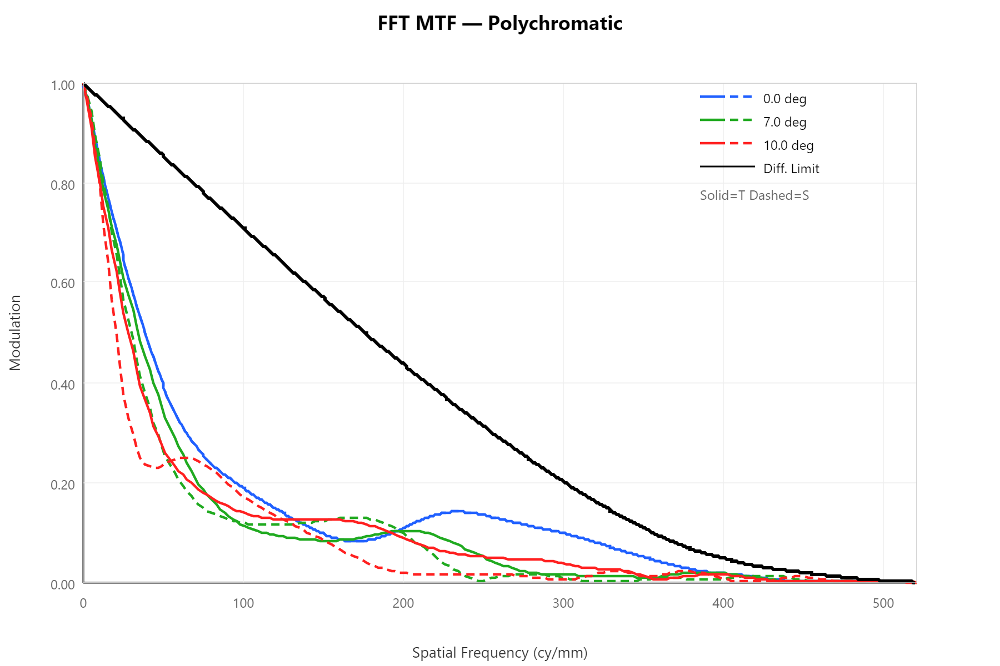 | 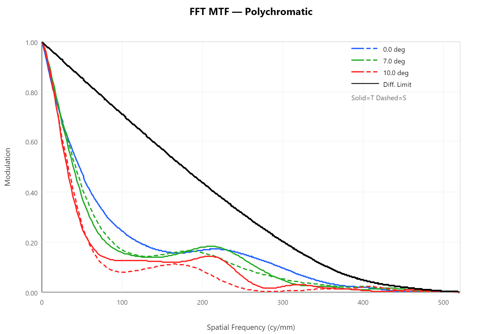 |

The follow-on Multistart dialog — initial merit `6.22 × 10⁻³`
(SPC output) → best `4.34 × 10⁻³`, 23 of 648 trials accepted:

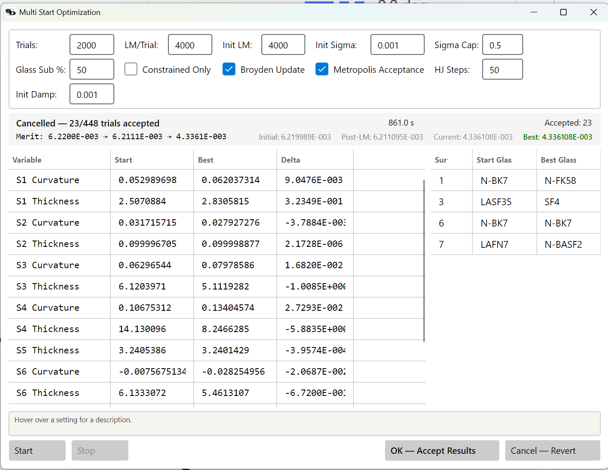

When to reach for SPC:

- The starting design has too few elements for the aberration
  budget (one or two lenses trying to do an apochromat's job).
- You want the program to discover topology — pre-stop vs
  post-stop, singlet vs doublet — rather than handing it a fixed
  surface count to refine.
- You don't already know how many elements the design needs.
  `Max Elements = 2` lets you watch the merit drop level by level
  and stop when the gains plateau.

What it isn't:

- A polish step. Always finish with Local LM and a Multistart pass
  with glass substitution. SPC's per-branch glass trials only
  sample a random subset and its per-branch LM is bounded —
  enough to rank branches, not to grind out the last percent of
  merit. The case study above shows Multistart finding ~30 %
  further improvement on top of the SPC output and shuffling 3
  of 4 glass picks; that's typical, not exceptional.
- A short-budget tool when doublets are enabled. "Single +
  Cemented Doublet" with `Max Elements = 2` and a real catalog
  takes minutes to tens of minutes per level on a multi-core
  machine.

## Common Workflow

1. Load a starting design that already traces. On-axis vignetting is
   heavily penalized — see
   [Merit Function § Failure handling](merit-function.md#spot-operands)
   — so the start needs at least all on-axis pupil rays reaching the
   image.
2. Tag curvatures and airspaces as **Variable** with physical
   bounds — typically 1–2 mm minimum on glass, 0.1 mm minimum on
   air, generous maxima.
3. Set up a merit function: a `WAVEX` or `SPOT` operand for image
   quality, an `EFL` target with high weight (≥ 100), boundary
   operands (`EG`/`EA`/`TTRACK`) to keep the geometry manufacturable.
4. Run **Local Optimizer** first. If merit stops far from where you
   want, run **Multistart** (a few hundred trials, ~2 % perturbation,
   glass substitution on if you have substitution surfaces).
5. Still stuck? Run **Basin Hopping** — defaults plus 100–500 hops,
   ideally with glass substitution. Stop early when you see the
   merit has plateaued.
6. **Always finish with a Local Optimizer pass** so the final state
   is LM-converged.

## Stopping an Optimization

Press **Stop** on the optimizer dialog at any time. The current
operation cancels at the next safe point and the best value found
so far is kept until you click **OK — Accept Results** (commits the
optimized state) or **Cancel — Revert** (restores the original).

## Performance Tips

- **Broyden on, default tolerance.** 3–5× faster than a full Jacobian
  every iteration and matches results in almost all cases.
- **Lock the focal length.** Adding an `EFL` operand with a tight
  target (weight ≥ 100) often dramatically stabilizes the search —
  the optimizer can't "cheat" by shifting focus to hide aberrations.
- **Bound air thicknesses below.** Without an `EA` minimum operand
  or a per-variable `Min` on each airspace, the optimizer can collapse
  airspaces to zero or negative values during exploration.
- **Don't over-vary.** Marking every available parameter Variable
  inflates the dimensionality and makes basins shallower. Start
  minimal; add more only when the merit plateaus.
- **Multistart for glass searches, Basin Hopping for topology.** If
  your topology is already good and you only want to vary glass,
  Multistart at ~50 % glass-swap probability iterates faster.
  Basin Hopping is the right tool when the *shape* of the design
  is in play.
