# Semi-Diameter as an Optimization Variable

Most designers treat a surface's clear aperture as a fixed input:
you set the semi-diameter, and the optimizer works everything else
around it. LensHH-LT lets you go one step further and make a
Fixed-aperture surface's **clear-aperture semi-diameter an
optimization variable**. The optimizer then sizes the aperture
directly — trading light throughput and vignetting against
aberrations — as part of the same least-squares step that drives
the curvatures, thicknesses, and glasses.

Two mechanisms keep this correct and safe automatically:

- **Automatic vignetting factors.** As a semi-diameter changes, the
  pupil sampling for that surface follows the true clear aperture,
  so the image-quality operands (`SPOTR`, wavefront, lateral color,
  …) always sample the beam that actually gets through. The merit
  function never scores rays the aperture has already clipped.
- **On-axis aperture-clearance floor.** A semi-diameter variable can
  never be driven below the axial marginal cone at that surface, so
  the on-axis beam is never vignetted. The floor is enforced
  throughout the run, so the optimizer is free to shrink an aperture
  to trim off-axis flare without any risk of clipping the on-axis
  bundle.

Enable **[automatic vignetting factors](vignetting-factors.md)** in the
System settings; it is the setting that ties the moving apertures to
the merit function's pupil sampling.

## How Auto semi-diameters are solved

A surface set to **Auto** has its semi-diameter computed for you. Two solve
modes decide how, set in System settings and applied to every Auto surface at
once:

| Mode | How the semi-diameter is obtained |
|---|---|
| **Real ray** (default) | Traces eight pupil-rim rays — the Y and X meridians and the four ±45° diagonals — at every field and wavelength, and takes the largest incident height at each surface. |
| **Paraxial** | Sizes each surface to the paraxial beam footprint instead: the marginal and chief ray heights, without tracing real rays. |

Both then apply the surface's **clear-aperture percent** if one is set, and
neither touches a surface marked Fixed.

The two modes are measuring different things, and they diverge on ordinary
designs — not only at large aperture or field, or on strongly aspheric
surfaces. On an f/3 double Gauss with a 14° maximum field and no aspheres,
switching modes moves the solved semi-diameters by **+26% on one surface and
−11% on another**.

The sign varies along the lens, which is the clue to why. Where real rays are
clipped or vignetted, the paraxial footprint is the *larger* of the two: it
describes a beam that is not all there. Where aberration carries real rays
outside the first-order beam — typically the rear group, after the stop — the
paraxial footprint is the *smaller*, and sizing to it under-reports the
aperture the element actually needs.

Real-ray mode sizes to the beam that is actually there; Paraxial mode sizes to
where first-order theory says it would be. Real ray is the default, and is what
we recommend. Paraxial is available for the case where you deliberately want
the aperture the design *requires* rather than the one the surviving rays
happen to fill — but note that anything reading a semi-diameter reads the
changed value with it, so `ET`, `EA`, `EG` and `SD` all move, and an
under-reported aperture makes a manufacturability constraint look satisfied
when it is not.

## Enabling a semi-diameter variable

In **Surface Properties → Variable / Pickup tab**, the
**"Semi-Diameter (Fixed aperture)"** row carries the same
Fixed / Variable / Pickup control you already use for curvature and
thickness. Choose **Variable** to hand the aperture to the
optimizer:

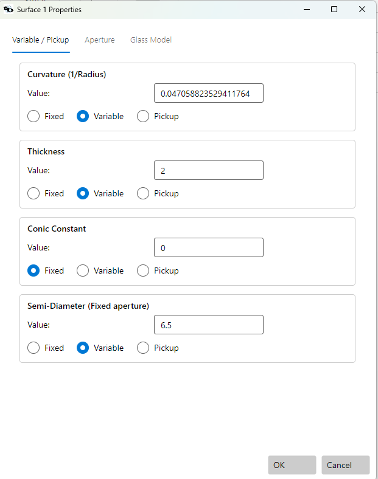

Only **Fixed-aperture** surfaces expose this control. Auto-aperture
surfaces already float their clear aperture to fit the traced beam,
so there is nothing for the optimizer to size — the row is only
meaningful where you have pinned the aperture to a fixed value.

## Worked example — Cooke triplet with vignetting

This example uses a Cooke triplet that *must* vignette to meet its
specification, so the aperture sizes are a genuine design lever
rather than an afterthought.

Design facts:

| Property | Value |
|---|---|
| Entrance pupil diameter | 12.5 |
| Target EFL | 50 |
| Fields (ObjectAngle) | 0° / 14° / 20° |
| Wavelengths | 0.48613 / **0.58756** (primary) / 0.65627 µm |
| Ray aiming | off |
| Automatic vignetting factors | **on** |

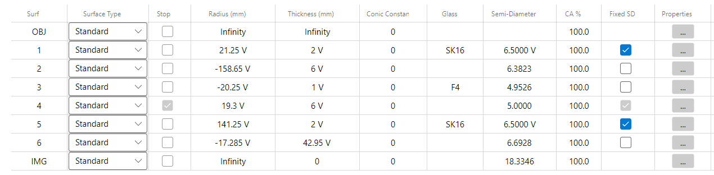

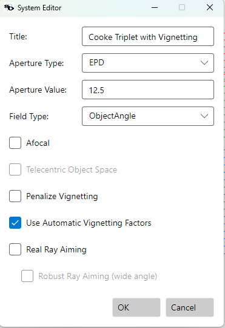

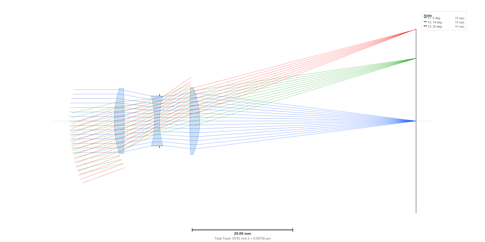

Because the triplet vignettes to hold its aberrations, the edge of
the field is dim: **relative illumination is only ~37% at the 20°
field**. That is by design — the merit function will hold that floor
rather than fight it. The starting state:

| Relative illumination — start | Spot (64 rectangular grid, vignetting factors) — start |
|---|---|
| 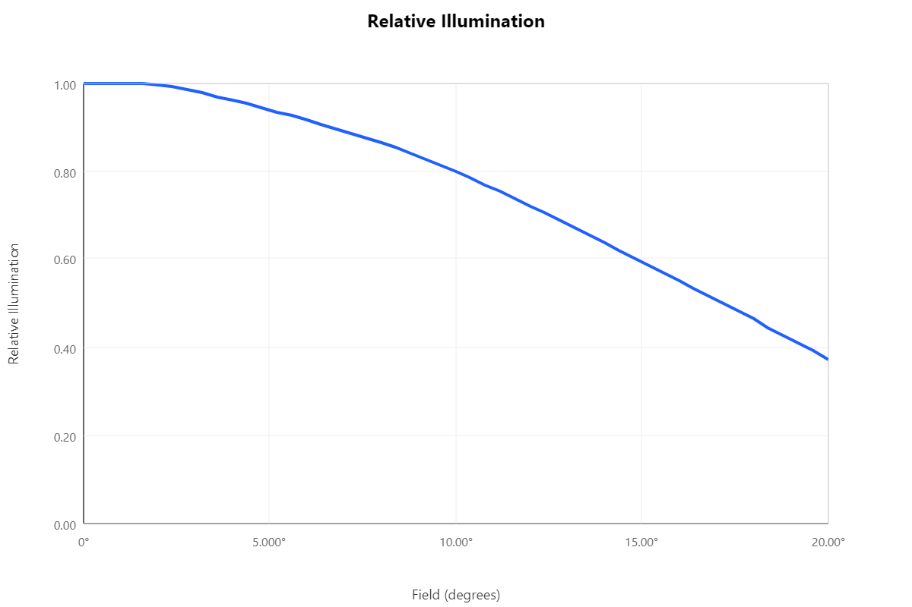 | 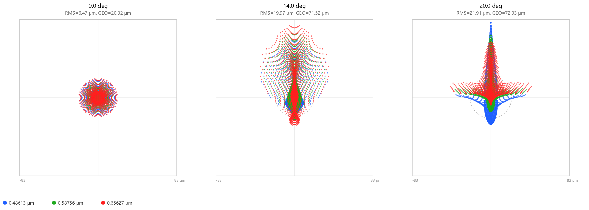 |

| Wavefront map — start | Lateral color — start |
|---|---|
| 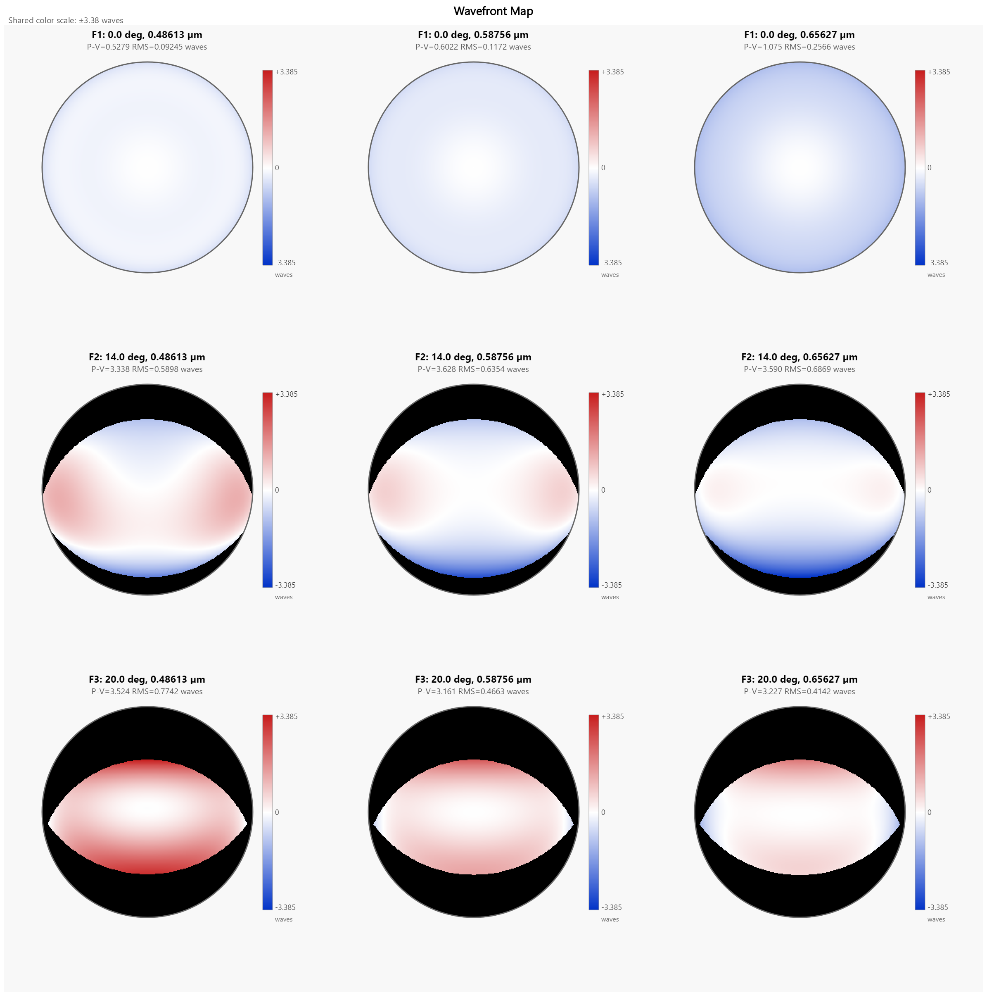 | 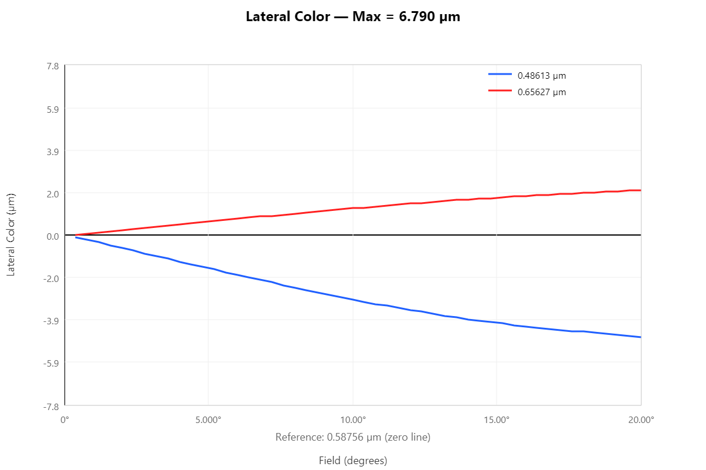 |

### The merit function

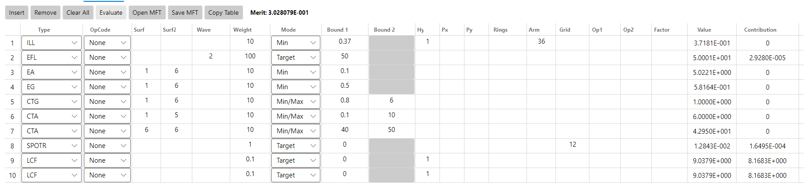

| Operand | Target | Purpose |
|---|---|---|
| `ILL` | ≥ 0.37 at the edge field | Bounds the vignetting — accept it, but keep the edge above 37% relative illumination. |
| `EFL` | = 50 (weight 100) | Hold the focal length. |
| `EA` | ≥ 0.1 | Edge-thickness (air) floor. |
| `EG` | ≥ 0.5 | Edge-thickness (glass) floor. |
| `CTG` | ≥ 0.8 | Center-thickness (glass) floor. |
| `CTA` | ≥ 0.1 | Center-thickness (air) floor. |
| `CTA` (back focal) | ≥ 40 | Keep the back focal distance above 40. |
| `SPOTR` | on-axis, rectangular 12-grid | On-axis RMS spot radius (image quality). |
| `LCF` | at the edge field | Lateral color at 20°. |

### The variables

- **All curvatures and all thicknesses** — the usual continuous
  variables.
- **Glass substitution on S1, S3, S5** — drawn from the CoreSet28
  filtered catalog.

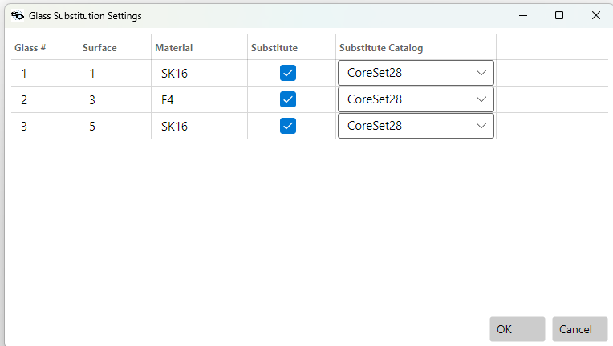

- **The Fixed semi-diameters of the two outer elements — S1 (front)
  and S5 (rear) — made Variable.** This is the point of the example:
  the optimizer is allowed to size the two outer clear apertures
  directly.

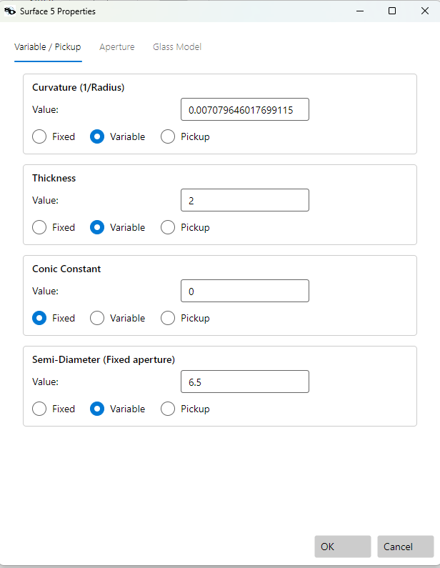

The collected variable list (all unconstrained here) shows the
curvatures, thicknesses, and the two semi-diameters gathered
together:

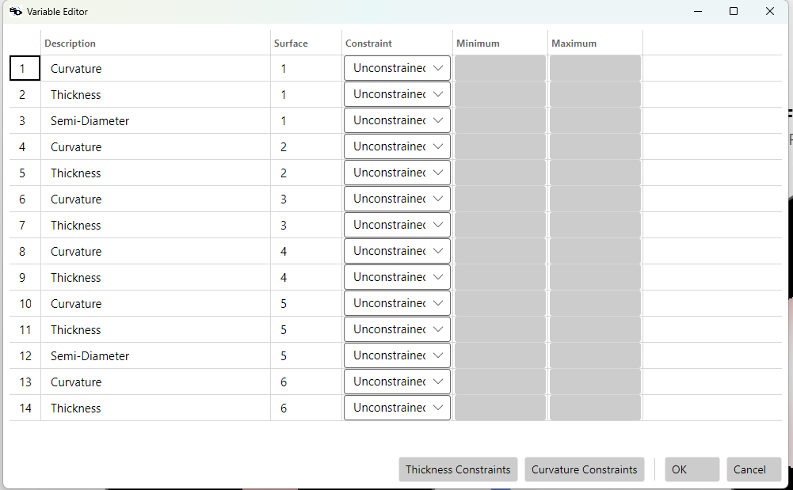

### Run and result

Run **Multistart** (3000 trials, glass substitution on).

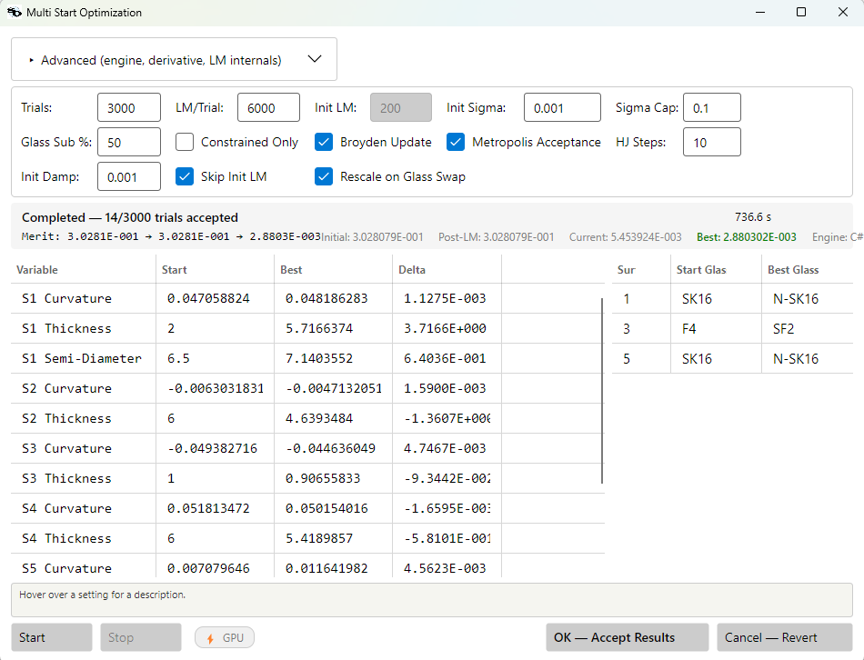

The merit improved **0.303 → 2.88 × 10⁻³**. The two variable
apertures moved in **opposite directions** — a move a designer would
not naturally make by hand:

| Surface | Start semi-diameter | Result | Change |
|---|---|---|---|
| S1 (front) | 6.50 | 7.14 | grew |
| S5 (rear) | 6.50 | 5.83 | shrank |

The glasses swapped as well: **SK16 → N-SK16** on S1 and S5, and
**F4 → SF2** on S3.

The after-state:

| Layout — after | Relative illumination — after |
|---|---|
| 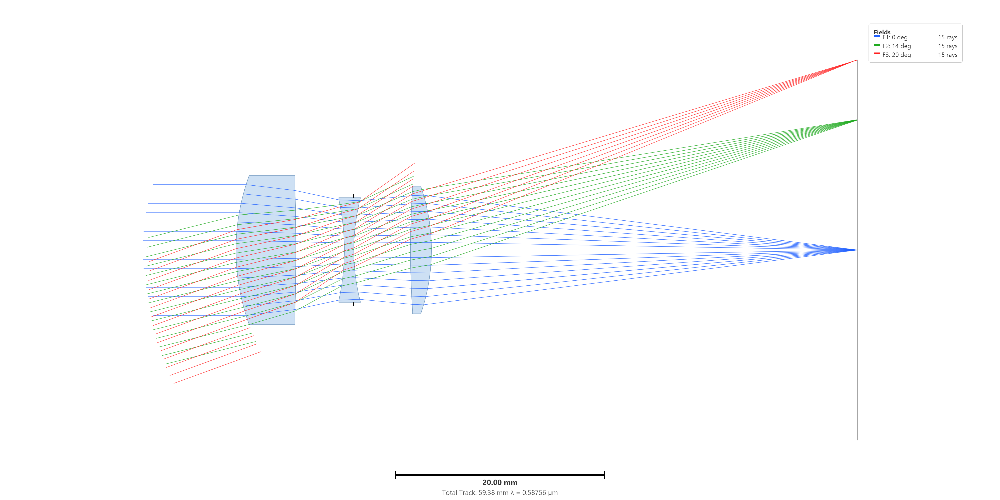 | 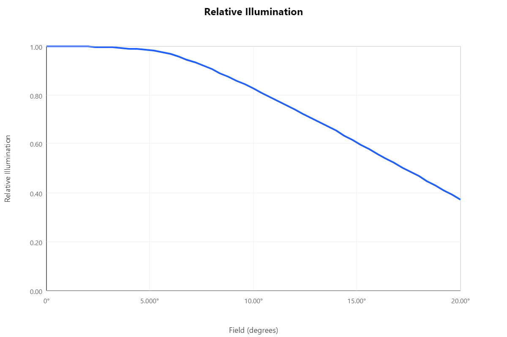 |

| Spot (64 rectangular grid, vignetting factors) — after | Wavefront map — after |
|---|---|
| 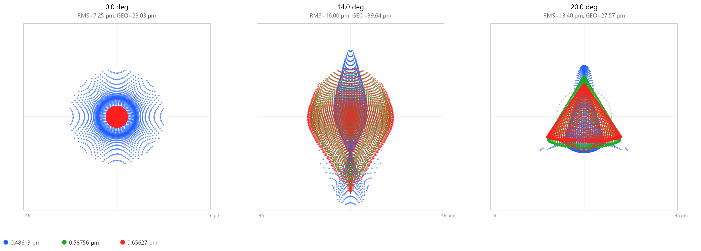 | 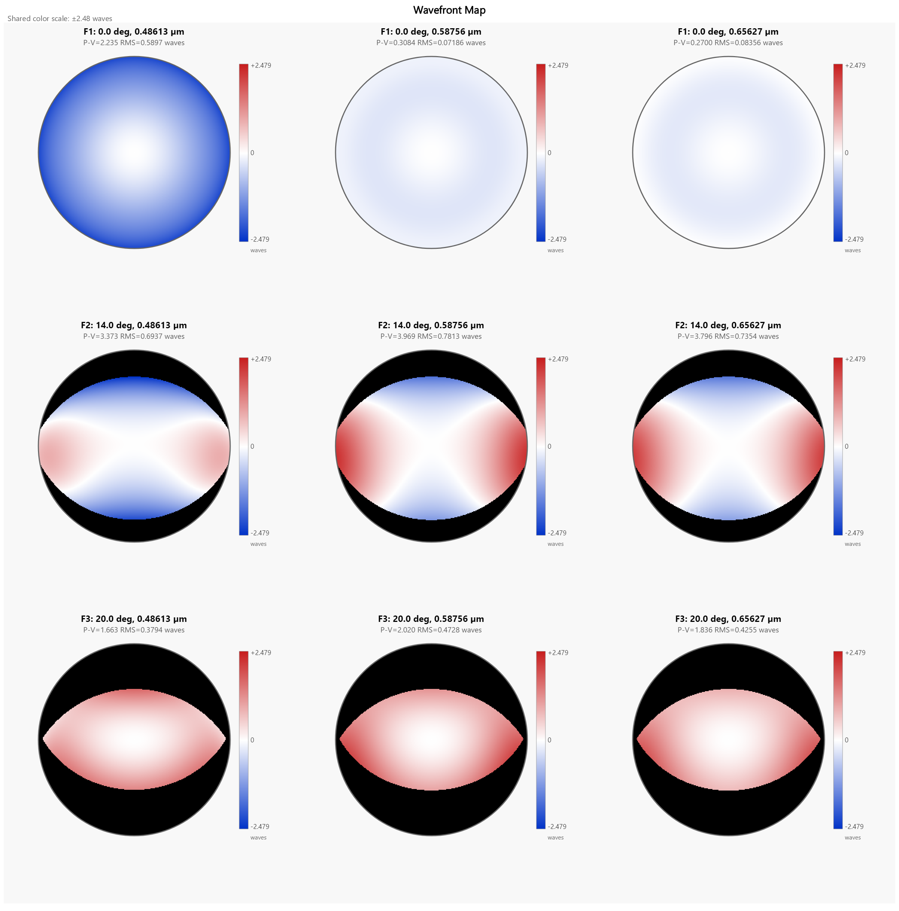 |

The spot sizes, read from the diagrams:

| Field | RMS before (µm) | RMS after (µm) | GEO before (µm) | GEO after (µm) |
|---|---|---|---|---|
| 0°  | 6.47  | 7.25  | 20.32 | 23.03 |
| 14° | 19.97 | 16.00 | 71.52 | 39.64 |
| 20° | 21.91 | 13.42 | 72.03 | 27.57 |

| Lateral color — after | Merit function — after |
|---|---|
| 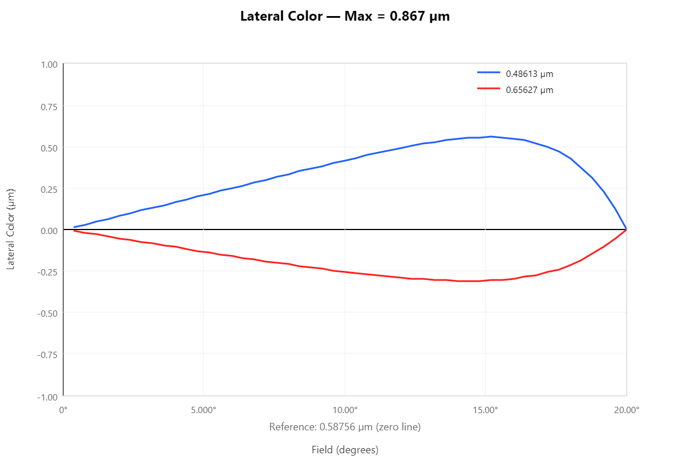 | 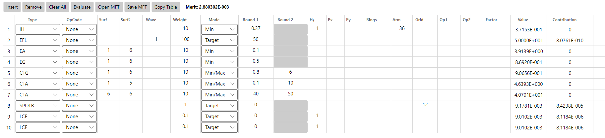 |

### Discussion

The edge relative illumination stayed at ~37%, held there by the
`ILL` constraint, while the mid-field illumination actually
improved. Off-axis image quality got markedly better — at 20°, the
RMS spot fell from 21.9 to 13.4 µm and the geometric spot from 72.0
to 27.6 µm — traded against a small increase in the on-axis spot
(6.5 to 7.3 µm RMS), which the merit function allowed. Sizing the two
outer clear apertures — growing the
front and shrinking the rear — was only possible because the
semi-diameters were variables. The automatic vignetting factors kept
the merit function's pupil sampling correct as those apertures
moved, so the image-quality operands always scored the beam that
truly got through, and the on-axis cone stayed protected by the
clearance floor for the whole run.

Making the two semi-diameters variable added a pair of degrees of
freedom that the optimizer used — together with the glass swaps and
the usual curvature/thickness work — to reach this result, arriving at
an asymmetric aperture split (front larger, rear smaller) rather than
the symmetric apertures the design started from.

## Files

The runnable sample files are under
`samples/UserGuide/SemiDiameterVariable/`:

- `CookeTriplet with Vignetting Optimize All LC.lhlt` — the starting
  design.
- `CookeTriplet with Vignetting Optimize All LC MS Result.lhlt` — the
  design after Multistart.

Open the starting file, confirm the two outer-element semi-diameters
are set to Variable and automatic vignetting factors are on, and run
Multistart to reproduce the result.
